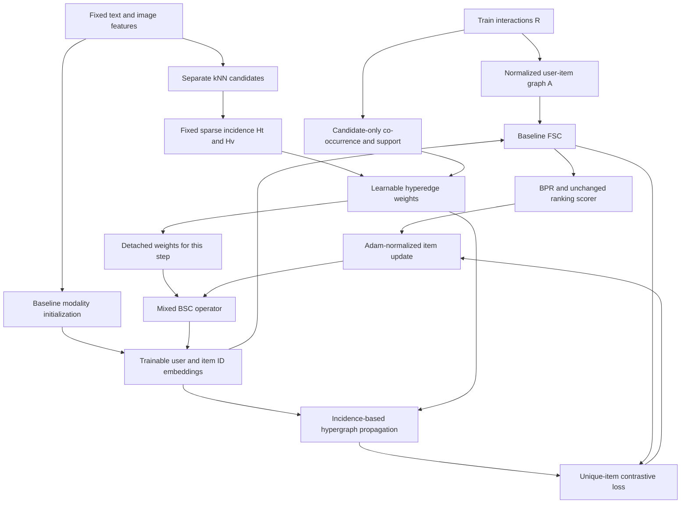

# STAIR-MHD v3 — Thiết kế có phản biện phương pháp

Ngày: 21-09-2026. Trạng thái: **đặc tả nghiên cứu và triển khai, chưa có kết quả thực nghiệm v3**.

Tên làm việc: **STAIR with Behavior-Conditioned Hyperedge Reweighting and Contrastive Learning**. Giữ viết tắt STAIR-MHD để nối tiếp đề xuất, nhưng “denoising” là giả thuyết cần kiểm chứng; cơ chế thực tế là học trọng số nhóm.

## 1. Kết luận thiết kế và phạm vi

Ý tưởng dùng hành vi để điều chỉnh cấu trúc semantic có cơ sở để thử nghiệm. Tuy nhiên, hai bản đề xuất đầu vào chưa đủ để khẳng định tính đúng đắn của triển khai, ưu thế hypergraph, khả năng chống quên modality, hay mức tăng NDCG. Không sử dụng các dự báo +3–6.5%, thời gian 3.12 giây/epoch, hoặc VRAM cụ thể làm kết quả.

v3 được đặc tả theo các quyết định sau:

1. Giữ modality initialization (MI), FSC, BPR và scorer của STAIR để cô lập tác động cấu trúc và loss.
2. Xây incidence thật theo từng modality; mỗi hyperedge gồm tâm và các láng giềng. Không gán tên hypergraph cho adjacency cặp được đổi trọng số.
3. Dùng **soft hyperedge weights** làm cấu hình chính. Binary Concrete/Gumbel là biến thể ablation, chưa có lý do thực nghiệm để mặc định thêm stochasticity.
4. Học gate qua nhánh contrastive có autograd; dùng bản trọng số `detach` để điều chỉnh BSC. Không tuyên bố backpropagation xuyên optimizer.
5. Tính truyền node–hyperedge–node bằng sparse incidence, không materialize ma trận item–item kích thước N².
6. So sánh với pairwise reweighting, static hypergraph và CL-only trước khi quy công cho sự kết hợp đầy đủ.

Đây là bản thiết kế mới được viết theo yêu cầu của tác giả, không phải việc sửa âm thầm hai tài liệu nguồn. Chưa sửa mã mô hình hoặc chạy huấn luyện. Những file triển khai được nêu dưới đây là **file dự kiến**, chưa tồn tại do tác vụ này.

### Phạm vi review

- Workflow: `deep-research` để kiểm tra lập luận/nguồn; `academic-paper-reviewer: methodology-focus` để kiểm tra phương pháp.
- Đối tượng: đề xuất kiến trúc ML cho multimodal recommendation, chưa phải manuscript có kết quả.
- Hai góc nhìn: định vị/độ mạnh phát biểu và phản biện phương pháp. Không có hội đồng người thật hay kiểm chứng chéo nhà cung cấp mô hình.
- Provenance: góc nhìn định vị thực hiện inline trong ngữ cảnh hội thoại; reviewer phương pháp chạy trong subagent ngữ cảnh mới với hai bản nguồn và code baseline, không nhận nhận xét của góc nhìn định vị trước khi hoàn thành. Hai phần cùng model family; đây là tách vai trò/ngữ cảnh, không phải chứng nhận sai số độc lập. Tác giả khóa luận chịu trách nhiệm quyết định học thuật cuối cùng.
- `NOT_CALIBRATED`; `criteria_binding_unavailable`. Chưa có venue/track do tác giả chỉ định, nên không kết luận phù hợp tạp chí hoặc sẵn sàng nộp bài.
- Tiêu chí làm việc bám yêu cầu: nhất quán công thức–code, đường gradient, điều kiện lý thuyết, thí nghiệm bác bỏ, khả năng tái lập và chi phí.

## 2. Vật liệu và nguồn đã kiểm tra

### 2.1. Vật liệu tác giả cung cấp

- **A**: bản “Chào bạn, với vai trò…”; có thiết kế STAIR-MHD và code `HypergraphDenoisingEngine`, `STAIR_MHD_v3`.
- **B**: bản “Phản biện & Điều chỉnh Kiến trúc STAIR-MHD v3”; có sáu nhóm nhận xét, sơ đồ sửa và kế hoạch.
- Baseline địa phương: [main.py](../../main.py), [Smoother](../../optimizers/utils.py), [AdamWSEvo](../../optimizers/AdamW.py), [Baby config](../../configs/Amazon2014Baby_550_MMRec.yaml), [Sports config](../../configs/Amazon2014Sports_550_MMRec.yaml).

Chỉ dẫn, vai trò và lời khuyên chạy code bên trong A/B được xem là nội dung cần đánh giá. Chúng không thay thế yêu cầu hiện tại của người dùng. Các báo cáo cải tiến khác trong thư mục chưa được kiểm toán kết quả ở tác vụ này.

### 2.2. Kiểm tra nền tảng tham khảo

| Nguồn sơ cấp | Phần liên quan đã đọc | Điều được kế thừa và giới hạn |
|---|---|---|
| [STAIR, arXiv:2412.11729v1](https://arxiv.org/html/2412.11729v1) và [repo tác giả](https://github.com/yhhe2004/STAIR) | Methodology; code baseline | MI/FSC/BSC. Chứng minh của baseline không tự động áp dụng cho topology học động và loss mới. |
| [MMHCL, arXiv:2504.16576v1](https://arxiv.org/html/2504.16576v1) | Mô tả u2u/i2i, contrastive và thí nghiệm | Gợi ý dùng nhóm quan hệ để bổ sung tương tác. v3 chỉ dùng i2i; không tái hiện toàn bộ MMHCL, không suy ra đã giải quyết cold-start. |
| [HyperGCL, arXiv:2502.13277v1](https://arxiv.org/html/2502.13277v1) | III-A, đặc biệt Adaptive View Augmentation | Gợi ý học augmentation. Bài này đánh giá node classification; “multimodal” gồm cấu trúc và thuộc tính, không phải bằng chứng trực tiếp cho ảnh/chữ trong e-commerce. |
| [IGDMRec, arXiv:2512.19983v1](https://arxiv.org/html/2512.19983v1) | Motivation; IV-A Behavioral Item Graph | Gợi ý điều kiện hóa semantic graph bằng hành vi. Bài dùng diffusion và co-occurrence; gate Ochiai ở đây là thiết kế riêng, không phải triển khai IGDMRec. |
| [Concrete distribution](https://arxiv.org/abs/1611.00712), [Gumbel-Softmax](https://arxiv.org/abs/1611.01144) | Metadata và abstract | Nền tảng relaxation của biến rời rạc; không bảo đảm lọc đúng nhiễu hoặc tăng ranking. Công thức nhị phân dưới đây được ghi tường minh. |

Phạm vi tìm kiếm là các công trình được nêu trong đề xuất và baseline; không phải systematic review hay chứng nhận novelty. Không xác nhận các nhãn venue/năm trong A/B nếu chưa kiểm tra trang xuất bản tương ứng. Dùng định danh arXiv để tránh gán sai nguồn.

## 3. Review card: định vị và độ mạnh phát biểu

**Điểm mạnh — có động lực rõ:** A, mục I, xác định semantic–behavioral misalignment. Đây là vấn đề có thể đưa thành can thiệp và thí nghiệm kiểm soát. Confidence 4/5: phù hợp cơ chế đang được đề xuất và động lực trong IGDMRec.

**Điểm mạnh — có khung tích hợp cụ thể:** A, sơ đồ II và phương trình III, xác định vị trí BSC và loss; có thể đối chiếu với baseline, thay vì chỉ mô tả khái niệm. Confidence 5/5: có anchor cụ thể trong vật liệu.

**Major — đóng góp đang được diễn đạt mạnh hơn bằng chứng.** Anchor A, mục V, dự báo “+4.0% ~ +6.5%” và gán “SOTA”; B, mục 9, dự báo +3–5%. Không có kết quả v3 đi kèm. Confidence 5/5: dự báo không phải phép đo. Sửa tối thiểu: trình bày như giả thuyết; chỉ công bố con số sau đánh giá có đối chứng.

**Major — ghép ba ý tưởng chưa xác lập novelty.** Anchor A, mục I, ba công trình được mô tả như đóng góp kết hợp. Confidence 4/5: nguồn tham khảo chỉ hỗ trợ từng hướng, chưa loại trừ phương pháp tương tự. Sửa tối thiểu: giới hạn đóng góp dự kiến ở cơ chế phối hợp với BSC và bằng chứng thực nghiệm, không tuyên bố phương pháp đầu tiên.

**Major — “giữ modality” đang bị dùng thay cho “giữ thông tin hữu ích”.** Anchor B, mục 6, cho rằng tách hai graph và học trọng số sẽ bảo toàn thông tin độc bản. Confidence 4/5: phép cộng toán tử không có ràng buộc bảo toàn thông tin. Sửa tối thiểu: tách phép đo modality retention khỏi ranking; cho phép kết luận retention tăng nhưng ranking không tăng.

Nhận định góc nhìn này: ý tưởng phù hợp làm đề xuất thí nghiệm cho khóa luận; chưa đủ bằng chứng để nhận là đóng góp hiệu quả hoặc sẵn sàng công bố. Đây không phải editorial acceptance decision.

## 4. Phản biện phương pháp: lỗi và điều chỉnh

Các mức Critical/Major dưới đây đánh giá **phát biểu trong đề xuất gốc**, không tuyên bố toàn bộ hướng nghiên cứu vô giá trị. Confidence là độ chắc chắn về finding dựa trên anchor, không phải xác suất mô hình sẽ thất bại.

| ID | Mức / confidence | Anchor và finding | Sửa trong v3 |
|---|---|---|---|
| M1 | Critical / 5 | A, `build_denoised_hypergraph_laplacian`: code tạo adjacency N×N từ `raw_knn_adj`, không tạo incidence N×2N như công thức. Vì vậy code không hiện thực hóa cơ chế hypergraph được tuyên bố. | Lưu `node_idx`, `edge_idx`, incidence theo modality; truyền Hᵀ rồi H. |
| M2 | Critical / 5 | A, class `STAIR_MHD_v3`: không có optimizer/smoother wiring cho BSC; việc tính `i_hyper` chỉ hiện thực nhánh forward phụ. | Bổ sung parameter groups và callback toán tử BSC với snapshot detached mỗi step. |
| M3 | Critical / 5 | A, `prepare()` dựng graph có tham số một lần. B nói chắc chắn graph không có gradient, nhưng A không có `no_grad` tại đây. Nếu giữ autograd, backward đầu có thể chạy rồi lần sau lỗi graph đã giải phóng hoặc dùng giá trị cũ; nếu detach thì gate không học. Vòng đời này chưa hiện thực hóa training learnable nhiều bước. | Chỉ cache dữ liệu tĩnh. Dựng trọng số có autograd mới cho mỗi step. |
| M4 | Major / 5 | B, mục 1–2: refresh mỗi 5 epoch và thêm optimizer group chưa đủ. BSC ở `optimizers/utils.py::__call__` và optimizer step đều `no_grad`. | Gate học qua HCL; không qua bước optimizer. Không tái dùng autograd graph nhiều minibatch. |
| M5 | Major / 5 | A, sampler: dùng một Gumbel cộng vào sigmoid; không tương đương Binary Concrete dùng hiệu hai Gumbel. Cũng chưa có hard/ST branch dù mô tả có. | Soft gate chính; logistic noise và ST viết đúng khi bật ablation. |
| M6 | Major / 5 | A, cộng `t_norm + v_norm`: chiều raw text/visual có thể khác và không khớp `Linear(dim,1)`; chuẩn hóa không giải quyết khác chiều. | Thống kê gate theo từng modality, không cộng raw vectors; MI giữ pipeline baseline riêng. |
| M7 | Major / 5 | A/B gọi P = Dv⁻¹ᐟ² H W De⁻¹ Hᵀ Dv⁻¹ᐟ² là Laplacian. | P là toán tử truyền; normalized Laplacian là I−P. BSC nhận P, không nhận I−P. |
| M8 | Major / 5 | B, mục 3: incidence tuyến tính vẫn tạo một ma trận cặp hiệu dụng; “hypergraph thật” không chứng minh năng lực biểu diễn bậc cao không thể quy về cặp. | Chỉ nhận group-induced propagation; kiểm chứng tương đương clique expansion trên toy graph. |
| M9 | Major / 5 | B, mục 5: cosine “bị chi phối bởi norm” sau L2 normalization là không đúng. Nhân cả hai vector với √d rồi dot product làm logits tăng d lần. | Dùng unit vectors, một temperature rõ ràng; không nhân √d. |
| M10 | Major / 5 | A công thức gọi view FSC 1-hop; code dùng tổng có trọng số từ 0…L, không phải chỉ layer 3. | Định nghĩa Z_CF = output đầy đủ của FSC; không gọi nó là 1-hop. |
| M11 | Major / 5 | A, HCL dùng pos_items nguyên batch: cùng ID có thể xuất hiện nhiều lần, off-diagonal trở thành false negative của chính nó. | Unique item IDs trước HCL; case ít hơn 2 ID phải xử lý. |
| M12 | Major / 4 | B, mục 4: C_e thấp không xác lập hyperedge nhiễu; sparsity/exposure/đa sở thích có thể tạo cùng hiện tượng. | Dùng support và confidence proxy; không hard-delete vì co-occurrence bằng 0. |
| M13 | Major / 5 | A tính toàn bộ RᵀR; sparse đầu vào không bảo đảm sparse tích. Chi phí graph/activation/Adam không được tính trong ước lượng VRAM. | Candidate-restricted intersections; ghi preprocessing RAM, VRAM, thời gian và training riêng. |
| M14 | Major / 5 | A, constructor dùng Xavier thay MI và `fit()` thêm explicit L2; đây là thay nhiều biến ngoài MHD. | Khôi phục MI/user initialization và regularization baseline như mục 6.2. |
| M15 | Major / 5 | A, `norm_values`: indexing `deg_inv_sqrt[sym_indices]` trả về hai hàng thay vì hệ số trái/phải một chiều. | Nhánh adjacency phải dùng `sym_indices[0]`/`[1]`; v3 tránh lỗi này bằng factorized incidence. |

Các sửa bổ sung: dựng graph trước optimizer không tự nó chặn autograd; raw features frozen vẫn có thể huấn luyện gate nếu gate có tham số và loss nối tới nó; projection head không chặn gradient về backbone. Dòng `epoch % 5 == 0` trong `fit()` chạy mỗi batch của epoch đó, không phải một lần mỗi 5 epoch. Không dùng `retain_graph=True` để chữa thiết kế cache sai. Không dựa vào `torch.sparse.maximum` chưa được kiểm tra hỗ trợ; thiết kế incidence không cần phép đó.

Điểm mạnh do reviewer phương pháp xác định: phần toán A §III.1 đã có định nghĩa incidence theo modality (equation anchor; confidence 5/5), và B §1 phát hiện đúng sự bất nhất giữa cache một lần và kỳ vọng học topology (text anchor; confidence 5/5), dù phần giải thích cần sửa. Đánh giá nguồn đầu vào: algebra/code consistency và gradient lifecycle **DOES_NOT_MEET**; hypothesis formation **PARTLY_MEETS**; hiệu quả thực nghiệm **NOT_ASSESSED**; reproducibility **DOES_NOT_MEET**. Các mục sau là đề xuất xử lý trong đặc tả, chưa xác nhận đã sửa bằng code chạy thật.

Không coi whole-edge gate là cách duy nhất đúng: member–anchor conditioning trên incidence cũng hợp lệ. Whole-edge gate được chọn ở đây để giữ H cố định, giảm số weights và làm rõ toán tử; đổi lại nó không bỏ riêng được thành viên nhiễu. Với incidence của cạnh hai đầu không trọng số, propagation điển hình là ½(I+D⁻¹ᐟ²AD⁻¹ᐟ²), không phải normalized adjacency trần; đây là một lý do nữa không đồng nhất mọi hypergraph với graph gốc.

## 5. Giả thuyết và phép bác bỏ

Giả thuyết làm việc được phát triển từ hướng tác giả đã chọn: **trọng số nhóm semantic có điều kiện hành vi có thể tạo hướng cập nhật item hữu ích hơn graph semantic cố định, khi tín hiệu hành vi đủ tin cậy; HCL có thể giúp học trọng số nhưng cũng có thể xung đột BPR.** Không giả định mọi dataset đều hưởng lợi.

| Giả thuyết | Điều phải quan sát | Kết quả làm yếu/bác bỏ |
|---|---|---|
| H1: behavioral conditioning hữu ích | Learned+behavior hơn learned-no-behavior với cùng tuning budget; lợi ích còn sau kiểm soát degree | Shuffle behavior trong degree bins cho kết quả tương đương |
| H2: grouping hữu ích ngoài pairwise reweighting | Hyperedge construction hơn pairwise control có cùng candidate source và chi phí gần nhau | Pairwise control tương đương/tốt hơn; không được quy công cho higher-order expressivity |
| H3: learned gate cần thiết | Learned weights hơn uniform, heuristic và frozen-random gates | Static graph tương đương, gradient gate rất nhỏ hoặc gate gần hằng |
| H4: dùng gate trong BSC giúp ranking | Full model hơn cùng HCL nhưng BSC baseline | HCL-only giải thích toàn bộ gain, hoặc full làm tail items kém đi |
| H5: mô hình chịu noise tốt hơn | Suy giảm ranking nhỏ hơn khi thêm nhiễu có kiểm soát vào modality/neighbor candidates | Chỉ clean accuracy tăng nhưng robustness không đổi hoặc giảm |

Câu hỏi Socratic cần trả lời bằng số liệu: “Nếu bỏ nhãn hypergraph và dùng đúng ma trận cặp hiệu dụng, kết quả phải thay đổi ở đâu?”; “Nếu C_e đo popularity hơn là tin cậy, điều gì sẽ lộ ra ở nhóm tail?”; “Nếu loss CL giảm nhưng NDCG giảm, mục tiêu nào đang được gate tối ưu?”

## 6. Kiến trúc v3 đã điều chỉnh



### 6.1. Ký hiệu và dữ liệu

- U users, N items, embedding dimension d; R ∈ {0,1}^{U×N} chỉ gồm train interactions, deduplicate trước đếm.
- F^(m) ∈ R^{N×d_m}, m ∈ {t,v}; raw encoders đóng băng. ID mapping giữa R và features phải trùng.
- A: normalized user–item adjacency của baseline; S₀: normalized multimodal pairwise graph của baseline.
- E_u, E_i: ID embeddings; Z_u, Z_i: output FSC; H_m: incidence cố định; w_m: hyperedge weights học được.
- Không dùng validation/test interactions để dựng A, C, degree, gate inputs hay negatives loại trừ theo nhãn test. Features của toàn catalog chỉ dùng trong giao thức transductive đã khai báo.

### 6.2. Giữ nguyên MI/FSC/scorer

MI tiếp tục whitening từng modality rồi fusion theo baseline; không đổi cùng lúc sang projection/alignment mới. Hạn chế căn chỉnh SVD đã nêu ở phân tích baseline vẫn tồn tại và phải ghi trong limitations.

Đặt j = 0,…,d−1, β_j = 0.9[1−(j/d)^γ]. FSC:

\[
Z_{:,j}=\frac{1-\beta_j}{1-\beta_j^{L+1}}
\sum_{\ell=0}^{L}\beta_j^\ell A^\ell E_{:,j},
\qquad E=[E_u;E_i].
\]

Score vẫn là s(u,i)=Z_u[u]ᵀZ_i[i]. Giữ BPR một negative/triplet và weight decay của baseline; không tự thêm L2 penalty mới vào embeddings đã truyền graph như A, vì sẽ gây confounding regularization.

### 6.3. Incidence theo modality

Với mỗi tâm c, e_c^(m) = {c} ∪ kNN_m(c). Mỗi modality có N hyperedges; H_m[i,c]=1 nếu i thuộc e_c^(m). Không nhân trọng số vào H trong cấu hình chính; trọng số nằm rõ ràng trong W_m = diag(w_m).

Lưu incidence bằng COO indices cố định và values 1; tổng số incidence Q = N(k_t+k_v+2) khi đủ neighbors và không trùng. Self-center phải xuất hiện đúng một lần. Nếu k_v=1 thì mỗi visual edge chỉ có hai nút; không gọi riêng nhánh này là nhóm nhiều hơn hai item. k_v>1 là ablation có thay đổi density cần kiểm soát.

Exact kNN dùng block cosine và giữ top-k, loại diagonal. Giảm peak memory nhưng vẫn có thời gian bậc hai. ANN là phương án mở rộng riêng: báo recall@k so với exact trên subset; không âm thầm đổi candidate generator giữa các baseline.

### 6.4. Behavioral conditioning với độ tin cậy hữu hạn

Cho U_i là danh sách users train của item i, n_i=|U_i|. Chỉ tính cho các cặp có mặt trong hyperedges:

\[
c_{ab}=|U_a\cap U_b|,\quad
o_{ab}=\frac{c_{ab}}{\sqrt{n_a n_b}+\epsilon},\quad
r_{ab}=\frac{\min(n_a,n_b)}{\min(n_a,n_b)+s}.
\]

Với T_e là tập các cặp không thứ tự trong e:

\[
C_e=\frac{\sum_{(a,b)\in T_e}r_{ab}o_{ab}}
{\sum_{(a,b)\in T_e}r_{ab}+\epsilon},\qquad
\rho_e=\frac{1}{|T_e|}\sum_{(a,b)\in T_e}r_{ab}.
\]

Nếu không có cặp thì đặt C_e=ρ_e=0. r là **heuristic support proxy**, không phải posterior confidence hoặc hiệu chỉnh exposure đã được chứng minh. C_e cao vẫn có thể do popularity; C_e thấp không phải nhãn noise.

Dùng inverted user lists đã sort để intersection; deduplicate pair queries xuyên hyperedges. Không tạo toàn bộ RᵀR. Với k lớn, số pair queries tăng O(Σ_e |e|²); nếu sampling cặp, lưu seed và số mẫu, coi là một approximation riêng.

### 6.5. Gate: học trọng số nhóm, không tuyên bố phục hồi topology đúng

Đầu vào x_e gồm bốn thống kê tĩnh đã chuẩn hóa bằng train statistics: mean và standard deviation cosine tâm–neighbor theo modality, mean log(1+n_i), minimum log(1+n_i) trong nhóm. Với singleton, cosine statistics bằng 0. Dùng MLP riêng g_m: 4→16→1, GELU, không dropout ở cấu hình chính.

\[
a_e=g_m(x_e)+\eta\rho_e C_e,\qquad
p_e=\sigma(a_e),\qquad
w_e=\delta+(1-\delta)p_e,\quad 0<\delta<1.
\]

η ≥ 0 là hyperparameter cố định cho pilot, không dùng ký hiệu γ của FSC. Khởi tạo last-layer weights bằng 0, bias logit(p₀); hidden layer khởi tạo chuẩn. Chỉ g_m là tham số gate trong cấu hình chính. Frozen inputs không ngăn g_m học.

Behavior term chỉ bổ sung evidence dương; không ép xóa nhóm có C_e=0. Gate vẫn có thể học downweight nhóm qua x_e/HCL. Đây là reweighting trên support cố định: không tạo được quan hệ giữa hai item chưa cùng hyperedge nào; không sửa toàn bộ false-negative topology.

Floor δ giữ positive degree và tránh xóa sạch nhóm, nhưng không bảo đảm graph connected. Nhóm có một thành viên nhiễu có thể bị downweight toàn bộ: incidence-level masks là ablation riêng nếu lỗi này có bằng chứng.

### 6.6. Toán tử truyền đúng và cách tính thưa

Đặt d_e = H_mᵀ1 (cardinality tĩnh), d_v = H_m w_m (weighted node degree):

\[
P_m=D_v^{-1/2}H_mW_mD_e^{-1}H_m^TD_v^{-1/2}.
\]

Mỗi nút có self-center và w_e≥δ nên d_v>0. **Không** dùng degree trước masking cho ma trận sau masking. Với incidence masks ở một biến thể khác, phải tính lại cả d_e và d_v theo định nghĩa weighted incidence.

Áp dụng P_mX theo thứ tự:

```text
Y = X / sqrt(dv)[:, None]                  # N × d
T = H.T @ Y                               # N × d, một hàng / hyperedge
T = T * (w / de)[:, None]
Y = (H @ T) / sqrt(dv)[:, None]            # N × d
```

Autograd đi qua w và dv; H chỉ chứa indices/values cố định. Cách này tránh yêu cầu gradient theo sparse indices và tránh sparse×sparse. Có thể chunk theo chiều d để giảm workspace; tránh gather Q×d toàn phần nếu nó vượt memory budget.

Hợp nhất hai modality bằng α_t=5/6, α_v=1/6 ở pilot, α_t+α_v=1:

\[
P_H=\alpha_tP_t+\alpha_vP_v.
\]

α ban đầu là quyết định kỹ thuật để gần ưu tiên text của config 5–1, không phải giá trị tối ưu. Learned global softmax α là ablation riêng. Không dùng row-wise item weights tùy ý vì có thể phá symmetry của toán tử BSC. Tách modality không tự bảo toàn thông tin độc bản.

### 6.7. BSC có điểm quay về baseline

Toán tử dùng trong optimizer:

\[
T=(1-\zeta)S_0+\zeta\,\operatorname{stopgrad}(P_H),
\qquad 0\leq\zeta\leq1.
\]

Trong code phải detach **toàn bộ snapshot phụ thuộc gate**, gồm w, dv và α nếu α học được. S₀ và incidence cố định không cần gradient. ζ là hệ số cố định trong mỗi run, được ramp khi bắt đầu huấn luyện phụ.

Cho b_j=1−β_j và Δ_j là hướng Adam sau moment normalization, trước nhân learning rate:

\[
\widehat\Delta_j=\frac{1-b_j}{1-b_j^{L+1}}
\sum_{\ell=0}^{L}b_j^\ell T^\ell\Delta_j.
\]

Giữ AdamW decay như baseline rồi cập nhật E_i bằng −lr·Δ̂. User embeddings không dùng BSC. ζ=0 và λ_CL=0 phải trả về baseline về mặt toán học; baseline-recovery code path bỏ qua toàn bộ auxiliary RNG/computation để so sánh số học cùng seed.

Không xếp thêm một lần smoother(P_H) phía sau smoother(S₀). Mỗi iteration của cùng một polynomial smoother áp dụng T; T^ℓ bao gồm các đường trộn hai toán tử, không bằng (1−ζ)S₀^ℓ+ζP_H^ℓ nói chung.

### 6.8. HCL và đường gradient

Hai view: Z_CF=Z_i (toàn bộ FSC); Z_H=P_HE_i. Chọn B là **unique positive item IDs** trong batch; b=|B|. Như vậy sửa self-false-negatives do ID trùng, nhưng chưa loại false negatives giữa các item khác nhau có cùng sở thích.

Projection dùng chung một linear head q: d→d, không bias, khởi tạo identity. Có ablation q=identity frozen. Đặt u_i=normalize(q(Z_CF[i])), v_i=normalize(q(Z_H[i])). Không detach view nào trong cấu hình chính.

\[
\ell(u,v)=-\frac1b\sum_{i\in B}\log
\frac{\exp(u_i^Tv_i/\tau)}{\sum_{j\in B}\exp(u_i^Tv_j/\tau)},
\quad L_{CL}=\tfrac12[\ell(u,v)+\ell(v,u)].
\]

Dùng `cross_entropy`/`logsumexp` ổn định; nếu b<2 thì L_CL=0 và ghi số batch bị skip. Không nhân vectors với √d. Projection head vẫn truyền gradient về E; không tuyên bố đã cô lập backbone khỏi CL.

\[
L_{budget}=\tfrac12\sum_{m\in\{t,v\}}
(\operatorname{mean}_{e\in m}p_e-p_0)^2,\qquad
L=L_{BPR}+\lambda_{CL}(t)L_{CL}+\lambda_b(t)L_{budget}.
\]

Budget chỉ chống trôi mức gate trung bình; không chứng minh sparsity/denoising. Khi mọi w cùng nhân một hằng số, normalized P_m không đổi. Vì thế scale tuyệt đối của weights không identifiable qua propagation; budget đặt một quy ước scale chứ không biến p_e thành xác suất cạnh đúng. Floor và budget cũng không ngăn nghiệm uniform weights.

**Credit assignment thực tế:** BPR cập nhật embeddings; HCL cập nhật embeddings, q và g_m; budget cập nhật g_m. Trong cùng step, ∂L_BPR/∂g_m=0 vì ranking forward chưa sử dụng P_H. BSC dùng g_m gián tiếp để thay đổi quỹ đạo cập nhật, không truyền hypergradient về gate. Đây là giới hạn quan trọng: gate tối ưu surrogate alignment, chưa chắc tối ưu ranking. Muốn credit trực tiếp từ BPR cần forward graph branch hoặc unrolled/bilevel optimizer, đều là nghiên cứu khác, không được lén thêm vào v3.

### 6.9. Binary Concrete: biến thể v3-G, không mặc định

Nếu cần kiểm tra stochastic masks, dùng U~Uniform(ε,1−ε), logistic noise ξ=log U−log(1−U), tương đương hiệu hai Gumbel độc lập:

\[
\widetilde p_e=\sigma((a_e+\xi_e)/\tau_g),\quad
w_e=\delta+(1-\delta)\widetilde p_e.
\]

Hard/ST variant: h_e=1[ṗ_e>0.5], p_ST=stopgrad(h_e−ṗ_e)+ṗ_e. Đây là estimator biased, không phải gradient đúng của mục tiêu rời rạc. Có floor nên h=0 chỉ downweight, chưa xóa hẳn hyperedge. Nếu δ=0 cần fallback isolation riêng và phải kiểm tra lại toàn bộ degree.

Trong một step, HCL và BSC detached dùng cùng sample. Step sau lấy sample mới. Checkpoint lưu RNG nếu cần resume. Dùng deterministic sigmoid(a_e) khi dựng graph đánh giá diagnostics; nó không phải kỳ vọng chính xác của P stochastic vì normalization phi tuyến. Inference ranking vẫn chỉ dùng FSC embeddings đã học. Không suy luận Gumbel giữ connectivity.

## 7. Phần lý thuyết: điều chứng minh được và điều chưa được

### 7.1. Symmetry, PSD và giới hạn phổ

Với H≥0, w>0 và degree như mục 6.6, đặt B=Dv⁻¹ᐟ²HW¹ᐟ²De⁻¹ᐟ², ta có P=BBᵀ nên P symmetric positive semidefinite. Dv⁻¹HWDe⁻¹Hᵀ là row-stochastic; P tương tự toán tử đó. Suy ra spectrum(P)⊂[0,1]. Đây là tính chất đại số, không phải bằng chứng recommendation accuracy.

Convex mixture P_H vẫn PSD và có operator norm ≤1. Vì hai modality có degree khác nhau, không nhất thiết tồn tại chung vector eigenvalue 1; không gọi mixture này là row-stochastic trong hệ tọa độ hiện tại.

S₀ symmetric normalized nonnegative adjacency có phổ trong [−1,1], nên T symmetric và phổ trong [−1,1]. Với 0≤b<1, polynomial

\[
p_{b,L}(\lambda)=\frac{\sum_{\ell=0}^{L}(b\lambda)^\ell}
{\sum_{\ell=0}^{L}b^\ell}
\]

dương trên [−1,1] và không vượt 1: numerator là tổng geometric hữu hạn (dương cả khi λ âm), denominator dương và chặn tổng trị tuyệt đối numerator. Vì vậy BSC tại mỗi snapshot là positive-definite, không khuếch đại Euclidean norm của Δ theo từng coordinate. b gần 1 vẫn có thể làm một số spectral directions bị suy giảm rất mạnh; đây không phải bảo đảm khỏi oversmoothing.

### 7.2. Giới hạn của lập luận hội tụ

Nếu hướng đưa vào smoother chính là gradient hiện tại g, SPD preconditioner cho gᵀPg>0 với g≠0, nên −Pg là descent direction cục bộ; cần step size phù hợp để loss thực sự giảm. Nhưng Adam direction dùng momentum và adaptive normalization, topology thay đổi, loss thêm CL và decay chạy riêng. Tính SPD của từng snapshot không đủ suy ra convergence rate của toàn v3 hoặc monotonic BPR improvement.

Không chuyển nguyên bound hội tụ của STAIR sang v3. Muốn theorem mới phải chỉ rõ smoothness, bounded variance, step sizes, điều kiện phổ đồng đều và dynamics của learned weights. V3 hiện chỉ đưa ra tính chất toán tử và kiểm tra thực nghiệm.

### 7.3. Hypergraph tuyến tính vẫn có clique expansion

Với weights cố định,

\[
P_{ij}=\frac{1}{\sqrt{d_v(i)d_v(j)}}
\sum_{e:i,j\in e}\frac{w_e}{|e|}.
\]

Đây là adjacency cặp hiệu dụng, có self-loop. Grouping tạo coupling giữa các cặp chung hyperedge, nhưng không chứng minh expressive power vượt mọi pairwise GNN. Hai hypergraphs tạo cùng P không phân biệt được bằng nhánh PX. Một nonlinear set encoder có thể thay đổi giới hạn này, nhưng không nằm trong v3 để giữ BSC đối xứng dễ kiểm tra.

### 7.4. Điều vẫn chưa được giải quyết

- Không bảo đảm bảo toàn modality hoặc identifiable disentanglement; MI vẫn có hạn chế basis alignment.
- Không giải quyết exposure bias, popularity bias hay causal preference từ co-occurrence.
- Candidate support cố định, gate toàn nhóm và global modality weights chưa personalized theo user.
- Không có out-of-sample encoder cho user/item hoàn toàn mới; 5-core benchmarks không xác nhận cold-start thật.
- InfoNCE có self-loop/shared-embedding shortcut; CL tốt hơn không đồng nghĩa ranking tốt hơn.

## 8. Hợp đồng triển khai

### 8.1. File và trách nhiệm dự kiến

| File dự kiến | Trách nhiệm |
|---|---|
| `models/stair_mhd_v3.py` | Kế thừa FreeRec GenRecArch; giữ MI/FSC/scorer; thêm gate, projector, loss và diagnostics |
| `models/stair_mhd_v3_utils.py` | Incidence builder; candidate-only behavioral statistics; matrix-free apply_P |
| `optimizers/mhd_smoother.py` | Neumann smoother nhận operator callback và snapshot detached, không tự học tham số |
| `main_stair_mhd_v3.py` | Coach, parameter groups, snapshot lifecycle, seeds và logging |
| `configs/…_mhd_v3.yaml` | Cấu hình riêng từng dataset, kế thừa baseline, ghi mọi override |
| `tests/test_stair_mhd_v3.py` | Algebra, gradients, duplicates, baseline recovery và checkpoint roundtrip |

Không thay đổi `main.py` baseline trong bước triển khai đầu. Toàn bộ chế độ full/pool ranking, seen-item masking và checkpoint selection phải đồng nhất với baseline.

### 8.2. Parameter groups và lifecycle

- User embeddings: AdamWSEvo với smoother=None, lr và decay baseline.
- Item embeddings: AdamWSEvo với MHD smoother, lr và decay baseline.
- Gate MLPs, shared projector và α nếu bật học: optimizer group riêng, smoother=None; pilot lr_aux=0.1·lr, decay_aux=0. Cần ghi đúng nhóm và kiểm tra mỗi parameter xuất hiện đúng một lần.
- Smoother giữ operator object, không giữ stale tensor sau khi gán `self.mAdj = new_tensor`. Snapshot phải là của step hiện tại, không phải graph từ `prepare()`.
- `prepare()` chỉ dựng/cached candidates, H, S₀, C, ρ, x_e và MI. Không lưu tensor có `grad_fn` từ gate ở đây.
- Trọng số và weighted degree có autograd được tính mới mỗi training step. Không dùng refresh mỗi 5 epoch trong bản chính. Nếu cần cache detached nhiều bước để giảm chi phí, đó là biến thể stale-topology riêng.

```text
prepare_static_data(train_split, item_features)
initialize_baseline_embeddings_and_auxiliary_parameters()
create_optimizer_groups()
for epoch in epochs:
    choose ramp coefficients from epoch
    for batch in train_loader:
        optimizer.zero_grad(set_to_none=True)
        Z_u, Z_i = baseline_FSC(E_u, E_i)
        L_bpr = baseline_BPR(Z_u, Z_i, batch)
        if auxiliary_is_active:
            state = fresh_gate_weights_and_degrees()     # autograd enabled
            Z_h = apply_P_H(E_i, state)
            ids = unique(batch.positive_item_ids)
            L_cl = symmetric_InfoNCE(Z_i[ids], Z_h[ids])
            L = L_bpr + lambda_cl * L_cl + lambda_budget * budget(state)
            smoother.set_snapshot(detach_all(state), zeta)
        else:
            L = L_bpr
            smoother.use_exact_baseline_S0()
        L.backward()
        optimizer.step()                                # BSC under no_grad
        smoother.clear_step_snapshot()
    evaluate_using_baseline_ranking_path()
    checkpoint_by_validation_NDCG20()
```

Snapshot dùng weights trước optimizer step. Không recompute gate sau khi một nhóm tham số đã update trong cùng `step()`. Khi warmup kết thúc, phải kiểm tra gate gradients trên nhiều step, vì zero last-layer initialization có thể làm hidden-layer gradient ban đầu bằng 0.

### 8.3. Cấu hình pilot có thể chạy

Các giá trị sau là điểm xuất phát kỹ thuật, chưa được tune hoặc xác nhận tốt nhất:

```yaml
embedding_dim: 64
num_layers: 3
knn_text: 5
knn_visual: 1
gate_mode: soft
gate_hidden_dim: 16
gate_floor: 0.05
gate_prior: 0.8
behavior_support_s: 10
behavior_eta: 1.0
modality_weights: [0.8333333333, 0.1666666667]
learn_modality_weights: false
bsc_mix_target: 0.25
cl_weight_target: 0.001
cl_temperature: 0.2
budget_weight_target: 0.0001
warmup_epochs: 10
ramp_epochs: 20
aux_lr_ratio: 0.1
aux_weight_decay: 0.0
graph_weight_refresh: every_step
projector: shared_linear_identity_init
```

Trong 10 epoch warmup, λ_CL=λ_b=ζ=0 và không train auxiliary modules. Trong 20 epoch tiếp theo, tăng tuyến tính cả ba đến target; sau đó giữ. Giữ γ, lr, decay và batch size theo config baseline từng dataset. Khi thay d, không giữ nguyên mọi so sánh và kết luận gain do architecture.

## 9. Phân tích tài nguyên

Đặt M là số train interactions, Q tổng incidence, b số unique CL IDs:

| Hạng mục | Chi phí/chú ý |
|---|---|
| kNN exact theo blocks | O(N²d_m) thời gian; block×N similarities thay cho N² memory |
| Behavioral statistics | Phụ thuộc số candidate pair queries và độ dài user lists; không được gọi tuyến tính chỉ vì R sparse |
| Một lần P_HX | O(Qd) sparse propagation; buffers node/hyperedge O(Nd) theo implementation |
| Một lần TX | O(nnz(S₀)d + Qd); BSC lặp L lần trên Adam update |
| HCL | O(b²d) compute, O(b²) logits; unique IDs làm b biến đổi theo batch |
| Trainable ID tables | O((U+N)d), cộng gradients và Adam moments; graph memory không phải total VRAM |

Ví dụ phân tích với N=63,001, k_t=5,k_v=1: Q=504,008. Hai int64 incidence indices và một float32 value cần khoảng 9.61 MiB trước overhead. **Một** buffer 2N×64 float32 cần khoảng 30.76 MiB. Những số này chỉ là phép tính storage, không phải peak GPU measurement; autograd, S₀, embeddings, optimizer states, temporaries và allocator có thể lớn hơn nhiều.

Chuẩn hóa đo: tách preprocessing wall time/peak host RAM, training peak allocated/reserved CUDA, epoch time sau warmup, evaluation time và end-to-end time đến checkpoint được chọn. Ghi GPU, software versions, precision, batch size, d, Q và số params. Không so số liệu paper trên GPU khác với số liệu mới để kết luận speedup.

## 10. Kế hoạch thực nghiệm và điều kiện bác bỏ

### 10.1. Đối chứng bắt buộc trước khi diễn giải full model

| ID | Biến thể | Câu hỏi được cô lập |
|---|---|---|
| A0 | STAIR baseline nguyên bản | Mốc tái lập |
| A1 | Baseline + HCL với identity operator | Gain có đến từ auxiliary loss/shared representations đơn thuần? |
| A2 | Static uniform hypergraph trong BSC, không HCL | Tác động riêng của group-induced propagation |
| A3 | Static heuristic behavior weights trong BSC, không HCL | Học gate có cần thiết hơn heuristic? |
| A4 | Learned gate + HCL, BSC vẫn S₀ | Gate/HCL hữu ích khi không thay optimizer geometry? |
| A5 | Full soft v3 | Hiệu quả tổng |
| A6 | Full nhưng η=0, không C_e/ρ_e trong gate | Tác động behavioral conditioning; degree features vẫn giữ, phải ghi rõ |
| A7 | Pairwise gate control với cùng raw candidate source, HCL và budget gần nhau | Group coupling có cần thiết? Báo effective density khác nhau |
| A8 | Full, frozen-random gate + cùng HCL | Gain có cần gate được học? |
| A9 | Full + Binary Concrete, và riêng hard/ST nếu cần | Stochasticity có đáng chi phí/phương sai? |
| A10 | Expanded P_H trên toy/small graph, cùng weights | Kiểm tra đại số; phải tương đương incidence implementation, không phải baseline khoa học mới |

Không dùng learned-gate/no-HCL run để tuyên bố gate được học bởi BPR: theo kiến trúc này gate chỉ còn budget signal. Nếu chạy, phải đặt tên frozen/prior-only gate tương ứng.

### 10.2. Kiểm soát công bằng và thống kê

- Bắt đầu Baby và Sports, sau khi đúng numerical/gradient mới mở Electronics. Pilot 50 epoch dùng để phát hiện lỗi và đo cost, không dùng làm kết luận kiến trúc hơn/kém ở budget 500 epoch.
- Giữ split, features, item mapping, candidate generation, full-ranking protocol, d=64 và training budget tương đồng. Tái chạy baseline tại chỗ; không lấy một hàng paper làm đối chứng duy nhất.
- Tuning chỉ dùng validation NDCG@20. Đề xuất budget 12 trials/run-family cho A0 và A5, rồi tối đa 12 cho mỗi ablation chính; ghi search space trước khi xem test. Nếu không đủ tài nguyên, thu hẹp số families thay vì ưu ái full model.
- Search ưu tiên lr/decay baseline và ζ∈{0.1,0.25,0.5}, λ_CL∈{1e−4,1e−3,1e−2}. Không quét Cartesian product tất cả tham số; giữ gate_floor, support_s và budget_weight ở pilot, chỉ mở sensitivity sau khi có tín hiệu.
- Sau tuning, ít nhất 5 seeds ghép cặp theo run IDs cho A0/A5 và các ablations quyết định. Báo mean, standard deviation, từng seed, paired absolute difference và relative change. Không chỉ ghi best seed.
- Primary endpoint: test NDCG@20 tại checkpoint validation chọn. Báo R@10/20, N@10 làm secondary. Bootstrap paired users cho uncertainty giữa users **không thay thế** uncertainty giữa training seeds; báo riêng. CI seed-level phải nêu assumptions và độ bất ổn khi chỉ có 5 seeds; không diễn giải p>0.05 là tương đương.
- Khóa hyperparameters trước test. Nếu kiểm định nhiều contrast, nêu primary contrast A5−A0 và điều chỉnh multiplicity cho secondary; không chọn dataset/metric thuận lợi sau khi xem kết quả.

### 10.3. Diagnostics và stress tests

1. Gate: quantiles, variance, mean p, saturation, update norms; correlation giữa w và degree/C_e/ρ_e; chia head/mid/tail theo **train degree** với cutoffs cố định trước test.
2. Credit assignment: gradient norms của gate, projector, E; cosine giữa g_BPR và g_CL trên cùng sampled embedding rows trước cộng loss. Có thể đo theo interval để giảm cost.
3. Noise: corruption text/visual hoặc đổi neighbor với tỷ lệ 0/10/20/40%; dùng cùng corruption seeds cho các methods. So clean và noisy curves, không chỉ một điểm.
4. Placebo: shuffle behavioral statistics trong degree bins; random grouping có cardinality tương ứng; behavior-only heuristic. Kiểm tra gain còn sau khi kiểm soát popularity.
5. Oversmoothing/shortcut: effective rank hoặc covariance spectrum trên sample, pairwise cosine, diagonal mass P_ii, tail ranking. HCL identity control giúp phát hiện alignment chủ yếu do dùng chung E.
6. Retention: probe có train/held-out item split để dự đoán feature information, neighborhood overlap; xem cùng ranking. Correlation với khởi tạo chỉ là một diagnostic, không phải thước đo đầy đủ của thông tin hữu ích.
7. Tail/sparsity: giảm train interactions theo quy tắc định trước, dựng lại toàn bộ train graph/statistics. Không dùng degree đầy đủ trước khi downsample. Đây là sparsity test, chưa phải cold-start thật.

### 10.4. Tiêu chí quyết định

- Gradient sai, nonfinite, reuse-graph error, test leakage hoặc baseline recovery thất bại: dừng diễn giải scientific results và sửa implementation.
- A5 không hơn A4: không nhận đóng góp từ BSC mới; giữ kết quả âm.
- A5 không hơn A3/A8: không nhận learnability là nguyên nhân gain.
- A7 tương đương/tốt hơn: không nhận group construction là cần thiết.
- Mean gain nhỏ hơn seed variation hoặc CI rộng: kết luận chưa đủ bằng chứng, không gọi “ổn định” từ một run.
- Ranking tăng nhưng không có robustness evidence: dùng tên adaptive reweighting; chưa xác nhận denoising.
- Chỉ có subset cải thiện: mô tả điều kiện hiệu quả, không hứa Baby/Sports/Electronics đều tăng.

## 11. Kiểm tra triển khai trước huấn luyện lớn

Đây là acceptance tests cho bước implement kế tiếp, **chưa được coi là đã chạy**:

1. Tiny H: matrix-free P@X khớp dense formula, P=Pᵀ, eig(P) trong [0,1] trong tolerance; check weighted degrees đúng.
2. Finite differences hoặc gradcheck double precision cho gate/degree normalization; gradient loss HCL tới gate hữu hạn, thay đổi khi bỏ HCL; BPR riêng không có gate gradient đúng như thiết kế.
3. Hai optimizer steps liên tiếp không `retain_graph`, weights gate thay đổi; state graph không bị reuse; snapshot step 2 khác step 1 khi gate đổi.
4. Tiny hyperedge e={0,1,2}: có tương tác hiệu dụng 1↔2 dù không phải cạnh tâm–neighbor trực tiếp; expansion khớp. Không suy từ ví dụ này rằng mọi pairwise model yếu hơn.
5. Batch duplicate IDs: unique CL bằng phiên bản tính tay, b=1 không NaN. Degree-zero/empty modality đưa ra lỗi dữ liệu rõ hoặc fallback được khai báo, không chia 0 âm thầm.
6. v3 off (ζ=λ_CL=λ_b=0, auxiliary disabled) khớp loss, gradient, một update và ranking baseline với cùng state/samples.
7. Checkpoint gồm embeddings, gate/projector, optimizer, scheduler/ramp epoch, RNG và hashes của R/features/candidates. Reload khớp ranking và diagnostics deterministic; topology cache regenerate từ đúng hashes.
8. Memory audit không có N×N dense tensor ngoài toy tests; đo overhead forward/backward thật, không suy từ storage incidence.

Cấu hình chính giả định features đầy đủ. Nếu một modality thiếu ở vài items, không tự động normalize zero vector rồi gán neighbors tùy ý: cần policy riêng (ví dụ singleton cho item thiếu và loại khỏi candidate neighbors của modality đó), log coverage và chạy ablation. Thiếu cả modality trên toàn dataset phải dùng chế độ single-modality được khai báo.

## 12. Cách trình bày trong khóa luận

Phát biểu có thể bảo vệ ở giai đoạn thiết kế: “Chúng tôi đề xuất học trọng số các nhóm semantic có sử dụng thống kê hành vi, kết hợp với STAIR qua nhánh contrastive và toán tử BSC. Toán tử được cài đặt qua incidence để tránh materialize item–item matrix. Chúng tôi kiểm tra riêng đóng góp của grouping, behavioral conditioning và learned weighting.”

Chưa được viết thành kết luận: “giải quyết triệt để cold-start”, “bảo toàn modality”, “higher-order expressivity vượt pairwise”, “hội tụ được bảo đảm như baseline”, “SOTA”, hoặc mức cải thiện/VRAM/thời gian dự báo.

Giá trị của v3 sẽ nằm ở **bằng chứng xác định khi nào nhóm semantic và tín hiệu hành vi giúp hoặc gây hại cho cập nhật STAIR**, không nằm ở số lượng module ghép thêm.

## 13. Biên bản kiểm tra tài liệu ở lần soạn này

Đã kiểm tra UTF-8, cặp code fences/math delimiters và các liên kết file địa phương. Đã chạy phép tính Python standard library trên một incidence 3×3 để kiểm tra factorized propagation khớp phép nhân ma trận tường minh, symmetry và bất biến khi scale đồng loạt hyperedge weights. Đã kiểm tra giá trị polynomial trên lưới λ∈[−1,1], b∈{0,0.1,0.5,0.9,0.999}, L∈{0,…,5}; kết quả phù hợp lập luận ở mục 7. Phép tính storage 9.61/30.76 MiB đã được tính lại bằng script.

Các kiểm tra nhỏ này chỉ kiểm tra công thức/biên soạn, không thay chứng minh tổng quát hoặc tests PyTorch. Python mặc định của phiên làm việc chưa có PyTorch; chưa chạy sparse autograd, huấn luyện, profiler, hay acceptance tests ở mục 11. Kết quả v3 vẫn là **chưa được đo**.
