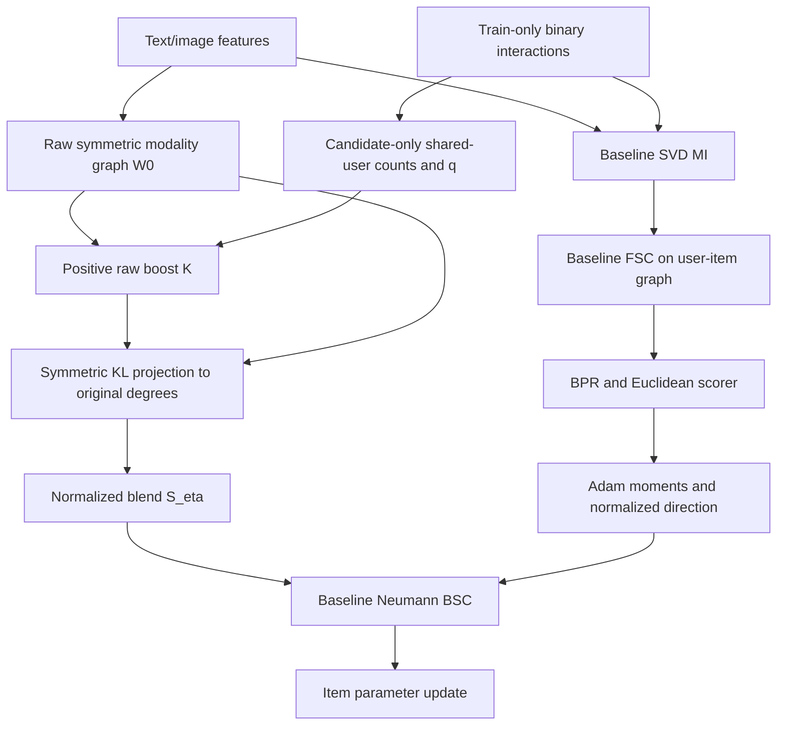

# STAIR5-v3: Phản biện PC-BSC và thiết kế hiệu chỉnh cạnh bảo toàn degree

**Ngày đối soát:** 02/10/2026. **Trạng thái:** thiết kế nghiên cứu; chưa triển khai v3, chưa có kết quả ranking v3. Tài liệu này thay thế đề xuất ba tín hiệu trong hai attachment bằng một specification có thể kiểm chứng. Không diễn giải các câu yêu cầu chạy thí nghiệm trong attachment thành chỉ thị thực thi.

## 1. Quyết định kiến trúc

Đề xuất chốt **STAIR5-v3a / DP-PC-BSC — Degree-Preserving, Preference-Compatible Backward Stepwise Convolution** làm nhánh chính. Giữ MI, FSC, BPR, Euclidean scorer, sampler, ranking và quy tắc chọn checkpoint của STAIR. Chỉ thay graph trong BSC bằng một graph được hiệu chỉnh offline từ train, có cùng support và cùng weighted degree với graph gốc.

“Preference-compatible” là tên giả thuyết: bằng chứng đồng tương tác có thể giúp chọn hướng trao đổi cập nhật tốt hơn. Đây không phải xác suất sở thích đã hiệu chuẩn, chứng minh loại bỏ nhiễu hay cam kết tăng Recall/NDCG. Điểm mới cần đánh giá là **tái phân bổ trọng số cạnh dưới ràng buộc degree**, không phải đưa ba heuristic vào sigmoid rồi gọi là uncertainty-aware hyperbolic graph.

**v3b** là nhánh nghiên cứu phụ thêm LHC đã kiểm toán vào v3a; chỉ mở sau khi đánh giá graph-only. Không mặc định thêm loss này vào mô hình cuối. Nếu v3a không tạo thay đổi hữu ích, kết luận đúng có thể là dừng hướng bảo toàn degree, thay vì tiếp tục ghép loss để cứu kết quả.

### Câu hỏi nghiên cứu có thể bác bỏ

- **RQ1:** Khi giữ nguyên ứng viên và bằng chứng hành vi của v2, tái phân bổ cạnh nhưng giữ degree có tốt hơn chuẩn hóa lại degree như v2 không?
- **RQ2:** Hiệu quả có đến từ quan hệ đồng tương tác cụ thể, hay chỉ từ mức perturbation và popularity?
- **RQ3:** Support kNN có chứa đủ quan hệ hành vi hữu ích để một phương pháp reweight-only cải thiện ranking không?
- **RQ4:** LHC còn mang lại lợi ích bổ sung sau khi kiểm soát graph, temperature, scale và chi phí không?

RQ1 là mục tiêu chính của v3a. RQ3 là điều kiện giới hạn: không có bằng chứng rằng bảo toàn support luôn là lựa chọn tối ưu.

## 2. Phạm vi và nguồn bằng chứng

Đã đối chiếu `docs/EStair.md`, `STAIR5_v1_Report.md`, `STAIR5_v1_Experiment_Report.md`, `STAIR5_v2_Report.md`, `STAIR5_v2_Experiment_Report.md`; đọc baseline `main.py`, `optimizers/AdamW.py`, `optimizers/utils.py`, graph và model v2. Đối soát hai log v2, manifest và telemetry trong `logs/GD5/stair5_v2/`.

Hai attachment được lưu thành bản làm việc tại `scratch/g5v3_review/proposal.txt` và `rebuttal.txt`. Bản thứ nhất đề xuất Lorentz + Ochiai + raw variance; bản thứ hai phê bình đề xuất đó nhưng cũng chứa các khẳng định cần sửa. Bản phản biện không được mặc định là nguồn đúng.

Nguồn web là manuscript hoặc trang xuất bản chính thức, kiểm tra ngày 02/10/2026. Nguồn tham khảo truyền cảm hứng cho giả thuyết, không chứng minh hiệu quả chuyển giao sang STAIR. Kiểm toán số và ví dụ đại số được lưu trong `scratch/g5v3_review/audit.py`, kết quả `evidence.json`, kèm SHA-256 của log/manifest/telemetry đã đọc. Các ví dụ nhỏ chạy CPU, không phải benchmark GPU hay thực nghiệm recommender.

## 3. Sửa diễn giải kết quả v1/v2 trước khi thiết kế v3

### 3.1. Kết quả test tại checkpoint được chọn bằng validation NDCG@20

Baseline là bản tái lập được báo cáo trong `report/chapters_v2/03_stair.tex`, chưa phải B0 chạy lại ghép cặp trên cùng pipeline. Dùng số sau `Load best model`; không lấy test epoch cuối thay checkpoint được chọn.

| Dataset | Model/checkpoint | R@10 | R@20 | N@10 | N@20 |
|---|---|---:|---:|---:|---:|
| Baby | Baseline lịch sử | 0.0674 | 0.1042 | 0.0359 | 0.0454 |
| Baby | v1, epoch 215 | 0.0660 | 0.1030 | 0.0352 | 0.0447 |
| Baby | v2 ET, epoch 215 | 0.0659 | 0.1029 | 0.0352 | 0.0447 |
| Sports | Baseline lịch sử | 0.0743 | 0.1111 | 0.0405 | 0.0500 |
| Sports | v1, epoch 500 | 0.0747 | 0.1133 | 0.0407 | 0.0506 |
| Sports | v2 ET, epoch 500 | 0.0744 | 0.1129 | 0.0406 | 0.0505 |
| Electronics | Baseline lịch sử | 0.0442 | 0.0665 | 0.0246 | 0.0303 |
| Electronics | v1, epoch 485 | 0.0435 | 0.0666 | 0.0241 | 0.0301 |
| Electronics | v2 | Chưa có run | Chưa có run | Chưa có run | Chưa có run |

Tăng tương đối là `100 × (model − baseline) / baseline`, không phải chênh lệch điểm phần trăm. Với v2, Baby lần lượt **−2,23%, −1,25%, −1,95%, −1,54%**; Sports **+0,13%, +1,62%, +0,25%, +1,00%**. Số log làm tròn bốn chữ số; cần metric đầy đủ độ chính xác cho kết luận nhỏ và thống kê.

**Không thể kết luận:** v2 thất bại trên Electronics; ET gây ra 85–90% lợi ích v1; LHC là nguyên nhân đã xác định của Baby; Baby có hierarchy nông; thay đổi weight decay chắc chắn khắc phục plateau. V1 và v2 là hai can thiệp khác nhau, chưa có factorial ghép cặp; mỗi dataset hiện chỉ có seed 1 được cung cấp.

Baby test epoch 500 đạt N@20=0.0454, nhưng checkpoint được chọn là epoch 215 với 0.0447. Sử dụng số epoch 500 để tuyên bố phục hồi baseline là lựa chọn dựa trên test và làm sai kết luận.

### 3.2. LHC thực tế đã tắt trong v2 ET

Manifest ghi `arm=ET`; telemetry có `lambda=0.0`, `cl_loss=0.0` ở toàn bộ các dòng đã đọc. Giá trị YAML `lambda_lhc=3e-4` không có nghĩa ET sử dụng LHC. Vì Baby vẫn giảm khi LHC không hoạt động, lập luận “Baby giảm nên LHC là thủ phạm” không đủ cơ sở. Điều này cũng không chứng minh LHC vô hại trong v1: cần B0, LHC-only, ET-only và ET+LHC trên cùng engine để xác định tác động và tương tác.

Sports telemetry có **510 dòng nhưng chỉ 500 epoch riêng biệt**: epoch 1–10 xuất hiện hai lần. Có dấu hiệu file append từ nhiều lần chạy; không coi 510 dòng là 510 epoch độc lập, không tính trung bình throughput bằng cách gộp mù. Khi triển khai v3 cần `run_id`, `attempt_id` và tệp mới cho mỗi attempt; phân biệt restart với resume.

### 3.3. Mức can thiệp graph nhỏ hơn lời mô tả

| Chỉ số manifest v2 ET | Baby | Sports |
|---|---:|---:|
| nnz, tính cả hai hướng | 59.848 | 157.752 |
| Tỷ lệ cạnh có q>0 | 10,4565% | 10,0461% |
| Mean q | 0,0022252 | 0,0027279 |
| Max q | 0,3387551 | 0,5336299 |
| Relative operator probe delta | 0,0666401% | 0,0753412% |
| Cache graph hit | Không | Có |

Probe dùng bốn cột random cố định để đo tác dụng của toán tử; **không phải** spectral norm, sai số mọi vector hay độ lệch toàn bộ phổ. Với strength=0.25, mean raw multiplier chỉ khoảng 1.0005563/1.0006820 trước chuẩn hóa. Khoảng 90% cạnh không có hỗ trợ đồng tương tác; q=0 là thiếu bằng chứng, không phải chứng cứ không thích.

Hai hệ quả cần kiểm chứng: shrinkage/Ochiai có thể khiến can thiệp quá yếu; và support semantic có thể bỏ sót quan hệ hành vi. Bổ sung feature variance hay hình học không tự giải quyết được thiếu support. Đây là lý do cần diagnostics và nhánh đối chứng mở rộng support, không hứa v3 giải quyết triệt để.

### 3.4. Chi phí quan sát được

| Dataset | Fit v1 | Fit v2 ET | Tỷ số v1/v2 |
|---|---:|---:|---:|
| Baby | 8.640,21 s ≈2,40 h | 1.147,63 s ≈19,13 phút | ≈7,53× |
| Sports | 15.310,74 s ≈4,25 h | 2.728,84 s ≈45,48 phút | ≈5,61× |

Đây là so sánh hai run đã có, không chứng minh tốc độ so với STAIR B0 cùng môi trường. ET không có LHC và engineering/backend có thể khác; cache cũng khác. Peak tensor allocated trong telemetry đã đọc là Baby ≈0,13773 GiB, Sports ≈0,21644 GiB; không phải tổng VRAM process, memory reserved, peak preprocessing hay peak evaluation. Không dùng các số này để cam kết “VRAM phẳng tuyệt đối” hoặc giảm một tỷ lệ cố định trên Electronics.

## 4. Phản biện hai tài liệu đính kèm

### 4.1. Công thức Lorentz đảo chiều similarity

Dùng convention \(\langle z,z\rangle_L=-c\), \(c>0\), sheet thời gian dương. Với hai điểm trên hyperboloid, \(\langle z_i,z_j\rangle_L\le-c\). Bình phương chordal surrogate không âm là

\[
d_{\mathrm{ch}}^2(i,j)=-2c-2\langle z_i,z_j\rangle_L\ge0,
\qquad s_L=\exp[-d_{\mathrm{ch}}^2/(2c\tau_H)].
\]

Attachment thứ nhất dùng dấu đối lập trong tử số. Ví dụ c=1, inner product=−2, τH=1: score sai=e¹≈2.7183, score đúng=e⁻¹≈0.3679. Công thức sai càng xa càng tăng score. Phải sửa dù cuối cùng v3a không dùng Lorentz. Chordal surrogate cũng không đồng nhất với squared geodesic distance; định nghĩa curvature, map và normalization là bắt buộc khi nghiên cứu nhánh hình học.

Nhận xét trong attachment thứ hai “Lorentz chỉ là cosine” chỉ đúng trong những điều kiện như norm không gian bằng nhau. Khi norm khác nhau, thành phần bán kính vẫn tồn tại. Hình học không được chứng minh hữu ích chỉ vì có bán kính, cũng không được bác bỏ tổng quát bởi một trường hợp đặc biệt.

### 4.2. Raw-feature variance không phải uncertainty

\(\operatorname{Var}_k(f_{ik})\) đo độ phân tán các tọa độ feature. Nó thay đổi khi đổi scale hoặc basis, chưa đo sai số dự đoán, aleatoric uncertainty hay relevance. Tọa độ embedding ảnh không phải các pixel để suy trực tiếp “ảnh có nhiều nền trắng thì variance thấp”. Trộn variance ảnh/text còn cần scale calibration.

Đổi variance sang một MLP học được cũng chưa đủ: cần mục tiêu estimation, ràng buộc tránh collapse và kiểm tra calibration/noise sensitivity. Bản v3a loại tín hiệu này vì chưa có estimator hoặc thực nghiệm hỗ trợ; không phủ nhận mọi mô hình uncertainty-aware.

### 4.3. Sigmoid và linear score đều cần miền giá trị

Sigmoid không luôn bão hòa chỉ vì có ba đầu vào; cần phân phối pre-logit thực tế. Nếu gate offline và cố định, không có “gate gradient bị nghẽn” trong training. Tuy nhiên sigmoid của đầu vào toàn dương có thể tạo nền tăng trọng số ngay cả khi bằng chứng yếu, và việc xếp hạng score không đồng nghĩa calibrated confidence.

Công thức thay thế \((w_1s_L+w_2s_B-w_3u)/(w_1+w_2+w_3)\) trong rebuttal cũng không tự thuộc [0,1]. Raw variance không bị chặn và sL sai có thể vượt 1; multiplier có thể âm. Cạnh âm hoặc graph bất đối xứng phá vỡ giả thiết toán tử normalized symmetric được dùng cho BSC. V3a dùng một score train-only có miền rõ ràng.

### 4.4. Chia global mean không bảo toàn norm

Đặt \(K=W_0\odot(1+a q)\), \(m\) là mean multiplier trên các cạnh. Nếu dùng \(K/m\) rồi degree normalization:

\[
\mathcal N(K/m)=\mathcal N(K),\qquad
\mathcal N(W)=D(W)^{-1/2}WD(W)^{-1/2}.
\]

Do \(D(K/m)=D(K)/m\), scalar dương triệt tiêu. Vì vậy thao tác đề xuất trong rebuttal không tạo một sửa chữa mới sau normalization. Nếu không normalization lại, chia mean vẫn không chứng minh \(\|Sg\|=\|g\|\), degree không đổi hay phổ không đổi.

Mean không trọng số thậm chí không luôn bảo toàn tổng weighted mass: ví dụ kiểm toán có mass 10 trước và 11.2 sau thao tác đó. Weighted mean có thể giữ tổng mass nhưng không giữ từng degree. **Support, tổng mass, degree, spectral bounds và norm preservation là năm thuộc tính khác nhau.**

### 4.5. “Chỉ boost, không prune” vẫn làm thay đổi cạnh khác

Sau normalization, tăng một cạnh làm tăng degree hai đầu và có thể giảm normalized weights của các cạnh khác. Không prune chỉ giữ zero pattern, không bảo đảm noise giảm hoặc tối ưu không suy thoái. Trong thiết kế bảo toàn degree bên dưới, một cạnh được tăng có thể buộc cạnh khác giảm; đó là redistribution có chủ đích, không gọi là toàn bộ cạnh được boost.

### 4.6. Điều chỉnh các kết luận phương pháp luận

| Khẳng định trong tài liệu | Điều chỉnh cần thiết |
|---|---|
| LHC đã được xác định là nguyên nhân Baby giảm | Chưa xác định; ET tắt LHC vẫn giảm. Chạy controls ghép cặp và kiểm tra tương tác. |
| Detach/graph mới không thể thay đổi tác hại của loss | Sai tổng quát: graph làm đổi trajectory và embedding, từ đó đổi gradient loss; tác dụng có thể tương tác. |
| Đạt Baby N20≥0.0454 chứng minh hết noise | Chỉ là threshold performance so với số lịch sử; không định nghĩa hoặc đo noise. |
| Sports R20≥0.1129 đủ chốt mô hình | Không thay mục tiêu validation N20 bằng một test Recall threshold sau khi xem kết quả. |
| τLHC=0.15 là giữ nguyên v1/v2 | Reference τ=0.3; 0.15 là yếu tố mới cần control riêng. |
| κ nhỏ giúp ranking chứng minh hierarchy nông | Có thể là thay đổi scale/regularization; cần evidence hình học độc lập. |
| Xác suất thành công 20%, 40%, dưới 30% | Chưa có mô hình xác suất hay dữ liệu hiệu chuẩn; loại số suy đoán. |
| Baby 0.0447→0.0450 là +0.5% | Tăng ≈0,671%; 0.0447→0.0454 ≈1,566%, không phải +1,566 điểm phần trăm. |
| Nhiều module đồng nghĩa không có novelty | Không thể kết luận như vậy; cần đối chiếu thuật toán và evidence, còn nhiều module làm attribution khó hơn. |

Sweep κ, warmup, weight decay chỉ đo sensitivity nếu không có controls phù hợp. Khi đổi decay phải chạy cả B0 và phương pháp cùng decay; không gộp thay đổi baseline optimizer với đóng góp kiến trúc.

## 5. Nghiên cứu liên quan và giới hạn chuyển giao

| Công trình đã kiểm tra nguồn chính | Ý tưởng phù hợp | Giới hạn khi áp dụng |
|---|---|---|
| [STAIR, arXiv:2412.11729](https://arxiv.org/html/2412.11729v1), Cong Xu, Yunhang He, Jun Wang, Wei Zhang | MI, coordinate-wise FSC/BSC, graph semantic cố định | Code smooths Adam-normalized direction; không coi chứng minh gradient descent là bảo đảm AdamW tổng quát. |
| [EVEN, AAAI 2025, 39(12):12461–12469](https://ojs.aaai.org/index.php/AAAI/article/view/33358), Qi và cộng sự | Đánh giá liên kết semantic bằng behavior-driven confidence | Có cả denoising interaction và alignment; phần trăm tăng so với comparator của paper không chuyển sang STAIR. |
| [SIGER, arXiv:2508.06154v1](https://arxiv.org/html/2508.06154v1), Zhang và cộng sự, 08/08/2025 | Xây collaborative top-k rồi trộn graph semantic; trực tiếp nêu thiếu coverage co-purchase | Eq. 7 trộn normalized collaborative và modality graph; đây có thể thêm support, khác reweight-only của v3a. Manuscript có perturbation/alignment riêng. |
| [IGDMRec, arXiv:2512.19983v1](https://arxiv.org/html/2512.19983v1), Guo và cộng sự, 2025 | Behavior-conditioned graph denoising bằng diffusion | Hệ thống generative + propagation + CL khác chi phí và mục tiêu BSC; chưa xác minh được nhãn TMM trong attachment từ nguồn đã kiểm tra. |
| [MURAL, arXiv:2609.04574v1](https://arxiv.org/html/2609.04574v1), Mousavi và cộng sự, 04/09/2026 | Candidate retrieval, adaptive edge learning, learned modality reliability | Preprint gần đây, không mặc định SOTA đã được tái lập. Eq. 3–4 học cạnh; Eq. 5–6 dùng uncertainty cho fusion. Không phải raw feature variance. |
| [Idel, matrix scaling review, arXiv:1609.06349](https://arxiv.org/html/1609.06349v1), 2016, §5.3/Theorem 5.4 | Symmetric diagonal scaling với row sums quy định và zero pattern khả thi | Cơ sở toán học cho projection, không phải paper recommender hoặc bảo đảm ranking. |

Nhận xét “MURAL chỉ fusion, không adaptive graph” trong rebuttal không đúng: manuscript mô tả cả hai. Tuy nhiên một log-variance học được không tự chứng minh calibrated predictive uncertainty; cần đọc objective và kết quả kiểm tra đúng phạm vi. V3a không sao chép claim calibration này.

**Khoảng trống cụ thể:** v2 tái chuẩn hóa degree sau raw boost, còn scalar global-mean correction không có hiệu lực. Có thể kiểm tra việc giữ degree gốc để phân biệt tác dụng redistribution liên-item với tác dụng đổi degree. Symmetric matrix scaling là kỹ thuật đã có; chưa có cơ sở gọi đây là phát minh toán học mới. Đóng góp khả dĩ là cách đặt constraint trong BSC, kiểm toán operator và evidence across datasets. Không tuyên bố first-ever khi chưa có systematic novelty search rộng hơn.

## 6. Specification chính thức: STAIR5-v3a / DP-PC-BSC

### 6.1. Luồng tính toán

Graph chỉ tác động đường optimizer item. Không thêm propagation graph này vào scorer hoặc FSC. User optimizer giữ baseline. Không có trainable gate/projector trong v3a; toàn bộ graph được freeze trước bước optimizer đầu tiên.

### 6.2. Dữ liệu và graph gốc

\(R\in\{0,1\}^{n_u\times n_i}\) chỉ gồm train. Deduplicate `(user,item)` trước thống kê. Giữ mapping item/user, split và feature row order của baseline; feature của item trong transductive catalog được dùng như baseline, nhưng validation/test interactions không đi vào counts, MI user pooling hoặc graph calibration.

\(W_0\) là **raw** symmetric nonnegative modality graph baseline: kNN theo cosine từng modality, loại self-neighbor như code gốc, cộng số modality hỗ trợ cạnh theo directed graph rồi symmetrize bằng max như `main.py`. Không thay trọng số raw bằng cosine liên tục. Giữ nguyên số neighbor của từng dataset. Coalesce duplicates trước degree calculation.

\[
d_i^0=\sum_j W^0_{ij},\quad D_0=\operatorname{diag}(d^0),\quad
S_0=D_0^{-1/2}W_0D_0^{-1/2}.
\]

Zero degree có inverse sqrt=0. Không thêm self-loop để chữa solver vì thay đổi baseline. Xác nhận `normalize(W0)` khớp `S0`; nếu không, dừng do contract mismatch. Với B0/off-path trả đúng buffer baseline đã tạo, tránh numerical drift do rebuild.

### 6.3. Một tín hiệu hành vi, giữ nguyên v2 để cô lập cơ chế mới

Với \(\mathcal U_i=\{u:R_{ui}=1\}\), \(n_i=|\mathcal U_i|\), chỉ tính trên support \(E_0\):

\[
c_{ij}=|\mathcal U_i\cap\mathcal U_j|,\quad
o_{ij}=\begin{cases}c_{ij}/\sqrt{n_in_j}&n_in_j>0\\0&\text{otherwise},\end{cases}
\quad q_{ij}=\frac{c_{ij}}{c_{ij}+t}o_{ij},\quad t>0.
\]

Do \(0\le c_{ij}\le\min(n_i,n_j)\), \(q\in[0,1]\), symmetric. t=5 là reference v2; không gọi đây là Bayesian posterior hay confidence interval. Không có giao nhau cho q=0 và raw boost bằng 1. Không học hoặc tune q bằng test. Tín hiệu vẫn bị ảnh hưởng exposure/popularity và đồng tương tác không phân biệt substitute/complement.

Candidate-only sorted-list intersection dùng một lần cho mỗi cạnh vô hướng rồi mirror. Không tạo dense \(R^TR\). Complexity phụ thuộc degree thực tế, không được viết thành O(|E0|) vô điều kiện; preprocessing phải ghi wall time riêng.

### 6.4. Raw preference boost

\[
K_{ij}=W^0_{ij}(1+a q_{ij}),\quad a\ge0.
\]

K có cùng support, symmetric và dương trên mọi cạnh có W0>0. Điểm khác v2 không nằm ở công thức q/K. **Điểm khác là bước projection tiếp theo.** Nhánh reference giữ a=0.25, t=5, η=0.25 để so sánh trực tiếp cơ chế; không tự đổi t, q, temperature hoặc weight decay cùng lúc.

### 6.5. Symmetric KL projection giữ degree từng item

Giải offline:

\[
W^*=\arg\min_{W}\ \frac12\sum_{(i,j)\in E_0}
\left[W_{ij}\log\frac{W_{ij}}{K_{ij}}-W_{ij}+K_{ij}\right]
\]
\[
\text{subject to}\quad W=W^T,\quad W\ge0,\quad
\operatorname{supp}(W)\subseteq E_0,\quad W\mathbf1=d^0.
\]

E0 ở đây chứa cả hai hướng; factor 1/2 tránh đếm đôi. W0 là feasible và dương trên support. Objective strictly convex theo edge weights nên W* duy nhất; positivity trên support theo điều kiện này và nghiệm tối ưu chính xác. Không nhầm uniqueness của W* với uniqueness của diagonal scale trên component bipartite.

Nghiệm có dạng \(W^*=\operatorname{diag}(s)K\operatorname{diag}(s)\), s>0 trên node có degree dương. Dạng này dựa trên stationarity/KKT; khả thi same-support với d0 được bảo đảm bởi W0, phù hợp điều kiện symmetric scaling trong [Idel §5.3](https://arxiv.org/html/1609.06349v1). Node isolated được loại khỏi solver và giữ isolated.

Đặt \(v=\log s\). Một formulation solver rõ ràng là minimization convex dual:

\[
F(v)=\frac12\sum_{(i,j)\in E_0}K_{ij}e^{v_i+v_j}-\sum_i d_i^0v_i,
\qquad \nabla F=W(v)\mathbf1-d^0.
\]

Hessian-vector product là \((\operatorname{diag}(W(v)\mathbf1)+W(v))p\); không materialize Hessian dense. Dùng L-BFGS với line search hoặc damped Newton-CG; với component bipartite cần xử lý gauge hoặc solver chịu được null direction. Không dùng alternating row normalization cuối rồi giả định symmetry còn nguyên. Không hứa fixed-point đơn giản luôn hội tụ sau một số bước cố định.

**Solver contract đề xuất:** FP64 offline reference, max 200 iterations, relative max row residual ≤1e−6 trên node d0>0; kiểm tra objective hữu hạn, symmetry, positivity, support và residual trước cache. Nếu không đạt, báo lỗi và lưu diagnostics, không âm thầm thay bằng W0 rồi ghi nhãn v3. Có thể tăng ngân sách solver sau khi xem residual, phải ghi manifest. Sau cast FP32 cho training, kiểm tra lại residual ≤2e−5 và operator action sai khác so với reference; không hợp thức hóa sai số lớn bằng tolerance rộng.

### 6.6. Normalized operator và conservative mix

\[
S_*=D_0^{-1/2}W^*D_0^{-1/2},\quad
S_\eta=(1-\eta)S_0+\eta S_*,\quad \eta\in[0,1].
\]

Vì hai graph cùng degree, equivalently \(W_\eta=(1-\eta)W_0+\eta W^*\) vẫn có degree d0 và normalize bằng D0. Merge thành **một CSR** có cùng nnz trước training; không gọi hai sparse mm ở mọi layer để thực hiện mix.

Khi a=0 hoặc η=0: fast-path trả S0 nguyên trạng; khi q≡0, có thể short-circuit S0 sau kiểm tra q. Gate 0 không được gọi là baseline recovery nếu FSC, MI, optimizer hay sampler còn đổi. Với constant q, W* về W0 trong exact arithmetic: scalar raw boost bị constraint loại bỏ. Đây là negative control tốt.

### 6.7. BSC trên đúng đối tượng cập nhật

Trong AdamWSEvo hiện tại, tính moment rồi normalized direction \(V_t\), sau đó BSC:

\[
\Delta_{:,j}=P_j(S_\eta)V_{t,:,j},\qquad
P_j(S)=\frac{1-b_j}{1-b_j^{L+1}}\sum_{\ell=0}^L b_j^\ell S^\ell.
\]

b_j dùng **baseline `beta3` của BSC**, còn FSC dùng complement như code; không tráo hai hệ số do cách đặt tên. Giữ L, γ, normalizer, decoupled weight decay và thứ tự update gốc. Không thay BSC bằng Hamiltonian/cosine filter, không smoothing raw gradient trước moments, không giữ thêm temporal momentum của graph.

Smoother chỉ giữ frozen operator/callback và baseline coefficients; không học parameter. Graph static nên không có dynamic snapshot mỗi step. Tất cả tensor graph/score/degrees trong prepare có `requires_grad=False` và không có active `grad_fn`. Chỉ khi nghiên cứu gate dynamic khác ngoài specification này mới cần snapshot trước optimizer step; không trộn chế độ đó vào v3a.

## 7. Chính xác điều gì được bảo đảm?

### 7.1. Bảo đảm toán học dưới giả thiết graph và solver đạt contract

1. Wη symmetric, nonnegative, same support và row sums d0; normalized Sη symmetric, spectral norm ≤1.
2. Sη√d0=√d0 trên mỗi component không isolated. Random walk có stationary distribution tỷ lệ d0 như baseline; không đồng nghĩa recommender exposure hoặc recommendation popularity không đổi.
3. Với b∈[0,1), Pj(Sη) có eigenvalues dương và ≤1: tại λ∈[−1,1], geometric sum `(1−(bλ)^(L+1))/(1−bλ)` dương. Pj invertible và non-expansive trong Euclidean norm.
4. Bounded intervention: với δ=||S*−S0||₂,
   \[
   \|P_j(S_\eta)-P_j(S_0)\|_2\le
   \eta\delta\frac{1-b_j}{1-b_j^{L+1}}\sum_{\ell=1}^L\ell b_j^\ell
   \le L\eta\delta.
   \]
   Dùng telescoping powers và ||S||₂≤1; không cần hai operators commute. Random probe không thay δ thành một bound đã chứng minh.

Các mệnh đề là suy dẫn cho specification này, không phải kết quả thực nghiệm paper nguồn. Approximate solver/cast có sai số; phải đo residual và ghi mức tolerance.

### 7.2. Những điều không được bảo đảm

- Không bảo toàn toàn bộ spectrum, eigenvectors hoặc norm mọi vector. **Non-expansive không phải norm-preserving.**
- Không chứng minh convergence của full AdamWSEvo stochastic training, loss giảm mỗi step hay “gradient interference bị loại bỏ tuyệt đối”.
- Không chứng minh giữ tất cả modality information hoặc fairness; coordinate-wise FSC và MI basis limitations trong EStair vẫn còn.
- Không chứng minh train co-occurrence là unbiased preference; không có exposure log để deconfound causal interest.
- Không chứng minh tăng NDCG; optimizer preconditioning không tương đương một objective graph regularizer mới trong full Adam dynamics.
- Không khắc phục candidate coverage, unseen-item cold start hoặc missing modalities.

### 7.3. Rủi ro riêng của bảo toàn degree: projection có thể xóa tín hiệu

Với graph tree không self-loop, row sums cố định xác định duy nhất trọng số cạnh qua leaf elimination. Khi đó W*=W0 dù q không hằng. Một cycle lẻ đơn độc cũng có thể không có freedom redistribution. Số cycle thông thường không đủ: freedom của biến edge dưới ràng buộc degree là `m − rank(B_unsigned)`, xét mỗi component; self-loop và bipartite structure cần xử lý đúng convention.

Trên 4-cycle kiểm toán, tăng score một cạnh tạo redistribution: các cạnh đối diện ≈1.17157, hai cạnh còn lại ≈0.82843 thay vì 1. Degree vẫn 2, residual≈1.31e−12, operator Frobenius change≈0.24264. Trên path/tree, max weight change≈7.78e−10, tức identity trong tolerance. Với constant score, sai khác bằng 0. Đây là counterexample/verification trên toy graph, không chứng minh graph Amazon có đủ freedom.

Ngay cả node có q=0 trên một cạnh vẫn có thể bị projection làm đổi cạnh do coupling. Chỉ component không có tín hiệu nào mới tự trở về W0. Không hứa từng item ít bằng chứng luôn giữ nguyên toàn bộ neighborhood.

Nếu dữ liệu chỉ có degree/popularity signal hữu ích, constraint có thể loại bỏ tín hiệu tốt. Nếu v2 đã thay operator quá ít, projection có thể làm ít hơn nữa. Vì vậy cần đo **retained intervention** trước training và so sánh v2-style unrestricted normalization; không mặc định “bảo toàn degree” là tốt hơn.

## 8. v3b: nhánh LHC có điều kiện, không đổi kiến trúc chính

V3b giữ graph v3a và thêm đúng LHC đã kiểm toán v2: cùng no-self-return view, bounded geometry, online stop-gradient key branch, positive mask train-only, duplicate ID handling và chunked multi-positive loss. Không dùng chordal formula sai trong attachment để xây graph. Không quay về code v1 chưa kiểm toán chỉ vì tên LHC giống nhau.

Reference: τ=0.3, κ=1.0, radius cap=2, λtarget=3e−4, warmup start/end=20/50 như config v2. Chỉ bắt đầu tuning κ/τ sau khi có reference paired LHC-only và v3a+LHC; τ=.15 là ablation riêng. Lịch λ phải zero trước start, ramp có định nghĩa endpoint rồi giữ target. Ghi effective λ theo epoch, raw CL, weighted CL, scale và gradient diagnostics.

Detach ngăn gradient đi qua target branch nhưng query vẫn dùng embedding chia sẻ với BPR; loss interference không bị loại bỏ tuyệt đối. Rho gradient dương tại vài batch không chứng minh ranking tốt. Đo thêm tỷ lệ norm auxiliary/BPR và thay đổi update sau optimizer/BSC, lấy mẫu thưa để tránh chi phí lặp full backward.

Primary v3a không có auxiliary optimizer. V3b chỉ tạo optimizer group cho parameter thực sự learnable; mỗi parameter thuộc đúng một group, user/item giữ baseline, auxiliary riêng và không smoother. τ/κ/λ nếu là scalar fixed không đăng ký trainable parameter. Không khẳng định chi phí v3b bằng v3a.

### Reference hyperparameters kế thừa theo dataset

| Dataset | dim / layers | epochs / eval interval | train batch | lr | weight decay | γ | textual/visual k |
|---|---|---|---:|---:|---:|---:|---|
| Baby | 64 / 3 | 500 / 5 | 1024 | 1e−3 | 0.3 | 0.1 | 5 / 1 |
| Sports | 64 / 3 | 500 / 5 | 1024 | 1e−3 | 0.1 | 0.2 | 5 / 1 |
| Electronics | 64 / 3 | 500 / 5 | 4096 | 1e−3 | 0.1 | 0.2 | 5 / 1 |

Bảng lấy từ config v2 hiện tại để chỉ rõ comparator reference; trước implement phải kiểm tra mọi hyperparameter còn lại với baseline YAML, including Adam betas/eps, sampler và eval batch. Không suy rằng decay lớn hơn trên Baby đã được chứng minh gây plateau.

## 9. Thực nghiệm chẩn đoán và tiêu chí quyết định

### 9.1. Các arm bắt buộc cho giả thuyết graph

| Arm | Graph trong BSC | LHC | Mục đích |
|---|---|---|---|
| B0 | S0, fast-path | Off | Baseline ghép cặp cùng engine |
| ET-ref | normalize(W0(1+a q)) rồi mix như v2 | Off | Comparator normalization, giữ q/a/t/η |
| DP-ref | Projection giữ d0 rồi mix | Off | v3a chính, cô lập degree constraint |
| DP-placebo | Shuffle q trên cạnh vô hướng theo strata train item degree rồi projection | Off | Kiểm tra thông tin cặp item, không chỉ perturbation |
| DP-zero/constant | q=0 hoặc hằng | Off | Negative control algebraic, không cần full training nếu off recovery qua test |

Placebo phải mirror score hai hướng, ghi số cạnh thật sự đổi và operator/probe distribution sau projection. Shuffle có thể tạo effect size khác DP-ref; nếu khác lớn cần sensitivity ở mức operator action gần nhau, không gọi so sánh đó là perfect control. Không cố tune placebo trên test.

Để đánh giá LHC dùng factorial B0, LHC-only, DP-only, DP+LHC với cùng config; phép interaction là `(DP+LHC−DP)−(LHC−B0)`. Có thể dùng ET+LHC phụ nếu muốn giải thích v2, không thay DP+LHC bằng một run lịch sử khác.

### 9.2. Lộ trình theo ngân sách

1. **Pre-flight offline:** kiểm tra contracts ở §11 và diagnostics ở §10. Nếu projection gần identity, xác nhận numerical exactness và freedom; không chi nhiều giờ full training trước khi biết can thiệp thực sự tồn tại.
2. **Pilot Baby:** B0, ET-ref, DP-ref, DP-placebo cùng seed, 100 epoch để phát hiện crash và trajectory. Pilot không đủ kết luận mô hình tốt vì checkpoint lịch sử Baby là 215 và Sports 500. Không dùng BPR<0.05 như tiêu chuẩn thành công ranking.
3. **Reference đủ budget:** các arm còn hợp lệ chạy cùng 500 epoch, eval mỗi 5, selection validation N20. Không dừng baseline sớm còn phương pháp chạy lâu hơn. Nếu đổi early stopping, áp dụng cùng rule cho mọi arm và ghi rõ thay protocol.
4. **Sensitivity nhỏ:** a∈{0.25,1,2}, η=0.25, t=5, seed pilot cố định; giữ ET comparator ở cùng a khi phân tích constraint. Không mở Cartesian grid a×η×t×κ×τ×decay ngay từ đầu. a lớn là giả thuyết tăng contrast, không bảo đảm giải quyết score yếu.
5. **Validation selection rồi khóa config:** tối đa cùng ngân sách tuning cho B0/ET/DP; ít nhất 3 seed ghép cặp để sàng lọc, 5 seed cho kết luận chính nếu đủ budget. Baby, Sports, Electronics đều cần B0 mới. Chỉ mở Electronics full khi sparse pre-flight và throughput/memory smoke test đạt yêu cầu; không skip Electronics rồi gọi thắng cả ba dataset.

Không dùng ngưỡng test Baby=.0454 để tune, không dùng test Sports=.1129 để chọn arm. Mục tiêu engineering có thể là runtime v3a gần B0 vì same nnz; mục tiêu khoa học là validation improvement được xác nhận ở selected-test sau khi khóa lựa chọn.

### 9.3. Thống kê và success criteria

Primary metric: validation NDCG@20 cho selection, selected-test NDCG@20 cho báo cáo cuối. Secondary: R@10/R@20/N@10 và phân tầng theo train item degree, history length. Báo cáo mean±SD, paired seed deltas, CI phù hợp và individual seed scores; với 3 seed không giả vờ CI rất ổn định. User-level paired bootstrap bổ sung uncertainty conditional on model, không thay training seed replication. Nếu kiểm định nhiều datasets/metrics, đăng ký primary family và correction như Holm; đừng cherry-pick metric tăng.

**Go:** DP so với B0 và ET có lợi nhất quán trên validation qua seed, selected-test phù hợp, placebo không giải thích toàn bộ lợi ích, chi phí đạt budget. **No-go:** không hơn comparator sau budget ngang nhau, tổn thất có hệ thống ở dataset/subgroup, hoặc projection gần identity và operator perturbation không tạo khác biệt có ý nghĩa. Không đặt trước xác suất thành công.

Nếu mục tiêu luận văn vẫn là tăng >6% trên đa số metric cả ba dataset, coi đó là **stretch target**, chưa có cơ sở dự báo từ v1/v2. Ví dụ N20 cần vượt 0.048124/0.053000/0.032118 tương ứng Baby/Sports/Electronics khi so với số baseline lịch sử; giá trị này không là điều kiện chọn model dựa trên test. Không gọi tăng nhỏ trong một seed là SOTA.

### 9.4. Điều kiện mở hướng support expansion

Nếu cùng-support DP quá yếu, đo coverage top behavioral neighbors trên semantic support bằng **train** và bằng behavioral graph dựng từ các train subfold riêng. Với q chỉ khác 0 ở khoảng 10% cạnh, thêm reweight heuristic không bảo đảm có cặp cần thiết để tác động.

Một hướng tiếp theo có cơ sở từ SIGER là collaborative candidate augmentation: dựng sparse top-k co-occurrence bằng inverted lists/streaming top-k hoặc retrieval rồi refine, symmetrize, normalize graph behavior và mix operator. Đây là **thay support và estimator**, phải đặt arm riêng `SUP`, giữ comparator ET/DP; không gộp vào DP-ref rồi tuyên bố degree constraint thành công. Không materialize dense RᵀR; heavy users có thể tạo O(history²) pairs nên cần budget/chunking, nếu cap/sampling phải ghi estimator đã đổi.

Fixed-degree projection trên support mở rộng không tự có strictly positive feasible solution; thêm cạnh có thể vi phạm khả thi của d0 trên một số cấu trúc. Vì vậy SUP không dùng projection của §6 như một bảo đảm vô điều kiện. Nếu kết quả chỉ tốt nhờ SUP, đóng góp chính là coverage expansion, cần sửa tên và claim thay vì duy trì narrative PC-BSC bằng mọi giá.

## 10. GPU, bộ nhớ và diagnostics

V3a thêm chi phí một lần của candidate statistics và scaling. Training dùng một CSR cùng nnz và số sparse mm BSC như baseline: thêm chi phí graph online về mặt số phép sparse mm là 0, nhưng runtime thực tế còn phụ thuộc backend, cache và logging. Không cam kết exact wall time hoặc lượng VRAM trước đo.

- Exact kNN chunked `[chunk,n_items]` có peak O(chunk×n_items), vẫn O(n_items²×feature_dim) compute. Không nhầm memory bounded với subquadratic compute. Trên Electronics, chunk=1024 và khoảng 63.001 item tạo riêng similarity FP32 khoảng 246 MiB, chưa gồm features và temporaries. Chọn chunk từ free memory và headroom; TF32/determinism flag phải ghi. Approximate ANN là ablation khác do có thể đổi graph baseline.
- Candidate counts và projection có thể CPU offline; FP64 GPU tùy phần cứng, Tesla T4 không mặc định tốt hơn CPU cho solver. Không cần giữ features gốc và q/counts trên GPU suốt training sau cache. CSR buffers chuyển device một lần trước training, không CPU↔GPU mỗi batch.
- Không dense n_items² graph, không dense Hessian, không batch×batch×dim similarity cho LHC. LHC nếu mở dùng 2D GEMM và chunk/checkpoint đúng loss normalization; overhead phải báo riêng.
- Inference giữ O(d) cho một dot-product user–item khi embeddings đã cache; full ranking một user là O(n_items×d) cộng top-k và masking. Cache embedding phải invalidate theo model checkpoint. Chi phí encoding FSC và xây graph không nằm trong O(d) per-pair claim.
- Đo train-only seconds/epoch, eval seconds, preprocessing cold/warm cache, end-to-end, peak allocated/reserved và process VRAM. CUDA timing đồng bộ ở ranh giới đo có chủ đích; không synchronize liên tục trong mỗi batch. Ghi dữ liệu GPU model/runtime giống manifest.

Diagnostics bắt buộc offline: q nonzero fraction/quantiles theo edge và node, count histogram, nnz, number of isolated/components, degree residual, symmetry residual, min/max weights, scaling quantiles, solver iterations/status, `||W*−W0||F/||W0||F`, `||Sη−S0||F/||S0||F`, random-probe action trước/sau BSC và placebo. Ghi intervention ratio sau projection so với trước projection; operator probes là diagnostics, không spectral norm certificates.

Diagnostics online thưa: BPR, embedding norms, selected validation metrics, training throughput, peak memory, update norm ratio BSC/input. V3b thêm effective λ/CL và gradient norm samples. Không lưu tensor có graph autograd vào history; detach scalar trước log.

Ước lượng budget phải dựa trên smoke test của engine mới. Bốn run Baby ET-like 500 epoch sẽ khoảng 76,5 phút fit nếu giữ throughput v2, chưa gồm preprocessing/evaluation phát sinh khác; mười lăm run Baby LHC-like theo tốc độ v1 khoảng 36 giờ fit. Hai ước lượng này có giả thiết khác nhau, không dùng chung một mức “1 giờ/run” hay xác suất thành công suy đoán. Ghi budget và chi phí thực tế riêng cho mỗi arm.

## 11. Kế hoạch triển khai sau báo cáo này

Chưa tạo source v3 trong lượt này. Khi triển khai, tổ chức giống v1/v2 và giữ source cũ để comparator tái lập được:

| File dự kiến | Trách nhiệm và contract |
|---|---|
| `models/stair5_v3.py` | Inherit baseline-compatible architecture; MI/FSC/BPR/scorer nguyên trạng; prepare chỉ dựng static graph; arms B0/ET/DP/placebo; parameter identity checks. |
| `models/stair5_v3_graph.py` | Raw graph contract, candidate-only q, symmetric constrained projection, normalized mix, solver diagnostics; không online learnable state. |
| `models/stair5_v3_utils.py` | Versioned content-addressed cache, atomic checkpoint/manifest, read-only evidence metadata; fingerprint split/mapping/features/W0/q settings/solver/source. |
| `optimizers/stair5_v3_smoother.py` | Callback Neumann baseline, same coefficients/normalizer, exact off-path; không đổi moments hoặc weight decay. |
| `main_stair5_v3.py` | CLI explicit arms, fixed seeds, baseline selection rule, run/attempt IDs, same full/pool ranking/masking, diagnostics và resume lifecycle. |
| `configs/Amazon2014{Baby,Sports,Electronics}_STAIR5_v3.yaml` | Baseline dataset hyperparameters, reference a=.25/η=.25/t=5, LHC off rõ ràng; không copy Baby decay sang datasets khác. |
| `tests/test_stair5_v3_graph.py` | Projection identity/tree/cycle, degree/symmetry/support positivity, q dedup/isolated/leakage, solver fail conditions, FP32 cast tolerance. |
| `tests/test_stair5_v3_pipeline.py` | MI/FSC/scorer và one-step optimizer recovery B0 vs baseline; groups uniqueness, checkpoint/resume/cache equivalence, CLI config effective values. |
| `notebook/P5/stair5_v3.ipynb` | Pre-flight, explicit dataset/arm selection, one fresh directory per attempt, profiling, subprocess exit checks; baseline and DP parity tests trước long runs. |

Không sửa baseline `main.py` hoặc optimizer gốc để thêm v3. Reuse geometry/objective v2 cho v3b qua imports có version/source hash; nếu cần thay thì module v3 riêng, không overwrite comparator. Khi resume phải khôi phục optimizer/epoch/RNG cùng graph fingerprint, không chỉ load embeddings.

### Kiểm thử chấp nhận trước Kaggle

1. Zero/constant q và a/η off path; baseline FSC normalization tại mọi coordinate; same initialization, scores, losses, moments và cập nhật một bước trong tolerance hoặc exact nơi off-path yêu cầu.
2. Directed duplicates và duplicate train IDs không làm đếm sai; mirror support/scores; degree zero; no valid/test edge access.
3. Projection 4-cycle có redistribution, tree có identity, disconnected bipartite gauge không làm crash; residual đạt tolerance; fail explicit khi solver không hội tụ.
4. Symmetric graph spectral bound bằng dense eigendecomposition **chỉ trên toy**, polynomial positivity/contractivity và perturbation-bound check; không xây dense eigenmatrix Amazon.
5. Autograd BPR vẫn đi vào user/item; static graph không grad_fn; groups không trùng/thiếu parameter; aux absent v3a, đúng group v3b.
6. Checkpoint roundtrip/resume reconstruct cùng graph; cache invalidation khi split/mapping/features/hyperparameters/solver thay; attempt log không append lẫn runs.
7. GPU smoke test exact sparse action so với CPU reference, measured peak memory, Kaggle subprocess imports/CLI/ranking path. CPU tests passing không ghi thành CUDA verified.

## 12. Phán quyết phản biện và kiến trúc cuối cùng

**Đề xuất attachment nguyên trạng cần major revision.** Giữ hướng train-only behavioral correction nhưng bỏ Lorentz similarity sai dấu, raw-feature variance và tuyên bố global-mean norm preservation. Thiết kế cuối v3a dùng một tín hiệu bounded và một constraint được định nghĩa rõ, có đường baseline recovery và comparator trực tiếp với v2. V3b chỉ là giả thuyết bổ sung; không coi LHC đã được chứng minh gây hại hoặc mang lợi ích.

Methodology-focus dùng hai lượt role-separated: criteria/scoring plan trước khi xem proposal, rồi review có evidence. Kết quả đánh giá và synthesis lưu trong `scratch/g5v3_review/`. Đây là mô phỏng vai trò AI cùng họ model, **NOT_CALIBRATED**, không phải hai reviewer người độc lập; không có venue-specific criteria (`criteria_binding_unavailable`). Phán quyết áp dụng đề xuất gốc, không chứng nhận thực nghiệm cho thiết kế điều chỉnh.

V3a có cơ sở toán học rõ hơn hai attachment và có chi phí online dự kiến gần baseline, nhưng **triển vọng tăng ranking còn chưa xác định**. Quan sát v2 can thiệp rất nhỏ và giới hạn coverage là phản biện mạnh đối với lựa chọn same-support này. Kết quả đúng cần cho phép bác bỏ DP-PC-BSC và chuyển sang support expansion nếu dữ liệu không ủng hộ, thay vì hứa phục hồi Baby/Electronics hoặc vượt SOTA trước khi chạy.
