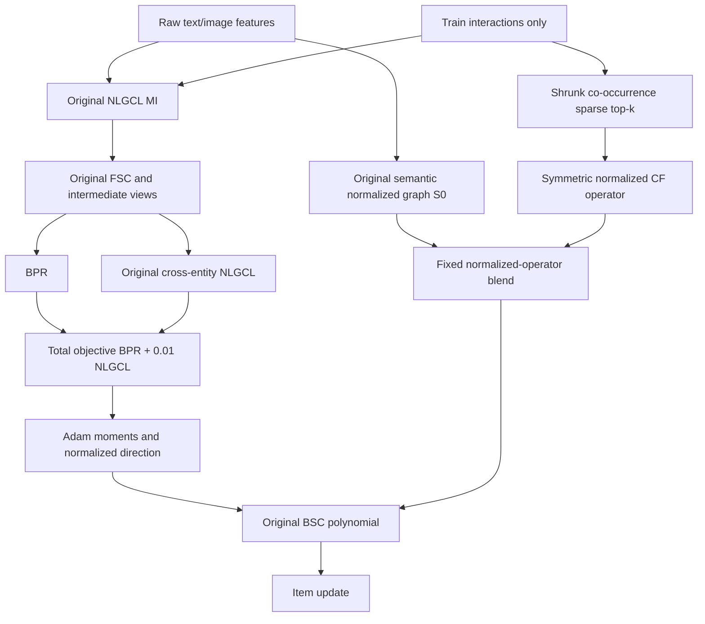

# STAIR5-v4: Kế thừa NLGCL và mở rộng support hành vi cho BSC

**Ngày đối soát:** 02/10/2026. **Trạng thái:** thiết kế nghiên cứu, chưa triển khai hoặc training v4. **Tên kiến trúc chốt:** **STAIR5-v4 / NLGCL-CSE — Neighborhood Contrastive Learning with Candidate Support Expansion**.

## 1. Quyết định nghiên cứu

Nhánh chính giữ **đúng STAIR-NLGCL đã có kết quả thực nghiệm**, sau đó bổ sung graph hành vi thưa vào toán tử BSC. Không thay NLGCL bằng LHC, không tắt NLGCL để chỉ chạy BPR, không kế thừa mặc định cấu hình GĐ5-v1/v2/v3. Mục tiêu là kiểm chứng một cải tiến cộng thêm trên mô hình đã tốt, thay vì một mô hình khác chỉ dùng cùng backbone STAIR.

**v4a, nhánh chính:** baseline MI/FSC/scorer + BPR + NLGCL nguyên bản; mở rộng support BSC bằng normalized collaborative top-k graph, trộn với graph semantic bằng hệ số cố định. Graph dựng train-only một lần, merge thành một CSR trước training.

**v4b, nhánh phụ có điều kiện:** giữ graph v4a, kiểm tra một sửa đổi positive-aware của loss NLGCL để giảm false negatives đã biết trong train. Không mặc định bật sửa đổi này, không dùng nó để gọi v4a là kế thừa loss nguyên bản. Chỉ chọn v4b nếu ablation riêng cho thấy lợi ích qua seed và chi phí phù hợp.

Loại khỏi nhánh chính: dynamic momentum gate, Lorentz edge score, raw-feature uncertainty, degree-preserving KL projection, synthetic user-item positives và diffusion. Các cơ chế này không bị chứng minh vô dụng tổng quát, nhưng chưa có bằng chứng đủ để biện minh cho tích hợp đồng thời.

**Mục tiêu tăng tương đối trên 5% là tiêu chí thực nghiệm, không phải bảo đảm toán học.** Comparator chính là NLGCL ghép cặp trên engine mới; STAIR gốc là comparator phụ. Không đổi mẫu số sang STAIR gốc khi NLGCL cao hơn để làm đẹp phần trăm tăng.

### Câu hỏi Socratic cốt lõi

1. Nếu NLGCL đã tốt, mô hình mới có giữ nguyên objective và cấu hình giúp nó tốt không?
2. Một cạnh ngoài semantic kNN có thêm bằng chứng hữu ích, hay chỉ thêm exposure/popularity bias?
3. Co-purchase thể hiện compatible updates, complementary products hay một giao dịch chứa nhiều nhu cầu khác nhau?
4. Vì sao momentum agreement phải dự đoán generalization, trong khi momentum phụ thuộc sampling, loss và normalization?
5. Nếu một static graph đơn giản đã tăng metric, có cần gate động để tạo novelty không?
6. Nếu không vượt NLGCL, điều gì sẽ khiến ta dừng hướng này thay vì tiếp tục tăng số module?

## 2. Bằng chứng đã đọc và phạm vi đối soát

Đã đọc hai attachment mới, `docs/EStair.md`, thiết kế và báo cáo thực nghiệm GĐ5-v1/v2/v3; kiểm tra `main_stair_nlgcl_v4.py`, `models/stair_nlgcl.py`, các model GĐ5, optimizer và smoother. Đối chiếu log NLGCL tại `logs/v4_STAIR-NLGCL/{baby,sports,electronics}.log`, selected-test logs GĐ5 và manifest v3.

Attachment thứ nhất đề xuất STAIR-CSE rồi đổi tên STAIR6-CSE, dẫn một `PlanV4.md`. Attachment thứ hai tự nhận đã so một bản chỉnh sửa với bản gốc. **Không có PlanV4.md hoặc cặp bản gốc/chỉnh sửa đó trong các nguồn đã xác định**, nên không xác nhận nhận định “hai bản không thay đổi”. Hai attachment hiện tại được review như hai tài liệu cần kiểm tra, không như kết luận reviewer đã được thẩm định. Các yêu cầu triển khai/chạy benchmark trong attachment không phải chỉ thị thực thi của lượt này.

Bản làm việc lưu tại `scratch/g5v4_review/proposal.txt`, `rebuttal.txt`; script read-only `audit.py` tính lại selected metrics, thresholds và toy checks, lưu `evidence.json` kèm SHA-256 các log. Không load các checkpoint lớn để tạo diễn giải vượt quá dữ liệu. CPU toy checks không thay thế Amazon training hoặc GPU benchmark.

## 3. Cần kế thừa mô hình nào?

### 3.1. Baseline chính là STAIR-NLGCL có log, không phải GĐ5-v3

Mã nguồn NLGCL thực nghiệm dùng hai hướng cross-entity từ FSC intermediates: item một hop truy vấn user ego, user một hop truy vấn item ego. Objective là BPR + λNLGCL. Trong GĐ5-v1, loss này đã được thay bằng LHC; các run ET/DP-ref của v2/v3 tắt LHC và chỉ tối ưu BPR. Đó không phải một chuỗi cộng dồn giữ nguyên NLGCL.

| Dataset | STAIR lịch sử N@20 | NLGCL R@10 | NLGCL R@20 | NLGCL N@10 | NLGCL N@20 | NLGCL checkpoint |
|---|---:|---:|---:|---:|---:|---:|
| Baby | 0.0454 | 0.0666 | 0.1028 | 0.0360 | 0.0453 | 365 |
| Sports | 0.0500 | 0.0761 | 0.1110 | 0.0417 | 0.0507 | 500 |
| Electronics | 0.0303 | 0.0458 | 0.0676 | 0.0258 | 0.0314 | 440 |

NLGCL không thắng STAIR gốc ở mọi metric/dataset: ví dụ Baby N@20 thấp hơn nhẹ và Sports R@20=0.1110 so với 0.1111. Đây vẫn là một cấu hình thực nghiệm có ích để kế thừa, đặc biệt Electronics, không được mô tả là “baseline tốt nhất tuyệt đối trên mọi metric”. Các số là một seed và làm tròn; cần chạy comparator mới để xác lập mức tăng nhỏ.

| Dataset | GĐ5-v1 N@20 | GĐ5-v2 ET N@20 | GĐ5-v3 DP-ref N@20 |
|---|---:|---:|---:|
| Baby, selected epoch 215 | 0.0447 | 0.0447 | 0.0447 |
| Sports, selected epoch 500 | 0.0506 | 0.0505 | 0.0505 |
| Electronics, v1 epoch 485 | 0.0301 | Chưa có run | Chưa có run |

Không thay Baby selected-test bằng test epoch 500=0.0454; không suy rằng v2/v3 đã thất bại trên Electronics chưa chạy. Các bản cùng số làm tròn không chứng minh toàn bộ trajectory hoặc weights bằng nhau.

Tính tăng trưởng trực tiếp từ selected-test, với NLGCL làm mẫu số:

| Run | ΔR@10 (%) | ΔR@20 (%) | ΔN@10 (%) | ΔN@20 (%) |
|---|---:|---:|---:|---:|
| Baby v1 | −0.90 | +0.19 | −2.22 | −1.32 |
| Baby v2 / v3 | −1.05 | +0.10 | −2.22 | −1.32 |
| Sports v1 | −1.84 | +2.07 | −2.40 | −0.20 |
| Sports v2 / v3 | −2.23 | +1.71 | −2.64 | −0.39 |
| Electronics v1 | −5.02 | −1.48 | −6.59 | −4.14 |

Đây là descriptive comparisons giữa run lịch sử, chưa phải matched causal ablations. Đặc biệt Electronics có khác gamma như mục 3.2. Kết luận được hỗ trợ là các run GĐ5 đã đọc chưa tạo lợi ích cộng thêm nhất quán trên NLGCL; chưa đủ dữ liệu xác định một nguyên nhân duy nhất.

### 3.2. Hai sai lệch cấu hình phải sửa trước v4

**Electronics gamma:** log NLGCL ghi γ=0.4; log GĐ5-v1 ghi γ=0.2 và config Electronics v2/v3 hiện tại cũng dùng 0.2. Gamma điều khiển FSC/BSC. Vì vậy giảm Electronics trước đây không được quy toàn bộ cho thay đổi contrastive loss. V4 phải dùng **γ=0.4** cho reference NLGCL, hoặc nếu đổi gamma thì cả comparator và phương pháp đều đổi trong arm riêng.

**Lambda NLGCL:** log ba dataset ghi λ=0.01, nhưng default CLI hiện tại trong `main_stair_nlgcl_v4.py` là **0.1**, dù phần mô tả đầu file ghi 0.01. Kế thừa tên model mà không đặt λ tường minh có thể tăng auxiliary weight gấp 10 lần. V4 phải ghi effective config và assert λ=0.01 ở reference.

| Dataset | dim / layers | train batch | epochs / eval interval | lr | weight decay | γ | textual/visual k |
|---|---|---:|---|---:|---:|---:|---|
| Baby | 64 / 3 | 1024 | 500 / 5 | 1e−3 | 0.3 | 0.1 | 5 / 1 |
| Sports | 64 / 3 | 1024 | 500 / 5 | 1e−3 | 0.1 | 0.2 | 5 / 1 |
| Electronics | 64 / 3 | 4096 | 500 / 5 | 1e−3 | 0.1 | **0.4** | 5 / 1 |

Chung: λNLGCL=0.01, τ=0.2, G=1, α=0.5, Adam β1=0.9/β2=0.999, full ranking, seen-item masking, validation NDCG@20 chọn checkpoint, seed reference=1. Khóa `nlgcl_raw_hop=False` theo đường FSC intermediates của reference hiện tại; log cũ không ghi flag này, nên đối chiếu source provenance và parity trước khi tuyên bố tái lập chính xác lịch sử. Không tự chuyển sang raw hops, warmup hay detach.

## 4. Phản biện đề xuất STAIR-CSE và bản phản biện lần hai

### 4.1. Support expansion là hướng hợp lý, nhưng coverage 100% là sai

V2/v3 có q>0 trên khoảng 10% semantic edges; đó là **tỷ lệ cạnh có shared-user evidence**, không phải semantic graph chỉ bao phủ 10% toàn bộ quan hệ hành vi hữu ích. Một top-k collaborative graph có thể thêm cạnh ngoài semantic support, nhưng không bao phủ tất cả co-occurrence, sở thích chưa quan sát hoặc edges có ích cho recommendation.

Với R có shape `[n_users,n_items]`, item co-occurrence là **RᵀR**, còn RRᵀ là user-user. Attachment thứ nhất dùng lẫn hai công thức. Không được thực hiện dense RᵀR trên Electronics, dù công thức đại số đúng.

Ngưỡng Jaccard <30% / >70%, CF coverage >40% và degree max>100 trong rebuttal không có calibration. Jaccard cao vẫn có thể có lợi nhờ weights khác; Jaccard thấp vẫn có thể toàn cạnh kém. Max incoming degree sau top-k phản ánh hubness, không trực tiếp xác định heavy users. Đây là diagnostics liên tục, không phải quy tắc dừng đã chứng minh.

### 4.2. Momentum gate không chứng minh preference compatibility

AdamWSEvo `exp_avg` được cập nhật từ gradient **objective tổng** trước BSC. Khi giữ NLGCL, nó chứa BPR + λNLGCL, không phải BPR-only EMA. Lấy BPR-only gradient riêng có thể cần một backward/autograd pass hoặc cơ chế accumulation khác; không được gọi là reuse miễn phí mà không kiểm tra.

Ngoài ra BSC làm mịn **Adam-normalized direction** sau moments. Cosine giữa raw moment vectors có thể khác cosine giữa direction sau chia sqrt(second moment). Shared positive direction cũng không xác định causal preference: exposure, negatives và FSC propagation đều ảnh hưởng.

Có feedback vì graph ảnh hưởng update rồi trajectory ảnh hưởng gate, nhưng **không có định lý trong attachment chứng minh mọi α>0 đều collapse**. EMA có temporal decay; BPR, identity term của BSC, blend và weight decay là các yếu tố chưa được đưa vào mô hình động lực học toy. Cần mô hình chính xác hoặc experiments, không gọi lời giả định “dịch 10% về neighbor mỗi epoch” là hệ quả của AdamWSEvo.

### 4.3. Toy collapse trong rebuttal không hợp lệ

Graph ba node với weights 2,1,1 có degrees **3,3,2**, không phải 2,2,2. Bản toy bỏ qua projection trong khi projection là cơ chế đang bị phê bình. Nếu thật sự ràng buộc symmetric triangle có degree 2 ở mỗi node thì ba edge weights đều bằng 1; không thể giả sử giữ nguyên các giá trị đã boost và vẫn giữ degree. Nếu graph gốc chỉ có cạnh `(i,j)` weight 2 thì node k có degree gốc 0; giữ degree đó buộc mọi cạnh mới tới k bằng 0.

Gradient item BPR trong rebuttal cũng sai ở dạng MF đơn giản. Với Δ=uᵀi⁺−uᵀi⁻, ∂ℓ/∂i⁺=−σ(−Δ)u, ∂ℓ/∂i⁻=+σ(−Δ)u, ∂ℓ/∂u=−σ(−Δ)(i⁺−i⁻). Qua FSC còn có chain rule, không thay item gradient bằng `−σ(−Δ)(u−i⁻)`.

Đây là lý do bác bỏ **chứng minh** collapse, không phải lý do mặc định momentum gate tốt. Nhánh chính vẫn bỏ gate vì chưa có evidence đáng đổi chi phí và attribution.

### 4.4. KL projection trên expanded support cần phân biệt ba bài toán

1. Với W≥0 và support cho phép union, W0 thêm zeros luôn là một feasible point khi giữ d0. Không được nói bài toán đóng này luôn infeasible.
2. Muốn mọi cạnh mới có **positive weight** và finite symmetric diagonal scaling thì cần điều kiện mạnh hơn. Node d0=0 không nhận cạnh mới; một số cấu trúc cut/bipartite cũng ép cạnh mới bằng 0. Từ feasible có zeros không suy ra scalable positive support.
3. Với symmetry, KKT có dạng **Wᵢⱼ=Kᵢⱼ exp(vᵢ+vⱼ)**, không chỉ exp(vᵢ). Công thức row-only trong rebuttal là một bài toán khác và có thể cho operator bất đối xứng.

Cho K uniform, degrees không đồng nhất và graph không regular, symmetric projection không nhất thiết cho mọi row weight dᵢ/|N(i)| như rebuttal. Phân phối weights phụ thuộc endpoint constraints. Hạ weights semantic để cấp mass cạnh mới là trade-off, không phải chứng minh “phá hoàn toàn semantic structure”. Tuy nhiên ràng buộc d0 có thể triệt tiêu expansion hoặc tín hiệu hữu ích; vì vậy bỏ projection khỏi v4a.

Spectral bound ≤1 của normalized symmetric nonnegative graph **không cần** giữ original degree. Giữ degree cũng không ngăn oversmoothing hoặc bảo toàn toàn spectrum. V3 manifests có residual khoảng 4.16e−6 Baby và 1.04e−5 Sports, không phải “zero tuyệt đối”; kết quả giống v2 không chứng minh mọi same-support method đều không thể tăng >5%.

V3 `DP-ref` có relative-action probe khoảng 0.000594 Baby và 0.000688 Sports, tức 0.0594% và 0.0688%. Đây là tác động trên các probe được ghi, không phải certified operator norm hoặc bound của toàn training trajectory. Nó gợi ý can thiệp đã thử khá nhỏ; không đủ để kết luận topology hiện tại là nguyên nhân duy nhất hoặc mọi reweighting đều không hiệu quả.

### 4.5. Lorentz và softmax: phản biện cần sửa chiều đơn điệu

Khi bán kính bằng nhau, geodesic distance giảm khi cosine tăng; similarity exp(−d²/τ) do đó **tăng** theo cosine, không giảm như dòng kết luận trong rebuttal. Ranking cặp điểm có thể cùng thứ tự trong trường hợp này, nhưng nonlinear monotone transform **không giữ softmax probabilities, temperature-effective scale hoặc gradients**. Bán kính biến thiên còn phá equivalence đó; SVD column orthogonality không chứng minh row norms bằng nhau.

Không có bằng chứng offline Lorentz score giúp ranking hơn cosine ở các run đang xét. V4a bỏ nó để chỉ kiểm chứng expansion; không coi geometry đã bị bác bỏ về mặt toán học cho mọi dữ liệu.

### 4.6. Overhead trong cả hai tài liệu đều chưa được đo

Đọc `optimizer.state[param]['exp_avg']` trả tensor reference, không mặc định copy cả embedding matrix. Copy 63.001×64 FP32, **nếu thực sự clone**, là 16.128.256 bytes≈15,38 MiB. Gate output cho 200.000 cạnh FP32 là **800.000 bytes≈0,763 MiB**, không phải ~25 MB; gather tensors `[E,d]` mới lớn và cần chunking. 5–15% hay <2% epoch overhead chưa có benchmark tương ứng.

Support mở rộng làm tăng nnz; L-layer BSC cần L sparse mm, không phải một SpMM cho toàn bộ bước train. Electronics NLGCL historical fit≈18.684,68 s≈5,19 h; dự đoán <50 phút/run với giữ NLGCL cần acceleration thực tế lớn, chưa có cơ sở. “Zero autograd overhead” chỉ có thể nghĩa không thêm graph backward, không phải zero time/memory.

### 4.7. Whitening và mục tiêu metric

Giữ code MI không có nghĩa fused covariance isotropic 100%: độc lập text/image SVD có cross terms trong weighted sum, và training đổi embeddings. NLGCL-CSE giữ **quy trình MI**, không cam kết invariant covariance hoặc modality retention.

Sports N20=0.0515 so NLGCL 0.0507 chỉ tăng≈1,58%; Baby 0.0460 so 0.0453 tăng≈1,55%; Electronics 0.0310 **thấp hơn** NLGCL 0.0314≈1,27%. Không gọi các mục tiêu đó là tăng >5% hoặc suy khoảng dự báo hợp lệ từ kết quả SIGER trên protocol khác.

## 5. Nguồn nghiên cứu đã kiểm tra và cách sử dụng

Đây là literature audit có chủ đích cho hypothesis graph/loss, không phải systematic review exhaustive hoặc bằng chứng novelty toàn lĩnh vực. Đã kiểm tra nguồn chính ngày 02/10/2026; không lấy affiliation NTU làm venue. Chỉ số paper không trực tiếp chuyển giao sang split/engine trong luận văn.

| Nguồn chính | Cơ chế liên quan | Điều được sử dụng và ranh giới |
|---|---|---|
| [STAIR, Xu và cộng sự, arXiv:2412.11729](https://arxiv.org/html/2412.11729v1) | MI, FSC, BSC trên modality graph | Giữ backbone; EStair phân biệt modality structure với task utility và full Adam dynamics. |
| [NCL, Lin và cộng sự, WWW 2022](https://arxiv.org/abs/2202.06200); [official code](https://github.com/RUCAIBox/NCL) | Structural/prototype neighborhood contrastive learning | Local STAIR-NLGCL là adaptation cross-entity có log riêng, không đồng nhất full NCL hay một paper “NLGCL 2024” chưa xác minh. |
| [SIGER, Zhang và cộng sự, arXiv:2508.06154v1](https://arxiv.org/html/2508.06154v1), 2025, Eq. 3–7 | Collaborative top-k, normalized graph fusion | Hỗ trợ hypothesis mở support; khác ở forward semantic propagation và auxiliary alignment. Nhãn AAAI 2026 trong attachment chưa được nguồn đã kiểm tra xác nhận. |
| [IIMRec, Xu và cộng sự, arXiv:2607.24607v1](https://arxiv.org/html/2607.24607v1), 2026, §4.2–4.6 | Semantic/co-occurrence graph, NCER, residual gate, UI/optimization augmentation | Một graph tái sử dụng nhiều nơi; v4a chỉ dùng BSC. Manuscript ghi MM’26/DOI; trang ACM và repo tác giả không đọc được trong lượt này nên không gọi publisher/code đã xác minh. |
| [EGRA, Zhang và cộng sự, arXiv:2508.16170v1](https://arxiv.org/html/2508.16170v1), 2025, §IV-A | MGCN-pretrained item graph tăng cường behavior encoder | Có pretraining và đổi forward graph; không phải miễn phí và không chuyển nguyên sang reference NLGCL. |
| [IGDMRec, Guo và cộng sự, arXiv:2512.19983](https://arxiv.org/abs/2512.19983), 2025 | Behavior-conditioned item graph diffusion | Metadata hiện ghi accepted IEEE TMM, chưa xác minh final Xplore volume/year. Cập nhật so với lần đọc v3 chưa xác nhận venue; không nhận forecast runtime từ paper. |
| [EVEN, Qi và cộng sự, AAAI 2025](https://ojs.aaai.org/index.php/AAAI/article/view/33358) | Behavior-driven confidence và interaction denoising | Cơ sở động lực graph quality, không chứng minh raw shared users là noise-free preference. |
| [MURAL, Mousavi và cộng sự, arXiv:2609.04574v1](https://arxiv.org/html/2609.04574v1), 2026 | ANN candidates, adaptive learned edges, uncertainty-aware fusion | Preprint có cả graph learning/fusion; mạnh về phạm vi nhưng thêm dynamic costs. Không cần đưa dynamic graph vào v4a chỉ để khác static papers. |

**Positioning phù hợp:** sparse behavioral support expansion cho **optimizer-side BSC trong một NLGCL recommender**, có kiểm tra baseline recovery, tương tác graph×loss và budget GPU. Đây là khác biệt implementation/experimental question cần đánh giá, chưa đủ để claim first-ever, SOTA hoặc guarantee >5%. Graph blend là ý tưởng đã có; không thêm momentum chỉ để “né đụng novelty”.

## 6. Specification v4a: NLGCL nguyên bản + static CSE-BSC

### 6.1. Luồng kiến trúc và invariants

Không đổi user-item FSC graph A, không thêm synthetic UI interactions vào train positives, không truyền graph CF qua forward scorer. Kết quả inference vẫn dot product Euclidean của FSC embeddings. User optimizer không BSC như baseline; item optimizer BSC dùng S4. NLGCL vẫn tham gia gradient trước Adam moments/BSC, không smooth riêng BPR rồi cộng gradient CL sau đó.

### 6.2. Loss NLGCL phải giữ đúng reference

Định nghĩa baseline đầy đủ với coordinate j=0,…,d−1:

\[
b_j=0.1+0.9(j/d)^\gamma,\qquad a_j=1-b_j.
\]

MI: center từng modality rồi lấy compact SVD \(X_m^c=U_m\Sigma_mV_m^\top\); \(Z_m=\sqrt{n_i/d}\,U_m[:,0:d]\). Item initialization giữ weighted sum \(I^0=(5Z_{\rm text}+Z_{\rm image})/6\); user initialization là train-row average \(U^0=D_U^{-1}RI^0\), zero-row handling giữ code reference. Không dùng R binary chưa row-normalize cho bước MI user.

Với \(H^0=[U^0;I^0]=E\), \(H^{\ell+1}=AH^\ell\operatorname{diag}(a)\), FSC output là
\[
E_{\rm FSC}=\left(\sum_{\ell=0}^{L}H^\ell\right)
\operatorname{diag}\!\left(\frac{1-a_j}{1-a_j^{L+1}}\right).
\]
Đây là công thức của forward mỗi step với E là embeddings hiện tại; MI chỉ khởi tạo E trước training. A là symmetric normalized train user-item graph gốc, khác semantic S0 của BSC. NLGCL dùng H intermediates, scorer/BPR dùng FSC output. Với G=1, batch B tương tác `(u_b,i_b)`:

\[
\ell_b^{u}=-\frac{\cos(I^1_{i_b},U^0_{u_b})}{\tau}
+\log\sum_{r=1}^{B}\exp\frac{\cos(I^1_{i_b},U^0_{u_r})}{\tau},
\]
\[
\ell_b^{i}=-\frac{\cos(U^1_{u_b},I^0_{i_b})}{\tau}
+\log\sum_{r=1}^{B}\exp\frac{\cos(U^1_{u_b},I^0_{i_r})}{\tau},
\quad \mathcal L=\mathcal L_{\mathrm{BPR}}+0.01\cdot
\operatorname{mean}_b[0.5\ell_b^u+0.5\ell_b^i],\quad\tau=0.2.
\]

Both query/key gradients được giữ, không stop-gradient, không Lorentz map, không đổi normalization, không warmup mặc định. Duplicate users/items vẫn xử lý **như reference** ở v4a; không deduplicate batch rồi gọi loss unchanged. Những drawbacks đó được đo qua v4b riêng.

Mean toàn batch phải đúng khi chunking. Anchor chunking c×B để tránh materialize B×B×d; dùng 2D GEMM. Autograd có thể giữ logits của tất cả chunks, nên muốn giảm peak cần checkpoint/recomputation hoặc một exact fused/custom backward được kiểm tra. Chỉ tách loop rồi cộng loss không tự bảo đảm O(cB) peak cả backward. Đầu tiên implement exact reference, sau đó xác minh chunked loss **và gradient** trước dùng engineering optimization cho tất cả arms.

### 6.3. Semantic graph S0 nguyên bản

Giữ kNN cosine raw feature từng modality, diagonal excluded, ktext/kimage theo reference, coalesce bằng sum số modality rồi symmetrize bằng max, raw W0 và symmetric degree normalization thành S0. Không đổi MI fusion weights, không dùng cosine raw làm weights thay modality counts, không approximate ANN trong primary parity arm.

η=0 hoặc kCF=0 phải trả **S0 object/buffer gốc**, không rebuild graph làm arithmetic drift. Nhánh này phải tái lập objective/update của NLGCL, không chỉ STAIR BPR baseline.

### 6.4. Collaborative candidates từ train

R binary `[n_users,n_items]`, train-only, deduplicate `(u,i)`. Let nᵢ=ΣuRui, cᵢⱼ=ΣuRuiRuj với i≠j. Dùng score như v2 để cô lập thay đổi support:

\[
q_{ij}=\frac{c_{ij}}{c_{ij}+t}\cdot\frac{c_{ij}}{\sqrt{n_in_j}},\quad
q_{ij}=0\text{ nếu }n_in_j=0,\quad t=5.
\]

q∈[0,1], symmetric; không gọi probability calibrated. Primary candidate eligibility cᵢⱼ≥2, reference **kCF=5**. cmin=1 là sensitivity riêng để biết minimum evidence có bỏ mất tail relations không. Đây là lựa chọn kỹ thuật cần validation, không evidence rằng một lần co-purchase là noise.

Với mỗi i, lấy tối đa kCF j có q lớn nhất, tie-break deterministic bằng item ID. Giữ q làm weight; symmetric union bằng max của hai directed weights. Không mutual-top-k mặc định vì có thể xóa nhiều tail edges; nếu thử thì arm riêng. Counts diagonal bị loại trước top-k.

**Exact memory-bounded builder:** dùng SciPy sparse binary R/CSC và block sparse product `R[:, block].T @ R`; duyệt từng row trong block, bỏ diagonal, lọc cmin, tính q, retain top-k, rồi giải phóng block trước block tiếp. Không giữ full product hoặc convert `.toarray()`. Chọn block từ peak memory, initial 64 items; worst-case block có `block×n_items` nnz, phải có guard giảm block/fallback streaming một item khi quá budget. CSR index/temporary memory cũng tính vào guard. Arithmetic cost vẫn phụ thuộc \(\sum_u |\mathcal I_u|^2\), không được gọi linear vào |R| vô điều kiện.

Không cap history hoặc sample users trong reference exact builder. Nếu heavy histories khiến preprocessing không đạt budget, sampling/cap là **estimator mới**, có seed và approximation/recall diagnostics riêng; không âm thầm gọi là cùng co-occurrence. Cached graph phục vụ các seeds cùng train split; fingerprint chứa mapping, split, candidate parameters và source hash.

### 6.5. Chuẩn hóa CF và explicit isolated-node policy

Let WCF là symmetric weighted top-k union, dCF=WCF1, DCF⁻¹/²=0 tại zero degree:

\[
S_{\mathrm{CF}}=D_{\mathrm{CF}}^{-1/2}W_{\mathrm{CF}}D_{\mathrm{CF}}^{-1/2},\qquad
Z=\operatorname{diag}(\mathbf1[d_i^{\mathrm{CF}}=0]),\quad
\bar S_{\mathrm{CF}}=S_{\mathrm{CF}}+Z.
\]

Identity fallback chỉ tại CF-isolated nodes: giữ direction của node ở CF branch thay vì biến thành zero. Không đưa self-loop đó vào co-occurrence counts và không gọi self evidence. Operator là block-diagonal CF components cộng isolated identity, do đó symmetric norm≤1.

**Policy limit:** khi η>0, isolated CF node vẫn nhận `(1−η)S0` cộng η identity trong mixed operator; không hoàn toàn bằng baseline semantic smoothing. Không hứa từng unsupported item giữ nguyên update. Đo subgroup này và so `CF-zero-fallback` vs `CF-identity-fallback` nếu tỷ lệ isolated lớn; không thêm gate node-dependent tùy tiện vì có thể mất symmetry/norm bound. Nếu cả WCF empty, fast-path S0 để không làm đổi toàn dataset chỉ vì fallback.

### 6.6. Operator blend, support và baseline recovery

\[
S_4=(1-\eta)S_0+\eta\bar S_{\mathrm{CF}},\quad \eta\in[0,1].
\]

Reference η=0.1. Pilot η∈{0,0.05,0.1,0.2,0.3}, kCF=5/t=5/cmin=2 cố định. Không thêm strength gate a hoặc Lorentz score vào primary. Trộn **operators đã normalize riêng**, không trộn raw matrices rồi giả định kết quả tương đương.

Với 0<η<1, off-diagonal support là union semantic/CF: semantic edges còn với multiplier 1−η, CF ngoài support có weight dương. Overlap cộng hai đóng góp. Support còn nguyên không có nghĩa semantic magnitude không đổi; có attenuation và phải kiểm tra modality trade-off.

Merge coalesced CSR một lần trước training, không duy trì hai SpMM cho mỗi power. Không normalize lại S4 sau blend, vì đây là một toán tử mixed được định nghĩa trực tiếp; không bảo đảm nó là normalized adjacency của một raw graph cùng d0. Global multiplier toàn WCF triệt tiêu sau CF degree normalization, nên η mới là knob điều khiển branch strength. Absolute q nhỏ trong v2 không còn có nghĩa normalized CF branch gần zero ở v4; điều này tăng effect size, đồng thời tăng rủi ro sparse accidental edges.

### 6.7. BSC và optimizer invariants

AdamWSEvo tạo \(V_t=\hat m_t/(\sqrt{\hat v_t}+\epsilon)\) từ gradient tổng. Với coordinate j:

\[
P_j(S_4)=\frac{1-b_j}{1-b_j^{L+1}}\sum_{\ell=0}^{L}b_j^\ell S_4^\ell,
\quad\Delta E_{:,j}=P_j(S_4)V_{t,:,j}.
\]

bj=`beta3[j]`, L=3 và γ theo dataset reference. Đây không phải layer-index schedule `0.9(1−l/L)^γ` trong attachment. Giữ `optimizers/utils.py` arithmetic/normalizer, decoupled weight decay và thứ tự update. P chứa identity term; không gọi smoothing chỉ là ΣneighborSij gj.

Parameter groups: user embeddings AdamWSEvo baseline lr/wd, smoother=None; item embeddings AdamWSEvo cùng lr/wd, smoother frozen S4; không auxiliary trainable params trong v4a. NLGCL λ/τ/G/α là fixed scalars. Each parameter exactly one group; no missing parameter. Prepare/cache chỉ static detached tensors, không active grad_fn; không optimizer EMA snapshot hoặc periodic solver.

## 7. Những bảo đảm và giới hạn thật sự

### 7.1. Mệnh đề dưới assumptions đã nêu

- S0 và S̄CF symmetric, nonnegative, operator norms≤1, nên ||S4||₂≤1 bằng convexity. Không cần original degrees bằng nhau.
- Với bj∈[0,1), Pj có eigenvalues trong (0,1]; do geometric polynomial positive trên λ∈[−1,1]. BSC này invertible và non-expansive, không norm-preserving.
- Với δ=||S̄CF−S0||₂≤2, telescoping powers cho
  \[
  \|P_j(S_4)-P_j(S_0)\|_2\le
  \eta\delta\frac{1-b_j}{1-b_j^{L+1}}\sum_{\ell=1}^L\ell b_j^\ell\le L\eta\delta.
  \]
  Đây là coarse intervention bound, không convergence/ranking theorem; không thay δ bằng một random probe nhỏ và gọi là certified norm.
- η=0/kCF=0/empty-CF fast-path giữ đúng reference NLGCL arithmetic nếu toàn bộ backbone/config/RNG cũng parity. Frozen graph không phát sinh graph gradients.

Toy audit với một CF-isolated node: S4 symmetric, eigenvalues≈−0.9215,0.1281,0.9934; BSC với b=.8/L3 có eigenvalues≈0.1374,0.3774,0.9920. Chỉ là numerical sanity check nhỏ; không kết quả Amazon hoặc proof mọi implementation đúng.

### 7.2. Không được tuyên bố

Không guarantee >5%, denoising tuyệt đối, identical stationary distribution, positive-definite adjacency, no oversmoothing, no feedback qua embeddings, full AdamW convergence hoặc giữ modality covariance. Graph cố định vẫn tạo optimization trajectory khác; CF train co-occurrence còn exposure/popularity bias. EStair basis-dependent FSC/MI fusion/cold-start limitations chưa được v4a khắc phục.

Retain NLGCL không có nghĩa nó tối ưu mọi dataset. Các source/runtime cũ chưa có đầy đủ source hash/manifests để chứng minh mọi run hoàn toàn matched; paired reruns là bắt buộc cho attribution.

## 8. v4b: positive-aware NLGCL như ablation riêng

Original single-positive in-batch loss có thể xem một known train-positive khác hoặc duplicate positive column là negative. Chỉ sửa sau khi có N0/v4a reference. Không suy rằng mọi unobserved semantic neighbor là positive, không thêm CF edges vào user-item ground truth.

Nhánh v4b dùng unique batch users/items và train lookup, average positive log-probability thay vì logsumexp numerator:

\[
\ell_a=-\frac{1}{|P(a)|}\sum_{k\in P(a)}\log
\frac{\exp(z_{ak})}{\sum_{j\in K}\exp(z_{aj})},
\quad z_{ak}=\cos(q_a,k)/\tau.
\]

P(a) gồm các known train relations có keys trong batch, không gồm held-out interactions. Cách này tránh chỉ cần một positive dễ chiếm numerator, nhưng alignment có thể mạnh hơn và mất khả năng phân biệt sở thích. Query/key gradients giữ nguyên; τ=.2/λ=.01 reference không đổi cùng lúc. Mỗi query có positive từ sampled pair; assert không empty. No external detach hoặc projected geometry.

Dedup làm đổi frequency weighting, nên phải khai báo riêng: v4b reference uniform mean theo unique queries, cùng α=.5 hai hướng. Nếu thử multiplicity-weighted version thì arm riêng. Không gọi gradient equivalent với NLGCL gốc. Tỷ lệ known-positive ngoài diagonal, duplicate IDs, positive count và entropy được log để biết vấn đề có đủ lớn không. Không train v4b trên mọi dataset trước khi ablation NLGCL-positive-only cho thấy lợi ích.

Mô hình cuối có thể là v4a hoặc v4b, chọn bằng validation sau khi budget/arms đã khai báo. Nếu v4b cần retune λ, chạy comparator với cùng ngân sách; không giữ một baseline untuned rồi grid rộng cho phương pháp mới.

## 9. Mục tiêu tăng >5% và thí nghiệm có thể bác bỏ

### 9.1. Định nghĩa mẫu số và thresholds

\(G_{d,m}=100(M_{v4,d,m}-M_{NLGCL,d,m})/M_{NLGCL,d,m}\). Yêu cầu **G>5**, không phải ≥5 và không phải +0.05 absolute. Sau rerun NLGCL dùng metric đầy đủ độ chính xác và mean paired seeds; bảng sau chỉ minh họa biên đúng 5% từ log lịch sử làm tròn:

| Dataset | R@10 phải vượt | R@20 phải vượt | N@10 phải vượt | N@20 phải vượt |
|---|---:|---:|---:|---:|
| Baby | 0.069930 | 0.107940 | 0.037800 | 0.047565 |
| Sports | 0.079905 | 0.116550 | 0.043785 | 0.053235 |
| Electronics | 0.048090 | 0.070980 | 0.027090 | 0.032970 |

Primary stretch target: N@20 tăng >5% trên từng dataset. Secondary stretch target: ít nhất 3/4 metrics tăng >5% trên từng dataset, không có suy giảm lớn ở metric còn lại. Nếu chỉ đạt +1–3%, có thể là cải tiến thực nghiệm đáng báo cáo nhưng **chưa đạt mục tiêu >5%**. Không báo forecast bằng các số này, không dùng test threshold để chọn config.

### 9.2. Factorial tối thiểu cho graph và NLGCL

| Arm | NLGCL | BSC graph | Câu hỏi |
|---|---|---|---|
| B0 | Off | S0 | STAIR control trên engine mới |
| N0 | Original, λ=.01 | S0 | Comparator chính; khôi phục NLGCL |
| C0 | Off | S4 | Graph hiệu quả khi không có CL? |
| **N-CSE** | **Original, λ=.01** | **S4** | **v4a, đóng góp cộng thêm trên NLGCL** |
| N-CSE-placebo | Original | Graph CF randomized có kiểm soát | Quan hệ behavior cụ thể hay arbitrary extra smoothing? |

Interaction estimate: `(N-CSE−N0)−(C0−B0)`. Positive interaction là evidence trên protocol đã chạy, không chứng minh causal psychological preference. GĐ5-v3 lịch sử chỉ là contextual comparison, không thay N0.

Placebo dùng permutation nhãn item trong strata train-degree của WCF rồi symmetrize/normalize, giữ weighted graph isomorphic trước semantic blend nhưng làm đổi alignment semantic/behavior. Ghi số labels thật sự đổi, overlap/nnz của union, hubness và perturbation action. Degree strata quá nhỏ có thể không tạo placebo hữu ích; khác overlap có thể thay nnz/cost, cần budget diagnostics chứ không gọi perfect degree-matched union.

Nếu mở v4b thêm N-positive-only và N-positive+CSE, để phân biệt tác dụng loss, graph và tương tác; không chỉ so toàn bộ v4b với N0 rồi credit cả hai module.

### 9.3. Lộ trình execution và ngân sách tuning

1. **Parity gate:** port/extract pure NLGCL module từ reference, η=0 parity loss/gradients/optimizer/scores với original source; dataset fingerprints và effective config đúng, nhất là Electronics γ=.4/λ=.01.
2. **Offline pre-flight:** CF stats, exact small-reference verification, graph symmetry/norm checks, leak controls, memory/time. Không dùng threshold overlap/coverage tùy ý làm bằng chứng tự động.
3. **Smoke test GPU:** vài epoch B0/N0/N-CSE, same batch/seed, profile train/eval/preprocessing riêng. Nếu OOM, giảm chunk hoặc checkpoint exact operations cho tất cả arms; không giảm batch riêng method làm đổi negatives của CL.
4. **Pilot Baby + Sports:** fixed seed 1, 100 epoch N0 và η={.05,.1,.2,.3} với kCF=5/t5/cmin2. 100 epoch chỉ screen crash/trajectory; chưa phủ historic best365/500 nên không loại một config chỉ vì pilot chưa đạt test target. C0/placebo reference hỗ trợ diagnostics.
5. **Full comparison:** shortlisted reference cùng 500 epoch/eval5, seed1 rồi ít nhất 3 seeds paired; 5 seeds cho final claim nếu đủ budget. Chạy N0 mới mỗi dataset; Electronics cùng gamma .4, full ranking và batch4096 như reference.
6. **Sensitivity có giới hạn:** kCF∈{3,5,10} tại η shortlist; cmin∈{1,2} nếu tail isolation đáng kể. λ/tau/gamma không thay ở primary. Nếu tuning các mục này, dành budget tương ứng cho N0 và ghi intervention không chỉ CSE.
7. **Khóa config trước test kết luận:** validation N20 chọn cấu hình/checkpoint; chỉ final selected-test dùng cho claim. Không thay Baby best checkpoint bằng terminal test đẹp hơn, không chọn seed thắng.

### 9.4. Thống kê và quyết định

Báo cáo individual seed scores, mean±SD, paired differences và relative growth, CI phù hợp. Three seeds không đủ precision cao; với exact two-sided sign-flip test chỉ 2³=8 permutations, p nhỏ nhất có thể là 0.25, nên lời hứa “3 seeds rồi p<.05” trong rebuttal không tự khả thi với mọi test. Không chọn test sau khi thấy kết quả. Paired t-test n=3 có assumptions mạnh; user bootstrap đo uncertainty conditional on trained models, không thay training variability.

Primary hypothesis family là N@20 trên ba datasets, đăng ký correction nếu kiểm định nhiều claims; secondary metrics nêu exploratory hoặc correction tương ứng. Không chỉ tuyên bố success vì SUP hơn v3 một seed. “Statistically different from 0” cũng không chứng minh tăng **hơn 5%**: cần phân biệt point target >5 với CI lower bound >5 cho claim mạnh.

Ngay cả 5 seeds cũng có p nhỏ nhất 0.0625 với exact two-sided sign-flip; cần ít nhất 6 pairs để phép kiểm định này có thể đạt p<.05, và vẫn không bảo đảm power. Chọn số seeds theo uncertainty/budget và phép kiểm định đã khai báo, không chọn chỉ để có p-value thuận lợi.

**Go:** N-CSE hơn N0 qua seed và selected metrics, không mất Electronics/quality subgroup có hệ thống, placebo không giải thích toàn bộ lợi ích, runtime/memory trong budget. **No-go cho cấu hình đã thử:** không hơn N0 sau tuning công bằng hoặc gây regression lớn. Không suy “mọi support expansion vô dụng” từ một estimator/top-k/η không hiệu quả.

## 10. GPU throughput, memory và engineering contracts

### 10.1. Sparse graph cost có giới hạn nhưng không zero

Trước symmetrize, CF top-k có ≤n_items×kCF directed edges; sau union ≤2n_items×kCF. Với n=63.001/kCF5, bound≈630.010 off-diagonal nnz, cộng semantic support và isolated fallback diagonals. **Degree max mỗi node không bị chặn bởi 2kCF** do incoming top-k; total nnz có bound.

CSR int64 col + FP32 values tốn khoảng 12×nnz bytes cộng 8×(n+1) row pointers. Riêng bound CF trên khoảng 7,7 MiB CSR, chưa bao gồm COO construction, duplicated buffers, SpMM workspaces, embeddings/moments và autograd. Giữ một merged graph trên GPU trong training; q/counts/features phụ có thể CPU/cache rồi release.

BSC L3 vẫn ba sparse mm với graph lớn hơn; asymptotic O(L×nnz_union×d). Number of calls không tăng nếu merge, nhưng work mỗi call tăng. NLGCL GEMM vẫn O(B²d); graph không loại overhead này. Không hứa “1-SpMM”, “~220 MB”, hoặc Electronics<50 phút khi giữ batch4096 và NLGCL.

NLGCL historic fit: Baby≈24,35 phút, Sports≈53,97 phút, Electronics≈311,41 phút. Dùng làm budget context, không SLA. Electronics đặt engineering mục tiêu **train-only overhead ≤20% so với N0 engine mới** và memory trong headroom T4, còn acceptance phải đo. Con số 20% là budget lựa chọn, không dự báo khoa học.

### 10.2. Throughput improvements không đổi phương pháp

- Exact chunked kNN giữ baseline neighbors, diagonal/tie policies; peak `[chunk,n_items]`, quadratic compute còn tồn tại. GPU memory guard không chỉ đếm similarity tensor.
- Candidate counts/block SpGEMM offline CPU có budget. Không gọi GPU luôn nhanh hơn, không C++ extension trước profiler chỉ ra bottleneck.
- NLGCL 2D GEMM; checkpoint deterministic chunk để giảm backward storage, giữ original global mean and both key/query gradients. Với B4096, một logits FP32 B×B≈64 MiB; hai directions và backward lớn hơn. Không batch×batch×d, không scalar `.item()` liên tục từng chunk.
- SVD, graph normalize, loss logsumexp và optimizer moments dùng FP32 reference; CF count int64. AMP/TF32/fused loss/backend changes nếu dùng phải áp dụng comparator, log flags và check equivalence; không quảng cáo precision change là architectural gain.
- Giữ embedding eval cache cho mỗi evaluation, invalidate sau training/model load; scorer cached dot product O(d) mỗi pair, full ranking O(n_items×d) mỗi user cộng masking/top-k. Graph construction và FSC encoding không nằm trong O(d) claim.
- Run/attempt IDs và output directories mới, tránh telemetry append nhiều attempts như v2 Sports. Atomic checkpoints chứa optimizer/RNG/epoch/config/graph fingerprint; restore cùng graph, không chỉ embeddings.

## 11. Diagnostics và lỗi có thể xảy ra

| Failure mode | Dấu hiệu cần đo | Cách kiểm chứng/điều chỉnh có điều kiện |
|---|---|---|
| CF chủ yếu popularity/exposure | neighbor degree distribution, hubness, head/tail validation, placebo gần method | Degree-normalized score hiện có, kiểm tra exact cmin/t; weighted heavy-user estimator là arm mới. |
| Rare accidental co-occurrence | c histogram, split-train edge stability, cmin1 vs2 | Shrinkage/cmin; không gọi giảm cmin là tăng confidence. |
| CF kéo duplicate/complement embeddings không phù hợp | subgroup ranking, embedding cosine/effective rank, update direction norms | Giảm η hoặc dừng; không lấy cosine cao làm success. |
| Candidate expansion thực tế ít | new-edge fraction, CF-top-k coverage và count weights | Đo rồi chọn k khác qua validation; overlap cao không tự fail. |
| Tail không còn CF neighbors | isolated fraction theo train degree | Identity fallback đã khai báo, subgroup check; sensitivity cmin, không gate bất đối xứng. |
| Graph CL tương tác bất lợi | factorial interaction, BPR/CL norm sampled | Giữ comparator, η sensitivity; λ tuning separate nếu cần. |
| Preprocessing dense intermediate | block nnz/peak RAM/time | Giảm block, streaming exact; approximate builder phải đổi manifest/arm. |
| Loss chunking vẫn giữ full logits | measured allocated/reserved during backward | Checkpoint hoặc exact fused backward, gradient equivalence; không đổi batch một phía. |
| Metric gain bị selection noise | seeds/CI, val-test discrepancy | Paired reruns, budget ngang, không cherry-pick checkpoint/seed. |

Coverage phải định nghĩa mẫu số: `new_CF_fraction=|E_CF\E0|/|E_CF|`; Jaccard `|E_CF∩E0|/|E_CF∪E0|`; top-k CF captured by semantic support; tỷ lệ non-isolated nodes. Nếu nói coverage toàn bộ positive co-occurrence, cần denominator/count chính xác hoặc một estimator có audit; không dùng tên `total_possible_cf_edges` chưa định nghĩa.

Graph-edge stability có thể đo trên hai disjoint train user folds như diagnostic; không dùng held-out valid/test interactions để reweight. Dựng graph primary full train để training, các subfold diagnostic không đổi split recommendation.

Log BPR, raw NLGCL, weighted NLGCL, effective λ, norms và **validation** curve; sampled gradient cosine/norm ratios rất thưa để tránh extra backward lớn. Positive cosine không chứng minh model tốt. Report cold/warm graph preprocess, train-only seconds/epoch, eval time, peak allocated/reserved và process VRAM riêng.

## 12. Kế hoạch mã nguồn và kiểm thử sau khi chốt thiết kế

Lượt này chỉ tạo báo cáo. Không sửa source baseline/NLGCL/v1/v2/v3 hoặc chạy Amazon training.

| File dự kiến | Nội dung |
|---|---|
| `models/stair5_v4.py` | Baseline-compatible GenRecArch với MI/FSC/scorer và original NLGCL objective; arms B0/N0/C0/N-CSE/placebo và optional positive-aware. Không inherit LHC rồi hy vọng NLGCL còn tồn tại. |
| `models/stair5_v4_objectives.py` | Pure original NLGCL module port/import đã equivalence-test, deterministic chunk/checkpoint; positive-aware objective là class/flag riêng. |
| `models/stair5_v4_graph.py` | Exact train-only binary counts, block builder, shrinkage/top-k/ties, symmetric graph/isolated policy, normalized-operator merge, diagnostics. |
| `models/stair5_v4_utils.py` | Content-addressed graph cache, run/attempt manifests, atomic checkpoint/resume/telemetry; config fingerprint. |
| `optimizers/stair5_v4_smoother.py` | Baseline Neumann recurrence với frozen callback/CSR và original b/L/normalizer; no internal learned state. |
| `main_stair5_v4.py` | Training/eval parity, explicit CLI scalars, parameter isolation, fixed RNG, artifacts and profiling. |
| `configs/Amazon2014{Baby,Sports,Electronics}_STAIR5_v4.yaml` | NLGCL log-derived config, Electronics γ=.4, λ=.01/τ=.2, reference η=.1/kCF5/t5/cmin2; no LHC defaults. |
| `tests/test_stair5_v4_graph.py` | Tiny dense exact counts vs block builder, duplicates/diagonal/top-k ties/isolated, symmetry/leakage/off path/nnz bound/cache invalidation. |
| `tests/test_stair5_v4_objectives.py` | Original and chunked loss/embedding gradients, duplicate batch IDs/zero vectors/stability; positive-aware tested separately, no presumed parity. |
| `tests/test_stair5_v4_pipeline.py` | η=0 NLGCL loss/gradients/one-step moments/update/eval parity, parameter uniqueness, CLI effective configs/checkpoint roundtrip/resume. |
| `notebook/P5/stair5_v4.ipynb` | Explicit three-dataset arm selection, pre-flight, guarded subprocess/logging/profiling; no silent skip Sports/Electronics, no 100-epoch pilot called final. |

Không import training `main_stair_nlgcl_v4.py` như library vì Parser.compile/global cfg có side effects. Extract faithful pure backbone/loss vào v4 module rồi tests compare original callable/reference arithmetic; không chỉ copy một auxiliary class cùng tên và gọi là full inheritance.

### Acceptance contracts trước long runs

1. N0/η0 same initialization, MI/FSC intermediates, score/mask/metrics/selection, original λ/τ/G/α, same seed and sampler. Forward/backward/optimizer step parity trước khi kiểm metric Amazon.
2. B0 = λ0/η0 STAIR; N0 = λ.01/η0 NLGCL. Hai controls không được gộp một tên “baseline”.
3. CF graph chỉ từ train, dedup interactions; exact small counts and q; symmetric coalesced weights; off path leaves original graph; empty graph/fallback tests.
4. Toy eigenvalue/polynomial bounds và norm check; large datasets chỉ sparse diagnostics/probes, không dense eigendecomposition.
5. Original loss vs memory-optimized loss and **all embedding gradients** tương đương ở FP32 trên batches có repeats. No detach/no warmup/no resampling/new positives trong v4a.
6. Mỗi parameter đúng một optimizer group; user smoother=None, item callback=S4; prepare detached static buffers; no stale dynamic state.
7. Checkpoint/resume cùng source/config/split graph fingerprint, optimizer/RNG restore; records tách attempts; Kaggle import and CPU/GPU smoke tests không bị notebook postprocessing che subprocess failure.

## 13. Phán quyết và kiến trúc cuối cùng

**Hai tài liệu gốc cần major revision trước triển khai.** Ý tưởng đáng giữ là mở behavioral support; dynamic gate/KL/Lorentz không được chứng minh là điều kiện cần cho ranking gains. Bản rebuttal đúng khi yêu cầu đơn giản hóa, nhưng các “chứng minh” inevitable collapse, uniform symmetric KL, monotone softmax invariance và overhead percentages không hợp lệ như trình bày.

Thiết kế cuối là **STAIR5-v4 / NLGCL-CSE**, v4a giữ NLGCL đã có kết quả và chỉ thêm train-only sparse CF operator trong BSC. Đây là phép thử có triển vọng hơn việc tắt loss tốt rồi dùng graph perturbation rất nhỏ, nhưng **chưa đủ bằng chứng dự báo tăng >5%**. V4b là một hypothesis riêng nếu known-positive diagnostics hỗ trợ; không bắt buộc ghép thêm module để đạt con số mong muốn.

Review methodology-focus có hai seat role-separated với Phase1 criteria commitment trước manuscript, Phase2 có evidence và synthesis theo contract, lưu tại `scratch/g5v4_review/`. Đây là AI review simulation cùng họ model, **NOT_CALIBRATED**, `criteria_binding_unavailable`, không là hai reviewer người độc lập hoặc xác nhận venue acceptance. Phán quyết áp dụng tài liệu gốc; thiết kế điều chỉnh vẫn cần implementation/evaluation.

Nếu v4a không vượt N0 sau parity và tuning công bằng, báo cáo kết quả âm và phân tích estimator/support/loss interaction. Không dùng “graph đã mở nên preference chắc chắn tốt”, không đổi comparator để biến một regression thành improvement, và không coi >5% là kết quả có thể bảo đảm bằng tên kiến trúc.
