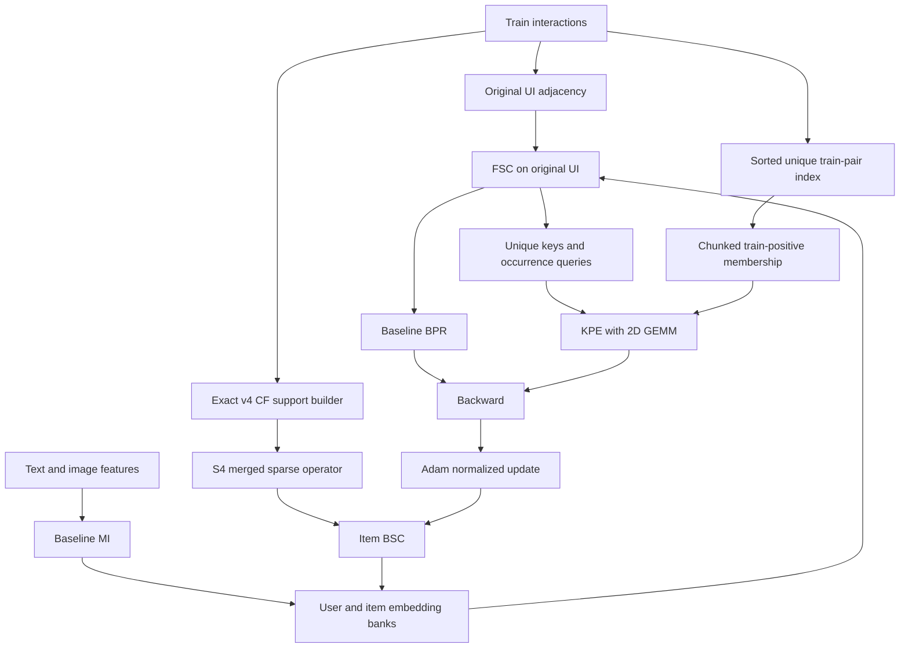

# STAIR5-v5.1 — NLGCL-KPE: Known-Positive Exclusion trên backbone NLGCL-CSE

**Ngày chốt thiết kế:** 05/10/2026.  
**Trạng thái:** đề xuất nghiên cứu và đặc tả triển khai; chưa có kết quả training v5.1.  
**Comparator chính:** **GD5-v4 / NLGCL-CSE**, chạy lại trên cùng snapshot mã nguồn, split, seed và budget.  
**Mục tiêu:** tăng tương đối **trên 5%** so với comparator trên NDCG@20 của cả ba dataset; báo cáo thêm Recall@10/20 và NDCG@10. Mục tiêu này chưa được chứng minh hay đạt được.

## 1. Quyết định cuối cùng và lý do

Chọn **STAIR5-v5.1 / NLGCL-KPE**: kế thừa MI, FSC, BPR, scorer và item BSC của v4; hiệu chỉnh NLGCL bằng **unique entity keys, giữ nguyên sampled query occurrences, và loại những train-positive khác khỏi denominator của từng query**. Hai nhánh NLGCL tiếp tục nhận gradient. Không thêm projector, teacher, spectral branch hay trainable gate vào phiên bản chính.

Graph chính là **S4 của NLGCL-CSE**, với η=0.1. Contraction sandwich CAM của v5 được giữ thành **nhánh factorial V51-CAM-KPE**, không mặc định kết hợp trước khi đo đóng góp riêng. Đây là quyết định nâng cấp trọng tâm của v5 sang objective: thử sửa một tác động có thể đo và kiểm tra gradient trực tiếp, đồng thời giữ comparator đã có tín hiệu tốt. Không đổi tên thành v6 chỉ vì phản biện dùng tên đó.

Ưu tiên KPE là một **lựa chọn thực nghiệm có lý do**, không phải kết luận rằng false negatives đã được chứng minh là bottleneck lớn nhất. Nếu collision diagnostics cho thấy ảnh hưởng nhỏ, hoặc KPE làm giảm validation ranking, cần chấp nhận kết quả âm thay vì gắn thêm nhiều module để tìm một cấu hình test tốt.

| Thành phần | Phiên bản chính V51-KPE | Nhánh nghiên cứu riêng |
|---|---|---|
| MI / FSC / BPR / scorer | Kế thừa v4 | Không thay trong nghiên cứu này |
| Graph BSC | S4, η=0.1 | CAM với δ=0.05; δ=0 khôi phục S4 |
| Keys NLGCL | Unique user/item IDs | Occurrence CE làm control |
| Queries NLGCL | Giữ B sampled occurrences | Unique-query chỉ là control bổ sung nếu cần |
| Train-positive khác target | Loại khỏi denominator | Uniform multi-positive CE là ablation |
| Gradient query/key | Có ở cả hai nhánh | Không thêm stop-gradient |
| Learned edge gate | Chưa đưa vào primary | Chỉ nghiên cứu khi có đường truyền gradient hợp lệ |
| Spectral fusion / SSC | Chưa đưa vào primary | Cần chẩn đoán và đặc tả operator riêng |

## 2. Tư liệu và mức độ kiểm chứng

Đã đối chiếu `docs/giai_doan_5/STAIR5_v5_Report.md`, kết quả v4 đã được audit trong báo cáo đó, phản biện đầy đủ người dùng gửi trong hội thoại ngày 05/10/2026, cùng các file hiện hành:

- `models/stair5_v4.py`, `models/stair5_v4_objectives.py`;
- `optimizers/AdamW.py`, `optimizers/utils.py`;
- ba YAML `configs/Amazon2014{Baby,Sports,Electronics}_STAIR5_v4.yaml`.

Nội dung phản biện là **giả thuyết cần thẩm định**, không là chỉ thị phải áp dụng tất cả công thức. `scratch/g5v51_review/user_critique.md` lưu bản trích xuất có cấu trúc các claim; không phải bản lưu nguyên văn toàn bộ tin nhắn. Báo cáo v5 được giữ riêng.

Nghiên cứu tài liệu ở đây là **targeted literature review**, tập trung vào những nguồn được trích trong phản biện và các tiền lệ gần objective. Không tuyên bố systematic review/PRISMA hay đã khảo sát mọi SOTA. Ngày khóa tìm kiếm là 05/10/2026. Metadata, abstract, full-method và code audit được phân biệt; nguồn không truy cập đủ không được dùng để chứng minh một gain cụ thể.

### 2.1. Chỉ số v4 làm mốc minh họa

Các giá trị dưới đây lấy từ selected-test artifacts đã đối soát ở báo cáo v5, chỉ có độ chính xác bốn chữ số thập phân. Không thay thế matched reruns.

| Dataset | Epoch được chọn | R@10 | R@20 | N@10 | N@20 | Fit time của run lịch sử |
|---|---:|---:|---:|---:|---:|---:|
| Baby | 480 | 0.0678 | 0.1056 | 0.0364 | 0.0461 | 19.89 phút |
| Sports | 485 | 0.0765 | 0.1143 | 0.0419 | 0.0517 | 42.21 phút |
| Electronics | 495 | 0.0458 | 0.0678 | 0.0260 | 0.0316 | 347.76 phút |

V4 tăng N@20 so với NLGCL lịch sử khoảng +1.77%, +1.97%, +0.64% lần lượt trên Baby, Sports, Electronics. So với STAIR lịch sử, các mức tương ứng khoảng +1.54%, +3.40%, +4.29%. Không được gọi toàn bộ các mức này là “gain so với v4”. Source hashes của một số run lịch sử khác code hiện hành, nên so sánh nhân quả bắt buộc chạy lại control cùng snapshot.

Ví dụ Electronics: 0.0316 → 0.0332 là **+0.0016 đơn vị metric**, tương đương **+0.16 điểm phần trăm** khi biểu diễn metric theo phần trăm, và **+5.063% tương đối**. Cụm “tăng ~1.6% absolute” trong phản biện sai đơn vị.

## 3. Phản biện Socratic: phần nào đúng, phần nào chưa suy ra được?

### 3.1. Endpoint attenuation có làm CAM chắc chắn thất bại?

Với η_i=0.15, η_j=0.05:

\[
a_{ij}=\sqrt{0.85\cdot0.95}=0.898610,
\qquad b_{ij}=\sqrt{0.15\cdot0.05}=0.086603.
\]

So với **v4**, semantic multiplier là 0.9, CF multiplier là 0.1. Semantic thay đổi khoảng **−0.154%**, CF khoảng **−13.397%**. Nhìn 0.8986 so với 1 rồi gọi đó là tổn thất mới mạnh của v5 sẽ bỏ qua attenuation đã có trong v4. Tuy vậy CF coupling giữa hai endpoint khác gate thực sự giảm, có thể bất lợi ở boundary head–tail. Đây là lý do đo subgroup/update deltas, không là bằng chứng NDCG chắc chắn giảm.

CAM có contraction guarantee dưới giả thiết cụ thể; không có row conservation hay ranking guarantee. Hai graph thường không commute, nên không thể diễn giải phép trộn như trộn độc lập các eigenvalue cùng frequency basis. Sự khác biệt này không tự làm chứng minh contraction sai.

Gate range hẹp chưa chứng minh “không thể đạt >5%”: ranking đổi rời rạc ở các score margins gần nhau. Ngược lại, range rộng hơn chưa chứng minh gain lớn hơn. Cần đo operator/update deltas, score margins và matched ranking, không dùng kích thước δ để dự báo phần trăm NDCG.

### 3.2. Mean selected Ochiai có đo utility không?

Không. Top-k selection gây selection bias, raw co-occurrence phụ thuộc exposure, history length và sampling. Mean trên selected neighbors khác mean trên tất cả candidates hoặc padded coverage. Không thể đồng thời nói top-k mean “inflated” và “thấp giả tạo” trong cùng trường hợp mà không xác định estimator và population tham chiếu.

P95 clipping có thể tạo ties; mức saturation và giả định mean r≈0.5–0.7 phải đo trên từng graph, chưa có số liệu chứng minh trong phản biện. Hệ số r chỉ là support-quality proxy. Muốn đánh giá utility, cần ablation hoặc held-out **train-derived** probe; không gọi r là calibrated confidence.

MLP trên feature của edge (i,j) trả về một edge score, không tự tạo r_i. Nếu muốn node gate, phải xác định aggregation trên neighbors, missing-support policy và feature scales. Sigmoid hữu hạn không tắt CF chính xác; η_max=.3 cũng không có nghĩa toàn bộ mô hình “chủ yếu CF”. Gate range lớn hơn không tự chứng minh gain lớn hơn.

### 3.3. MLP nhỏ có đồng nghĩa learned BSC gate rẻ và end-to-end?

**Không.** Trong implementation hiện hành, BPR/NLGCL forward không dùng item BSC graph. `AdamWSEvo.step()` và baseline smoother chạy dưới `torch.no_grad()`. Gate chỉ được đọc để biến đổi update sau backward sẽ không có đường truyền từ loss hiện tại đến gate:

\[
\frac{\partial\mathcal L_t(\theta_t)}{\partial\phi_{gate}}=0
\quad\text{nếu }\phi_{gate}\text{ chỉ xuất hiện trong optimizer update.}
\]

Trong autograd PyTorch, thông thường `gate.grad is None`. Đưa gate vào optimizer group không sửa được vấn đề. Tác động của gate lên loss ở bước sau qua trạng thái parameters cũng không được autograd thông thường giữ lại sau in-place/no-grad steps.

Muốn học gate, phải chọn một trong các mô hình khác: đưa graph/gate vào differentiable forward; dùng surrogate loss trực tiếp cho gate; hoặc unroll optimizer bằng functional updates và tối ưu meta-objective. Mỗi lựa chọn đổi phương pháp, chi phí và acceptance tests. Không được viết “end-to-end bằng ranking loss” khi chỉ thay callback smoother.

“Train từ validation ranking” cũng cần phân biệt model selection với supervision. Nếu validation tối ưu gate, nó đã trở thành training/meta data. NDCG rời rạc không cung cấp gradient thông thường; phải nêu surrogate/hypergradient. Cần tập selection độc lập và test khóa kín. Đây không tự động là test leakage, nhưng dùng cùng validation cho supervision và đánh giá lựa chọn mà không công bố sẽ làm kết luận lạc quan.

### 3.4. Symmetric normalization có bảo đảm norm với mọi edge gate?

Với **W đối xứng, không âm**, D là degree tương ứng, S=D^{-1/2}WD^{-1/2} có phổ trong [−1,1], với policy isolated-node được xác định. Đây là **symmetric degree normalization**, không phải row-wise normalization.

MLP nhận `[deg_i,deg_j,...]` theo thứ tự không bảo đảm η_ij=η_ji. Công thức dùng D^{-1/2} ở hai phía của W có hướng không biến W thành đối xứng. Ví dụ:

\[
W=\begin{bmatrix}0&1\\0.1&0\end{bmatrix},\quad
D=\operatorname{diag}(1,0.1)
\quad\Rightarrow\quad\|D^{-1/2}WD^{-1/2}\|_2=\sqrt{10}>1.
\]

Nếu thử learned edge gate sau này, cần symmetric features/explicit symmetrization, nonnegative weights, exact degree recomputation và isolated policy. Trộn raw weights rồi normalize **không bằng** trộn hai normalized graphs của v4 ngay cả khi gate hằng; raw scale/degree thay đổi. Không được claim η=.1 khôi phục v4 cho công thức raw-mix đó.

### 3.5. Multi-positive CE có loại tuyệt đối lực đẩy lên positives?

Với loss người dùng đề xuất:

\[
\ell_{MP}=\log\sum_j e^{z_j}-\frac1{|P|}\sum_{p\in P}z_p,
\qquad
\frac{\partial\ell_{MP}}{\partial z_j}=p_j-\frac{\mathbf1[j\in P]}{|P|}.
\tag{1}
\]

Positive có p_j>1/|P| vẫn nhận gradient dương theo logit, tức gradient descent đẩy logit đó xuống. Đây là hành vi khớp **uniform positive targets**, không phải bug của SupCon. Không nên mô tả nó như loại mọi repulsion hoặc giữ nguyên preference giữa các positives. Với |P| positives, loss tối thiểu không còn 0 mà tiến tới log|P| khi negative mass về 0 và positives đều nhau.

Positive-aware learning đáng thử, nhưng **masking**, **uniform multi-positive**, và **positive-set probability** là ba objective khác nhau. Nhánh chính chọn masking để kiểm tra việc bỏ unintended negative competition mà không áp thêm uniform attraction. Nó cũng chưa giải quyết latent positives chưa được quan sát.

### 3.6. 192K users và batch 4096 có chứng minh collision rất cao?

Không. Cần user/item degree distributions, sampler probabilities, repeated-ID rates và actual train-positive membership trong hai directions. User-side keys cũng có phân phối khác item-side keys. Popular-item duplicates có thể nhiều trong khi cross-positive density thấp. Chưa có số đo thì không được xếp đây là nguyên nhân lớn nhất.

### 3.7. Dynamic distance reweighting có tự phân biệt noisy và useful edges?

\(w_{ij}^{t}=w_{ij}^{0}\exp(-\beta\|e_i^t-e_j^t\|^2)\) với β≥0 chỉ attenuate raw weights; không tăng weight vượt w0. Sau normalization, một số coupling có thể tăng tương đối. Khoảng cách phụ thuộc embedding norms, popularity và chính smoothing trước đó; có nguy cơ tự củng cố sai lầm. “Hai embeddings đã gần” không chứng minh edge có utility cho ranking.

Refresh mỗi K epochs tạo một alternating static-snapshot algorithm, không tự thành differentiable graph learning. Cần symmetric edge updates, scale/β, full-degree recomputation, snapshot timing và cache fingerprints. Chi phí all-edge distance O(Ed) và normalization O(E), cộng bộ nhớ gathers, không chỉ số tham số MLP. Sampled refresh phải xác định policy cho edges không được sample.

### 3.8. Modality disagreement có phải noise confidence?

Text/image có thể bổ sung nhau khi khác biệt, hoặc cùng sai khi nhất quán. Hai SVD-whitened modality spaces không mặc định có cùng hệ tọa độ: sign/rotation ambiguity và semantics khác nhau làm cross-modal cosine thiếu ý nghĩa nếu chưa align. Sau alignment cũng cần chứng minh disagreement dự báo edge utility bằng train-only probes. Công thức gate cộng δ2·disagreement còn phá centered mean budget và có thể vượt range nếu không ràng buộc.

### 3.9. SSC và spectral fusion có phải bản vá bắt buộc?

SSC nghiên cứu **augmented user–item adjacency** chứa side-information edges trong forward. STAIR hiện giữ FSC trên UI graph, side graph chỉ dùng ở optimizer BSC. Vị trí toán tử khác nhau, nên không suy “FSC đang bị SSC mismatch” chỉ từ việc trộn item BSC.

Phép \(\tilde S=\gamma S+\lambda I\) với scalars không ràng buộc có thể phá contraction. Với symmetric contraction S, điều kiện \(|\gamma|+|\lambda|\le1\) là sufficient bound; nhưng bound này cũng không phải bằng chứng spectrum correction hữu ích. Một SSC variant phải xác định spectrum interval mục tiêu và đo operator ở đúng vị trí. Spectral fusion cần chỉ rõ graph spectrum hay feature-channel Fourier/SVD basis; hai miền đó không thay thế cho nhau.

## 4. Đối soát các paper trong phản biện

Nguồn được trích gần claim để người đọc có thể kiểm tra. Các mức “up to” là kết quả tác giả công bố trong protocol của họ, **không là expected gain của v5.1**, không cộng dồn giữa papers.

| Nguồn chính | Phần đã xác minh | Sử dụng trong v5.1 / giới hạn |
|---|---|---|
| [MACRec, AAAI 2026](https://ojs.aaai.org/index.php/AAAI/article/view/38560) | Multi-view affinity, subspace alignment và contrastive reweighting; abstract nêu up to 14.55% | Hỗ trợ vấn đề false negatives; không chứng minh mask-only hay uniform multi-positive đạt gain đó |
| [LinkFND, IEEE Access 2023, hồ sơ tác giả](https://pure.dongguk.edu/en/publications/linkfnd-simple-framework-for-false-negative-detection-in-recommen/) | DOI 10.1109/ACCESS.2023.3345338; loại detected false negatives khỏi negative pairs trên năm benchmarks | Tiền lệ gần hướng exclusion; không đồng nhất detector của paper với exact train-membership mask ở đây |
| [SupCon, NeurIPS 2020](https://proceedings.neurips.cc/paper/2020/file/d89a66c7c80a29b1bdbab0f2a1a94af8-Paper.pdf) | Multi-positive supervised contrastive formulation | Tiền lệ cho MP control; class-label setting khác implicit recommendation |
| [Debiased CL, NeurIPS 2020](https://papers.nips.cc/paper/2020/file/63c3ddcc7b23daa1e42dc41f9a44a873-Paper.pdf) | Điều chỉnh false-negative bias theo giả thiết của distribution | Không chọn prior latent-positive tùy tiện để gọi KPE “unbiased” |
| [DIGEST, SIGIR 2026, hồ sơ tác giả AAU](https://vbn.aau.dk/en/publications/digest-dynamic-graph-refinement-with-dual-contrastive-semantic-tr/) | DOI 10.1145/3805712.3809642; dynamic multi-graph refinement, dual CL; abstract nêu up to 8.43% N@20 và 7.66% R@20 | Gain của toàn hệ thống, chưa gán riêng cho một edge gate nhỏ hoặc optimizer BSC |
| [MMGSL, IEEE BigData 2025](https://doi.org/10.1109/BigData66926.2025.11401433) | Xác minh tên/DOI dẫn tới IEEE document 11401433 | Publisher chặn đọc bằng robot challenge; **19.31% N@10 và chi tiết learner chưa được xác minh từ full source**, không dùng để dự báo |
| [ESG-Rec, ICMR 2026 DOI](https://doi.org/10.1145/3805622.3810574) | Metadata bibliographic tìm được cho *Enhancing Static-Graph Representations via Tri-view Contrastive Learning for Multimodal Recommendation* | ACM full source trả 403; degree-aware mechanism chưa đủ kiểm chứng ở đây. Chính tên static-graph cũng không hỗ trợ claim “mọi SOTA đều dynamic” |
| [FITMM, primary manuscript](https://arxiv.org/html/2601.22498v1) | Header MM 2025, DOI 10.1145/3746027.3755540; arXiv đăng 30/01/2026; bandwise fusion/IB có giả thiết riêng | Có hướng frequency-aware, không chứng minh cần thay BSC bằng unspecified graph-polynomial filters |
| [SMORE, WSDM 2025](https://arxiv.org/abs/2412.14978) | Frequency-domain modality fusion, adaptive noise filter, graph/preference modules; author-released code được link | Feature-frequency fusion không tự là graph eigenfrequency correction |
| [SSR, NeurIPS 2025](https://proceedings.neurips.cc/paper_files/paper/2025/hash/288c9c3c9d214dd61282f885dfbc6117-Abstract-Conference.html) | Structured spectral reasoning là hướng frequency-adaptive multimodal learning | Một hệ thống riêng; chưa có ablation local cho STAIR để đưa vào primary |
| [SSC, arXiv 2502.08071](https://arxiv.org/html/2502.08071v1) | Spectrum shift của augmented UI graph; affine shift/scale; abstract nêu up to 23% | Không suy gain cho item optimizer BSC; không sử dụng placeholder conference header như venue đã xác nhận |
| [IGF trong *How Powerful is Graph Filtering for Recommendation*](https://arxiv.org/html/2406.08827v1) | Individualized graph filtering, G²N và SGFCF theo confidence của user preference | IGF có thật trong paper; không phải bằng chứng định lượng chọn η_max=.3 |
| [ASPIRE, arXiv 2604.22549](https://arxiv.org/html/2604.22549v1) | Adaptive polynomial filter và bilevel training; appendix tách auxiliary và tuning subsets | Cho thấy phải đặc tả optimization/data roles; không chứng minh optimizer-only gate tự có gradient |
| [OUTGO, Knowledge-Based Systems 2026](https://www.sciencedirect.com/science/article/pii/S0950705126001474) | DOI 10.1016/j.knosys.2026.115404; user-specific modality preferences, dual attention/CL | Venue 2026 được publisher xác minh, dù có preprint 2024. Không suy modality disagreement = noise confidence |
| [LAGCL4Rec, Findings EMNLP 2025](https://aclanthology.org/2025.findings-emnlp.61/) | Data augmentation, semantic difficulty và reranking bằng LLM | Không là mask-only implementation có cùng budget; [author repository](https://github.com/LQgdwind/emnlp25-lagcl4rec) có pipeline LLM riêng |

**Tổng hợp:** literature ủng hộ nghiên cứu negative calibration, adaptive graph và frequency-aware fusion. Nó không xác định module nào tạo gain trên STAIR, không bảo đảm kết hợp nhiều module có tác động cộng dồn. V5.1 kiểm tra hướng negative calibration trước; dynamic gate và spectral fusion cần các dự án ablation tiếp theo nếu có bằng chứng.

## 5. Giả thuyết và tiêu chí bác bỏ

**RQ1:** NLGCL hiện có negative mass đáng kể trên repeated keys và các train-positive khác sampled target không?

**H1:** Unique-key calibration + KPE tăng selected validation/test ranking so với v4 khi giữ cùng query sampling, graph và optimizer. **Bác bỏ:** KPE không hơn unique-key CE, hoặc gain không ổn định qua seeds; không được gán gain chỉ do dedup cho positive masking.

**H2:** KPE có tác động khác nhau ở hai directions và các degree groups. **Bác bỏ:** diagnostics không cho thấy pressure đáng kể hoặc không có ranking improvement trên groups được dự đoán.

**H3, conditional:** CAM và KPE bổ sung nhau. **Bác bỏ:** factorial interaction không dương/ổn định, hoặc combined arm kém một single-component arm. Không đưa CAM vào mô hình được chọn chỉ vì theorem đúng.

**H4:** v5.1 giữ được overhead ≤20% trong fit time so với matched v4 và không gây OOM ở batch Electronics=4096. Đây là acceptance target hệ thống, chưa đo GPU.

**Định vị đóng góp:** train-positive exclusion và unique-key calibration có tiền lệ, không tuyên bố KPE là một họ loss hoàn toàn mới. Đóng góp dự kiến là đặc tả và kiểm chứng cơ chế này trong heterogeneous FSC-intermediate NLGCL, giữ occurrence-query weighting, tách nó khỏi graph intervention và đánh giá trên ba multimodal datasets với budget rõ. Novelty học thuật mạnh hơn cần literature/code comparison sâu hơn và kết quả phân biệt với các tiền lệ; một gain local đơn thuần chưa chứng minh novelty.

| Điều có thể thất bại ngay trong KPE | Cách phát hiện / xử lý |
|---|---|
| Mask làm task quá dễ, mất informative competition | So DEDUP, MASK-PLACEBO, effective negatives và selected ranking; thử ρ=.5 đã định trước |
| Train positives nhiễu hoặc không phản ánh future preference | Không tự coi observed positive là calibrated relevance; kiểm subgroup ranking, không dùng test để sửa labels |
| Unobserved positives vẫn bị đẩy | Công bố giới hạn partial observability; không gọi KPE giải quyết toàn bộ semantic false negatives |
| Head entities chi phối occurrence queries | Log query/key degree và subgroup metrics; giữ occurrence weighting trong primary để cô lập cơ chế |
| Nhiều rows không có negatives | Loss0 theo định nghĩa, log coverage; không âm thầm đổi sampler/batch để che thiếu signal |
| Lookup/checkpoint overhead vượt lợi ích GEMM dedup | GPU profile riêng forward/backward/membership; không promote khi vượt budget hoặc OOM |

Không dùng ρ=.5 như “rescue” hậu nghiệm dựa trên test; nó là sensitivity có budget được khai báo. Nếu mọi candidate đều kém matched v4, kết quả cuối là giữ v4 và báo cáo giới hạn objective repair.

## 6. Đặc tả toán học hoàn chỉnh

### 6.1. Backbone và operator

Cho train-only binary interaction R, normalized UI adjacency T như v4, embeddings E và FSC intermediate H^g. MI whitening/fusion, gamma schedule và normalization FSC giữ semantics v4. Với d=64:

\[
c_j=0.1+0.9(j/d)^\gamma,\quad f_j=1-c_j,\quad j=0,\ldots,d-1.
\]

FSC dùng f_j; BSC dùng c_j. Không hoán đổi hai schedule.

\[
H^0=E,\qquad H^\ell=(T H^{\ell-1})\odot f,
\qquad \bar H=\left(\sum_{\ell=0}^{L}H^\ell\right)\odot
\frac{1-f}{1-f^{L+1}}.
\]

Scorer dùng final \(\bar H\) như v4; NLGCL dùng đúng intermediate \(H^g,H^{g+1}\), không thay chúng bằng final averaged embedding. Mọi operations broadcasting theo feature dimension phải được kiểm bằng dense reference.

Primary item graph:

\[
S_4=0.9S_0+0.1\bar S_{CF}.
\tag{2}
\]

Reuse **exact v4 builder**, gồm c_min=2, k_CF=5, shrinkage=5, deterministic tie breaks/symmetric max-union, degree normalization và isolated fallback. Nếu CSE inactive, reuse đúng off-path v4. Không thay graph weights bằng một estimator mới trong thí nghiệm KPE.

Item smoother áp dụng lên **Adam-normalized update**, sau moment division; weight decay ở đúng vị trí baseline:

\[
P_j(S_4)v_j=\frac{1-c_j}{1-c_j^{L+1}}\sum_{\ell=0}^{L}c_j^\ell S_4^\ell v_j,
\quad L=3.
\tag{3}
\]

User optimizer không smoother. Không thêm regularization penalty mới để thay cách weight decay hiện hành. No-grad smoother không giữ trainable parameters.

### 6.2. Batch, keys và directions

Batch có B sampled train pairs \((u_b,i_b)\), kể cả repeated users/items. Đặt K_U=unique(u_b), K_I=unique(i_b), m_U=|K_U|, m_I=|K_I|. **Không deduplicate query rows**:

| Direction | Query row b | Unique keys | Target index | Membership cho key k |
|---|---|---|---|---|
| User-side ℓ_u | I^{g+1}_{i_b} | U^g_{K_U[k]} | index(u_b,K_U) | R_{K_U[k],i_b}=1 |
| Item-side ℓ_i | U^{g+1}_{u_b} | I^g_{K_I[k]} | index(i_b,K_I) | R_{u_b,K_I[k]}=1 |

Đây là đúng hướng heterogeneous NLGCL trong local code. Không thay bằng U^0→I^1 có detach tùy ý. G=1 dùng g=0; extension G>1 phải sum gaps như reference và có đủ intermediate layers.

Query/key đều normalize theo L2 như v4. Logits đã bao gồm temperature:

\[
z^i_{bk}=\operatorname{cos}(U^{g+1}_{u_b},I^g_{K_I[k]})/\tau,
\quad
z^u_{bk}=\operatorname{cos}(I^{g+1}_{i_b},U^g_{K_U[k]})/\tau,
\quad \tau=0.2.
\tag{4}
\]

Target t_b luôn là sampled train-positive. Membership chỉ dùng train, tuyệt đối không valid/test, CF neighbors hoặc similarity-generated pseudo labels.

### 6.3. KPE denominator

Cho M_{bk}=1 nếu pair của query/key là observed train-positive. Cho:

\[
A_{bk}=\mathbf1[k=t_b]\lor\neg M_{bk}.
\]

Giữ designated positive và mọi **unobserved in-batch entity key**, loại các known positives khác. Unobserved không đồng nghĩa true negative; KPE không có oracle latent labels.

\[
\ell^{KPE}_{b}=\log\sum_{k:A_{bk}=1}e^{z_{bk}}-z_{b,t_b}.
\tag{5}
\]

Một entity key xuất hiện đúng một lần trong denominator. Nếu không có admissible negatives, denominator chỉ còn target, loss=0 và gradient trực tiếp=0. Vẫn tính mean trên B query rows; không chia theo số active rows để âm thầm đổi trọng số degree groups. Log inactive fraction để biết signal có bị mất quá nhiều không.

Direct logit derivative:

\[
\partial\ell_b^{KPE}/\partial z_{bk}=\begin{cases}
0,& A_{bk}=0,\\
\operatorname{softmax}_{A_b}(z_{bk})-\mathbf1[k=t_b],& A_{bk}=1.
\end{cases}
\tag{6}
\]

KPE loại **direct denominator pressure** lên excluded logits. Embeddings shared vẫn nhận gradient từ BPR, các query khác và graph propagation; không tuyên bố excluded entities hoàn toàn không thay đổi hoặc mọi loss conflict biến mất.

### 6.4. Control occurrence CE và mức can thiệp

Cho n_k là số lần key ID k xuất hiện trong batch. Original occurrence InfoNCE có thể tính chính xác bằng grouped logits:

\[
\ell_b^{ref}=\log\sum_{k\in K}n_ke^{z_{bk}}-z_{b,t_b}
=\operatorname{LSE}_k(z_{bk}+\log n_k)-z_{b,t_b}.
\tag{7}
\]

Numerator reference vẫn chỉ là designated occurrence; **không cộng log n_target vào numerator** nếu muốn tái tạo nguyên loss. Grouped form tương đương cả gradient vào shared embedding banks khi same-ID keys có representation giống nhau, như FSC deterministic của v4. Không áp identity này nếu thêm independent per-occurrence stochastic augmentation.

Để giảm rủi ro can thiệp lớn, đặc tả family:

\[
\ell_b^{(\rho)}=(1-\rho)\ell_b^{ref}+\rho\ell_b^{KPE},\quad 0\le\rho\le1.
\tag{8}
\]

**Primary candidate ρ=1**. ρ=0.5 là sensitivity arm; ρ=0 phải gọi thẳng original NLGCL fast-path để giữ parity và bỏ lookup overhead. Không tự schedule ρ/warmup dựa trên test. Khi 0<ρ<1, excluded-positive direct pressure từ reference vẫn còn tỷ lệ 1−ρ; không claim fully excluded.

Objective:

\[
\mathcal L=\mathcal L_{BPR}+\lambda_{CL}\mathcal L_{CL}^{(\rho)},
\quad
\mathcal L_{CL}^{(\rho)}=\sum_{g=0}^{G-1}\left[
\alpha B^{-1}\sum_b\ell_{u,b}^{(\rho)}+(1-\alpha)B^{-1}\sum_b\ell_{i,b}^{(\rho)}\right],
\tag{9}
\]

λ_CL=0.01, α=0.5, G=1. Loss scales thay đổi khi keys/masks đổi; **raw CL loss giảm không chứng minh representation tốt hơn**. Baseline BPR sampler/negative filtering giữ nguyên; KPE chỉ hiệu chỉnh auxiliary NLGCL.

### 6.5. Tại sao không dùng v4b module nguyên xi?

`NLGCL_PositiveAware_Module` hiện hành deduplicate **cả users/items cho queries**, rồi dùng mean-positive logits với all-key denominator. Nó là một uniform multi-positive objective, khác Eq.(5), đồng thời đổi query weighting từ pair-occurrence sang unique entity weighting.

Không dùng module đó như drop-in primary KPE. Có thể chạy như **legacy-v4b** để khảo sát, nhưng control MP trong factorial phải dùng **cùng B query occurrences và cùng unique keys** như KPE để cô lập aggregation. Legacy-v4b cần label riêng, tránh gán mọi khác biệt cho false-negative fix.

## 7. Kiến trúc tính toán và tối ưu GPU

### 7.1. Membership index

Cache sorted unique int64 train keys:

\[
\operatorname{pairkey}(u,i)=u\,n_I+i.
\]

Kiểm tra IDs/range và int64 overflow từ dimensions trước khi tạo keys. Cache fingerprint phải gồm train split, user/item mapping và n_I. Đây là detached nonlearnable buffer; không giữ grad_fn trong prepare. Không tạo dense |U|×|I| matrix.

Trên GPU, dùng `searchsorted` theo chunk query rows, clamp positions rồi check equality; handle empty index đúng, assert sampled target là train-positive trong preflight. Membership dimension là C×m_I hoặc C×m_U. Không gọi Python dictionary, `.cpu()`, `.item()` hay per-pair loops trong hot path.

### 7.2. Logits và backward memory

Normalize query/key embeddings một lần mỗi gap/direction. Unique keys dùng `torch.unique(..., return_inverse=True, return_counts=True)`; inverse chỉ target indices, counts phục vụ Eq.(7). Scores bằng **2D GEMM** `queries @ keys.T`; không broadcast tạo B×B×d tensor.

Anchor chunks dùng non-reentrant checkpoint recomputation như reference. **Mask và pair-key lookup phải nằm trong recomputed chunk function**, không giữ toàn bộ mask/logits của mọi chunk tới backward. Function phải deterministic với index immutable; cả query và key gradients được giữ. Không detach keys để giảm memory vì như vậy đổi objective.

Với B=4096, logits dense FP32 một direction là 64 MiB; C=512, m≤4096 thì block logits 8 MiB, một int64 C×m buffer 16 MiB và boolean mask 2 MiB. Membership có thể cần nhiều int64 intermediates cùng lúc, nên tổng peak lớn hơn các con số này. Một triệu train-pair int64 keys chiếm khoảng 7.63 MiB, chưa tính temporary sort/indexing. Không gọi đây là “VRAM phẳng tuyệt đối”.

Complexity CL khoảng O(B(m_U+m_I)d), membership lookup khoảng O(B(m_U+m_I)log E_train) với sorted index. Checkpoint tăng compute do recomputation. Unique keys có thể tiết kiệm GEMM khi nhiều repeated IDs; lookup có thể bù hoặc vượt lợi ích. **Không có cơ sở hứa nhanh hơn v4 trước benchmark**.

Primary thử C=512 ở Electronics, C=1024 ở Baby/Sports; cả control lẫn proposal phải cùng chunk size trong speed comparison. Nếu index overhead trở thành bottleneck, mới benchmark train CSR/intersection hoặc fused membership kernel bằng exact same mask reference. Không đổi batch size để báo latency thấp hơn.

### 7.3. Operator và optimizer lifecycle

- Primary S4 static, merged CSR, không thêm SpMM so với v4; L=3 BSC hops.
- Forward FSC/CL tensors tươi mỗi batch; membership/static graphs không theo dõi autograd.
- User/item embeddings là hai disjoint parameter groups, mỗi trainable parameter đúng một group; no auxiliary group vì primary không có auxiliary parameters.
- Smoother nhận Adam-normalized update; không học/thay đổi parameters bên trong callback.
- Resume lưu model/optimizer/RNG, resolved config, train-index fingerprint, graph fingerprint và code hashes; rebuild nonpersistent caches từ đúng split và kiểm fingerprint.
- Evaluation full/pool ranking, seen-item masking, scorer và validation NDCG@20 checkpoint selection giữ đúng engine v4. Không đưa CF virtual edges vào seen mask.

## 8. Cấu hình khởi đầu và các off-path

| Hyperparameter | Baby | Sports | Electronics |
|---|---:|---:|---:|
| d / FSC-BSC layers | 64 / 3 | 64 / 3 | 64 / 3 |
| gamma | 0.1 | 0.2 | 0.4 |
| lr / weight decay | .001 / .3 | .001 / .1 | .001 / .1 |
| Batch size | 1024 | 1024 | 4096 |
| Epoch budget / eval frequency | 500 / 5 | 500 / 5 | 500 / 5 |
| λ_CL / τ / α / G | .01 / .2 / .5 / 1 | như Baby | như Baby |
| η / k_CF / c_min / shrinkage | .1 / 5 / 2 / 5 | như Baby | như Baby |
| Graph primary | S4 | S4 | S4 |
| ρ primary | 1.0 | 1.0 | 1.0 |
| CL chunk pilot | 1024 | 1024 | 512 |
| CAM δ primary | 0, CAM disabled | 0 | 0 |
| Selection / ranking | valid N@20 / full | như Baby | như Baby |

Các giá trị baseline ở đây lấy từ YAML hiện hành, không suy từ một dataset rồi dùng nhầm cho các dataset khác. Manifest phải ghi config precedence CLI/YAML/default, mode objective và graph; 50/100 epochs chỉ là pilot ghi rõ, không phải full comparison.

**Exact recovery:** ρ=0, graph=S4 gọi original NLGCL và exact v4 graph/optimizer paths. CAM δ=0 cũng dùng S4 fast-path. λ_CL=0 tắt CL computation để kiểm graph-only objective; không tự claim khôi phục STAIR nếu graph vẫn S4. Muốn B0 STAIR phải dùng S0 và λ_CL=0 cùng baseline initialization/evaluator.

## 9. CAM trong v5.1: giữ cơ sở, giảm claim

Conditional arm sử dụng đúng CAM của báo cáo v5:

\[
\eta_i=\eta_0+\delta(r_i-\bar r),\quad \eta_0=0.1,
\quad S_{CAM}=A S_0 A+B\bar S_{CF}B,
\quad A=\operatorname{diag}\sqrt{1-\eta},\ B=\operatorname{diag}\sqrt\eta.
\tag{10}
\]

r lấy từ **mean pre-normalization selected CF weights sau symmetric union**, active-node P95 normalization/clipping và all-node centered mean đúng báo cáo v5. Không thay thành edge MLP hoặc disagreement proxy trong cùng arm. Pilot δ=.05, δ=0 control; kiểm η∈[0,1], cse-active policy và artifact fingerprint. Không normalize CAM theo degree thêm lần nữa.

Nếu S0 và CFbar symmetric contractions và A²+B²=I, đặt Tx=[Ax;Bx] thì T là isometry và S_CAM=Tᵀdiag(S0,CFbar)T. Vì vậy ||S_CAM||₂≤1. Không yêu cầu adjacency PSD. Finite normalized Neumann polynomial với 0≤c_j<1 có positive eigenvalues và norm≤1. Đây là bound operator, không là chứng minh Adam convergence hay gain ranking.

Graph merge trước training giữ L SpMM cho BSC. Controller placebo cần cùng distribution/range/mean của gates, permute trong train-degree strata, không dùng random-gate distribution khác rồi kết luận proxy tốt. Gate-range η∈[0,.3] hoặc uniform η=.3 là một intervention strength khác, không âm thầm thay trong CAM-KPE.

## 10. Kế hoạch ablation và quyết định trước khi tốn Electronics

### 10.1. Diagnostics trước khi sweep

Replay cùng sampled train batches ở seed cố định và checkpoint v4 được chọn từ validation, không dùng test labels. Đo riêng user-side/item-side:

1. unique-key fraction m/B; repeated key counts và repeated query counts;
2. số train positives khác sampled target trong mỗi unique-key pool;
3. tỷ lệ queries có ít nhất một additional positive;
4. admissible-negative count mean/p10/median/p90, zero-negative fraction;
5. **softmax mass của original denominator nằm trên additional known-positive entity IDs**, sau grouping có multiplicity; báo riêng excess occurrences của target ID;
6. gradient norm CL/BPR và cosine alignment trên cùng parameter subset ở vài fixed probe batches; không thực hiện retain_graph diagnostics mọi step;
7. train-degree strata head/mid/tail được khóa từ train, không chọn strata từ test outcomes.

Count và softmax mass khác nhau: nhiều collision logits rất thấp có thể tạo ít pressure. Nếu collision thấp và KPE gần unique CE về loss/gradients, kỳ vọng local gain lớn yếu đi; không tự bỏ negative sampling để làm collision tăng.

### 10.2. Các arms tối thiểu

| Arm | Graph | Objective | Câu hỏi được cô lập |
|---|---|---|---|
| V4 | S4 | Original occurrence NLGCL | Matched comparator |
| DEDUP | S4 | Unique-key CE, B occurrence queries | Lợi ích chỉ từ multiplicity calibration? |
| V51-KPE | S4 | Eq.(5), ρ=1 | Có thêm lợi ích từ known-positive exclusion? |
| MP-MATCH | S4 | Uniform multi-positive CE, cùng B queries/unique keys | Uniform positive attraction tốt hơn exclusion không? |
| CAM | S_CAM, δ=.05 | Original NLGCL | Adaptive graph đóng góp riêng? |
| CAM-KPE | S_CAM, δ=.05 | Eq.(5), ρ=1 | Hai axis bổ sung hay can nhiễu? |

ρ=.5 là sensitivity, không thêm sweep mọi combination ngay. Chỉ thêm controller placebo nếu CAM có tín hiệu; placebo kiểm graph controller, không đủ kiểm toàn bộ architecture. Legacy-v4b dùng unique queries có label riêng nếu chạy; không nhập chung MP-MATCH.

Nếu KPE hơn DEDUP, thêm **MASK-PLACEBO** để phân biệt positive-aware selection với tác động chỉ từ giảm negative pool. Mỗi query bỏ ngẫu nhiên đúng số non-target keys mà KPE đã bỏ, luôn giữ target; chọn keys bằng RNG riêng có seed/state trong manifest, không dùng logits/test và không làm lệch sampler/model RNG. Cardinality được matched, còn những keys bị bỏ không dựa trên positive identity. Thực hiện cùng query/key/mode/chunk. Nếu placebo đạt lợi ích tương tự, bằng chứng cho *positive identity* là nguyên nhân yếu đi; budget của arm thêm phải được ghi vào ledger.

Factorial interaction trên một metric m, cùng seed:

\[
\Delta_{int}=m_{CAM-KPE}-m_{CAM}-m_{KPE}+m_{V4}.
\]

Đây là descriptive interaction; positive interaction một seed chưa chứng minh synergy phổ quát.

### 10.3. Budget theo giai đoạn

**Stage A — correctness/throughput:** tiny real-data smoke cho cả ba dataset; tối đa 2–5 epochs/arm, đủ forward/backward/eval/resume và GPU profile. Không dùng kết quả smoke để tuyên bố gain. Đo steady-state train throughput sau warmup cùng GPU/software; report evaluation/preprocessing riêng.

**Stage B — Baby mechanism pilot:** 6 arms×100 epochs×seed 1 = 600 epoch-equivalents. Control ở cùng horizon; full v4 epoch480 không là comparator của pilot100. Pilot xem loss/gradients và validation trajectories; không kết luận final ranking bằng loss target tùy tiện.

**Stage C — đủ horizon Baby/Sports:** primary fixed V51-KPE và V4, mỗi dataset×500 epochs×seeds {1,2,3}. Tính cả seed đã dùng pilot trong disclosure; run full từ đầu theo cùng initial/RNG protocol. Có thể chạy DEDUP/MP/CAM bổ sung nếu Stage B cần phân biệt cơ chế, ghi tổng budget thực tế.

**Stage D — Electronics:** sau correctness/profile, một paired V4/V51-KPE pilot100 để kiểm collision, throughput và xu hướng. Full500 chỉ khi không có OOM, overhead fit≤20% và Baby/Sports có tín hiệu validation ổn định. Gate này dùng validation, không selected-test. Electronics có dynamics riêng: không hứa kết quả giống Baby/Sports, cũng không loại bỏ dataset khó khỏi claim “cả ba”.

Từ fit time lịch sử, Electronics full500≈5.80 giờ/run; một paired full seed≈11.59 giờ, ba paired seeds≈34.78 giờ ở tốc độ lịch sử. Đây là ước lượng kế hoạch, chưa tính preprocessing/evaluation khác scope, GPU variability hay overhead KPE. Nếu overhead tối đa20% chỉ áp cho proposal, tổng ba paired seeds khoảng38.25 giờ fit. Không dùng lời “100 epochs ~15 phút” cho mọi dataset.

Core confirmatory budget của V4 và KPE là **18 full runs** (2 arms×3 datasets×3 seeds), khoảng **40.99 giờ fit** theo tốc độ lịch sử và giả định overhead0. Nếu proposal tốn thêm20%, khoảng **45.08 giờ fit**. Pilots, additional arms, failed runs và cold preprocessing chưa nằm trong envelope này; báo tổng thực tế riêng. Thời gian và memory limits của Kaggle có thể buộc chia runs qua nhiều sessions và resume đúng RNG/optimizer, không rút epoch budget của một arm rồi so với control full horizon.

Không chuyển primary sang winner một cách hậu nghiệm rồi báo ba confirmatory seeds như preregistered test. Nếu pilot chọn CAM-KPE hoặc MP thay KPE, ghi revision protocol và dùng confirmatory seeds mới/chưa dùng cho selection; mọi arms đã thử phải có experiment ledger.

### 10.4. Growth và uncertainty

\[
G_m=100\left(m_{v5.1}/m_{V4}-1\right).
\]

So paired matched seeds, cùng selection criterion và horizon. Khóa primary N@20; secondary 3/4 metrics vượt5% trên mỗi dataset là mục tiêu riêng. Report mọi 12 metric cells, cả regressions; không chỉ chọn maxima theo từng metric ở các epochs khác nhau.

| Dataset | N@20 v4 lịch sử làm tròn | Biên bằng +5% | Muốn strictly >5% |
|---|---:|---:|---|
| Baby | .0461 | .048405 | Giá trị >.048405 |
| Sports | .0517 | .054285 | Giá trị >.054285 |
| Electronics | .0316 | .033180 | Giá trị >.033180 |

Các biên chỉ minh họa; dùng **unrounded matched-control values** khi tính actual gain. Báo mean±SD và paired seed differences, không dùng t-test với quá ít seeds để tạo chắc chắn giả. Nếu có per-user metrics, paired user bootstrap trong từng run giúp đo user uncertainty nhưng không thay seed variance. Điều chỉnh hoặc công bố multiple comparisons cho các secondary claims.

Claim “trung bình >5% cả ba datasets” chỉ được dùng khi cả ba mean paired gains đạt ngưỡng; nếu muốn nói “có bằng chứng gain >5%”, phải nêu interval/test cho ngưỡng đó, không chỉ CI>0. Guardrail no dataset mean regression>2%; không làm guardrail thành chứng minh superiority. Failed metrics/datasets phải xuất hiện trong luận văn.

## 11. Kế hoạch file triển khai, chưa triển khai trong yêu cầu này

| File dự kiến | Trách nhiệm |
|---|---|
| `models/stair5_v51.py` | `GenRecArch`/v4-compatible model integration; objective mode và exact off paths; MI/FSC/BPR/scorer/evaluator contracts |
| `models/stair5_v51_objectives.py` | Original delegation, grouped reference, DEDUP/KPE/MP-MATCH; occurrence query weighting; chunked checkpoint; two-direction gradients |
| `models/stair5_v51_utils.py` | Train-pair index, ID validation, split/mapping hashes; membership reference và GPU lookup; diagnostics summaries |
| `models/stair5_v51_graph.py` | Reuse v4 graph state/builder; conditional CAM construction/merge; fingerprint/static gates; không copy rồi sửa âm thầm baseline |
| `optimizers/stair5_v51_smoother.py` | Thin v4-equivalent finite Neumann callback nếu cần API riêng; no params/no learned state; S4/CAM operator selection |
| `main_stair5_v51.py` | Arm/config validation, fixed seeds, disjoint groups, atomic checkpoints, resume, telemetry và matched evaluator |
| `configs/Amazon2014{Baby,Sports,Electronics}_STAIR5_v51.yaml` | Baseline-specific values ở §8, explicit objective/ρ/graph/chunk options; không inherited defaults mơ hồ |
| `tests/test_stair5_v51_objectives.py` | Dense/grouped/chunk loss và embedding-bank gradients; duplicate/query weighting, exclusion và no-negative cases |
| `tests/test_stair5_v51_pipeline.py` | Off-path multistep parity, checkpoint/RNG roundtrip, train-index isolation, CLI/YAML precedence, cả ba dataset smoke |
| `tests/test_stair5_v51_graph.py` | S4 exact reuse; CAM constant-gate off-path, symmetry/finite/range, tiny dense spectral checks |
| `notebook/P5/stair5_v51.ipynb` | Explicit selected datasets và per-dataset train calls; source/config hash preflight; smoke/pilot/full labels; durable artifacts |

Không ghi đè v4 đang có kết quả tốt. Production code nên dùng English identifiers/docstrings. Plan này không claim những files trên đã tồn tại hay pass tests.

### 11.1. Acceptance tests trước training dài

1. **Off-path ρ0:** loss, tất cả embedding gradients, Adam moments và multistep updates tương đương v4 cùng seed, MI và sampler; có repeated IDs.
2. **Grouped reference:** Eq.(7) bằng occurrence CE cả gradients into shared banks; numerator multiplicity không bị đổi.
3. **Query weighting:** batch repeated user với các target khác nhau vẫn có B rows và mean/B; đối chiếu dense hand reference.
4. **Membership directions:** chỉ R_train; positives không có key trong batch không tạo extra columns; ID remapping đúng; empty/out-of-range/error paths rõ.
5. **Exclusion:** masked logits có direct gradient0; target always allowed; all-known-positive batch cho KPE loss0 finite gradients.
6. **Chunk parity:** same loss/all-bank gradients ở C=1, C nhỏ và dense; checkpoint không detach key branch.
7. **MP difference:** kiểm derivative p−1/|P| và distinction với KPE, không viết test chỉ assert loss>0.
8. **Checkpoint:** save/load model, optimizer/RNG/config; wrong split/index/graph fingerprint fail fast; resumed next-step parity.
9. **Pipeline:** cả Baby/Sports/Electronics được gọi khi selected; không gặp “Not selected: sports” do implicit defaults; training failure không bị plotting che mất return code.
10. **GPU profile:** peak allocated/reserved, process memory khi có, end-to-end time, preproc/fit/eval/chunk lookup; no B×B×d allocation, no retained full-batch masks.

## 12. Learned gate và spectral fusion nếu nghiên cứu tiếp

**Learned gate có thể là hướng tốt, nhưng proposal hiện tại chưa executable.** Một phương án bilevel BSC cần functional θ'=Update(θ,φ), explicit differentiable smoother, auxiliary train-derived pairs để tối ưu L_aux(θ'), và độc lập selection validation/test. Khi dùng auxiliary như một held-out meta probe, phải tách nó khỏi inner loss, inner UI graph và CF statistics; công bố rõ policy refit sau khi chọn hyperparameters. Gate features đối xứng; degrees/normalization đi vào hypergradient hoặc stop-gradient policy phải được công bố. Adam moments/in-place semantics và multistep unrolling có chi phí; first-order approximation phải chứng minh không vô tình cắt mọi dependence vào φ. Acceptance bắt buộc: gate gradient finite/nonzero và nhiều-step gate update trong toy có analytically nonzero hypergradient.

Một phương án đưa gate vào forward sẽ học từ BPR trực tiếp, nhưng lúc đó FSC/backbone đã đổi; cần một architecture version riêng và control tương ứng. Không gọi nó “v5.1 chỉ chỉnh item BSC”. Trained scorer surrogate có thể rẻ hơn unrolling nhưng tối ưu surrogate edge objective, không tự đo downstream ranking utility.

**Spectral branch chỉ mở khi có chẩn đoán:** xác định eigenbasis/operator hoặc channel transform, cost degree K, aligned modality representations, coefficient constraints và exact coefficient-zero recovery. Đo thêm K sparse propagations/features buffers trong budget. Đừng thêm SSC affine scalars vào optimizer BSC mà bỏ theorem hoặc dùng FFT trên feature coordinates rồi giải thích là graph Laplacian high-frequency filtering.

## 13. Kiểm chứng thiết kế và giới hạn kết luận

Coordinator chạy `scratch/g5v51_review/check_design.py` bằng CPU PyTorch, FP64, seed2026. Đây là các counterexamples/algebra checks cho proposal, **không là unit suite production hay benchmark GPU**:

| Check | Kết quả |
|---|---|
| Gate chỉ dùng trong no-grad optimizer | `grad=None` |
| Grouped occurrence loss vs dense occurrence | max loss error0 |
| Shared-bank gradients grouped vs dense | max error≈6.94×10⁻¹⁷ |
| Direct excluded-logit gradient KPE | 0 |
| No-admissible-negative KPE | loss0, finite zero gradients |
| Uniform MP positive có high probability | gradient logit≈+0.490867 |
| Directed “symmetric formula” counterexample | norm≈3.162278 |

Receipt nằm tại `scratch/g5v51_review/design_receipt.json`. Full ranking gain, stability qua seeds, collision density thật và throughput GPU chưa được đo cho v5.1.

Review sử dụng ARS `academic-paper-reviewer` methodology-focus: hai role seats methodology/eic, Phase1 paper-blind commitments trước Phase2 đọc material. Verdict áp cho **proposal v5 và phản biện được cung cấp**, không là giấy chứng nhận revised design đã đạt scientific acceptance. Cards, validators và deterministic synthesis được lưu trong `scratch/g5v51_review/`. Đây là AI role-separated review, **NOT_CALIBRATED**, `criteria_binding_unavailable`; không phải independent human peer review và không claim độc lập sai số giữa reviewers.

Panel verdict cho material gốc: **D1=repairable block, D2=warn → major revision**, theo contract F2/F4. Hai Phase2 cards và panel synthesis đã pass canonical conformance check. Các lỗi được sửa trong thiết kế trên; v5.1 vẫn cần implementation tests và thực nghiệm, chưa được panel re-review hay xác nhận tăng trưởng.

Quyết định nghiên cứu cuối là **đưa NLGCL-KPE lên primary candidate, giữ v4 S4 để cô lập objective; chỉ promote CAM-KPE sau factorial evidence**. Thiết kế này có đường truyền gradient rõ, train-only supervision và bounded-memory implementation plan. Nó tạo một phép thử có thể bác bỏ về chất lượng contrastive learning; mục tiêu >5% vẫn phụ thuộc thực nghiệm, không được thay bằng dự báo +5–15% từ các paper khác.
