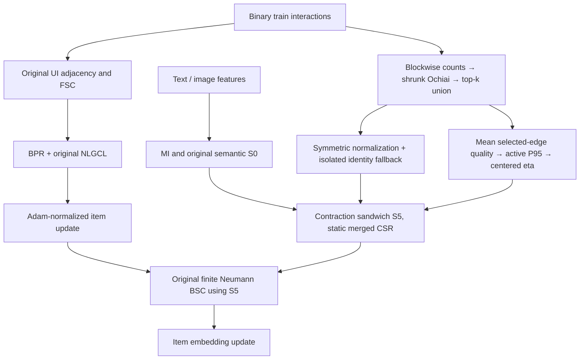

# STAIR5-v5: NLGCL-CAM — Centered Adaptive Mixing với toán tử BSC có cận chuẩn

**Ngày đối soát:** 04/10/2026. **Trạng thái:** đề xuất nghiên cứu và đặc tả triển khai, chưa có thực nghiệm v5.  
**Comparator chính:** STAIR5-v4 / NLGCL-CSE, không nhầm với STAIR-NLGCL v4 của giai đoạn trước.  
**Mục tiêu:** kiểm tra khả năng tăng tương đối **trên 5% so với GD5-v4**; đồng thời báo cáo riêng tăng trưởng so với STAIR và NLGCL. Đây là mục tiêu thực nghiệm, không phải hệ quả của chứng minh cận phổ.

## 1. Quyết định nghiên cứu

Giữ thành phần đã có tín hiệu tốt của v4: MI, FSC trên graph user–item gốc, BPR, NLGCL gốc và graph CF mở rộng từ train. Thay **duy nhất phép trộn cố định trong item BSC** bằng phép trộn thích nghi tĩnh, đối xứng và có cận chuẩn bằng xây dựng. Tên phiên bản cuối: **STAIR5-v5 / NLGCL-CAM (Centered Adaptive Mixing)**.

Không đưa nguyên xi `min(eta_i, eta_j) + 5-step power iteration` vào phiên bản chính. Cách này đối xứng nhưng chưa bảo đảm contraction. Thay bằng:

\[
\boxed{S_5=A S_0 A+B\bar S_{\mathrm{CF}}B,
\quad A=\operatorname{diag}\sqrt{1-\eta_i},
\quad B=\operatorname{diag}\sqrt{\eta_i}.}\tag{1}
\]

Với hai graph thành phần đối xứng, có chuẩn không quá 1 và \(0\le\eta_i\le1\), công thức này bảo đảm \(\|S_5\|_2\le1\) trong số học thực. Khi mọi \(\eta_i=0.1\), nó khôi phục toán tử v4. Implementation phải có fast-path trả chính toán tử v4 khi tắt thích nghi, tránh thay đổi thứ tự phép tính làm mất parity số học.

**Vì sao chọn hướng này?** Nó giữ support CF đã bổ sung được tín hiệu, kiểm tra một bottleneck còn lại — mọi item dùng cùng tỷ lệ trộn — và giữ một CSR cố định trên GPU. Lợi ích mới phải đến từ việc phân bổ can thiệp phù hợp, thay vì một tổ hợp nhiều thay đổi không thể quy nguyên nhân.

**Giới hạn quan trọng:** chỉ chỉnh BSC có thể đem lại lợi ích nhỏ hơn 5%. V4 đã gần NLGCL trên Electronics; hiện không có dữ liệu đủ để xác suất hóa hay bảo đảm mục tiêu. Nếu adaptive mixing không hơn control, giữ v4 là kết quả tốt và báo cáo kết quả âm của v5.

## 2. Phạm vi tư liệu và trạng thái bằng chứng

Đã đối chiếu hai tệp đính kèm, `docs/EStair.md`, thiết kế v4, báo cáo thực nghiệm v4, mã nguồn hiện tại và các artifact trong `logs/GD5/stair5_v4_complete_artifacts/`. Nội dung đính kèm được xem là **giả thuyết cần thẩm định**. Các câu “implement ngay”, dự báo accuracy, hoặc “đã verify citation” trong đó không là bằng chứng hay lệnh triển khai.

- **Tài liệu A:** đề xuất Symmetric Edge-Level Adaptive Mix, mean Ochiai, percentile và power iteration.
- **Tài liệu B:** phản biện A và một hướng gọi là NC-CSE-NLGCL; đưa mã `S5A_Refined_Builder` và các ngưỡng GO.
- **MATERIAL GAP:** bản gốc đầy đủ của NC-CSE-NLGCL không nằm trong hai tệp này. Chỉ có công thức và mô tả qua lời phản biện của B. Vì vậy không thể kết luận đã review toàn bộ proposal đó hay tái tạo chính xác implementation dự kiến.
- Tài liệu B gọi `S0_clean`, `S_cf_clean` là Laplacian trong comment, nhưng công thức và BSC đang cần **normalized adjacency**. Hai loại toán tử không thay thế trực tiếp cho nhau.

Các mức bằng chứng được dùng trong báo cáo:

| Loại | Có thể kết luận | Không thể kết luận |
|---|---|---|
| Log selected-test seed 1 | Một cấu hình cho kết quả tại checkpoint đã chọn | Mean nhiều seed, significance, SOTA chung |
| Metadata support/overlap | Graph CF khác graph semantic về support | Cạnh mới là nguyên nhân duy nhất của gain |
| Chứng minh đại số | Cận của operator và polynomial dưới giả thiết nêu rõ | Ranking tốt hơn, toàn bộ AdamW không diverge |
| Paper liên quan | Hướng nghiên cứu có tiền lệ và động lực | Công thức v5 đã được paper đó chứng minh |
| Toy checks | Một số invariant và phản ví dụ được kiểm tra số học | Hiệu năng Amazon hoặc throughput T4 |

## 3. Đối soát v4 trước khi đặt mục tiêu v5

### 3.1. Chỉ số tại checkpoint được chọn

Nguồn chính là dòng TEST **sau** `Load best model`, không phải dòng epoch 500, bảng best từng metric, hoặc metric tốt nhất trên test trong quá trình train.

| Dataset | Selected epoch | R@10 | R@20 | N@10 | N@20 | Coach.fit |
|---|---:|---:|---:|---:|---:|---:|
| Baby | 480 | 0.0678 | 0.1056 | 0.0364 | 0.0461 | 1,193.516 s ≈ 19.89 phút |
| Sports | 485 | 0.0765 | 0.1143 | 0.0419 | 0.0517 | 2,532.349 s ≈ 42.21 phút |
| Electronics | 495 | 0.0458 | 0.0678 | 0.0260 | 0.0316 | 20,865.536 s ≈ 347.76 phút |

Các dòng selected-test được cung cấp chỉ in bốn chữ số thập phân. Báo cáo v4 có một số giá trị sáu chữ số cho Baby/Sports, nhưng artifact đang xét không có dump unrounded selected-test tương ứng để xác minh độc lập. Không dùng bảng summary trước load-best làm nguồn tăng độ chính xác: bảng đó có thể chứa kết quả terminal. Các phép tính dưới đây dùng số đã hiển thị và chỉ là đối soát xấp xỉ.

Manifest tổng hợp ghi thời gian subprocess Baby ≈20.54, Sports ≈43.04 và Electronics ≈349.71 phút. Chúng khác `Coach.fit` vì phạm vi đo khác nhau. Không lấy một loại thời gian của v4 chia cho loại khác ở baseline để công bố speedup.

### 3.2. Tăng trưởng phải có mẫu số rõ ràng

Theo số tái lập STAIR/NLGCL trong tài liệu dự án và selected-test v4 đã làm tròn:

| Dataset | Comparator | ΔR@10 | ΔR@20 | ΔN@10 | ΔN@20 |
|---|---|---:|---:|---:|---:|
| Baby | STAIR | +0.59% | +1.34% | +1.39% | +1.54% |
| Baby | NLGCL | +1.80% | +2.72% | +1.11% | +1.77% |
| Sports | STAIR | +2.96% | +2.88% | +3.46% | +3.40% |
| Sports | NLGCL | +0.53% | +2.97% | +0.48% | +1.97% |
| Electronics | STAIR | +3.62% | +1.95% | +5.69% | +4.29% |
| Electronics | NLGCL | 0.00% | +0.30% | +0.78% | +0.64% |

V4 có tín hiệu cải thiện trên ba dataset, đặc biệt các chỉ số NDCG so với STAIR. Tuy nhiên **+5.69% là một metric trên một dataset so với STAIR**, không phải trên phần lớn metrics, không phải so với NLGCL/v4 và không chứng minh SOTA so với mọi phương pháp hiện hành. Một seed cũng chưa xác định variance hoặc tính phổ quát.

### 3.3. Graph và bộ nhớ: dữ liệu quan trọng cho thiết kế

| Dataset | S0 nnz | CF nnz | S4 nnz | CF-isolated | CF edges ngoài S0 | Cold CF build theo metadata |
|---|---:|---:|---:|---:|---:|---:|
| Baby | 59,848 | 23,054 | 84,134 | 2,448 / 7,050 = 34.72% | 94.73% | 0.268 s |
| Sports | 157,752 | 43,334 | 206,300 | 8,262 / 18,357 = 45.01% | 92.97% | 0.581 s |
| Electronics | 542,752 | 174,488 | 739,423 | 28,465 / 63,001 = 45.18% | 96.40% | 2.936 s |

Các metadata đều ghi `cache_hit=false`; thời gian CF build trên không bao gồm toàn bộ MI/kNN, import, training và evaluation. Đây là phép đo của run cụ thể, không là cam kết latency cho mọi môi trường.

Electronics có intersection \(174488-168206=6282\) stored off-diagonal entries; Jaccard ≈0.008836. Coverage của **selected CF support** bởi S0 là \(6282/174488\approx3.60\%\), khác Jaccard <1%. Cũng không phải coverage của mọi cặp đồng tương tác trong toàn dữ liệu. Counts của ma trận đối xứng thường đếm hai hướng; không đổi sang số cạnh vô hướng mà quên chia đôi.

Metadata củng cố giả thuyết fixed semantic support bỏ sót các quan hệ đồng tương tác. Nó chưa chứng minh mọi cạnh mới hữu ích hoặc “96.4% gain đến từ cạnh mới”. Muốn kết luận cơ chế cần CSE-placebo, ablation support và nhiều seed.

Từ 500 dòng telemetry, **max training peak allocated** của Baby là **144.174 MiB**, Sports **218.509 MiB**. Giá trị Baby 143.6 MiB trong report không bằng max của artifact. Không tìm thấy telemetry peak tương ứng của Electronics trong bộ artifact được cung cấp; ~680 MiB chưa được xác minh ở đây. Peak training allocated không phải CUDA reserved, NVML process memory, hay peak của evaluation/preprocessing. Raw Sports NLGCL ở cuối training ≈4.698, khác diễn giải 5.55–5.60 trong report; mức raw loss giữa batch size khác nhau cũng không so trực tiếp.

Mật độ **train** tính lại từ `n_train/(n_users*n_items)` là Sports \(3.3423\times10^{-4}\), Baby \(8.6479\times10^{-4}\), Electronics \(1.0349\times10^{-4}\), không phải các mật độ train đang ghi trong report. Cần tách mật độ train và toàn bộ split.

### 3.4. Ràng buộc tái lập chưa được phép bỏ qua

Manifest Baby/Sports chứa source fingerprints. Hash của `stair5_v4.py`, `stair5_v4_objectives.py`, `stair5_v4_graph.py`, `main_stair5_v4.py` trong workspace hiện tại khác hash ở run lịch sử. Đây không tự là lỗi của run, nhưng **không thể gán kết quả lịch sử trực tiếp cho mã hiện tại**. V5 phải có một control v4 chạy lại trên cùng code/runtime/split, hoặc tái lập đúng snapshot lịch sử rồi ghi rõ nhánh so sánh. Không đồng thời sửa sampler/loss và gọi toàn bộ chênh lệch là lợi ích CAM.

Không sử dụng các ước lượng speedup/VRAM lịch sử trong bảng nhiều thế hệ làm số liệu chuẩn nếu chưa có raw artifact, GPU, precision và phạm vi đo khớp. Không có v5 GPU benchmark trong lần review này.

## 4. Phản biện Socratic hai ý tưởng v5

### 4.1. Đối xứng có đủ để gọi là SPSD không?

**Không.** Normalized adjacency có thể có eigenvalue âm. Ví dụ \(\begin{bmatrix}0&1\\1&0\end{bmatrix}\) có eigenvalues \(\{-1,1\}\). Điều cần chứng minh là contraction và tính dương của **polynomial BSC**, không phải adjacency SPSD. Row-wise mixing có thể làm mất đối xứng và khiến lập luận phổ đối xứng không áp dụng, nhưng polynomial vẫn được định nghĩa; không thể gọi “chuỗi bị gãy” hoặc suy gradient chắc chắn nổ.

### 4.2. Min-gate có giữ contraction không?

**Không tự động.** Cho \(S_0=\begin{bmatrix}0&1\\1&0\end{bmatrix}\), \(\bar S_{CF}=I\), \(\eta=(0,0.2)\). Phép min-mix trong A/B tạo:

\[
S_{\min}=\begin{bmatrix}0&1\\1&0.2\end{bmatrix},\qquad
\|S_{\min}\|_2=1.10498756>1.
\]

Cả hai thành phần đều đối xứng, không âm và có chuẩn 1. Vì vậy sửa row-wise thành min-edge mới sửa đối xứng, chưa sửa toàn bộ cận phổ.

Một upper bound lỏng dạng \(1+2\eta_{\max}\) có thể được biện minh cho **min-kernel** qua biểu diễn PSD \(\min(a_i,a_j)=\int\mathbf1[a_i\ge t]\mathbf1[a_j\ge t]dt\) và tính chất Schur multiplier. Không được suy ra cho mọi coefficient theo cạnh chỉ bằng việc kéo \(\eta_{\max}\) ra khỏi Hadamard product. Bound này cũng không bằng 1 và không giúp khôi phục v4 nếu rescale toàn cục tùy tiện.

### 4.3. 5–10 power iterations có phải chứng chỉ chuẩn không?

**Không.** Với \(S=\operatorname{diag}(1.1,1)\) và vector khởi tạo gần thành phần thứ hai, 10 iterations có thể ước lượng norm gần 1; rescale theo estimate vẫn để true norm ≈1.1. Sai số nhỏ giữa hai lần iterate cũng không chứng minh sai số so với eigenvalue thật nhỏ. Warm-start ba bước không có bảo đảm \(10^{-4}\) nếu thiếu giả thiết về spectral gap và khởi tạo.

Power/Lanczos dùng làm **diagnostic ước lượng**, không làm certificate trong pipeline chính. Nếu vẫn nghiên cứu min-mix, phải dùng upper certificate hợp lệ, ví dụ max absolute row sum hoặc Collatz–Wielandt \(\max_i(Sv)_i/v_i\) với \(S\ge0,v_i>0\), rồi phân tích độ co rút thêm; đó là một ablation khác. Symmetric normalization vốn cũng không yêu cầu mọi row sum bằng 1.

### 4.4. Mean Ochiai có thật sự đo confidence và loại popularity bias?

**Chưa.** Ochiai giảm phụ thuộc vào raw counts, shrinkage giảm sức nặng low-support pairs. Nhưng exposure, user history length, top-k selection và nhiễu có cấu trúc vẫn còn. Mean trên các hàng đã chọn là **proxy chất lượng/độ mạnh support**, không phải xác suất cạnh đúng hoặc uncertainty đã hiệu chuẩn. Max/top-2 có thể bị winner's curse; không có estimator thắng theo lý thuyết chỉ vì bỏ bốn cạnh yếu trong một ví dụ.

Trong A, chia cho \(K_{CF}\) và trong code B, chia cho số neighbors thực tế là hai phương pháp khác nhau. Sau symmetric top-k union, số neighbors của một node có thể lớn hơn \(K_{CF}\); chia số cạnh union cho 5 có thể đẩy raw score ra ngoài phạm vi dự kiến. V5 phải định nghĩa duy nhất một neighborhood và denominator.

### 4.5. Sigmoid có tắt CF khi không có bằng chứng không?

**Không.** Khi mọi \(r_i=0\), công thức A/B cho \(\eta_i=\eta_{max}/2\). Với cap .15, gate vẫn .075. Tail cũng không tự có gate 0. Percentile trên toàn catalog có thể bằng 0 khi quá nhiều hàng trống; percentile clipping là heuristic, không chứng minh bảo vệ tail hoặc loại exposure bias. Ngay cả gate 0 ở một endpoint, global spectral rescaling vẫn có thể thay toàn bộ semantic row.

### 4.6. Có thể gán substitute/complement từ hai ma trận không?

Không đủ bằng chứng. `R.T @ R` ở đây đếm **shared users trong train history**, không nhất thiết cùng basket/session và không phải tương quan đã kiểm soát exposure. `semantic × CF` không định danh substitutes; nhưng kết luận ngược “substitute luôn có co-purchase âm, high–high luôn là combo noise” cũng quá mạnh. Nên gọi quan hệ bằng thuộc tính quan sát được: semantic support, shared-user support và overlap. Nếu muốn học loại quan hệ, cần labels hoặc context riêng. Nghiên cứu sản phẩm và basket sử dụng dữ liệu/định nghĩa quan hệ cụ thể, không cấp phép suy dấu phổ quát từ counts. [McAuley et al., 2015](https://arxiv.org/abs/1506.08839), [Wan et al., 2018](https://cseweb.ucsd.edu/~jmcauley/pdfs/cikm18a.pdf).

### 4.7. Threshold/NCER có chắc chắn sai hoặc đúng không?

Không. Support overlap thấp không chứng minh semantic threshold nào cũng có hại; cần ablation. Ngược lại, không nên lấy ngưỡng cosine .5 từ một dataset khác làm hằng số universal. Claim “MLLMRec có 12% false edges <.5” chưa có nguồn primary đủ rõ được xác minh trong lần tra cứu này; không dùng làm premise.

B mô tả NCER là user-based, nhưng IIMRec §4.3 dùng binary **fused item–item graph** và common item neighbors. Tuy nhiên chia cho một k không luôn bảo đảm score ≤1 khi union nhiều graph làm row degree >k. Nếu thử NCER, phải định nghĩa lại Jaccard/cosine neighborhood có cận hoặc chứng minh degree bound. Triadic closure có thể củng cố popularity/cliques và giảm bridge edges; vài giá trị rời rạc không tự là lỗi chí mạng. [IIMRec §4.2–4.3](https://arxiv.org/html/2607.24607v1#S4).

### 4.8. Những ngưỡng dự báo có đạt mục tiêu 5% không?

Không: Sports .0520 so với .0517 ≈+0.58%; Baby .0465 so với .0461 ≈+0.87%, không phải +0.4%; Electronics N10 .0262 so với .0260 ≈+0.77%. Các ngưỡng này có thể là pilot improvement margins, không phải >5% targets. Không “merge best practices” của các estimator sau khi nhìn test; một phép ghép mới là mô hình mới cần đánh giá riêng.

## 5. Nghiên cứu liên quan: giữ ý tưởng nào, không chuyển giao claim nào?

Tra cứu có mục tiêu theo các paper được nêu và bottleneck của STAIR, đến 04/10/2026. Đây là source-based literature scan, không là systematic review/PRISMA hoặc bằng chứng đã bao phủ mọi SOTA. Không dùng thứ hạng khác split/feature/evaluator để xác nhận SOTA của v4/v5.

| Công trình / trạng thái nguồn | Nội dung thực sự liên quan | Quyết định cho v5 |
|---|---|---|
| [STAIR, arXiv 2412.11729](https://arxiv.org/html/2412.11729v1) và [code tác giả](https://github.com/yhhe2004/STAIR) | MI, FSC và optimizer-side BSC phân phối collaborative/modality information | Giữ backbone và đúng vị trí smoother; không gọi BSC là hard constraint bảo tồn modality |
| [NCL, WWW 2022](https://arxiv.org/abs/2202.06200), [RUCAIBox/NCL](https://github.com/RUCAIBox/NCL) | Neighborhood-enriched structural/semantic contrastive learning | Có tiền lệ cho neighborhood CL; **không đồng nhất** objective NCL paper với NLGCL cross-entity local code |
| [IIMRec, arXiv 2607.24607](https://arxiv.org/html/2607.24607v1) | NCER trên fused item graph, residual item gate, UI expansion, discounted neighbor BPR | Học động lực item-dependent absorption; không copy bốn modules hay row-normalized forward graph sang BSC rồi giữ nguyên theorem |
| [MURAL, preprint 04/09/2026](https://arxiv.org/html/2609.04574v1) | ANN retrieval/refinement, adaptive edges, per-item modality uncertainty, graph refresh | Động lực không tin mọi item như nhau; CAM tĩnh không hiện thực hóa learned uncertainty của MURAL |
| [FITMM, MM'25; arXiv đăng 30/01/2026](https://arxiv.org/html/2601.22498v1), [code tác giả](https://github.com/llm-ml/FITMM) | Bandwise frequency fusion và information bottleneck có giả thiết Gaussian/band covariance | Không suy “static node gate là optimal IB” hay “SVD coordinate chính là Laplacian frequency”; giữ ý tưởng residual/control |
| [SIGER, arXiv 2508.06154](https://arxiv.org/html/2508.06154v1) | Behavioral enrichment của semantic graph, perturbation và alignment | Tiền lệ gần CSE; đóng góp mới phải nằm ở adaptive operator/controlled evidence, không claim đầu tiên thêm CF |
| [EGRA, arXiv 2508.16170](https://arxiv.org/html/2508.16170v1) | Enhanced behavior graph và representation alignment | UI augmentation là hướng khác, cần graph/normalization/evaluator contracts riêng; chưa đưa vào CAM |
| [Edge Spectrum, arXiv 2608.29578](https://arxiv.org/html/2608.29578v1), [code tác giả](https://github.com/kyomusso/Edge-Spectrum-in-CF) | Choice-derived substitution graph và smoothing/ranking misalignment trên news impressions | Paper **có thật**; giữ bài học diagnostic. Không chuyển theorem slate choice sang mọi Amazon shared-user graph |
| [Multi-task heterogeneous graph with cross-attention, Scientific Reports 2026](https://www.nature.com/articles/s41598-026-48466-7) | MovieLens/IMDb, dual encoders, task-oriented pretraining và attention | Nguồn có thể tương ứng với tên MTL viết tắt trong attachment, chưa xác nhận mapping; không chứng minh CF gate hiệu quả trên Amazon hay cùng cost |

IIMRec paper cung cấp link `Jinfeng-Xu/IIMRec`, nhưng lần truy cập repo trả 404; đã xem methodology của paper, **chưa audit được source repo đó**. FITMM và Edge Spectrum có repository truy cập được; lần này xác minh artifact/README, không chạy hay chứng nhận toàn bộ implementation của họ. MURAL/Edge Spectrum được dẫn như preprint; không tự nâng thành công trình đã peer-review ở venue chỉ từ lời giới thiệu trong attachment/repository.

**Khoảng trống nghiên cứu hợp lý:** item-dependent, train-only BSC operator có constant-gate recovery, contraction certificate bằng xây dựng và cùng chi phí online với v4. Đây là hướng có thể đóng góp; không khẳng định công thức hoàn toàn mới trên toàn bộ literature nếu chưa có novelty search sâu hơn.

## 6. Đặc tả STAIR5-v5 / NLGCL-CAM

### 6.1. Các invariants giữ từ v4

1. Cùng train/valid/test split, item/user mapping, pretrained features và MI initialization.
2. FSC chỉ dùng normalized user–item train adjacency như v4. Không thêm virtual interactions vào FSC, sampler, BPR positives hoặc seen-item mask.
3. BPR, NLGCL, weight decay, Adam moments, scorer, full/pool ranking và checkpoint selection giữ semantics v4. Primary experiment dùng full ranking, validation NDCG@20.
4. CF support chỉ từ binary deduplicated train interactions, cmin=2, t=5, directed top-5, deterministic tie-break và symmetric max union như v4.
5. Không gate MLP, không projector, không loss mới, không EMA/stop-gradient, không graph refresh online trong v5 chính. Số tham số học bằng v4.

### 6.2. CF graph: đúng dữ liệu và đúng neighborhood

\[
R_{ui}=\mathbf1[(u,i)\in\mathrm{train}],\quad
n_i=\sum_uR_{ui},\quad c_{ij}=\sum_uR_{ui}R_{uj}.
\]

Với \(i\ne j,c_{ij}\ge2,n_i n_j>0\):

\[
q_{ij}=\frac{c_{ij}}{c_{ij}+5}\frac{c_{ij}}{\sqrt{n_i n_j}}\in(0,1].\tag{2}
\]

Top-k chọn theo q, tie-break theo item ID tăng dần. \(W^{dir}\) giữ tối đa 5 cạnh mỗi hàng; \(W_{CF}=\max(W^{dir},(W^{dir})^T)\). Sau union, một hàng có thể hơn 5 neighbors. Không threshold semantic, không nhân giao support; do đó CF edges ngoài S0 vẫn được giữ.

\[
S_{CF}=D_{CF}^{-1/2}W_{CF}D_{CF}^{-1/2},\qquad
\bar S_{CF}=S_{CF}+\operatorname{diag}\mathbf1[d_i^{CF}=0].\tag{3}
\]

Chỉ các node CF-isolated nhận identity fallback; không thêm self-loop 1 cho mọi node sau normalization. Nếu toàn bộ CF graph trống hoặc v4 graph builder đánh dấu CSE inactive, giữ chính off-path v4, không cưỡng ép trộn \(.9S_0+.1I\).

### 6.3. Proxy chất lượng support và gate có control rõ ràng

**Neighborhood primary:** các off-diagonal neighbors của \(W_{CF}\) **sau symmetric union**. Dùng **mean trên số neighbors thực tế**, không chia cố định cho k:

\[
m_i=|\mathcal N_{CF}(i)|,\qquad
a_i=\begin{cases}\frac1{m_i}\sum_{j\in\mathcal N_{CF}(i)}q_{ij},&m_i>0,\\0,&m_i=0.\end{cases}\tag{4}
\]

Tính từ **weights chưa degree-normalize**, loại fallback diagonal. Nếu chỉ còn normalized CF matrix, không suy q từ đó; cache W hoặc vector a cùng fingerprint đúng. \(a_i\in[0,1]\). Phép mean này đo chất lượng selected-neighbor support, không đo coverage như padded mean `sum/k`.

Gọi \(\mathcal A=\{i:m_i>0\}\). Nếu rỗng, dùng off-path v4. Nếu không:

\[
p=Q_{0.95}(\{a_i:i\in\mathcal A\}),\quad
r_i=\begin{cases}\operatorname{clip}(a_i/p,0,1),&i\in\mathcal A,\\0,&i\notin\mathcal A.\end{cases}\tag{5}
\]

Quantile dùng method `linear`, CPU FP64, không fit trên valid/test. p phải finite và >0; p không hợp lệ do dữ liệu/cache hỏng phải báo lỗi rõ, không thay bằng một sigmoid gate tùy ý. Primary giữ P95 vì gần đề xuất người dùng và có cap; đây vẫn là heuristic. Việc saturation/top-k làm r mất một phần độ phân giải phải log và kiểm sensitivity riêng.

**Gate centered, không sigmoid:**

\[
\boxed{\eta_i=\eta_0+\delta(r_i-\bar r),
\quad\bar r=\frac1{n_I}\sum_i r_i,
\quad\eta_0=0.1,
\quad0\le\delta\le0.1.}\tag{6}
\]

Hệ quả:

- Catalog mean \(\frac1{n_I}\sum_i\eta_i=0.1\), nên không đồng thời đổi trung bình node gate và bật adaptivity.
- \(\eta_i\in[\eta_0-\delta,\eta_0+\delta]\subseteq[0,0.2]\); không cần clipping nếu implementation đúng.
- δ=0 khôi phục v4; δ=.025/.05/.1 cho phép sensitivity có giới hạn. **Default pilot δ=.05**, không phải một hyperparameter đã tối ưu.
- CF-isolated có \(r_i=0\), gate \(.1-\delta\bar r\), thường vẫn dương. Đó là **giảm so với v4**, không tắt hoàn toàn và không được quảng bá “tail protected 100%”. Fallback của isolated node vẫn được giữ.
- Mean node gate bằng nhau **không** bảo đảm cùng tổng edge mass, stationary measure hoặc độ mạnh polynomial. Log thêm các đại lượng đó; controls uniform η=.05/.1/.15 và placebo giúp phân biệt adaptivity với thay đổi cường độ thực tế.

Nếu toàn bộ r bằng nhau, dùng fast-path v4. Không dùng learned alpha trong phiên bản này: nó thêm optimizer/autograd/identifiability confounds và không cần cho hypothesis chính.

### 6.4. Trộn đối xứng ở hai endpoint

Từ (1), mỗi stored edge có giá trị:

\[
(S_5)_{ij}=\sqrt{(1-\eta_i)(1-\eta_j)}(S_0)_{ij}
+\sqrt{\eta_i\eta_j}(\bar S_{CF})_{ij}.\tag{7}
\]

Không phải min-gate, không phải row-wise mixture, cũng không phải chuẩn hóa lại adjacency raw. Hai multiplier đối xứng theo i,j; chỉ union các support hiện hữu và fallback diagonals. Không normalize S5 theo degree thêm lần nữa: làm vậy đổi method và có thể làm mất exact constant-gate recovery.

V5 vẫn có hạn chế: nếu \(\eta_i=0\), semantic edge i–j bị hệ số \(\sqrt{1-\eta_j}\) ở endpoint kia. **Không bảo tồn toàn bộ semantic row của i**. Hai endpoint cùng η=0 mới giữ edge semantic nguyên vẹn. Việc mixed endpoint giảm edge mass có thể tăng local shrinkage; đây là rủi ro thực nghiệm, dù cận chuẩn đúng.

### 6.5. Chứng minh contraction

Đặt \(T x=(Ax,Bx)\). Vì \(A^2+B^2=I\), ta có \(T^T T=I\): T là một isometry. Khi đó:

\[
S_5=T^T\begin{bmatrix}S_0&0\\0&\bar S_{CF}\end{bmatrix}T,
\]

và

\[
\|S_5\|_2\le\|T^T\|_2\max(\|S_0\|_2,\|\bar S_{CF}\|_2)\|T\|_2\le1.\tag{8}
\]

Giả thiết phải kiểm tra: S0 là normalized adjacency đối xứng, CF normalization đúng, IDs khớp, finite nonnegative weights, eta trong [0,1]. Với weighted undirected nonnegative graph, symmetric normalized adjacency có phổ trong [-1,1]; isolated identity fallback thêm block có norm 1. S5 đối xứng, không âm và contraction, **không nhất thiết PSD**. Floating-point implementation dùng tolerance được khai báo, không tuyên bố bit-level norm ≤1.0000000000 ở mọi GPU.

Chứng minh (8) là suy luận của thiết kế này; không gán cho MURAL/FITMM/IIMRec. Không cần eigendecomposition, spectral rescaling hay power iteration để định nghĩa S5.

### 6.6. Đúng vị trí BSC và đúng hệ số FSC

Cho \(c_j=0.1+0.9(j/d)^\gamma\) như baseline, j=0,…,d−1. **BSC dùng \(b_j=c_j\)**; FSC dùng hệ số bổ sung \(f_j=1-c_j\). Không hoán đổi hai schedule khi port code.

Sau BPR+NLGCL backward, AdamWSEvo tính Adam-normalized update v_j từ moments; item smoother áp dụng:

\[
P_j(S_5)v_j=\frac{1-b_j}{1-b_j^{L+1}}
\sum_{\ell=0}^{L}b_j^{\ell}S_5^{\ell}v_j.\tag{9}
\]

Weight decay thực hiện riêng đúng baseline optimizer, không đổi sang smoothing raw gradient hoặc moment trước division. User embeddings không smoother. CAM không nhận gradient, không học tham số và không giữ tensors có grad_fn trong prepare.

Với \(0\le b_j<1,L\ge0\) và eigenvalue \(\lambda\in[-1,1]\):

\[
p_j(\lambda)=\frac{1-b_j}{1-b_j^{L+1}}
\frac{1-(b_j\lambda)^{L+1}}{1-b_j\lambda}>0,
\qquad |p_j(\lambda)|\le1.\tag{10}
\]

Vì vậy finite BSC polynomial là positive definite và norm-bounded trên các giả thiết đó. Đây là bảo đảm của **một phép smoothing**, không là chứng minh global convergence/generalization, không loại mọi NaN và không bảo đảm loss/embedding norms không tăng trong toàn bộ AdamW training.

S5 và S4 đều contraction, nên telescoping cho:

\[
\|P_j(S_5)-P_j(S_4)\|_2
\le\frac{1-b_j}{1-b_j^{L+1}}\sum_{\ell=1}^{L}\ell b_j^\ell\,\|S_5-S_4\|_2.\tag{11}
\]

Điều này cho diagnostic độ nhạy hữu ích; không chứng minh quan hệ tuyến tính giữa operator delta và ΔNDCG. Không cần S0 và CF commute, không coi mixed eigenvalues là trộn từng frequency của hai graph.

### 6.7. Objective NLGCL phải giữ đúng hướng

\[
\mathcal L=\mathcal L_{BPR}+0.01\mathcal L_{NLGCL}.
\]

Giữ regularization/weight decay nơi baseline đang thực hiện, không thêm một L2 penalty mới bằng cách viết lại objective. Với sampled pair \((u_b,i_b)\) và g=0 khi G=1:

\[
\ell_{u,b}=-\log\frac{\exp(\operatorname{cos}(I^{g+1}_{i_b},U^g_{u_b})/\tau)}{\sum_{a\in\mathcal B}\exp(\operatorname{cos}(I^{g+1}_{i_b},U^g_{u_a})/\tau)},
\]
\[
\ell_{i,b}=-\log\frac{\exp(\operatorname{cos}(U^{g+1}_{u_b},I^g_{i_b})/\tau)}{\sum_{a\in\mathcal B}\exp(\operatorname{cos}(U^{g+1}_{u_b},I^g_{i_a})/\tau)},\quad
\mathcal L_{NLGCL}=\alpha\overline\ell_u+(1-\alpha)\overline\ell_i.
\tag{12}
\]

τ=.2, α=.5, G=1; anchors là **propagated opposite-entity**, keys là ego embeddings như local reference. Cả hai nhánh nhận gradient. Không detach, không ramp λ, không thay denominator multiplicity hay deduplicate batch trong primary. Anchor chunking/checkpoint recomputation phải tương đương loss **và tất cả embedding gradients** với dense reference, kể cả repeated IDs.

## 7. Các failure modes vẫn còn và phép thử phân biệt

| Rủi ro | Vì sao công thức đúng vẫn có thể thất bại | Phép thử và điều kiện diễn giải |
|---|---|---|
| r không phản ánh ranking utility | Mean selected q có selection/exposure bias | Degree-stratified plots và controller placebo; nếu shuffled r cũng tốt tương đương, chưa chứng minh reliability alignment |
| CF-isolated ≠ toàn bộ tail | Item nhiều tương tác vẫn có thể không qua cmin/top-k | Báo đồng thời train-degree bins và CF-isolation, không gọi hai nhóm cùng một tên |
| Endpoint attenuation làm co quá mạnh | A/B sandwich có thể giảm mass ở gate-disagreement boundaries | Log edge multiplier, self-loop mass, Frobenius delta, update-norm ratio; compare uniform controls |
| Saturation của P95 | Nhiều node r=1 mất ordering | Log saturation fraction; raw bounded a estimator là ablation sau, không chọn sau test |
| Operator channel yếu | FSC/CL giữ phần lớn inductive bias; δ nhỏ, L hữu hạn | So selected metrics với operator/update deltas; gain nhỏ không có nghĩa contraction proof sai |
| NLGCL false negatives | Repeated users/items và known-positive pairs nằm trong denominator | Train-only collision/positive diagnostics; chưa sửa objective khi đo CAM |
| CF evidence tự củng cố train structure | Q dùng cùng train với BPR, không là nhãn độc lập | Validation generalization, popularity/tail slices; optional train-half stability diagnostic, không dùng test xây graph |
| Adaptive graph ảnh hưởng quá trình lâu dài | Static r không đổi theo learned task geometry | Chấp nhận đây là static proxy; dynamic gates là hypothesis sau, không phải thiếu update bug |
| Gain do refactor hoặc tuning budget | Source/sampler/chunking khác historical run | Re-run v4 control cùng implementation; δ0 loss/step/eval parity; matched search budget |
| Mean gate control chưa match mọi mass | Edge coefficient phụ thuộc cả endpoint, không linear mean | Uniform η sweep và log edge-/degree-weighted effective mixing; không gọi perfect mass matching |

Câu hỏi Socratic cuối cùng: **Nếu bỏ tính thích nghi bằng cách permute r nhưng vẫn giữ distribution và CF support, kết quả có còn tăng không?** Đây là control quan trọng hơn việc chỉ thấy một seed v5 cao hơn v4.

## 8. Kế hoạch thực nghiệm và tiêu chí >5%

### 8.1. Mục tiêu được khóa trước khi chạy

Primary metric: selected-test NDCG@20. Primary comparator: **v4 N-CSE chạy lại**, cùng code và budget. Báo riêng STAIR B0 và NLGCL N0. Relative growth:

\[
\Delta_M(D)=100\left(\frac{\overline M_{v5,D}}{\overline M_{v4,D}}-1\right).
\]

Ngưỡng minh họa dựa trên các số lịch sử đã làm tròn:

| Dataset | R@10 > | R@20 > | N@10 > | N@20 > |
|---|---:|---:|---:|---:|
| Baby | 0.071190 | 0.110880 | 0.038220 | 0.048405 |
| Sports | 0.080325 | 0.120015 | 0.043995 | 0.054285 |
| Electronics | 0.048090 | 0.071190 | 0.027300 | 0.033180 |

Đây là **boundaries**, equality chỉ là 5%, chưa phải >5%. Con số nhiều chữ số trong bảng là phép nhân số đã làm tròn, không có nghĩa source metric có độ chính xác tương ứng. Khi kết luận phải dùng unrounded selected-test của paired reruns; không dùng literal thresholds này thay cho comparator thực tế.

Phân biệt ba cấp kết quả:

1. **Incremental improvement:** mean N20 tăng và uncertainty phù hợp, dù <5%.
2. **Đạt point target mạnh:** N20 tăng >5% trên cả ba dataset; báo số secondary metrics vượt 5%. Nếu phát biểu “đa số metrics trên cả ba”, yêu cầu ít nhất 3/4 trong {R10,R20,N10,N20} **trên từng dataset**, không gộp 12 metrics rồi giấu một dataset giảm.
3. **Claim mạnh về uncertainty:** simultaneous lower confidence bounds của relative improvement >5% trên primary family; point estimate >5% chưa đủ cho cấp này.

Ngưỡng N20 so với STAIR lần lượt Baby .047670, Sports .052500, Electronics .031815 chỉ là secondary target có mẫu số khác; không đổi sang nó nếu v5 không vượt v4.

### 8.2. Arms và budget

| Arm | Operator / objective | Câu hỏi |
|---|---|---|
| B0 | S0, λCL=0 | Baseline STAIR reference |
| N0 | S0, NLGCL gốc | NLGCL reference |
| V4 | S4, η=.1, NLGCL gốc | Comparator bắt buộc |
| U05/U15 | Uniform CSE η=.05/.15, NLGCL gốc | Gate strength đơn thuần có giải thích lợi ích không? |
| V5-CAM | Eq.(1), δ∈{.025,.05,.1}, NLGCL gốc | Adaptive controller có thêm giá trị không? |
| V5-P | CAM với r permute trong train-degree strata | Alignment proxy–item có thực sự hữu ích không? |

V5-P chỉ permute r, không permute graph CF; do đó giữ support, gate distribution, mean gate và degree strata. Ghi seed của permutation riêng. Dùng log2 train-degree bins với singleton bins không đổi; log tỷ lệ item thực sự được hoán vị. Đây không bảo toàn mọi row mass/topology correlation, nên không gọi perfect placebo. Có thể thêm CF-label placebo như v4 nếu cần xác định graph-content effect; không nhầm với controller placebo.

**Lộ trình tiết kiệm GPU:**

1. Parity/toy/CPU+CUDA smoke trước Amazon runs. δ=0 phải recover active v4 và off-path v4.
2. Pilot Baby + Sports 100 epochs để phát hiện crash, update distortion, memory và trajectory. So các arms cùng epoch/budget và **validation** metrics. Không so test pilot với test v4 500 epochs rồi loại config; selected epochs lịch sử là 480/485/495.
3. Shortlist bằng validation, giữ tối đa một δ primary và control V4; chạy đủ 500 epochs trên Baby/Sports. Nếu chưa có validation benefit hoặc runtime budget không đạt, không mở một grid Electronics tốn nhiều giờ.
4. Một shortlisted CAM + V4 + V5-P trên Electronics cùng 500 epochs. Control V4 là cần thiết, không chỉ so với history.
5. Final paired seeds, trước hết {1,2,3}, mở rộng theo budget/uncertainty đã đăng ký; công bố individual scores và cấu hình khóa. Seed1 pilot và quá trình chọn cấu hình là exploratory, phân biệt với confirmatory seeds.

Các arm B0/N0/U05/U15 chỉ cần chạy ở mức phù hợp với câu hỏi; không nhân toàn bộ exploratory grid với mọi seed. Nếu tuning η cho uniform control, budget control phải tương đương δ search. Không đồng thời tune γ/λ/τ/kCF trong primary CAM rồi nhận đó là gain từ adaptivity.

### 8.3. Thống kê và GO/NO-GO

Đăng ký trước primary family N20 trên ba datasets và điều chỉnh multiple claims, ví dụ Holm cho tests. Báo mean±SD, paired seed deltas, CI và effect sizes. Ratio of means khác mean of seedwise ratios: dùng công thức đã định nghĩa nhất quán, seedwise ratios là supplementary.

Exact two-sided sign-flip với 5 seed pairs có p tối thiểu 2/32=.0625; không hứa “5 seeds chắc p<.05”. Sáu pairs có thể đạt mức đó cho một test nhưng vẫn không bảo đảm power hay vượt threshold sau correction. Paired t-test có assumptions riêng; bootstrap users chỉ đo uncertainty conditional on trained models, không thay training-seed variance. Nếu dữ liệu ít, mô tả uncertainty thay vì ép một significance claim.

**GO sang full experiment:** implementation contracts pass, không NaN/leakage, pilot validation có tín hiệu đáng kiểm và cost đạt budget. **GO cho kết luận accuracy:** locked CAM vượt rerun V4 theo primary analysis; target >5% đánh giá riêng. **NO-GO cấu hình:** regression lặp lại, lợi ích biến mất với matched control, hoặc placebo giải thích toàn bộ claimed alignment effect. Một estimator thất bại không chứng minh mọi adaptive mixing vô dụng.

Không dừng sớm vì test đẹp; không lấy maximum test theo epoch, seed hay arm. Nếu framework log test định kỳ, không cho logs đó tác động vào lựa chọn; cấu hình mới ưu tiên chỉ valid trong training, selected-test cuối một lần. Hai arms phải dùng cùng evaluation contract.

## 9. Cấu hình primary và hiệu suất GPU

| Tham số | Baby | Sports | Electronics |
|---|---:|---:|---:|
| Embedding dim / FSC layers | 64 / 3 | 64 / 3 | 64 / 3 |
| γ | .1 | .2 | .4 |
| AdamWSEvo lr / weight decay | .001 / .3 | .001 / .1 | .001 / .1 |
| Batch size | 1024 | 1024 | 4096 |
| Epochs / eval frequency | 500 / 5 | 500 / 5 | 500 / 5 |
| NLGCL λ / τ / G / α | .01 / .2 / 1 / .5 | như Baby | như Baby |
| Text/image k | 5 / 1 | 5 / 1 | 5 / 1 |
| CF k / cmin / shrinkage | 5 / 2 / 5 | 5 / 2 / 5 | 5 / 2 / 5 |
| Mean node η / pilot δ | .1 / .05 | .1 / .05 | .1 / shortlisted δ |
| Precision | FP32, AMP off, TF32 off | như Baby | như Baby |
| CL anchor chunk / CF block / product budget | 1024 / 64 / 128 MiB | như Baby | như Baby |

### 9.1. Preprocessing phải sparse và cacheable

- Reuse exact blockwise CF builder; lưu W_CF hoặc a đã tính trước normalization. Không tạo full dense R.T@R, full Q, dense eta_ij, item×item attention hoặc Python dict per edge.
- Tính row mean bằng CSR row sums/counts; guarded division, không dùng `np.where` trên một phép chia zero đã được tính trước. Nonzero q validation trước aggregate; fixed quantile semantics.
- Eq.(7) bằng COO/CSR **vectorized endpoint scaling** trên mỗi graph rồi sparse addition/coalescing. Mỗi graph có thể copy một lần ở CPU; sort/dedup canonical. Không loop dict khoảng 740K edges để merge.
- Fingerprint input train mapping/split, features/S0, W_CF, builder source/version, q estimator, quantile method, η0/δ, numerical precision. Controller và merged-operator cache có keys riêng; thay δ không làm build lại co-occurrence.
- Dataset leakage test: đổi valid/test không đổi operator; đổi train phải invalidate cache. Không cache theo dataset name đơn thuần.

### 9.2. Chi phí online tương đương cấu trúc v4

S5 có support là subset union S0/CF/fallback và không thêm cạnh ngoài v4. Khi các coefficient dương, nnz thường bằng S4; δ0 dùng graph v4 trực tiếp. Với Electronics history, CSR ≈739,423 nnz dùng int64 indices/FP32 values cần khoảng \(12E+8(n_I+1)\approx8.94\) MiB cho **một graph**, chưa gồm optimizer state, embeddings, autograd, workspace hay reserved memory.

Merge graph **trước training**; không triển khai hai nhánh A S0 A x + B CF B x ở mỗi BSC hop khi đã có thể merge static. BSC vẫn L=3 SpMM mỗi update, cùng asymptotic \(O(L E d)\); CAM không thêm SpMM hay gate MLP online. NLGCL giữ \(O(B^2d)\) GEMM và checkpoint recomputation khi cần. “Không thêm calls” không có nghĩa latency bit-identical hoặc zero memory.

Giữ chỉ merged CSR GPU trong primary; stats/r/eta ở CPU hoặc nhỏ detached diagnostic buffers, release CPU construction copies khi cache xong. Không `.item()`, CPU copy hoặc spectral iteration trong minibatch. Sparse callback nhận Adam update, buffer đúng device, `no_grad`, không giữ computation graph.

**Performance acceptance dự kiến, cần đo:** sau warmup, median steady training epoch của CAM ≤1.05×V4 và peak allocated/reserved cùng phạm vi ≤1.10×V4; ghi median và dispersion, không một iteration. Đo riêng preprocessing cold/cache, train, valid, selected-test và end-to-end; synchronize CUDA khi microbenchmark, không thêm synchronize vào mọi step train production. Nếu chậm, profiler quyết định sửa; không giả định 700K nnz tức đúng 700K FLOPs hay 10 giây CPU.

## 10. Kế hoạch file triển khai và acceptance tests

Đây là kế hoạch, **chưa tạo các module v5** trong lần review này. Tổ chức tương tự v4/v1 và giữ v4 như comparator:

| File dự kiến | Trách nhiệm cụ thể |
|---|---|
| `models/stair5_v5_graph.py` | Reuse train-only CF support contract; support-quality stats, active quantile, centered gates, vectorized sandwich, metadata, cached operator; `GraphStateV5` detached |
| `models/stair5_v5.py` | Inherit/reuse pure v4 backbone và objectives; thay item graph/smoother wiring, không copy parser globals; exact `v4-control`/δ0 paths |
| `optimizers/stair5_v5_smoother.py` | Thin stateless wrapper của finite Neumann BSC trên precomputed S5; không train parameters, không sửa Adam order |
| `models/stair5_v5_utils.py` | Versioned artifact/checkpoint contracts, source/config/split/graph fingerprints, schema validation và diagnostics serialization |
| `main_stair5_v5.py` | CLI `--v5-arm {v4-control,cam,cam-placebo}`, `--cam-delta`, `--eta`; effective config logging, optimizer groups, native ranking/selection, seeding và cost telemetry |
| `configs/Amazon2014{Baby,Sports,Electronics}_STAIR5_v5.yaml` | Baseline inherited values đúng từng dataset, explicit arm/delta, valid selection và no silent trial overrides |
| `tests/test_stair5_v5_graph.py` | Quality/quantile/gates, sparse sandwich, exact off-path, cache/leakage, support/eigenvalue and fallback contracts |
| `tests/test_stair5_v5_pipeline.py` | δ0 model/loss/all-gradient/optimizer-update/evaluator parity, parameter partition, checkpoint roundtrip/resume, CPU/CUDA smoke |
| `notebook/P5/stair5_v5.ipynb` | Explicit three-dataset selection, pilot vs final budgets, correct CLI, return-code guard, artifacts/profiling and selected-test parsing |

Không import file training `main_*.py` làm library nếu parser compile có side effects. Không overwrite v4 khi thêm v5; shared helper refactor chỉ thực hiện sau parity regression checks và ghi source fingerprints mới cho cả control.

### 10.1. Các contract bắt buộc

1. **Sparse vs dense toy oracle:** q/counts exact trên binary duplicated interactions; integer counts; correct no-self edges/top-k ties/max union. Zero-degree/empty graph không divide-by-zero.
2. **Reliability oracle:** mean actual post-union degree, p95 active-only, `r∈[0,1]`, centered meanη=.1 và eta range; asymmetric top-k incoming edges không làm chia nhầm k; isolated r=0.
3. **Operator identity:** δ0 returns v4 operator qua fast-path; general constant eta matches scalar blend numerically; inactive CF, kCF0 và empty train theo đúng v4 off behavior. η0=0 ở explicit N0/B0 phải trả baseline S0.
4. **Operator constraints:** symmetry residual, nonnegative/finite values, no new support; small dense eigvalsh in [-1,1] và positive polynomial Eq.(10), bao gồm disconnected/bipartite graphs. Không dùng PI làm ground-truth certificate.
5. **Numerical counterexamples:** min-mix norm>1, zero-score sigmoid gate>0 và finite-PI underestimation phải nằm trong regression documentation để tránh quay lại assumptions sai.
6. **Training parity δ0:** same seed/MI/FSC intermediate tensors, BPR/NLGCL loss, all embedding gradients, Adam moment tensors và one/multiple-step updates trong FP32; duplicate sampled IDs không đổi objective.
7. **Ranking parity:** full/pool score, seen-item mask và NDCG/Recall calculation; native valid N20 chọn checkpoint; metric parser lấy TEST sau load-best; terminal/best-test-sweep không masquerade selected result.
8. **Parameter uniqueness:** mỗi parameter đúng một group; user smoother=None, item smoother=S5; không có auxiliary trainable parameter trong CAM primary. New modules không vô tình thêm learnable weights.
9. **Checkpoint:** lưu/load model, Adam moments/step, RNG, sampler/loader state nếu resume, selected-meter state và fingerprint; roundtrip không tương đương exact resume. Chạy uninterrupted vs resumed trajectory test với shuffled datapipe thực tế trước tuyên bố exact continuation. Chưa có chứng minh exact resume trong review này.
10. **Kaggle smoke:** import/CLI/train+valid+selected-test artifact trên toy data; exit status nonzero không bị plotting che; GPU peak logging đúng đơn vị và đúng stage; sports/electronics không bị “Not selected” do implicit default.

### 10.2. Những diagnostic cần log

Graph summary: q/row-degree/a/r quantiles, isolated fraction, P95 và saturation fraction, η min/mean/max, edge multipliers, nnz, source/operator fingerprint, controller placebo permutation receipt, relative Frobenius change so với S4. Large-graph spectral estimates được ghi là estimates.

Train summary: BPR/raw CL/weighted CL, λ, actual processed samples, steps và samples/s, ratio norm Adam update trước/sau BSC khi sampling diagnostic. Stage memory: peak allocated, reserved và NVML nếu có, tách train/eval/preprocessing. Không lạm dụng full-catalog diagnostic mỗi batch.

Subgroup results: fixed train-degree bins và CF-isolated/active, số users/items mỗi slice, exposure/coverage nếu evaluator định nghĩa được. Overall averages không xác nhận tail gains; post-hoc subgroup chỉ exploratory.

## 11. Nếu CAM không đủ: nhánh nghiên cứu tiếp theo có điều kiện

Không thêm modules chỉ vì mục tiêu 5%. Có hai khả năng cần phân biệt:

**A. Proxy/gating sai:** nếu percentile/mean không dự đoán ích lợi, thử một estimator raw bounded mean hoặc train-subsample edge stability. Đó là thay estimator trong cùng contraction framework, phải có equal-budget uniform/placebo controls. Không gọi cross-fit confidence đã calibrated nếu chưa kiểm calibration/utility.

**B. Nút thắt ở objective:** nếu known-positive/duplicate diagnostics cho thấy false-negative pressure đáng kể, thử positive-aware NLGCL **như một arm tách biệt**. Không dùng CF neighbors làm positive labels tự động. Với query associated item i, user-key u là known-positive nếu \(R_{ui}=1\); direction kia query u và item-key i cũng theo R. Duplicates cùng entity không là negatives khác nhau. Phải chọn rõ multi-positive aggregation, occurrence-vs-unique weighting, candidate mask và chunked lookup; objective thay đổi nên không claim baseline parity.

Lúc đó dùng factorial {S4,S5} × {original CL,positive-aware CL}, khóa protocol mới; chỉ ghép nếu interaction evidence hỗ trợ. Đây là **v5b conditional research**, không là default architecture hay dự báo chắc +0.5–1.5%. UI expansion/NCER/frequency fusion vẫn là hướng khác, cần ngân sách và hypothesized mechanism riêng.

## 12. Kết luận phương pháp và giới hạn kiểm chứng

Hai tài liệu đề xuất có động lực hợp lý — chất lượng CF khác nhau giữa item và phải giữ đối xứng — nhưng các bảo đảm “min preserves SPSD”, “5-step PI certifies norm”, “sigmoid protects tail 100%”, và “zero overhead” không đúng như viết. Bản phản biện cũng phải sửa attribution IIMRec, sự nghi ngờ paper Edge Spectrum và cách gán substitute/complement.

Thiết kế cuối NLGCL-CAM giữ các thành phần v4 có tín hiệu, dùng **centered static gates + contraction sandwich**, có exact v4 off-path và cùng sparse online structure. Phần được chứng minh là operator/polynomial bounds dưới giả thiết rõ; phần phải thực nghiệm là quality proxy, generalization, subgroup benefit và >5% growth. Không viết kết luận thành công v5 trước khi có matched runs.

Review sử dụng academic-research-suite trong `deep-research` và `academic-paper-reviewer/methodology-focus`: hai seat methodology/eic cam kết tiêu chí paper-blind rồi review materials, output và synthesis lưu ở `scratch/g5v5_review/`. Đây là AI role simulation cùng họ model, **NOT_CALIBRATED**, `criteria_binding_unavailable`; không là hai reviewer người độc lập, không có venue-fit certification. Phán quyết của panel áp dụng **tài liệu gốc**, không chứng nhận architecture sửa đã đạt accuracy.

**Phán quyết tài liệu gốc: major revision.** D1 methodology có repairable block; D2 writing có warn; contract F2/F4 kích hoạt và F2 quyết định kết quả. Các Phase1/Phase2 cards đã pass conformance checker. Các điểm trọng yếu được tích hợp vào thiết kế sửa: methodology W1–W5 về norm/PSD/gate/estimator; W6–W10 về comparator, controls và support inference; W11–W15 về attribution/cost/telemetry/mechanism; eic W1–W10 về giới hạn claim và specification. Checker xác minh quy trình/grammar, không xác minh paper đúng, phép tính đúng hay v5 có gain. Receipt applicability attestation trong card không thay audit descriptive arithmetic riêng.

Read-only audit của lần này đã recompute selected-log provenance, growth/density/support và kiểm 120 graph toys. Maximum sandwich norm ≈1+4.4e−16, uniform parity error ≈2.2e−16; min-mix counterexample norm≈1.105 và finite PI example còn norm1.1. Các toy checks hỗ trợ kiểm công thức/implementation plan, không thay chứng minh hay Amazon/GPU experiment. Chưa training v5, chưa đo throughput CUDA, chưa chứng nhận exact resume.

