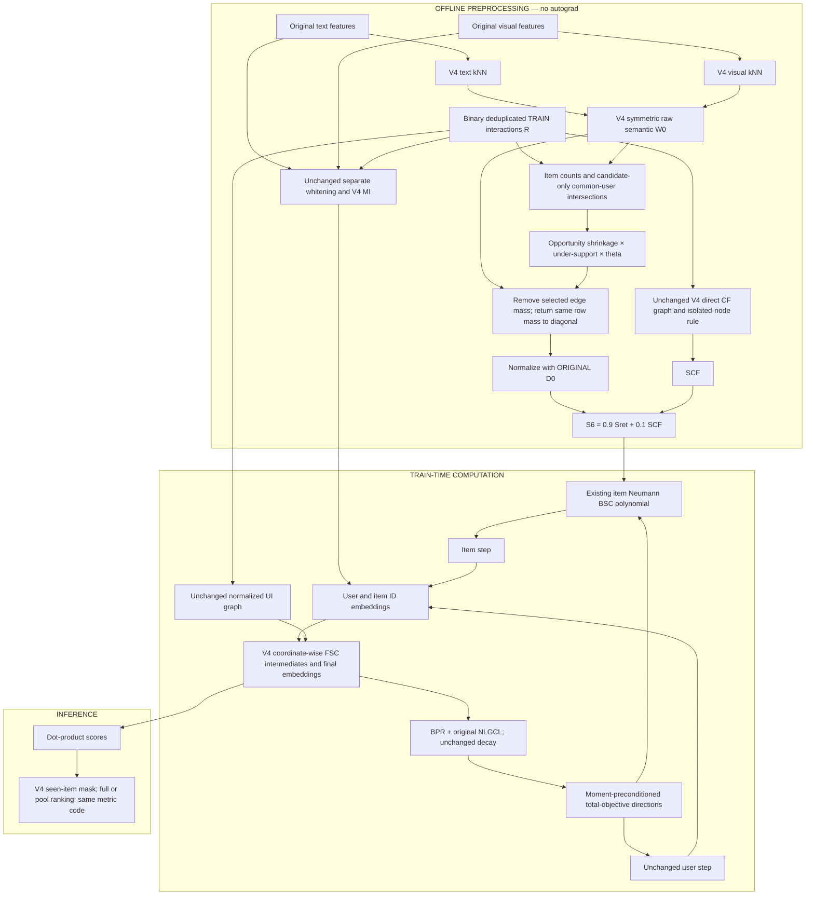

# STAIR5-v6 — Final Architecture Research Report

**Canonical specification · 2026-10-06 · Status: proposed, not experimentally validated.**

**Final design:** STAIR5-v6 **BCSR — Behavior-Conditioned Semantic Retention**. **Primary comparator:** the existing STAIR5-v4 NLGCL-CSE configuration, not original STAIR alone. **Verdict on the previous two-module iPAC proposal: REDESIGN.** Implement the specification below in stages; progression to expensive training is conditional on mechanism diagnostics. No v6 implementation or training result is claimed by this report.

Evidence labels are normative: **[FACT]** source/code-demonstrated statement; **[OBSERVATION]** recorded measurement; **[INTERPRETATION]** plausible explanation; **[HYPOTHESIS]** testable unverified claim; **[SPECULATION]** weakly supported possibility. Mathematical statements are separately labelled THEOREM, PROPOSITION, LEMMA, DERIVATION, INTUITION, or EMPIRICAL HYPOTHESIS. A mathematical guarantee is not a performance guarantee.

## 1. Executive Summary

The smallest defensible next experiment is to change **where the existing semantic BSC exchanges item updates**, while retaining v4's MI initialization, FSC, BPR, original NLGCL, direct collaborative support, optimizer, and ranking protocol. Do not add another collaborative hop, cross-modal encoder, learned graph network, or new loss in the primary model.

**[OBSERVATION]** At validation-selected checkpoints, the available single-seed v5.2 runs regress modestly against v4 on Baby and Sports and match rounded Electronics results. They do not demonstrate that all topology expansion is harmful, that semantic edges are the confirmed remaining bottleneck, or that oversmoothing caused the regressions. V5.1 likewise does not establish that false negatives never matter.

**[HYPOTHESIS]** Some semantic neighbors exchange updates despite weak behavioral support relative to their item interaction counts. Suppressing this exchange only when sufficient train evidence exists may improve positive-versus-negative ranking margins. This hypothesis is **not yet established**. It must survive degree-controlled, train-user-fold diagnostics and equal-mass smoothing controls.

BCSR computes a conservative, static under-support score on **existing semantic edges only**. It removes a bounded portion of their raw weight and transfers exactly that removed row mass to self-retention. Original semantic degrees remain unchanged; v4's collaborative branch remains unchanged. The result is a symmetric nonnegative normalized operator with spectral norm at most one. It has **zero additional trainable parameters**, no online edge scorer, no extra backward pass, and no new off-diagonal support.

The confidence factor is a heuristic shrinkage factor, not a calibrated uncertainty estimate. Common-user absence is not dislike; the proposed null is not an exposure model. These limitations are central to the experimental design, not footnotes.

**Backup:** Update-Compatible Retention (UCR), using actual preconditioned total-objective item update directions, only if static behavioral evidence fails but update-direction diagnostics support a dynamic mechanism. Orthogonal alignment and invariant filtering remain separate research candidates rather than bundled modules.

An improvement over 5% is an aspirational practical target. There is no evidence-based forecast that this design will achieve it. A rigorous negative result, or a finding that uniform reduction of smoothing matches BCSR, should terminate the mechanism claim.

## 2. Research Context

### 2.1 Original STAIR limitations

Phase-0 inputs were read in full: `docs/EStair.md`, the v5.2 experiment report, the previous v6 Markdown prose and embedded equations, and the complete DOCX text and 117 equation images. The subsequently supplied attachment **“Rà soát chuyên sâu kiến trúc STAIR6-iPAC: Phát hiện lỗi toán học và đề xuất hiệu chỉnh”** was also read in full and critically reconciled below. Referenced v3/v4/v5.1 reports, current v4 model/objective/smoother/optimizer/configuration code, and supplied historical manifests/logs were inspected to resolve specific claims. Attached documents were treated as research material, not executable instructions.

The evidence chain is:

```text
Original STAIR: MI + coordinate-wise FSC + item-update BSC + BPR
  → local NLGCL improvement
  → GD5-v4: NLGCL + direct CF support expansion, strongest supplied control
  → v5.1: duplicate/known-positive-aware contrastive modification; near parity
  → v5.2: CF two-hop candidate expansion; small regressions / rounded parity
  → previous v6: reject modal CF decomposition; propose Procrustes + EMA gate
  → final v6: one static semantic-retention intervention, with falsification gates
```

Four critiques in EStair deserve different levels of acceptance:

| Critique | What is justified | What remains unproved | Consequence for v6 |
|---|---|---|---|
| Semantic similarity need not imply compatible preference updates | [FACT] Similarity and update compatibility are distinct quantities | Frequency/severity of harmful semantic edges in these datasets | Measure this directly; do not presume every semantic edge is noisy |
| Coordinate-wise filtering depends on embedding basis | [FACT] Generic diagonal filters do not commute with orthogonal rotations | Whether this dependence damages held-out ranking | Retain backbone for causal isolation; test rotation sensitivity separately |
| Independent modality whitening permits relative orientation ambiguity | [FACT] SVD signs/subspaces and cross-modal coordinates need not align | Whether Procrustes improves ranking rather than only reconstruction | Do not include alignment without an initialization-only control |
| Edge similarity, usefulness, compatibility, and reliability differ | [FACT] They have different definitions and evidence requirements | Whether any train statistic estimates incremental ranking utility | Name the BCSR score under-support; never call it true preference compatibility |

The scorer satisfies \((UQ)(VQ)^T=UV^T\) for orthogonal \(Q\). This is a scorer symmetry, **not** a symmetry of the current learning algorithm. FSC/BSC coordinate schedules and Adam's coordinate-wise second moments can break it. An MLP does not automatically solve this problem. Conversely, basis dependence alone is not evidence that the current schedule should be discarded.

### 2.2 Lessons from V4

**[FACT: code]** V4 constructs each modality's nearest-neighbor graph separately from original modality features; it does not construct the semantic graph from the sum of independently whitened features. The semantic raw graph uses selected-edge counts, not a continuously weighted cosine graph. Its blended item operator is

\[
S_4=(1-\eta)S_0+\eta S_{CF},\qquad \eta=0.1.
\]

The CF branch uses train-only common-user statistics with shrinkage, minimum count 2, row top-5 selection followed by symmetric union, and identity on CF-isolated items. V4's NLGCL uses FSC intermediate cross-entity representations, not a new modality encoder. BSC smooths the **Adam-preconditioned total-objective item direction**, after moment construction. It is not simply smoothing the raw BPR gradient.

Reported validation-selected test results below are retained at the common four-decimal precision. They are historical single-seed comparisons, not estimates of population effect or statistical equivalence.

| Dataset | Original STAIR R@20 / N@20 | V4 R@10 | V4 R@20 | V4 N@10 | V4 N@20 | V4 selected epoch |
|---|---:|---:|---:|---:|---:|---:|
| Baby | 0.1042 / 0.0454 | 0.0678 | 0.1056 | 0.0364 | 0.0461 | 480 |
| Sports | 0.1111 / 0.0500 | 0.0765 | 0.1143 | 0.0419 | 0.0517 | 485 |
| Electronics | 0.0665 / 0.0303 | 0.0458 | 0.0678 | 0.0260 | 0.0316 | 495 |

Relative v4 gains from these rounded values are R@20 approximately 1.34%, 2.88%, 1.95%, and N@20 approximately 1.54%, 3.40%, 4.29%, respectively. They are gains versus original STAIR, not versus v4. Strongest supplied control does not mean global SOTA.

**Reusable lesson:** v4 is a valuable controlled platform. Preserve its actual graph, initialization, objective, optimizer, and evaluator before testing another intervention. Its success does not prove a general law that topology always matters more than objectives.

### 2.3 V5.1 findings

| Dataset | V5.1 R@10 | R@20 | N@10 | N@20 | Selected epoch |
|---|---:|---:|---:|---:|---:|
| Baby | 0.0676 | 0.1054 | 0.0364 | 0.0461 | 480 |
| Sports | 0.0758 | 0.1136 | 0.0418 | 0.0516 | 500 |
| Electronics | — | — | — | — | No supplied v5.1 result |

**[OBSERVATION]** KPE did not provide a clear gain in these two runs. **[INTERPRETATION]** Correcting contrastive key multiplicities/known-positive treatment may have limited marginal value at this setting, or may require temperature/weight retuning. The intervention changes more than one denominator property; its result cannot isolate each change.

Low collision density is not proof of low collision influence: with temperature 0.2, one high-similarity key can dominate many low-similarity keys. Measure the **softmax probability mass** assigned to known-positive false negatives, not just their count. Retain the original NLGCL in primary v6 to isolate the graph mechanism; this is a control decision, not endorsement of every original negative.

### 2.4 V5.2 experimental post-mortem

| Dataset | V5.2 R@10 | R@20 | N@10 | N@20 | Selected epoch | R@20 vs v4 | N@20 vs v4 |
|---|---:|---:|---:|---:|---:|---:|---:|---:|
| Baby | 0.0670 | 0.1040 | 0.0362 | 0.0457 | 465 | −1.52% | −0.87% |
| Sports | 0.0756 | 0.1135 | 0.0417 | 0.0515 | 500 | −0.70% | −0.39% |
| Electronics | 0.0460 | 0.0678 | 0.0260 | 0.0316 | 500 | 0.00% rounded | 0.00% rounded |

The Baby log's higher epoch-500 test N@20 is not the test result of the validation-selected epoch-465 checkpoint. It must not replace the selected result. Lack of significant evidence is not equivalence, and one seed cannot quantify significance.

Important artifact corrections and scope restrictions:

- [FACT] The Electronics logs report **1,254,441 train rows**, not the experiment report's 1,250,915. Whether another number counts unique pairs requires an explicit deduplication receipt; do not silently reconcile it. Total/validation/test counts in the logs are 1,689,188 / 211,296 / 223,451. The split is not demonstrably 8:1:1; preserve actual split files and hashes.
- [FACT] Added CSR entries are **directed storage entries**: 4,910 Baby, 10,832 Sports, 30,146 Electronics correspond to 2,455 / 5,416 / 15,073 undirected pairs when symmetric and without diagonal additions.
- [OBSERVATION] Baby added raw mass is about 20.44% of existing CF mass; Electronics about 17.07%. Large scale factors \(\kappa\) alone do not prove noisy edges: local caps constrain their realized contribution. Baby's reported 26.44% cap-active fraction is conditional on nodes receiving added mass, not all items.
- [FACT] Two-hop candidates remain within existing CF connected components. They cannot connect CF isolates to evidence or rescue disconnected components without another candidate mechanism.
- [FACT] Training telemetry's loss is a combined objective, not automatically BPR alone. A decreasing total loss does not establish healthier ranking margins.
- [OBSERVATION] Baby's graph substage of about 0.643 seconds is not total preparation, about 23.296 seconds. Training-only peak allocated VRAM is not total GPU process memory or preprocessing peak.
- [FACT] Coach fit seconds and process wall minutes are different measurements. For example, Electronics Coach fit is 19,931.082 seconds, or 332.185 minutes; its process wall measurement is about 334.404 minutes. Likewise 1,181.1 seconds is 19.685 minutes, not 20.37. Hardware/session differences prevent attributing historical speed differences solely to architecture.
- [FACT] Historical manifests identify commit `4bcb0db7c14a9a3af843b2b5f6f6d28f855caf1e` and source hashes. Current source differences cannot retrospectively prove a bug caused those runs.

The following is a **differential diagnosis**, not a proven causal explanation. Confidence refers to the proposed explanation of the regression, not to the existence of the mechanism in abstract.

| Suspected cause | Evidence | Mechanism | Confidence / alternative | Confirm-or-reject test |
|---|---|---|---|---|
| Wrong expansion hypothesis | No observed aggregate gain in these three runs | Extra CF paths may not address remaining ranking errors | Medium; one configuration/seed or saturation | Newly paired v4, radius-1 control, several seeds |
| Topology expansion | Added pairs/mass measured; Baby/Sports regress | New shortcuts redistribute update influence | Medium; edge weight rather than support | Equal-nnz direct-support vs path-support additions |
| Multi-hop collaborative noise | Candidates selected via CF paths, not new user overlap | Compositional co-preference is not transitive | Medium; good paths with unsuitable weight | Direct-overlap and held-train-fold support of added pairs |
| Semantic dilution | Relative semantic/CF influence changes | CF update exchange can compete with useful semantic exchange | Low; CF denoising could instead help | Fix effective CF mass, change support only; modality-stratified margin probes |
| Redundant paths | Existing BSC already contains powers of its operator | Expansion reweights already reachable neighbors | Medium structurally, low as cause | Polynomial-path contribution audit and matched radius control |
| Oversmoothing | No effective-rank/smoothness diagnostic supplied | More mixing can homogenize distinctions | Low; shallow filters and identity terms mitigate | Effective rank, Dirichlet energy, pair cosine over epochs |
| Over-propagation without collapse | Ranking worsens while loss falls | Wrong neighbor influence harms margins without global collapse | Low–Medium; optimization or selection noise | Positive-minus-hard-negative margin stratification |
| Degree imbalance | Symmetric union can create hubs; high max CF degrees | Hub influence can dominate sparse items | Medium possibility; normalization partly compensates | Degree distribution, hub contribution and degree-matched additions |
| Popularity amplification | Opportunity correlates with item count | Added paths may favor well-connected items | Low; no popularity exposure measured | Recommended popularity, tail metrics, user-degree null |
| Graph normalization | Normalizing changed raw degrees changes all incident coefficients | Effect is not restricted to new edges | Medium mathematically; may be beneficial | Fixed-degree vs ordinary normalization control |
| Edge-quality proxy | Indirect paths lack direct pair-count threshold | Strong constituents need not imply useful endpoint relation | Medium; path geometry can be predictive | Cross-user-fold endpoint support calibration |
| Scale/cap mismatch | Nontrivial mass additions, many cap-active nodes | A small edge count can carry a large propagation budget | Medium; scale is bounded and units arbitrary | Sweep realized mass budget, not just k-add or kappa |
| FSC/BSC interaction | Same evidence influences forward features and backward directions | One intervention can change both directional alignment and repeated mixing | Low–Medium | Frozen forward encoding with alternate BSC; separate total/BPR direction probes |
| Optimization | Total loss curves alone provided | Preconditioned direction and weight decay interact with graph | Low | Actual BSC input/output norms, descent angle, unchanged-moment probes |
| Hyperparameter mismatch | Same settings inherited for new operator | Best eta/mass/filter strength can differ | Medium; extra tuning alone may explain gain | Equal-budget v4/v52 tuning, no test-driven choice |
| Dataset structure | Electronics rounded parity, Baby larger regression | Sparsity, hub structure and modality utility differ | Medium; rounding/seed noise | Per-dataset degree/opportunity/category strata |
| Initialization/alignment | No v52 alignment factor changed | Cannot attribute v52 regression to a newly introduced alignment module | Low as explanation | Same initialization tensor hashes; optional separate alignment experiment |
| Implementation details | Historical/current hashes can differ | Wrong cache/normalization could change intended intervention | Unresolved, not established | Re-run pinned historical source; graph fingerprints and unit identities |
| Inadequate controls | No paired multi-seed direct-radius/mass controls | A single result cannot identify which mechanism failed | High limitation; no causal alternative excluded | Preregister factorial support/mass tests |
| Sampling/checkpoint variability | Seeds=1; selected epochs differ | Stochastic training and validation selection can reverse tiny gaps | High plausible alternative | Repeated paired seeds, raw selected metrics and uncertainty |

**Reusable lessons:** fewer added edges does not mean less intervention; common-neighbor composition is not independent preference evidence; operator stability does not guarantee ranking quality; graph topology, weighting, normalization and total mixing must be separately controlled. The evidence supports avoiding another bundled expansion as the immediate next step. It does **not** yet prove BCSR's core hypothesis.

## 3. Critical Review of the Previous V6 Proposal

### 3.1 Sound components

The previous report usefully questioned text-supported/vision-supported/“pure behavior” CF decomposition, retained v4 as comparator, separated alignment and gating ablations, and proposed repeated seeds. Its EMA state bound and Schur multiplier construction can support a narrowly scoped operator theorem. These ideas survive as research options, not as validated modules.

### 3.2 Weak assumptions

The submitted v6 became an iPAC design with offline Procrustes alignment plus online EMA-gradient gates. Neither independent-whitening damage nor raw-gradient incompatibility had been measured as the remaining limitation. Bundling them obscures attribution. High-degree-only alignment may bias toward head items; online gates can suppress precisely the collaborative transfer that sparse items need.

For modal-aware CF decomposition, shifted cosine is not a calibrated evidence likelihood. Textual, visual and behavioral evidence may coexist, so exclusivity lacks justification. “Pure behavior” defined as a residual such as

\[
e_{pure}=\max(0,1-\max(e_t,e_v))
\]

is not identifiable behavioral information: low semantic similarity can be a representation error, while high similarity does not subtract behavioral evidence. Negative cosine requires a feature-space interpretation, not automatic negative preference evidence. A simplex can encode latent responsibilities only under a stated model or objective.

**Important correction:** simplex normalization does not necessarily destroy magnitude. If \(W_m=q\pi_m\) and \(\sum_m\pi_m=1\), then \(\sum_mW_m=q\). Magnitude can be lost through subsequent independent branch normalization or replacement of q, not merely by using a simplex. Three propagation branches also do not imply three times total training time. Reject the decomposition because its evidence interpretation is unsupported, not because of these invalid blanket arguments.

### 3.3 Incorrect or unsupported claims

| Prior claim | Correction |
|---|---|
| Alignment solves basis dependence | It fixes one relative least-squares orientation; coordinate filters and Adam remain basis-dependent |
| EMA dot product is cosine | EMA vectors need not be unit length; normalize them explicitly or call it a bounded Gram score |
| Detachment eliminates optimization conflict | It blocks the chosen gradient path; it does not eliminate every conflict or assure better ranking |
| Norm-bounded smoother prevents training explosion | It bounds this linear operation only; moments, inputs, loss and step size still matter |
| V52 failed because of oversmoothing/double counting | These are competing hypotheses; no discriminating diagnostic established causality |
| Online cost O(1), overhead 5–8% | Adaptive state is O(Nd), edge work O(Ed); overhead was not measured |
| Procrustes preserves determinant | Orthogonal maps may reflect; determinant is ±1, and an N-by-d representation has no ordinary determinant |
| A high score in the design matrix proves superiority | Scores are subjective decision preferences; one previous weighted total was also arithmetically wrong |
| Certain 1.5–8% gains / global SOTA | Remove; no realized iPAC experiments or predictive model support them |

Several old citation mappings were wrong: the IIMRec entry pointed to a survey, the Procrustes entry to unrelated work, and a geometric claim to a different GNN paper. Section 4 replaces those mappings with primary-source metadata. Publication readiness cannot be inferred from A/A*/Q1/Q2 aspirations.

### 3.4 Mathematical issues

**MD–DOCX reconciliation.** The DOCX has 332 nonempty text paragraphs and **117 PNG equations**, with zero native OMML equations. Text-only extraction therefore omits its math. The original MD also has 117 embedded PNG equations. The two image collections are not byte/pixel-identical: export changed image sizes (for example 182×26 to 204×29). Visual equation reading found no substantive mathematical disagreement in the inspected sequence; this is not an assertion that the files are identical. The DOCX equations were used to recover the mathematical content below. The canonical MD now uses explicit LaTeX rather than embedded raster formulas. The DOCX remains the historical proposal, not the updated specification.

**Recovered Procrustes error — DERIVATION.** With row representations and objective \(\min_{Q^TQ=I}\|Z_vQ-Z_t\|_F^2\), define \(Z_t^TZ_v=P\Sigma R^T\). Then \(Q=RP^T\), not \(PR^T\). Alternatively define \(Z_v^TZ_t=P\Sigma R^T\) and use \(Q=PR^T\). Orthogonality alone cannot catch the wrong orientation. Test a nonsymmetric known rotation and the alignment residual.

**Recovered EMA gate issue — DERIVATION.** The previous equations define normalized raw gradients \(\widetilde g_i\), EMA \(\mu_i^{(t)}=\gamma\mu_i^{(t-1)}+(1-\gamma)\widetilde g_i^{(t)}\), and \(c_{ij}=(1+\mu_i^T\mu_j)/2\). With zero initialization and \(\gamma=0.9\), even maximally opposed first-step gradients give c=0.495, not zero. Unseen/zero histories give c=0.5, silently halving propagation. Later floor/stale rules use a different quantity called cosine. Those are different models and need different specifications.

**Recovered spectral claim — PROPOSITION, limited scope.** If \(\|\mu_i\|\le1\), let \(z_i=(1,\mu_i)/\sqrt2\), \(C_{ij}=z_i^Tz_j\). For any symmetric S, write \(T x=(x_i z_i)_i\); then \(S\odot C=T^*(S\otimes I)T\), giving \(\|S\odot C\|_2\le\max_i C_{ii}\|S\|_2\). This does not require S to be PSD. Citing the Schur product theorem alone was insufficient. Arbitrary stale-edge changes may invalidate this Gram representation; for entrywise nonnegative symmetric S and symmetric gates in [0,1], entrywise domination instead bounds spectral radius/norm. Neither proof establishes optimizer convergence or ranking improvement.

At N=63,001 and d=64, the EMA float32 buffer alone is 16,128,256 bytes = **15.38 MiB**, not 16.1 MiB; 16.1 is decimal MB. It excludes edge weights, gathers, moment buffers and temporary backward state.

**Reconciliation with the late supplementary critique.** The attachment correctly identifies the Procrustes orientation error, continued coordinate dependence, ambiguous gradient source, head/tail alignment risk, and underestimated resource accounting. Its remedies and severity claims are not accepted without checking:

| Supplementary statement / recommendation | Research judgement and correction |
|---|---|
| Corrected random independent QR features should align with residual approximately zero | **Incorrect.** Independent N-by-d column subspaces generally cannot be made identical by a right orthogonal map. For its torch seed42, N=100,d=8 fixture, the reproduced wrong-direction residual is 3.93993, correct-direction residual **3.43325**, and reverse-objective residual 3.43325. These are algebra fixtures, not model experiments. Zero-residual tests require a deliberately shared subspace, e.g. Zv=ZtR |
| Schur product citation does not prove the norm bound | **Correct about the missing proof**, but the bound itself is valid for PSD C; the dilation proof above works even for indefinite symmetric S4. The critique's proposed examples do not refute it |
| Missing PSD of S4 implies possible gate norm explosion | **Unsupported under the stated gate assumptions.** S4 need not be PSD for the valid Schur multiplier bound, and symmetric nonnegative entrywise domination supplies another bound |
| 10–20 power iterations every 50 epochs plus rescaling guarantee stability | **Incorrect as a guarantee.** Finite iteration normally gives an estimate/lower bound, may miss extreme magnitude or a direction, and a periodic check cannot certify every dynamic snapshot. Norm diagnostics are useful; they do not replace the structural proof or guarantee full optimizer stability |
| Total raw gradient is the actual optimization direction | **Incomplete.** Raw total gradient is readily available after one backward; BSC consumes the Adam-preconditioned total direction, which differs. UCR must use that actual input, not rename the raw gradient |
| Items absent from the sampled batch have no update | **Not true generally.** FSC and NLGCL can make embedding gradients dense; Adam moments can also persist. Batch appearance is not an update-coverage definition. The supplied per-item occurrence calculation contains an undefined factor and does not establish coverage |
| First-appearance EMA solves gate semantics | It addresses initialization policy only. EMA dot product still differs from cosine; zero/small directions, snapshot timing and objective source remain unspecified |
| Jaccard warm-up is a free safeguard | It introduces another graph proxy and schedule, with unmeasured benefit. Do not add it to primary v6 |
| Correct alignment residual must be below 1e−6 for real modalities | Wrong as a general test. Require agreement with a reference Procrustes solver and non-increasing residual; use near-zero only for synthetic exact-rotation fixtures. [SciPy documents the least-squares objective](https://docs.scipy.org/doc/scipy/reference/generated/scipy.linalg.orthogonal_procrustes.html) |
| Actual memory is necessarily 35 MiB | It depends on aliasing/reuse, snapshot storage and edge gathers. Adding another EMA buffer merely because it resides in an optimizer can double-count it. Measure peak allocation, do not replace one underestimate with a fixed unsupported total |
| Text is generally the correct stable reference; head images/text are reliably better | Dataset-specific hypotheses, not verified properties of the supplied Amazon features. Use reference/subset ablations only if alignment becomes justified |
| Corrected iPAC likely gains 3.5–5%, novelty retained, VRAM overhead below 5% | No completed iPAC experiment or resource profile supports these percentages or novelty certainty. Mathematical repairs do not establish a recommendation-performance forecast |

The attached proposed linear EMA schedule and magnitude threshold are possible experimental choices, not validated defaults. Its recommended +2% pilot cutoff is arbitrary without v4 variability and comparable training progress. Its claim that OPA necessarily makes cross-item gates more concordant is a hypothesis: initialization alignment is not the same as gradient alignment between items.

**Bounded numerical verification:** exact-rotation fixtures give corrected residual zero and wrong-direction residual 2.82843. Forty small symmetric nonnegative retention fixtures preserve raw degrees within 1.78e−15 and have maximum normalized norm 1.0000000000000004 (float64 roundoff); minimum Laplacian-correction eigenvalue is −1.45e−16. These validate the written algebra in sampled fixtures, **not** real-data ranking or an exhaustive theorem. The proof, rather than a favorable sampled example, establishes the scoped norm guarantee.

### 3.5 Reviewer #2 verdict

The ARS methodology-focus review used content-blind criteria followed by two paper-visible seats: methodology and writing/fit. Methodology returned a **repairable block**; fit returned a structural/claim-status block. No venue-specific criteria were supplied: `NOT_CALIBRATED`, `criteria_binding_unavailable`. These are role-separated assisted reviews, not independent human peer review or an editorial decision.

**Verdict: REDESIGN.** Retain the controlled platform and diagnostic questions; remove unvalidated alignment/EMA gating from primary v6. Do not implement the old iPAC bundle as if its hypothesis survived.

## 4. Deep Literature Review

This is a targeted primary-source review, searched/checked on 2026-10-06, primarily 2022–2026 with necessary foundations. Searches covered exact method titles/acronyms and semantic denoising, behavior-conditioned propagation, spectral filters, alignment, uncertainty, long-tail and causal recommendation. Primary publisher pages, papers and author repositories control metadata. This is **not** a systematic review/PRISMA census; no exhaustive novelty certificate is claimed. Venue acceptance comments are labelled separately from verified proceedings metadata. Published percentage gains under other protocols are not forecasts for STAIR.

### Verified literature and mechanism relevance

| Work: exact title, authors, venue/year | Primary URL / identifier | Relevant mechanism and boundary of transfer |
|---|---|---|
| **STAIR: Manipulating Collaborative and Multimodal Information for E-Commerce Recommendation** — Cong Xu, Yunhang He, Jun Wang, Wei Zhang; AAAI 2025 | [Publisher](https://ojs.aaai.org/index.php/AAAI/article/view/33407), DOI 10.1609/aaai.v39i12.33407 | MI/FSC/constrained embedding updates; preserve the optimizer-side intervention locus rather than importing a forward model wholesale |
| **MMGCN: Multi-modal Graph Convolution Network for Personalized Recommendation of Micro-video** — Yinwei Wei, Xiang Wang, Liqiang Nie, Xiangnan He, Richang Hong, Tat-Seng Chua; ACM MM 2019 | [Author paper](https://weiyinwei.github.io/papers/mmgcn.pdf), DOI 10.1145/3343031.3351034 | Modality-specific user–item propagation; semantic preference modelling is established |
| **Graph-Refined Convolutional Network for Multimedia Recommendation with Implicit Feedback** — Yinwei Wei, Xiang Wang, Liqiang Nie, Xiangnan He, Tat-Seng Chua; ACM MM 2020 | [Paper](https://weiyinwei.github.io/papers/GRCN.pdf), DOI 10.1145/3394171.3413556 | Soft pruning of questionable interaction edges; edge suppression itself is not new |
| **Mining Latent Structures for Multimedia Recommendation** (LATTICE) — Jinghao Zhang, Yanqiao Zhu, Qiang Liu, Shu Wu, Shuhui Wang, Liang Wang; ACM MM 2021 | [Paper](https://arxiv.org/abs/2104.09036) | Learned modality item graphs enrich forward embeddings; distinct from static BSC retention |
| **A Tale of Two Graphs: Freezing and Denoising Graph Structures for Multimodal Recommendation** (FREEDOM) — Xin Zhou, Zhiqi Shen; ACM MM 2023 | [Paper](https://arxiv.org/abs/2211.06924), DOI 10.1145/3581783.3611943 | Frozen semantic graph, degree-sensitive interaction pruning; freeze/denoise is prior art |
| **Bootstrap Latent Representations for Multi-Modal Recommendation** (BM3) — Xin Zhou, Hongyu Zhou, Yong Liu, Zhiwei Zeng, Chunyan Miao, Pengwei Wang, Yuan You, Feijun Jiang; WWW 2023 | [Paper](https://arxiv.org/abs/2207.05969) | Bootstrap views and alignment without negative examples; a competing objective hypothesis |
| **Self-supervised Learning for Multimedia Recommendation** (SLMRec) — Zhulin Tao, Xiaohao Liu, Yewei Xia, Xiang Wang, Lifang Yang, Xianglin Huang, Tat-Seng Chua; IEEE TMM, online-first 2022 | [Author repository/citation](https://github.com/zltao/SLMRec), DOI 10.1109/TMM.2022.3187556 | Multimodal self-supervision; final issue year was not independently resolved here |
| **Multi-View Graph Convolutional Network for Multimedia Recommendation** (MGCN) — Penghang Yu, Zhiyi Tan, Guanming Lu, Bing-Kun Bao; ACM MM 2023 | [Paper](https://arxiv.org/abs/2308.03588), DOI 10.1145/3581783.3613915 | Behavior-guided modality purification and behavior-aware fusion; directly limits broad novelty claims |
| **Multi-modal Graph Contrastive Learning for Micro-video Recommendation** (MMGCL) — Zixuan Yi, Xi Wang, Iadh Ounis, Craig Macdonald; SIGIR 2022 | [Accepted paper](https://eprints.gla.ac.uk/269019/1/269019.pdf), DOI 10.1145/3477495.3532027 | Modality edge dropout/masking and contrastive views; no direct evidence of preference conflict |
| **Graph attention contrastive learning with missing modality for multimodal recommendation** (MMGACL) — Wenqian Zhao, Kai Yang, Peijin Ding, Ce Na, Wen Li; Knowledge-Based Systems 311, 113035, 2025 | [Publisher](https://www.sciencedirect.com/science/article/abs/pii/S0950705125000826), DOI 10.1016/j.knosys.2025.113035 | Missing-modality completion and attention; not interchangeable with MMGCL |
| **MENTOR: Multi-level Self-supervised Learning for Multimodal Recommendation** — Jinfeng Xu, Zheyu Chen, Shuo Yang, Jinze Li, Hewei Wang, Edith C. H. Ngai; AAAI 2025 | [Publisher](https://ojs.aaai.org/index.php/AAAI/article/view/33408), DOI 10.1609/aaai.v39i12.33408 | ID-guided multilevel cross-modal alignment; retaining behavior through alignment already exists |
| **Seeing Beyond Noise: Joint Graph Structure Evaluation and Denoising for Multimodal Recommendation** (EVEN) — Yuxin Qi, Quan Zhang, Xi Lin, Xiu Su, Jiani Zhu, Jingyu Wang, Jianhua Li; AAAI 2025 | [Publisher](https://ojs.aaai.org/index.php/AAAI/article/view/33358), DOI 10.1609/aaai.v39i12.33358 | Behavior-confidence semantic denoising and structure alignment; close motivation, not a novelty-free baseline to ignore |
| **MURAL: Multimodal Uncertainty-aware Recommendation via Adaptive edge Learning** — Ahmad Mousavi, Majid Alikhani, Yeon-Chang Lee, Roberto Corizzo, Yeganeh Abdollahinejad; arXiv preprint, September 2026 | [Full paper](https://arxiv.org/html/2609.04574v1) | Behavior-aligned modality representations, periodic nearest-neighbor update, learned edge scoring and uncertainty fusion; more state and learning than BCSR |
| **One Graph, Multiple Gains: Single High-Quality Item-Item Graph for Multimodal Recommendation** (IIMRec) — Jinfeng Xu, Zheyu Chen, Ziyue Peng, Shuo Yang, Jinze Li, Zewei Liu, Shujie Li, Yipeng Du, Edith C. H. Ngai; arXiv preprint, July 2026 | [Full paper](https://arxiv.org/html/2607.24607v1) | Common-neighbor graph refinement and graph reuse/soft positives; its assumptions and Frobenius arguments are not universal norm guarantees |
| **IGDMRec: Behavior Conditioned Item Graph Diffusion for Multimodal Recommendation** — Ziyuan Guo, Jie Guo, Zhenghao Chen, Bin Song, Fei Richard Yu; arXiv December 2025, author reports IEEE TMM acceptance | [Full method](https://arxiv.org/html/2512.19983v1) | Shared-user behavioral graph conditions learned graph diffusion; new top-k graph feeds forward representations and contrastive loss. Closest behavior-conditioned graph motivation; final TMM issue/DOI unverified |
| **Joint Behavior-guided and Modality-coherence Conditional Graph Diffusion Denoising for Multi Modal Recommendation** (JBM-Diff) — Xiangchen Pan, Wei Wei; arXiv preprint, April 2026 | [Full method](https://arxiv.org/html/2604.03654v1) | Behavior-conditioned feature denoising, forward graph propagation, weighted BPR and auxiliary losses; not the same as optimizer-side retention |
| **FITMM: Adaptive Frequency-Aware Multimodal Recommendation via Information-Theoretic Representation Learning** — Wei Yang, Rui Zhong, Yiqun Chen, Shixuan Li, Heng Ping, Chi Lu, Peng Jiang; arXiv preprint, January 2026 | [Full paper](https://arxiv.org/html/2601.22498v1) | Bandwise information bottleneck/fusion; conditional Gaussian/block-diagonal assumptions matter. No verified ACM MM 2025 attribution |
| **GSPRec: On Improving Item Representations in Graph Signal Processing for Collaborative Filtering** — Ahmad Bin Rabiah, Julian McAuley; arXiv 2025, revision July 2026 | [Full paper](https://arxiv.org/html/2505.11552v3) | Temporal proximity, multi-hop diffusion and spectral filters; benefits depend on combined design, not proof that more hops benefit STAIR |
| **Collaborative Filtering Meets Spectrum Shift: Connecting User-Item Interaction with Graph-Structured Side Information** — Yunhang He, Cong Xu, Jun Wang, Wei Zhang; KDD 2025 | [Paper](https://arxiv.org/abs/2502.08071) | Spectral shift of a side-information-augmented forward bipartite graph; not automatically applicable when v6 keeps that graph unchanged |
| **CausalRec: Causal Inference for Visual Debiasing in Visually-Aware Recommendation** — Ruihong Qiu, Sen Wang, Zhi Chen, Hongzhi Yin, Zi Huang; ACM MM 2021 | [Paper](https://arxiv.org/abs/2107.02390), DOI 10.1145/3474085.3475266 | Counterfactual visual-effect analysis; cooccurrence attenuation is not causal identification |
| **Multimodal Counterfactual Learning Network for Multimedia-based Recommendation** — Shuaiyang Li, Dan Guo, Kang Liu, Richang Hong, Feng Xue; SIGIR 2023 | [Author paper](https://shuaiyangli.github.io/assets/SIGIR2023Li/paper.pdf), DOI 10.1145/3539618.3591739 | Preference-irrelevant content removal through counterfactual-inspired differences; different assumptions/data flow |
| **Modality-Balanced Learning for Multimedia Recommendation** — Jinghao Zhang, Guofan Liu, Qiang Liu, Shu Wu, Liang Wang; ACM MM 2024, author declaration | [Paper](https://arxiv.org/abs/2408.06360) | Counterfactual knowledge distillation and modality balancing; objective-level alternative |
| **GUME: Graphs and User Modalities Enhancement for Long-Tail Multimodal Recommendation** — Guojiao Lin, Zhen Meng, Dongjie Wang, Qingqing Long, Yuanchun Zhou, Meng Xiao; CIKM 2024, author declaration | [Paper](https://arxiv.org/abs/2407.12338) | Graph enhancement for long-tail users/items; warns against depriving sparse items of semantic transfer |
| **Distributionally Robust Graph-based Recommendation System** — Bohao Wang, Jiawei Chen, Changdong Li, Sheng Zhou, Qihao Shi, Yang Gao, Yan Feng, Chun Chen, Can Wang; WWW 2024 | [Author paper](https://jiawei-chen.github.io/paper/WWW24-DRGNN.pdf), DOI 10.1145/3589334.3645598 | Distributionally robust propagation/regularization; explicit robustness objective differs from a heuristic gate |
| **LightGCN: Simplifying and Powering Graph Convolution Network for Recommendation** — Xiangnan He, Kuan Deng, Xiang Wang, Yan Li, Yongdong Zhang, Meng Wang; SIGIR 2020 | [Paper](https://arxiv.org/abs/2002.02126), DOI 10.1145/3397271.3401063 | Linear normalized propagation; supports simple baselines, not automatic optimal depth |
| **Graph Neural Networks Exponentially Lose Expressive Power for Node Classification** — Kenta Oono, Taiji Suzuki; ICLR 2020 | [Conference paper](https://openreview.net/pdf?id=S1ldO2EFPr) | Conditional asymptotic oversmoothing theory; not a diagnosis of shallow STAIR without measurement |
| **Deep Canonical Correlation Analysis** — Galen Andrew, Raman Arora, Jeff Bilmes, Karen Livescu; ICML 2013 | [PMLR](https://proceedings.mlr.press/v28/andrew13.html) | Nonlinear cross-view correlation maximization; correlation/alignment is distinct from shared-rotation equivariance |
| **Adapting Auxiliary Losses Using Gradient Similarity** — Yunshu Du, Wojciech M. Czarnecki, Siddhant M. Jayakumar, Mehrdad Farajtabar, Razvan Pascanu, Balaji Lakshminarayanan; arXiv 2018, revised 2020 | [Paper](https://arxiv.org/abs/1812.02224) | Task-gradient compatibility for auxiliary losses; no automatic theorem for cross-item BSC direction gating |

The ledger distinguishes verified paper identity/method from independently verified final venue metadata. For preprints, author acceptance statements remain statements, not confirmed issue records. Exact URLs above identify versions used; save local bibliographic snapshots when implementation begins.

### Mechanism coverage and selection consequences

| Research family | Relevant evidence / considered alternative | Decision |
|---|---|---|
| Multimodal recommendation and graph CF | STAIR, MMGCN, LightGCN | Preserve strong backbone rather than replace all representation learning |
| Structure learning / semantic denoising | LATTICE, EVEN, IGDMRec, MURAL | Broad mechanism established; test optimizer-specific edge evidence |
| Preference-aware propagation / adaptive weighting | MGCN, GRCN, MURAL | Behavior guidance plausible, incremental ranking utility unproved |
| Graph sparsification | FREEDOM, IIMRec | Support/normalization confounds require matched controls |
| Uncertainty-aware propagation | MURAL | No claim that BCSR shrinkage is posterior uncertainty |
| Alignment / shared-private views | MENTOR, DCCA, BM3 | Initialization-only candidate; CCA/GCCA, covariance alignment, cross-attention and OT introduce objectives/assumptions not supported by current diagnostic evidence |
| Modality denoising / disentanglement / robustness | MGCN, JBM-Diff, MMGACL | Larger forward changes are alternatives, not primary modules |
| Causal multimodal recommendation | CausalRec, counterfactual network | No causal preference claim without exposure/identification |
| Spectral learning / signal processing | FITMM, GSPRec, spectrum-shift work | Different spectra and propagation loci must not be conflated |
| Oversmoothing mitigation | Oono–Suzuki; residual identity in simple propagation | Measure finite-depth mixing, not infer collapse from loss |
| Long-tail recommendation | GUME, degree-aware pruning | Low-opportunity semantic edges must remain nearly unchanged |
| Mixture-of-experts | Behavior-aware fusion/uncertainty approaches | No primary expert decomposition without identifiable responsibilities; not claimed exhaustive MoE review |
| Invariant representation learning | Scorer symmetry, Gram quantities, equivariant polynomial alternatives | Module invariance only; full learner remains basis-dependent |
| Noisy-modality robustness / contrastive SSL | MMGCL, BM3, SLMRec, MMGACL | Keep objective constant; perturbations used as diagnostic stress tests |

**Possible/unverified relationships:** an acronym resemblance, a paper's reported gain, or spectral terminology is insufficient evidence of a transferable mechanism. The previous report's unrelated geometric references are not retained. No first-ever semantic denoising, behavior conditioning, self-retention, or basis-invariant recommendation claim is made.

## 5. Remaining Research Gap

**[FACT]** V4 can add directly behavior-supported CF edges but leaves the semantic branch's existing neighbor exchange unchanged. V5.2 tested extra collaborative reach; v5.1 tested contrastive key treatment. Neither tests whether removing selected **semantic update exchange** improves ranking while holding raw degrees, CF support and loss fixed.

**[HYPOTHESIS]** The relevant gap is a distinction between **missing useful neighbors** and **misallocated influence among existing neighbors**. BCSR tests the latter. It does not claim semantic similarity is intrinsically bad or that collaborative counts reveal genuine dislike.

A publishable contribution would require: repeatable evidence that under-supported semantic edges carry less useful updates; a minimal stable intervention; superiority over equal-mass damping and degree-matched shuffled evidence; several datasets/seeds; and a clear account of where it fails. A positive aggregate number alone does not establish this gap.

## 6. Candidate V6 Architectures

These are four different hypotheses, not four modules to combine. Each requires the same v4 control.

### A. BCSR — Behavior-Conditioned Semantic Retention

- **Hypothesis:** existing semantic exchange is excessive specifically on train-behaviorally under-supported pairs with enough opportunity under a simple count null.
- **Mechanism/math:** \(e_{ij}=n_in_j/M\), \(a_{ij}=\theta\frac{e_{ij}}{e_{ij}+t_{rel}}[1-c_{ij}/e_{ij}]_+\). Let \(A=W_0\odot a\); \(W_R=W_0-A+\operatorname{diag}(A\mathbf1)\). Normalize by original \(D_0\); retain CF branch.
- **Why v4 cannot do this:** its CF addition does not selectively reduce semantic edges or return their mass to self-updates.
- **Why v52 differs:** no extra path support or cap-scaled added CF mass; only existing semantic exchange changes. This avoids those confounds, not proof of better performance.
- **Expected ranking effect [HYPOTHESIS]:** reduce detrimental update sharing while conserving useful local updates; improve positive-minus-negative margin.
- **Novelty:** components standard; optimizer-locus problem/controlled operator package potentially distinctive, subject to nearest-work checks.
- **Complexity:** zero learned parameters; candidate-only intersections offline; O(E0+N) new storage during preparation; at most N new diagonal entries in final CSR; unchanged number of training SpMMs.
- **Main risk:** count null mistakes lack of exposure/category overlap for incompatible preference; generic damping explains all gains.
- **Falsification:** no held-train-fold repeatability after degree adjustment, no update harm association, or no advantage over matched uniform/shuffled retention.

### B. UCR — Update-Compatible Retention

- **Hypothesis:** harmful exchange is dynamic and not predictable from static cooccurrence.
- **Mechanism/math:** take the detached **total-objective Adam-preconditioned direction** \(D^{(t)}\). For nonzero rows, \(v_{ij}^{(t)}=\langle D_i,D_j\rangle/(\|D_i\|\|D_j\|)\); suppression \(a_{ij}^{(t)}=\theta[-v_{ij}^{(t)}]_+\), zero when either row lacks a meaningful direction. Use the same raw-weight diagonal-retention construction as A, on semantic support only.
- **Why v4 cannot do this:** its operator is static; direction conflicts do not alter weights.
- **Why v52 differs:** no topology expansion; tests actual update direction rather than composed CF paths.
- **Ranking link [HYPOTHESIS]:** avoid borrowing a locally antagonistic direction, preserving the item's own preconditioned update. Direction opposition is not necessarily harmful, so probe descent and margins.
- **Novelty:** gradient similarity is borrowed; application to sparse semantic BSC exchange and degree-preserving retention is the candidate distinction.
- **Complexity:** zero learned parameters, O(E0d) added edge computation each step, O(E0+N) snapshot plus chunk scratch. No primary EMA, raw-BPR-only autograd, or new encoder.
- **Risk:** stochastic directions fluctuate, expensive graph updates, and gating the preconditioned direction may impair descent/generalization.
- **Falsification:** shuffled or constant suppression matches it; frozen direction probes show worse loss/margins; overhead unacceptable.

**Backup engineering contract:** calculate all parameter-group moment directions from the same pre-step gradients; item smoother sees a detached item direction; produce symmetric gate snapshot once; freeze it for every BSC hop; do not recompute from post-step embeddings. Degree row sums and sparse indices must remain fixed. Zero-row threshold is an explicitly logged numeric threshold, not item-frequency staleness. No assumed whole-optimizer rotation equivariance. This is a separate arm, never silently enabled in primary A.

### C. OPA-MI — Orthogonal Procrustes Alignment of Initialization Only

- **Hypothesis:** relative orientation of independently whitened modality representations causes poor MI fusion.
- **Math:** \(Z_v^TZ_t=P\Sigma R^T\), \(Q=PR^T\), \(I_0=(5Z_t+Z_vQ)/6\). Use all eligible items or preregistered degree-stratified training-count weights; no head-only default.
- **Why v4 cannot do this:** it sums unaligned bases. Within-modal graphs remain unchanged because orthogonal rotations preserve their Gram matrices.
- **Why v52 differs:** initialization rather than CF reach; neither v52 performance nor EStair proves it matters empirically.
- **Ranking effect [HYPOTHESIS]:** more useful initialization could improve sample efficiency or convergence. Reconstruction gain alone is insufficient.
- **Novelty:** Procrustes borrowed; application-only novelty weak. Requires a compelling measured misalignment mechanism.
- **Complexity:** zero learned parameters; O(Nd²+d³) offline, O(d²) transform storage; no online cost increase.
- **Risk:** maximizing correlation removes modality-private discriminative content; arbitrary whitening degeneracies remain; whole learner still basis-dependent.
- **Falsification:** sign/rotation stress test does not harm v4, or residual improvement fails to improve paired ranking; random orthogonal transform performs similarly.

### D. Covariant Spectral Filtering Control

- **Hypothesis:** coordinate-dependent attenuation is the bottleneck rather than graph edge quality.
- **Math:** replace per-coordinate filters by scalar polynomial \(H(S)=\sum_{\ell=0}^L w_\ell S^\ell\), \(w_\ell\ge0,\sum w_\ell=1\), e.g. coefficients derived from the average existing beta, or separately tuned shared scalar beta. Then \(H(S)(XQ)=H(S)XQ\).
- **Why v4 cannot do this:** diagonal schedules generally do not commute with Q.
- **Why v52 differs:** removes a representation-axis dependency, not additional CF paths.
- **Ranking effect [HYPOTHESIS]:** reduce sensitivity to arbitrary initialization orientation. It may also remove useful coordinate priors.
- **Novelty:** scalar graph filtering standard; a full invariant optimizer would require covariant preconditioning or changed optimization, not just this filter.
- **Complexity:** shared scalar variant zero extra parameters; same sparse work. A learned polynomial adds L+1 parameters and tuning. Full-system equivariance is a larger redesign.
- **Risk:** degrades the strongest STAIR feature; improvements can come from changed filter strength or optimization.
- **Falsification:** shared-rotation stress shows little ranking variability, or matched-strength scalar filtering worsens performance.

## 7. Candidate Comparison and Selection

Scores are **subjective research-triage preferences**, not calibrated probabilities, theorem grades, or measured performance. 1=poor suitability, 10=strong suitability for the next controlled experiment. Empirical support scores remain low because the proposed mechanisms have not been measured locally.

| Criterion | A BCSR | B UCR | C OPA-MI | D Covariant filter |
|---|---:|---:|---:|---:|
| Theoretical soundness of scoped construction | 8 | 7 | 8 | 8 |
| Empirical support for bottleneck | 5 | 3 | 3 | 2 |
| Plausibility of N@20 improvement | 5 | 5 | 4 | 4 |
| Plausibility of R@20 improvement | 5 | 5 | 4 | 4 |
| Robustness prior | 7 | 4 | 6 | 4 |
| Scientific novelty prior | 4 | 6 | 2 | 4 |
| Falsifiability | 9 | 8 | 9 | 8 |
| Efficiency | 9 | 4 | 10 | 8 |
| Implementation feasibility | 9 | 6 | 9 | 5 |
| Ablation clarity | 9 | 7 | 9 | 5 |
| Publication potential conditional on evidence | 5 | 6 | 4 | 5 |
| Explainability | 8 | 7 | 7 | 6 |

Weighted score uses 25% mean of N/R plausibility, 20% theory, 15% empirical support, 15% novelty, 10% falsifiability, 5% feasibility, 5% efficiency, 5% explainability. Robustness, ablation clarity and publication potential remain displayed decision checks rather than double-counted terms. Scores: **A 6.40; B 5.65; C 5.55; D 5.25**. Differences are not statistical evidence. A one-point change in several judgements can change the ordering.

**PRIMARY: A, BCSR.** It is the smallest train-time intervention, isolates evidence-specific semantic exchange, and avoids v52 path expansion and old v6 online state. **BACKUP: B, UCR**, conditional on measured direction conflict and acceptable speed. C is a useful cheap independent diagnostic, rejected as primary because misalignment harm is unmeasured and novelty weak. D is rejected as primary because it alters the successful backbone and requires a broader optimizer discussion. Neither C nor D is scientifically disproved.

Earlier GD5-v3 behavior-supported positive edge boosting with constrained reweighting warns that same-support adjustment is not automatically successful. BCSR's intended distinction is **under-support attenuation plus diagonal retention**, while keeping v4 NLGCL and CF. This is a design distinction, not evidence that v3's failure validates A. A positive-boost-on-v4 control is therefore required.

## 8. Final STAIR5-v6 Architecture

### 8.1 Core hypothesis

**EMPIRICAL HYPOTHESIS:** “We hypothesize that reliably behaviorally under-supported semantic update exchange, rather than insufficient collaborative multi-hop reach, is a primary remaining bottleneck preventing STAIR5-v4 from further improving ranking.”

“Reliably” here means repeatable under held-train-user diagnostics; it does not mean the proposed heuristic already provides calibrated reliability. Failure of the diagnostic removes the justification for the primary mechanism.

### 8.2 Design principles

1. One intervention: semantic off-diagonal attenuation with self-retention.
2. Train-only interactions; no validation/test positives enter edge statistics.
3. No new off-diagonal support; CF support and weights unchanged.
4. Low expected overlap implies weak suppression, preserving scarce semantic transfer.
5. Raw row degrees preserved through diagonal compensation, not ordinary renormalization.
6. Exact theta=0 fast path returns the existing v4 graph and training behavior.
7. No new learnable parameters, auxiliary losses, alignment or online states in primary.
8. Stability proofs scoped to operators; performance decided by controlled experiments.

### 8.3 Architecture overview

Offline: reproduce v4 modality kNN and raw semantic W0; reproduce direct CF WCF; deduplicate train interactions; calculate pair counts only for existing semantic candidates; compute suppression and diagonal retention; normalize using the original semantic degrees; blend with untouched CF operator. Cache all static objects with versioned fingerprints.

Training: use v4 MI embeddings and FSC; BPR+original NLGCL; user AdamWSEvo unchanged; item AdamWSEvo receives the new static operator in the existing BSC polynomial. All batches, regularization and checkpoint rules remain identical.

Inference: v4 FSC final embeddings and dot-product ranking. The BCSR operator is optimizer-side only; no new gate or sparse operation is needed at scoring time.

### 8.4 Architecture diagram



### 8.5 Component-by-component explanation

Only **A→RET→SR** is new. Candidate counts measure train under-association; shrinkage prevents strong conclusions from low expected overlap; diagonal retention controls propagation amount without reallocating all removed mass to other neighbors. Existing MI/FSC/NLGCL/CF are controls. No component is included for an unsupported novelty claim.

## 9. Mathematical Formulation

### Symbols and data contract

| Symbol | Definition |
|---|---|
| M,N,d | Filtered user count, item count, embedding dimension d=64 |
| R∈{0,1}^{M×N} | Deduplicated train interaction matrix, fixed user/item indexing |
| P_MI | Existing baseline left-normalized train operator used for user MI; retain its raw-row multiplicity convention |
| X_t∈R^{N×p_t}, X_v∈R^{N×p_v} | Original text and visual item features |
| Z_t,Z_v∈R^{N×d} | Unchanged v4 separate whitened modality features |
| U_0,V_0 | Learnable raw user/item ID embedding tables, initialized by MI |
| n_i,c_ij,e_ij | Item unique-user count, pair common-user count, null expected count |
| W0,D0,S0 | V4 raw semantic graph, its row degree diagonal, normalized operator |
| WCF,SCF | V4 direct collaborative raw graph and normalized isolated-aware operator |
| t_rel,theta | Fixed opportunity shrinkage scale (pilot default 5), maximum suppression |
| a_ij,A,m_i | Suppression fraction, removed raw-weight matrix, removed row mass |
| WR,SR,S6 | Retained semantic raw graph, normalized retained operator, final blend |
| L,b_j,a_j | Filter depth L=3, BSC coordinate coefficient, FSC coefficient a_j=1−b_j |
| H^(ell), E | FSC intermediates and final concatenated embeddings |
| D^(t),G^(t) | Preconditioned Adam item direction and raw total-objective gradient |
| eta | Unchanged CF blend 0.1 |
| B,tau,lambda,alpha | Batch size, NLGCL temperature .2, weight .01, direction mixture .5 |

Use **M for the filtered eligible user universe**, including users with zero train row if the frozen dataset indexing retains them. Record this convention; do not change M independently of the control. All counts are computed from binary R, not repeated interaction multiplicities. Original training sampling remains unchanged.

### 9.1 Interaction and semantic initialization

Let centered feature SVD be \(X_m-\mathbf1\bar x_m^T=P_m\Sigma_m Q_m^T\). Retain the v4 left-singular whitening convention:

\[
Z_m=\sqrt{N/d}\,P_m[:,1:d],\quad
V_0=(5Z_t+Z_v)/6,\quad
U_0=P_{MI}V_0,
\]

where P_MI is the unchanged v4 left-normalized operator. If the raw train pairs are unique, P_MI=D_U^{-1}R with the existing zero-row convention; if duplicates occur, preserve the baseline's actual multiplicity policy for MI and UI propagation while using binary R **only for the new graph statistics**. This formula documents the current control; do not change SVD orientation, rank handling, scaling or initialization seed in primary v6. No Procrustes is applied.

### 9.2 Semantic graph and unchanged collaborative graph

For each modality, row top-k cosine candidates are selected from **original features**, k_t=5, k_v=1, with v4 tie/zero-feature rules. Let selected directed counts accumulate into C0. The current v4 symmetrization forms \(W_0=\max(C_0,C_0^T)\) entrywise after coalescing. Preserve its existing diagonal treatment; never substitute shifted cosine weights. Let

\[
d_i^0=\sum_j W_{0,ij},\quad
D_0=\operatorname{diag}(d_i^0),\quad
S_0=D_0^{-1/2}W_0D_0^{-1/2}.
\]

Inverse square root is zero on zero degree. Semantic isolates keep the **actual v4 semantic convention**, normally zero row; CF isolate identity is a separate convention.

CF statistics remain:

\[
n_i=\sum_u R_{ui},\quad c_{ij}=\sum_uR_{ui}R_{uj},\quad
q_{ij}=\frac{c_{ij}}{c_{ij}+5}\frac{c_{ij}}{\sqrt{n_in_j}}.
\]

Use c≥2, deterministic row top-5 q, symmetric max-union, original zero/self rules, and isolated CF self-identity. Normalize exactly as v4 to obtain SCF. This is not a new primary module. Never materialize dense RᵀR for BCSR.

### 9.3 Conservative train under-support

On each existing **undirected off-diagonal** semantic candidate, compute:

\[
e_{ij}=\frac{n_i n_j}{M},\qquad
h_{ij}=\begin{cases}[1-c_{ij}/e_{ij}]_+, & e_{ij}>0,\\0,&e_{ij}=0,\end{cases}
\]

\[
r_{ij}=\frac{e_{ij}}{e_{ij}+t_{rel}},\quad
a_{ij}=\theta r_{ij}h_{ij},\quad
t_{rel}=5,\quad 0\le\theta\le0.5.
\]

Validate M>0, t_rel>0, binary counts 0≤n_i≤M and 0≤c_ij≤min(n_i,n_j), finite raw graph values and theta in [0,.5]. Set a_ii=0, mirror the same computed a_ij to both directions, and clamp tiny numerical roundoff into [0,theta]. Missing item evidence means no suppression. Compute e and ratios in float64 offline; sparse output is float32.

**DERIVATION:** e is the expected intersection of two independent uniformly drawn user subsets of sizes n_i,n_j from M users. **INTUITION:** a large expected overlap makes an observed deficit more repeatable than the same deficit at tiny expected overlap. **Not a theorem:** real user histories are not uniformly exchangeable; user degree, exposure, time and category violate this null. r is not a p-value, posterior or error probability. h is not a negative-feedback label. A degree-preserving train-only null is a diagnostic challenger, not another fitted primary module.

Pilot default theta=0.25 is an **untested effect-size choice**. Selection grid is {0,0.1,0.25,0.5}, fixed before validation access. No wider range or tuned per-dataset t_rel is silently allowed. Sensitivity to t_rel∈{2,5,10} is a diagnostic, not additional test-driven search.

### 9.4 Raw-weight retention and normalization

\[
A=W_0\odot a,\quad m=A\mathbf1,\quad
W_R=W_0-A+\operatorname{diag}(m).
\]

Thus removed neighbor mass becomes self-update mass; it is not redistributed among the remaining neighbors. Existing W0 self-loops remain intact. Degrees satisfy \(W_R\mathbf1=W_0\mathbf1\). Define

\[
S_R=D_0^{-1/2}W_RD_0^{-1/2},\qquad
S_6=(1-\eta)S_R+\eta S_{CF}.
\]

**Normative fast path:** theta=0 returns the **stored actual S4 CSR**, without recomputation, recasting or changed coalescing order. Exact recovery is a software contract stronger than symbolic equality. At theta>0, normalize only with original D0. No new top-k pass, degree pruning, CF rebuild or fused-feature kNN.

### 9.5 Unchanged FSC and objective

Let \(\mathcal A\) be the current symmetrically normalized user–item bipartite operator. For j=0,…,d−1:

\[
b_j=0.1+0.9(j/d)^\gamma,\quad a_j=1-b_j,\quad
H^{(0)}=[U_0;V_0],\quad
H^{(\ell)}=\mathcal A H^{(\ell-1)}\operatorname{diag}(a),
\]

\[
E=\left(\sum_{\ell=0}^{L}H^{(\ell)}\right)
\operatorname{diag}\left(\frac{1-a}{1-a^{L+1}}\right),\qquad
s(u,i)=E_u^TE_{M+i}.
\]

Division/power order and precision remain v4's implementation. Do not “repair” control behavior by adding a new normalization formula during the comparison.

For sampled triples (u,i+,i−),

\[
\mathcal L_{BPR}=-\frac1B\sum_b\log\sigma(s(u_b,i_b^+)-s(u_b,i_b^-)).
\]

Original G=1 NLGCL uses layer-1 item queries against layer-0 user keys in one direction, and layer-1 user queries against layer-0 item keys in the other. Row-normalize representations; define

\[
z_{bk}^{u}=\frac{\langle\widehat H_{M+i_b^+}^{(1)},\widehat H_{u_k}^{(0)}\rangle}{\tau},\quad
z_{bk}^{i}=\frac{\langle\widehat H_{u_b}^{(1)},\widehat H_{M+i_k^+}^{(0)}\rangle}{\tau},
\]

\[
\mathcal L_{CL}=\alpha\operatorname{CE}(z^u,b)+(1-\alpha)\operatorname{CE}(z^i,b),\qquad
\mathcal L=\mathcal L_{BPR}+\lambda\mathcal L_{CL}.
\]

Keys remain sampled occurrences; retain duplicate/known-positive denominator behavior for exact v4 control. Decoupled optimizer weight decay remains the existing regularization mechanism; do not introduce a new explicit embedding penalty or multi-positive loss. The gate receives no gradient.

### 9.6 Optimizer-side propagation and final prediction

For item raw gradient \(G^{(t)}=\nabla_{V_0}\mathcal L\), preserve Adam moments and bias correction:

\[
D^{(t)}=\widehat m^{(t)}/(\sqrt{\widehat v^{(t)}}+\epsilon).
\]

For coordinate j, the existing BSC polynomial is

\[
p_j(S)=\frac{1-b_j}{1-b_j^{L+1}}\sum_{\ell=0}^{L}b_j^\ell S^\ell,
\quad \widetilde D_{:,j}=p_j(S_6)D_{:,j}.
\]

The item step retains the current decay placement:

\[
V_0^{(t+1)}=(1-\mathrm{lr}\cdot\mathrm{wd})V_0^{(t)}-\mathrm{lr}\,\widetilde D^{(t)}.
\]

User direction is unsmoothed. Predictions use FSC E and s(u,i) above, with unchanged seen-item masking and evaluator. These equations describe the current optimizer path; implementation must delegate it rather than duplicate it with a divergent version.

## 10. Theoretical Analysis

### Stability

**LEMMA 1 — Raw degree preservation.** If W0 is symmetric nonnegative and a is symmetric, zero diagonal, in [0,theta] with theta≤1, then A is symmetric nonnegative, WR is symmetric nonnegative, and WR1=W01. Proof: sum each row of W0−A+diag(A1). Positive off-diagonal weights are at least (1−theta)W0; original support is not removed for theta<1. Semantic zero-degree rows stay zero.

**PROPOSITION 1 — Operator contraction.** On positive-degree components, \(D_0^{-1}W_R\) is row-stochastic and similar to SR. Its eigenvalues have magnitude ≤1; SR is real symmetric, so \(\|S_R\|_2\le1\). Adding zero isolate blocks preserves the bound. SCF has the same bound under its symmetric nonnegative normalized/identity-isolate construction. Triangle inequality gives \(\|S_6\|_2\le(1-\eta)+\eta=1\), for eta∈[0,1]. Assumptions must be validated against the actual cached graph.

This is **not** a blanket rule for arbitrary row-normalized asymmetric matrices: row stochasticity alone bounds spectral radius, not necessarily spectral norm. Final S6 is symmetric; it need not itself be row-stochastic, because the two branch degree systems differ.

**PROPOSITION 2 — BSC boundedness.** For b_j∈[0,1), p_j is a polynomial with nonnegative coefficients summing to one. From Proposition 1, \(\|p_j(S_6)\|_2\le1\). Summing columnwise yields \(\|\widetilde D\|_F\le\|D\|_F\). Therefore the smoother cannot enlarge the Frobenius norm of its finite input under these assumptions. It does not bound raw gradients or assert Adam convergence, descent, finite loss, or generalization.

For infinite Neumann propagation at a fixed b<1, \(\sum_{\ell\ge0}b^\ell S^\ell\) converges in operator norm since \(\|bS\|<1\). V6 uses the unchanged finite L=3 operator; this convergence fact is not a convergence theorem for training.

### Spectral properties

**PROPOSITION 3 — Retention is a normalized Laplacian correction.** Let \(\Delta=S_R-S_0\). Then

\[
\Delta=D_0^{-1/2}\{\operatorname{diag}(A\mathbf1)-A\}D_0^{-1/2}\succeq0,
\]

because for any x, the quadratic form equals \(\frac12\sum_{ij}A_{ij}(x_i/\sqrt{d_i^0}-x_j/\sqrt{d_j^0})^2\ge0\), with zero-degree entries defined as zero. Thus SR≥S0 in Loewner order and ordered eigenvalues cannot decrease. For A≤theta W0, the same edgewise quadratic form gives \(0\preceq\Delta\preceq\theta(I-S_0)\) on positive-degree components, hence \(\|\Delta\|_2\le2\theta\).

**DERIVATION:** \(\|S_6-S_4\|_2\le2(1-\eta)\theta\). This is a worst-case bound, not predicted realized change. For contractions X,Y, telescoping gives \(\|X^\ell-Y^\ell\|\le\ell\|X-Y\|\), so

\[
\|p_j(S_6)-p_j(S_4)\|_2\le
\frac{1-b_j}{1-b_j^{L+1}}\sum_{\ell=1}^L\ell b_j^\ell\,\|S_6-S_4\|_2.
\]

**INTUITION:** more self-retention reduces selected semantic exchange. **Not established:** global oversmoothing is eliminated or ranking improves. SR and S0 need not commute; Loewner order of their polynomial outputs does not automatically follow. The mixed graph does not inherit a single original degree eigenvector. Measure finite-depth effect rather than asserting a universal frequency correction.

### Basis dependence/invariance

**PROPOSITION 4 — Gate invariance and module equivariance.** R, counts, within-modal cosine and BCSR a do not depend on a shared embedding-axis rotation. For any Q, a fixed scalar item-space operator satisfies S_R(XQ)=(S_RX)Q. Orthogonal rotations of each modality preserve its own kNN Gram matrix in exact arithmetic, except numerical ties.

The **complete STAIR training is not rotation-equivariant**: generic Q does not commute with diagonal b/a schedules; Adam's coordinate second moments are not a full covariance operator. BCSR does not fix independent MI fusion orientation. Its valid claim is **basis-independent graph evidence**, not a basis-invariant recommender. CCA, cross-modal projection and MLPs solve different problems and need separate proofs.

### Complexity and differentiability

Count/shrinkage/retention computations are static, no_grad, finite and symmetric. No differentiability through top-k/count statistics is required. Float64 offline arithmetic and explicit zero-e handling avoid unstable division. Sparse output precision/coalescing introduces small numerical drift, checked by tolerances rather than symbolic claims. Additional graph work is detailed next.

## 11. Why V6 Should Improve over V4

Every arrow below after the observations is a **testable conditional mechanism**, not an established effect.

**Evidence-specific exchange chain:**

```text
V4 semantic weights do not use behavioral under-support [FACT]
  → candidate edges show repeatable deficit and poorer update influence [TO MEASURE]
  → BCSR attenuates only those existing semantic exchanges
  → item directions borrow less potentially detrimental neighbor information
  → positive-minus-hard-negative margins improve on affected items [HYPOTHESIS]
  → R@20 and N@20 improve if threshold crossings/rank placements improve
```

**Conservative low-opportunity chain:**

```text
Sparse item pairs rarely share observed users even when useful [INTERPRETATION]
  → low e produces weak shrinkage factor r
  → BCSR changes their semantic transfer little
  → tail items retain more of V4's scarce semantic support than unshrunk suppression
  → fewer tail margin regressions [HYPOTHESIS]
  → more robust recall across degree strata
```

**Diagonal-retention/control chain:**

```text
Dropping raw edges and renormalizing also boosts other neighbor coefficients [FACT]
  → removed mass returned to self-update, original degree fixed
  → distinguishes selected exchange removal from global neighbor redistribution
  → own update remains available rather than being rerouted to other questionable neighbors
  → affected ranking margins improve [HYPOTHESIS]
```

If equal-mass uniform self-retention achieves the same result, the first chain fails: the evidence supports **less semantic mixing**, not behavior-specific reliability. If no affected-margin difference appears but aggregate metrics improve, investigate optimization/selection alternatives before attributing the gain to compatibility. No component has an unconditional causal ranking proof.

## 12. Computational Complexity

Let E0 be directed semantic nnz, ECF direct CF nnz, EUI train bipartite nnz, and E6 final blended nnz. Existing union may overlap. Counting candidate intersections exactly via sorted CSC user lists costs
\(O(\sum_{\{i,j\}\in E_0}(n_i+n_j))\) with two-pointer intersections, plus O(nnz(R)) indexing. Optimized galloping/compiled intersections can reduce practical cost; no unconditional linear-in-E claim is made. User-heavy candidates can make preprocessing expensive.

| Resource | V4 | Primary V6 increment |
|---|---|---|
| Trainable parameters | (M+N)d ID parameters | **0** |
| Graph train storage | O(E4+EUI) | At most N added diagonal slots in blended graph; often overlaps existing diagonal |
| Offline statistics | CF builder and semantic kNN | Candidate intersections plus O(E0+N) arrays; no dense N² matrix |
| Per-step propagation | FSC O(LEUI d), BSC O(LE4 d) | Same SpMM count; at most O(LNd) extra diagonal work if not fused |
| Contrastive work | Existing O(B²d), chunked | Unchanged |
| Online graph scoring/backward | None | None |
| Inference/evaluation | Existing FSC and full/pool ranking | Unchanged |
| Extra optimizer state | Existing moments | None |

Float32 CSR with int64 column indices/row pointers uses approximately 12E+8(N+1) bytes; actual PyTorch layout must be recorded. The **incremental** N diagonal entries cost at most roughly 12N bytes in this layout (about 0.72 MiB at N=63,001), excluding preparation arrays and allocator overhead. A separate CSR duplicates storage; production should discard intermediate graph copies after diagnostics/cache export.

Semantic blockwise kNN retains v4's bounded allocation but can still take quadratic similarity computation. BCSR does not solve that baseline cost. One dense N×N float32 matrix at N=63,001 is about 14.8 GiB; forbid it. No fixed overhead percentage is asserted. Measure preprocessing CPU RAM/time, training allocated/reserved VRAM, NVML process memory, epoch time, evaluation time, Coach fit and end-to-end wall time separately. Same-hardware paired profiling is required.

## 13. Implementation Specification

### Preprocessing

1. Load frozen split/index/feature files; verify hashes before computing graphs.
2. Deduplicate train R for graph statistics, retaining the existing training sampler.
3. Reproduce/cache **raw** W0 and original d0 as well as S0; do not reconstruct raw weights from normalized S0.
4. Reuse unchanged v4 WCF/SCF builder and fingerprint. Enumerate unique off-diagonal semantic pairs i<j.
5. Build sorted item→unique-user CSC lists once. Compute c for candidates only in a compiled loop, chunked to bounded memory. Do not run Python set intersections once per edge in production; provide a small correctness reference for tests.
6. Evaluate n/e/h/r/a in float64; scatter symmetric weights and removed row mass. Build WR and normalize with d0; coalesce/sort; cast once to float32 CSR.
7. Blend as v4; at theta0 return original S4 directly. Export manifest and cache; release temporary arrays.

Do not use held-out interactions to choose edges, calibrate counts or tune t_rel. Catalog features remain transductive exactly as baseline; disclose this scope.

### Data structures and tensor contract

| Module | Input shape/type/device | Output | Trainable / initialization / gradient |
|---|---|---|---|
| Candidate counts | R M×N binary CSR/CSC, int64 indices/counts, CPU; candidate pairs K×2 int64 | n N, c K int64 | No; exact binary counts; no grad |
| Under-support scorer | n, c, pair indices, M; float64 CPU arithmetic | e,h,r,a each K; float64 | No; theta/t_rel configuration; zeros at no evidence |
| Retention builder | W0 N×N sparse float64 reference or float32 raw with float64 accumulation; a K | WR sparse; d0,m N | No; diagonal a=0; degree conservation |
| Normalizer/blend | WR,d0,SCF; CSR indices | S6 N×N float32 CSR, GPU when training | No; fixed throughout training |
| Static BSC smoother | D N×d float32 dense GPU; S6 sparse | Smoothed D N×d | No internal params/state learning; existing polynomial |
| Model/loss | Existing user/item tables and batches | Existing FSC outputs and scalar losses | Only original embeddings receive gradients |

All prepare/cache tensors have requires_grad=False and no active grad_fn. Explicitly name CPU graph statistics versus GPU train operators. Primary v6 needs no dynamic gate snapshot; if common infrastructure provides snapshot APIs, use a static detached snapshot without stale recomputation. The backup UCR has a separate lifecycle contract in §6, not a hidden primary branch.

### Model changes and forward pass

Subclass/wrap the existing v4 class rather than replace its MI/FSC/loss/evaluation logic. Override only graph preparation/injection. Keep original user/item field indexing and model registration. Prepare must finish before the smoother/optimizer is constructed. Model forward and ranking methods delegate to v4. Diagnostics never alter graph tensors in place during training.

### Loss

Identical BPR and original NLGCL, including sample multiplicity, query/key direction, temperature, coefficient and chunked denominator. No extra gate penalty, alignment loss, supervised contrastive loss or explicit L2 term. Loss components must be logged separately for interpretation; logging does not change gradients.

### Configuration

New files inherit v4 defaults with explicit overrides only:

```yaml
v6_arm: BCSR
v6_theta: 0.25          # pilot choice; validation grid: 0, 0.1, 0.25, 0.5
v6_t_reliability: 5.0  # heuristic expected-count scale, not calibrated uncertainty
v6_retention: diagonal
v6_stats_source: train_unique_pairs
v6_candidate_source: v4_semantic_support
v6_count_backend: compiled_intersection
v6_count_chunk_size: 65536
v6_normalization: original_semantic_degree
v6_cache_version: bcsr_v1
```

Computational chunk size is adjustable for memory; it must not change counts/operator fingerprints. Store null definition and eligible-user convention. No adaptive degree threshold, modality cosine gate, warm-up or learned alpha in primary. Eta stays .1.

### Training

Parameters appear exactly once: user embeddings AdamWSEvo with smoother=None; item embeddings AdamWSEvo with static BSC(S6); **no auxiliary group**, because there are no new trainable parameters. Keep baseline lr/wd, batch order, negative sampling and precision flags. Check parameter-set equality and disjointness at startup. Deterministically seed Python, NumPy, torch and workers; save generator policy and hardware/library versions.

### Evaluation

Delegate v4 full/pool ranking, seen-item mask, metric and validation checkpoint selection. Primary protocol is full ranking. Record unrounded per-user scores/metrics or selected aggregate values when storage permits, selected epoch and checkpoint hash. Do not select test epochs; do not evaluate best validation from one seed against the final epoch from another. Atomic checkpoint and cache writes must retain compatibility with existing tools.

## 14. Minimal Code Changes

**Proposed files; not implemented by this report:**

| File / integration point | Responsibility | What remains delegated |
|---|---|---|
| `models/stair5_v6_graph.py` | Candidate-only counts, suppression, raw retention, original-degree normalization, cache/manifest | Existing semantic/CF candidate generation via v4 |
| `models/stair5_v6.py` | Thin v4 subclass; inject prepared S6 and diagnostics | MI, FSC, BPR/NLGCL, score/ranking |
| `main_stair5_v6.py` | CLI/config validation, seed/provenance, graph diagnostics | Existing coach, optimizer update/evaluator |
| `configs/Amazon2014{Baby,Sports,Electronics}_STAIR5_v6.yaml` | Explicit small override set | Dataset-specific v4 hyperparameters |
| `tests/test_stair5_v6_graph.py` | Counts/duplicates, symmetry, degree conservation, zero cases, spectral and cache contracts | Existing baseline tests |
| `tests/test_stair5_v6_pipeline.py` | Exact theta0 recovery, identical seeded steps, groups, checkpoint roundtrip | Existing full/pool ranking implementation |
| `notebook/P5/stair5_v6.ipynb` | Paired arms, all three datasets, preflight/profile/artifacts | Current Kaggle setup and execution contracts |

No baseline mutation is required. No new smoother file is necessary if the v4 smoother already accepts a static operator. If a wrapper is needed for provenance, it must contain no new polynomial/optimizer implementation. Retain W0/d0 in v6 preprocessing; if v4 builder currently exposes only normalized S0, add a v6 adapter around its raw graph creation, not an inverse reconstruction. No trainer/loss rewrite.

Engineering tests must include:

- Exact candidate counts versus tiny dense reference, duplicate R rows, empty/zero-count items, M convention and overflow-safe products.
- Known-count scorer fixtures; e=0 gives a=0; symmetry, diagonal untouched, 0≤a≤theta.
- WR1=W01, nonnegativity, support unchanged off diagonal, retention equals removed mass.
- Tiny-graph eigenvalue/norm checks and deliberately asymmetric invalid-input rejection.
- Theta0 returns exact v4 sparse fingerprint and identical seeded forward/loss/first several updates; no accidental identity-mixture change.
- Known noncommuting rotated filter example so no full-invariance claim sneaks into tests.
- No graph grad_fn; unchanged nonzero embedding gradients; same parameter groups/checkpoint roundtrip.
- Cache invalidation when train data/features/W0/theta/t_rel/null version changes; cache reuse when only computational chunk changes.
- Selected-checkpoint evaluator equality and notebook cells for Baby, Sports and Electronics individually.

## 15. Experimental Protocol

Freeze data split/index/feature hashes, baseline commit and a v4 graph fingerprint. Historical results motivate the study; the **primary comparison uses freshly paired v4/v6 runs**, not historical seed1 values alone.

| Setting | Baby | Sports | Electronics |
|---|---:|---:|---:|
| Epoch budget | 500 | 500 | 500 |
| Validation frequency | 5 | 5 | 5 |
| Batch size | 1024 | 1024 | 4096 |
| Embedding dimension / filter depth | 64 / 3 | 64 / 3 | 64 / 3 |
| Learning rate | .001 | .001 | .001 |
| AdamW weight decay | .3 | .1 | .1 |
| Coordinate gamma | .1 | .2 | .4 |
| k-text / k-vision / k-CF | 5 / 1 / 5 | 5 / 1 / 5 | 5 / 1 / 5 |
| CF eta / minimum count / shrinkage | .1 / 2 / 5 | .1 / 2 / 5 | .1 / 2 / 5 |
| NLGCL lambda / tau / alpha / G | .01 / .2 / .5 / 1 | same | same |

Verify these against the frozen files at implementation time; a later dataset/config change must be declared and applied to both arms. Same negative sampler, batch size, feature preprocessing, optimizer moments, dtype/TF32, metric version, ranking mode, seed and checkpoint criterion. Preserve full budget rather than introducing v6-only early stopping. If baseline actually has another stopping policy, freeze and apply it identically.

**Tuning fairness:** first compare locked v4 to the preregistered BCSR grid. Then perform a matched-budget tuning control: allocate the same number of validation-evaluated trials to v4's semantic-strength/retention alternatives. A tuned v6 versus an untuned v4 supports only that narrow comparison. Do not compensate a failed v6 pilot with undocumented extra lr/eta/filter searches. Hyperparameter decisions use validation only; final tests are read once after choices lock.

Original STAIR, v5.1 and v5.2 are secondary contextual comparators, reproduced under the same final environment if used for inferential claims. Electronics need not be trained for every rejected pilot; however, claims across three datasets require actual complete paired runs.

Dataset reasoning is conditional:

| Dataset | Plausible structure requiring measurement | Where BCSR might help | Likely failure |
|---|---|---|---|
| Baby | Small catalog, visual redundancy/product variants, potentially narrow audiences | Well-observed semantic pairs with different user groups | Under-support reflects substitutes/exposure or missing opportunity; attenuation removes useful variant transfer |
| Sports | Broad subcategories; text/image utility may differ by category | Well-observed semantic neighbors spanning different use preferences | Category/activity confounds explain all deficits; head-only gains |
| Electronics | Large sparse catalog, heterogeneous popularity and accessory relations | A subset of head/mid-degree edges with measurable support deficits | Most pairs have low e, so conservative mechanism changes little; preprocessing intersection cost grows |

These are predictions to test, not measured dataset facts beyond supplied sizes/counts. No per-dataset percentage gain is fabricated. Report e/h/suppression distributions before assuming the mechanism is active equally everywhere.

## 16. Ablation Plan

Each arm changes exactly one scientific factor relative to its named parent. Preserve all other settings and log realized removed mass, not just theta.

| Arm | Research question | Expected if hypothesis true | Interpretation if false |
|---|---|---|---|
| V4 | Reproducible control | Historical trend broadly reproducible | Investigate environment/protocol before comparing v6 |
| V6 theta0 | Exact software recovery? | Identical graph/seeded trajectory | Implementation/protocol defect; stop |
| BCSR-core | Does evidence-specific retention help? | Affected margins and paired ranking improve | Core mechanism not supported |
| Uniform retention, equal global mass | Is generic weaker smoothing enough? | Below BCSR despite same removed mass | If equal/better, prefer simpler uniform retention; abandon specificity claim |
| Symmetric shuffled a within degree/e strata | Is placement informative beyond degree/mass? | Lower utility than BCSR | Gate evidence redundant or confounded |
| Row-mass-matched shuffle/control where feasible | Is per-node retention budget the entire effect? | BCSR still better | Node budget explains gain; edge-level claim fails |
| No opportunity shrinkage: a=theta h | Does conservative evidence matter? | More tail regressions than core | r unnecessary or miscalibrated |
| No diagonal retention, ordinary renormalization | Does self-retention improve relative to edge dropping? | Core more stable/useful | Benefit derives from another normalization effect |
| Same a, fixed D0, remove mass without diagonal | Is retention distinct from pure attenuation? | Core better despite equal edge suppression | Global operator shrinkage may explain gain |
| Positive-support boost on v4, matched budget | Is new sign/mechanism different from earlier v3 idea? | Under-support retention outperforms boost | Either general reweighting works or direction hypothesis wrong |
| CF-only attenuation placebo | Is semantic locus specifically important? | Below semantic BCSR | Broad smoothing adjustment rather than semantic bottleneck |

Uniform matched-mass fraction is \(\bar a=\sum_{ij}A_{ij}/\sum_{i\ne j}W_{0,ij}\), applied to existing off-diagonal edges with the same diagonal retention. Symmetric shuffle operates on i<j pairs and mirrors them; never independently shuffle directed entries. Exact row-mass matching may be infeasible on fixed support: use constrained fitting and report residual distribution rather than falsely claiming perfect matching. If a fair placement control cannot be achieved, downgrade the edge-specific causal conclusion.

Do not call a bundle of no-shrinkage/no-retention/no-CF one ablation. Backup UCR and OPA-MI are separate candidate trials, not components of “V6-full.” Primary final model is already BCSR-core.

## 17. Diagnostic Experiments

All diagnostics use train-only construction. Held-train-user folds are diagnostic holdouts, not validation/test interactions. They must not change the full-data primary graph used in later paired training.

| Diagnostic | Formula / procedure | Supports hypothesis | Falsifies or weakens it |
|---|---|---|---|
| Cross-user-fold support repeatability | Split TRAIN users into fitting/diagnostic groups; recompute n,c,e using each fold's own M; compare h by Spearman correlation and degree/e-stratified deficit rates | Under-support ordering repeats beyond degree-only shuffled control | Association disappears or is only popularity/activity |
| User-degree null challenger | Degree-preserving bipartite swaps using train R; estimate pair expected counts within bounded sampled candidates | Deficit ranking agrees beyond naive occupancy null | Uniform null systematically misclassifies activity/category structure |
| Active intervention | Distribution of a and e; fraction a>0; removed mass \(\sum A/\sum W0\); node budget m_i/d_i | Meaningful localized intervention on supported pairs | Nearly zero effect, or head-dominated mass only |
| Actual direction compatibility | \(\cos(D_i,D_j)\) for BSC-input Adam directions at early/mid/late v4 checkpoints | Deficit pairs more often carry harmful exchange after degree control | Same/better direction agreement than other edges |
| Frozen update utility | Clone checkpoint/moments; same batch, compare one-step BCSR/v4/uniform/shuffle; diagnostic batches independent of direction batch | BCSR improves local BPR/margins beyond equal-mass controls | Only training batch improves, or generic damping matches |
| Descent angle | \(\langle G,\widetilde D\rangle/(\|G\|_F\|\widetilde D\|_F)\) with G total raw gradient | No systematic loss of descent compatibility | Negative/unstable angles or damage despite bounded norm |
| Ranking margin | \(s(u,i^+)-\max_{j\in\mathcal N_u}s(u,j)\), fixed train-diagnostic negatives; report distributions by item degree/suppression | Positive shift on affected positives without tail damage | Aggregate gain without predicted margin mechanism |
| Propagation magnitude | \(\|p(S6)D-p(S4)D\|_F/\max(\|p(S4)D\|_F,\epsilon)\) | Controlled change localized to high a | Tiny/no change, or large global effects dominated by hubs |
| Effective rank / collapse | Singular values of centered item embeddings; \(r_{eff}=\exp(-\sum p_k\log p_k)\), p normalized singular values | No collapse; greater discrimination when needed | Rank collapses or equal-mass control explains change |
| Smoothness | \(\operatorname{tr}(X^T(I-S0)X)/\|X\|_F^2\) on positive-degree semantic support, same S0 for all arms | Expected reduction in harmful exchange without uncontrolled roughness | Metric changes unrelated to affected margins |
| Spectrum and degree | Sampled Rayleigh quotients/extreme eigenvalues; verify original raw degree preservation; nnz/components | Assumed contraction/degree identities hold | Asymmetry, nonfinite values, changed off-diagonal support |
| Propagation entropy | For positive-degree WR, \(-\sum_j (WR_{ij}/d_i)\log(WR_{ij}/d_i)\), report self mass separately | Measured exchange reduction, not merely claimed | Entropy/head concentration becomes pathological |
| Tail and popularity | User-wise recall by target item train-degree quintile; recommendation mean log(1+n_i), catalog coverage | No consistent tail degradation or popularity-only gain | Gains disappear outside head targets |
| Modality contribution | Label edges text-only, vision-only, both; report suppression, fold support, utility by label | Identifies where semantic exchange is problematic | No evidence-specific relation; do not infer exclusive modality responsibilities |
| Alignment sensitivity, separate diagnostic | Independent SVD sign flips/orthogonal MI rotations; original graph fixed; paired short training | Large ranking variability motivates C, not BCSR | Alignment candidate lacks empirical motivation |

Frozen probes use **actual preconditioned total-objective directions**. Raw BPR-only gradients are optional extra diagnostics, clearly separate; extracting them can require another autograd traversal. A positive local probe is not held-out generalization or causal preference evidence. Do not choose the best probe checkpoint after seeing outcomes; preregister early/mid/late checkpoints and all tested batches.

## 18. Statistical Validation

Use at least **3 paired training seeds** for screening and preferably **5 or more fresh confirmatory seeds** after the architecture/configuration locks. Pair v4/v6 by seed and sampling policy. Report per-seed selected-epoch raw metrics, mean±SD, mean paired difference, relative gain computed from unrounded means, and uncertainty intervals. A paired design does not make learned trajectories identical; log randomness controls.

Primary confirmatory outcomes: R@20 and N@20 on each of three datasets. R@10/N@10 secondary. Declare whether success requires every dataset, a predeclared aggregate, or both; do not change this after results. For the user objective, report the stringent **all-three-dataset** target explicitly and retain failures.

Paired t-tests concern seed differences conditional on this fixed split and need distributional caution at small n. Exact Wilcoxon signed-rank/permutation-style tests avoid some assumptions but have low resolution: **with five nonzero no-tie paired differences, the minimum exact two-sided signed-rank p-value is 2/2⁵=0.0625**. Do not promise p<.05 from five seeds by choosing a convenient approximation. A prespecified one-sided test needs a justified directional question; do not switch sidedness after observing results. More seeds or clearly exploratory intervals may be necessary.

Correct for the six primary dataset×metric comparisons, e.g. Holm, and label all additional ablations exploratory unless separately powered. User-level paired bootstrap intervals within seed assess conditional user variability; they do not replace model-seed uncertainty or cover new data splits. State sampling unit and aggregation. A nonsignificant difference is not proof of parity; equivalence requires a preregistered practical margin and appropriate test.

No historical v4 multi-seed variance is available. First measure it; do not invent a variance-based go threshold. Separate pilot selection seeds from confirmation, lock tuning, and avoid test inspection until configuration selection is complete. Audit all failures/timeouts and resource-induced exclusions.

## 19. Failure Modes and Mitigations

| Risk / severity | Why it could happen | Diagnostic | Mitigation / consequence |
|---|---|---|---|
| Misidentified cause — HIGH | V52 regressions are seed/config noise | Fresh paired v4/v52 and mechanism probes | Do not claim postmortem causality |
| Exposure/activity confounding — CRITICAL | Uniform occupancy null ignores user histories/exposure | User-degree null, category/degree strata | Call score under-support; stop if evidence disappears |
| Substitute-item suppression — HIGH | Similar products may be substitutes with little cointeraction | Category/variant audit, margin probes | Preserve low-opportunity transfer; reject score if substitutes harmed |
| Long-tail deprivation — HIGH | Missing overlap may be ordinary sparsity | Degree-specific recall and r sensitivity | Conservative shrinkage; tail regression veto |
| Generic damping masquerades as compatibility — CRITICAL | More self-retention alone helps | Uniform and row-budget matched controls | Prefer simpler damping; withdraw edge-specific claim |
| Popularity amplification — HIGH | High-e/head pairs receive most intervention | Removed mass and recommendation popularity by degree | Report strata; no overall-gain-only acceptance |
| Gate saturation — MEDIUM | c=0 gives maximal h for many pairs | e/h/a histograms | Fixed theta cap; diagnose null before retuning |
| Too little intervention — MEDIUM | Most e are tiny, especially Electronics | Realized mass and operator-direction change | Declare saturation/null result; no automatic larger gate |
| Wrong raw graph/normalization — CRITICAL | Builder supplies normalized S0 instead of W0 | Degree fingerprints and reference graph tests | Preserve raw W0/d0; abort on mismatch |
| Duplicate count inflation — HIGH | Train rows repeated | Binary dense-reference counts | Deduplicate statistics only; retain sampler |
| Symmetry/norm proof failure — CRITICAL | Directed gate shuffle or asymmetric pruning | Symmetry/eigenvalue negative tests | Unique undirected candidate scoring and mirroring |
| Oversmoothing/over-retention — MEDIUM | More diagonal weight can stall useful mixing or worsen filter balance | Effective rank, propagation norms, margins | Limit theta; compare uniform retention; no universal cure claim |
| Representation collapse / modality imbalance — HIGH | Backbone losses may still collapse or favor one modality | Rank and modality-labelled edge diagnostics | Keep separate from gate claim; no fashionable extra module |
| Leakage — CRITICAL | Held-out positives used for counts/calibration/cache | Split hashes, data provenance audit | Train-only cache keys; invalidation; reject run |
| Cache/protocol contamination — HIGH | Cached graph from another theta/train split | Cache receipt, theta0 trajectory | Version all operator inputs and fast path |
| Preprocessing bottleneck — MEDIUM | Many long user-list intersections | CPU RAM/time and degree-tail profiling | Compiled bounded chunks; no dense products |
| Weak novelty — HIGH | Denoising/self-loops already common | EVEN/IGDMRec/IIMRec and uniform controls | Claim problem evidence/optimizer locus only if supported |
| Tuning advantage — HIGH | New model receives more trials | Trial registry and matched v4 search | Equal-budget comparator and fresh confirmation |
| Dataset dependence — HIGH | Behavioral support/modality utility differ | All three datasets and strata | Restrict claim if one fails; no pooled concealment |
| Small-seed false confidence — HIGH | Tiny gaps within stochastic variance | Paired uncertainty and raw seed table | More seeds or exploratory label; no significance shortcut |

BCSR has no trainable gate, so parameter overfitting is not its primary risk; **hyperparameter selection and diagnostic overfitting remain real**. UCR backup adds stochastic-gate/step-order/resource risks and requires its own audit. The absence of additional parameters does not establish robustness.

## 20. GO / NO-GO Criteria

These are preregistration decisions, not fabricated outcomes. Practical thresholds should be locked after estimating control variability and before confirmatory v6 test access.

| Stage | Required action | Decision |
|---|---|---|
| 0A: graph contract | Exact theta0, symmetry, degree preservation, finite zero cases, norm fixtures, unchanged CF/splits | Any failed identity → **NO-GO**, fix implementation |
| 0B: mechanism | Held-train-user repeatability, degree/activity challengers, frozen direction/margin probes, equal-mass controls | No evidence-specific association or generic damping explains effect → **NO-GO for BCSR claim**; consider simpler retention or backup only on new evidence |
| 1: smoke | 2–5 epochs all datasets; nonzero gradients, same evaluator, artifact/checkpoint roundtrip, memory profile | Crash/NaN/protocol mismatch → NO-GO; smoke metrics do not establish gain |
| 2: pilot | Baby/Sports paired short trajectories with v4, same budget and checkpoints; predeclared theta grid | Consistent regression or tail harm → NO-GO; small positive trend → **WEAK-GO**, not publication evidence |
| 3: full training | Locked configuration, complete 500-epoch paired runs, all three datasets | Repeated positive effects exceeding measured control noise with supported mechanism → provisional **GO** |
| 4: ablations | Uniform/shuffle/row-budget, shrinkage, diagonal and positive-boost controls | Specificity fails → simplify model and revise claim; aggregate gain alone insufficient |
| 5: confirmation | Fresh seeds, uncertainty/multiplicity plan, same hardware efficiency | Meaningful reproducible gain, mechanism survives, no unacceptable tail/resource penalty → **STRONG-GO** |

For the practical user target, relative gains above 5% in both R@20 and N@20 across all datasets would be excellent **if measured**; they are not the automatic scientific go threshold. GO may support a smaller useful contribution; the stringent target may remain unmet. No arbitrary historical “+2% means GO” rule is retained.

Efficiency acceptance budget: preregister maximum acceptable median epoch-time increase (suggested engineering target ≤10% under same hardware) and peak memory within the Kaggle device limit with reserve for evaluation. This is a budget choice, not a measured prediction. If preprocessing dominates total time, include it in the decision. Do not count early-stopped failed arms as faster successful models.

## 21. Expected Outcomes

- **Conservative:** exact control recovery and useful mechanism diagnostics; ranking parity is plausible. This can still explain why added CF reach did not help.
- **Likely:** the evidence does not support a calibrated most-likely gain. Some datasets/strata may improve while low-opportunity Electronics remains little changed. Treat this as a scenario, not a forecast.
- **Optimistic:** reproducible R@20/N@20 improvements on all three datasets, superiority over damping controls, low extra online cost. A gain above 5% is possible but unsubstantiated.
- **Failure:** under-support confounded by exposure/activity, no local harmful-update association, or uniform retention matches/exceeds BCSR. Publish/report the falsification, retain v4, and do not relabel the same design as a breakthrough.

No invented BPR targets, predicted benchmark table or “successful rescue” narrative is included.

## 22. Novelty and Publication Positioning

| Closest method | Borrowed/shared idea | Candidate distinction | Claim limit |
|---|---|---|---|
| STAIR / local v4 | Optimizer-side graph filtering, MI/FSC/NLGCL/direct CF | Selective semantic retention at fixed original degrees | Local incremental design, not new backbone |
| GRCN / FREEDOM | Edge suppression / static graph efficiency | Existing semantic item-update edges, not user–item pruning | Denoising and freezing already known |
| EVEN | Behavior-informed semantic reliability | Explicit under-support/null diagnostic and degree-preserving self-retention in BSC | Broad preference-aware denoising novelty unavailable |
| MGCN / MENTOR | Behavior-guided semantics and alignment | No new encoder/fuser/loss | Cannot claim first cross-modal behavior guidance |
| IGDMRec | Behavior-conditioned semantic graph denoising | Attenuation-only existing support; no diffusion generator; original D retained; optimizer direction locus | Inspected full method lacks this exact package, not an exhaustive originality proof |
| JBM-Diff | Behavior-guided modality denoising | Static graph intervention rather than feature diffusion/objective bundle | Motivation shared |
| IIMRec | Graph quality via train structure | No common-neighbor expansion/forward graph reuse; separate generic-retention controls | Structural reweighting established |
| MURAL | Adaptive reliability/edge learning | No trainable gate/uncertainty network/online graph update | BCSR does not claim calibrated uncertainty |
| GSPRec / spectral methods | Polynomial propagation | Existing STAIR filter unchanged; evidence-specific raw Laplacian correction | Polynomial and self-loop mechanics standard |

**Level 1 component novelty:** low. Count under-association, shrinkage, normalized graphs and diagonal mass retention are **STANDARD/BORROWED** motifs. **Level 2 combination novelty:** potentially modest; application to constrained item-update propagation with frozen v4 factors is **ADAPTED**, not automatically a new paradigm. **Level 3 problem-formulation novelty:** potentially meaningful only if the study demonstrates **when semantic update exchange is harmful despite semantic similarity**, separately from missing reach, degree effects and generic damping. That empirical characterization is the candidate **NEW** contribution, still unproved.

A defensible paper title would emphasize “behavior-conditioned semantic retention for optimizer-side multimodal propagation,” without “basis-invariant,” “causal,” “quantum,” or guaranteed SOTA language. A/A* or Q1/Q2 readiness requires completed evidence, stronger nearest-method comparison, reproducible code and an explicit venue target. If evidence-specific gains fail, an efficient uniform-retention baseline may be useful but has weaker novelty. No acceptance prediction is warranted.

## 23. Implementation Roadmap

1. **Freeze receipts:** input/split/feature/source hashes, v4 raw/normalized graphs, configuration, selected-metric extraction and baseline environment. Preserve the original DOCX/MD as review history outside the canonical specification.
2. **Build count/retention module and tests:** tiny dense references, duplicate/isolated fixtures, original-degree identities, sparse fingerprint and theta0 trajectory. No model redesign beyond the adapter.
3. **Run Stage0 diagnostic tools:** train-user folds, degree null challenger, v4 checkpoint direction probes and matched damping/shuffle. Save negative evidence as well as positive.
4. **Implement thin v6 integration:** graph injection, parameter invariants, CLI/config validation, cache/checkpoint manifests. Existing loss/evaluator stay delegated.
5. **Notebook smoke/profile:** explicitly selectable Baby/Sports/Electronics, fail loudly on missing dataset/arm; no “not selected” silent skip when a dataset is requested. Separate training errors from plotting/import errors; configure full 500-epoch budget independently of pilot cells.
6. **Pilot then lock:** paired control/candidate settings, fixed tuning registry, no test-driven expansion of the architecture. Reject primary if Stage0 fails.
7. **Full/ablation/confirmation:** all three datasets, fresh paired seeds, raw selected metrics, mechanism and efficiency tables, statistical limitations.
8. **Paper claim audit:** reconcile every claim with measured results, rerun nearest-literature checks before submission, disclose assisted research/review and human verification.

The next step is implementation of this concrete module and its tests/diagnostics, **not another unconstrained architecture brainstorming round**. Proceeding past the staged gates remains an empirical decision.

## 24. Final Recommendation

**REDESIGN the previous iPAC proposal. Implement BCSR as the primary, minimal v6 experiment, with UCR as an evidence-triggered backup.** Keep v4 MI/FSC/BPR/NLGCL/direct CF and the ranking protocol unchanged. Do not retain modal CF decomposition, Procrustes, EMA gates, learned edge networks or spectral fusion in the primary merely because they appeared in earlier drafts.

The strongest conclusion available now is that v5.2's added collaborative reach did not produce the intended gain under its supplied runs. The remaining semantic-exchange hypothesis is scientifically plausible and implementation-ready, but not established. Its value depends on surpassing matched generic-retention controls and surviving fresh paired seeds, degree/tail diagnostics and dataset differences.

**Final quality audit:** inputs including DOCX equations read; mathematical content restored as text; source identities verified with venue gaps labelled; observed versus hypothetical claims distinguished; no invented v6 results; operator proofs scoped; no whole-training invariance claim; all inputs/outputs/gradient paths specified; exact v4 recovery and fair tuning required; every component has a falsification/control; novelty explicitly provisional; assisted reviewer objections incorporated. Historical multi-seed variance, Stage0 evidence, actual v6 costs and performance remain **unmeasured**, not checked-off accomplishments.

**Research integrity:** this document was produced with AI-assisted literature search, role-separated methodological review and mathematical/code inspection. It is a proposal, not a record of performed v6 experiments. Human authors must verify implementation, source versions and final experimental claims before thesis or paper submission.
