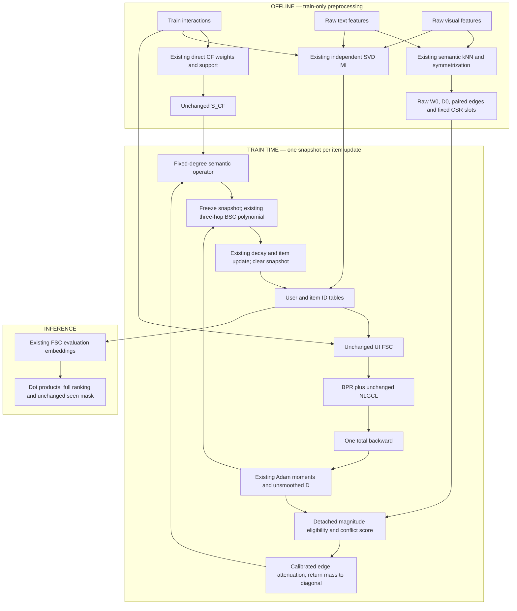

# STAIR5-v7 — Final Architecture Research Report

**Canonical specification, revised 2026-10-07.**

**Primary design:** **UCR-D — Update-Compatible Retention with Dose Control** on the existing semantic branch of optimizer-side BSC.

**Verdict on the DOCX's monolithic HybNCER-MAG:** **REDESIGN.** Use a decoupled research framework. UCR-D is the primary candidate; intermediate-hub-penalized structural retention is a separately tested alternative; repaired MAG and spectral correction are challengers, not mandatory components.

**Status:** research design ready for implementation and diagnostic testing, **not validated v7 performance**. Neither a 3–7% ranking gain nor a total GPU footprint below 800 MiB has been demonstrated. The strict memory requirement is currently unmet by the inherited Electronics telemetry and must become an execution gate.

## 1. SOTA Literature Deep Dive and Evidence Reconstruction

### 1.1 Scope, material recovery and evidence labels

This report applies `academic-research-suite` **deep-research** and **academic-paper-reviewer, methodology-focus**. It integrates the supplied English critique without treating its conclusions as authority. The review is formative, **NOT_CALIBRATED**, with `criteria_binding_unavailable`: no exact conference/track evaluation criteria were supplied. Separate methodology and editorial reviewer executions produced source-anchored objections before synthesis; both used the same model family. This is assisted review, not independent human peer review or an acceptance forecast.

The complete `STAIR5_v7.docx` was read: 149 nonempty paragraphs and **62 equation images**, with no native OMML equation objects. A text-only DOCX extraction would omit its mathematical content. Relevant formulas are recovered below as editable LaTeX; the original DOCX is preserved as the superseded draft. Source SHA-256: `598d2f2a8018198aedfbf8385bebe5420a5f9f252b394cfbb9a0454161d3957e`.

The complete new v6 experimental report, per-dataset manifests, selected metrics and telemetry were reconciled with the actual v4/v6 graph, objective, smoother and AdamWSEvo implementation. Earlier v4/v5.1/v5.2 findings and the prior `EStair.md` critique supply the research trajectory. Audit extracts and reviewer cards are in `scratch/g5v7_review/`; they are supporting artifacts, not replacement specifications. Manuscripts and attachments were treated as evidence, not operational instructions.

Use the following labels throughout:

- **[FACT]**: a directly verified source or implementation property.
- **[OBSERVATION]**: a measured local-run result, with its scope.
- **[INTERPRETATION]**: an explanation consistent with evidence, not identified causally.
- **[HYPOTHESIS]**: a prospective claim to test.
- **[SPECULATION]**: a plausible but insufficiently supported explanation.

Mathematical statements are separately labelled **PROPOSITION**, **DERIVATION** or **EMPIRICAL HYPOTHESIS**. Mathematical validity of an operator is not evidence of ranking superiority.

### 1.2 Research history and what actually failed

```text
Original STAIR: MI + FSC + optimizer-side item BSC + BPR
    ↓
STAIR5-v4: retained STAIR + NLGCL + direct CF support (NLGCL-CSE)
    ↓
v5.1 KPE: positive-aware objective adjustment; no established gain over v4
    ↓
v5.2 BPE: budgeted higher-order support; small local regressions
    ↓
v6 BCSR: degree-preserving semantic retention; tiny attenuation, near parity
    ↓
Original v7 draft: structural CF reweighting + raw-BPR gradient EMA gate
    ↓
Final v7: isolate a dose-controlled actual-update retention hypothesis
```

**[FACT]** V4 is the strongest supplied direct control; that does not mean global SOTA. BSC means **Backward Stepwise Convolution**. BPE means **Budgeted Path Expansion**. BCSR means **Behavior-Conditioned Semantic Retention**. These names must not be interchanged.

**[OBSERVATION]** The supplied v5.2 experiments show approximately −0.39% to −0.87% differences on reported comparisons. They motivate avoiding another support expansion as the primary intervention. They do not prove that every two-hop path is harmful or that semantic dilution uniquely caused the differences.

**[OBSERVATION]** V5.1 did not establish improvement over v4 in those experiments. Calling objective changes universally “second order” and graph changes universally “first order” is unsupported. Their order depends on perturbation size and derivatives; no such universal theorem follows from this history.

The v6 seed-1 checkpoints, selected by validation NDCG@20, have these full-ranking test results:

| Dataset | Selected epoch | Recall@10 | Recall@20 | NDCG@10 | NDCG@20 |
|---|---:|---:|---:|---:|---:|
| Baby | 480 | 0.06770717 | 0.10559546 | 0.03640461 | 0.04611761 |
| Sports | 485 | 0.07649994 | 0.11425202 | 0.04194076 | 0.05166391 |
| Electronics | 440 | 0.04584190 | 0.06812519 | 0.02590056 | 0.03167616 |

The corresponding supplied v4 summaries are rounded:

| Dataset | V4 R@10 | V4 R@20 | V4 N@10 | V4 N@20 |
|---|---:|---:|---:|---:|
| Baby | 0.0678 | 0.1056 | 0.0364 | 0.0461 |
| Sports | 0.0765 | 0.1143 | 0.0419 | 0.0517 |
| Electronics | 0.0458 | 0.0678 | 0.0260 | 0.0316 |

**[OBSERVATION]** Electronics has a small positive Recall@20 difference and approximately +0.24% NDCG@20 against the rounded v4 summary, while NDCG@10 is lower. Do not call this improvement on all metrics, statistically established parity, or a new SOTA result. Exact paired v4 outputs and multiple seeds are needed to distinguish these small effects.

Historical artifact root: `logs/GD5/stair5_v6_complete_artifacts/stair5_v6/20261006_154158_efb239/`. The aggregate manifest and each `selected_test_metrics.json`, `manifest.json`, and `training_telemetry.jsonl` are the evidence sources. Recorded source commit: `ff73c42`.

### 1.3 The v6 dosage finding: correct accounting

| Dataset | Mean expected overlap e | Mean shrinkage r | Conditional mean attenuation a, given a>0 | Raw off-diagonal mass moved to diagonal |
|---|---:|---:|---:|---:|
| Baby | 0.01862042 | 0.00356305 | 0.00059296 | 33.12187939 |
| Sports | 0.00549485 | 0.00106823 | 0.00018155 | 26.66184042 |
| Electronics | 0.00434729 | 0.00078616 | 0.00009866 | 51.50281109 |

**[FACT]** `mean_effective_a` is an **unweighted conditional mean over nonzero attenuation**, not the fraction of total graph weight removed. Its percentages are approximately 0.059296%, 0.018155% and 0.009866%, respectively. The draft's “0.02%–0.06% graph mass” both mislabels the quantity and omits Electronics.

**[FACT]** All moved weight was returned to the diagonal. Total raw graph mass was preserved. The exact weighted exchange fraction requires a denominator `sum_offdiag(W0)`, which was not explicitly logged as that historical statistic. Never infer it from conditional means or affected edge counts.

**[FACT]** At the recorded commit and in current code, the v6 null denominator is `M=n_users`: Baby 19,445, Sports 35,598, Electronics 192,403. It is not the number of training interaction rows. The experimental report's description of M is inaccurate; **no corresponding implementation denominator bug is established**. The exchangeable-user null remains a heuristic rather than an exposure model.

**[INTERPRETATION]** Small attenuation makes a small effective intervention plausible. It does not identify small dose as the cause of near parity. The missing measurements are normalized operator change, actual BSC direction change, and utility versus dose-matched controls.

### 1.4 Post-mortem hypotheses and discriminating tests

| Suspected mechanism | Evidence and mechanism | Confidence | Alternative explanation | Discriminating test |
|---|---|---|---|---|
| Insufficient effective v6 dose | Small logged attenuation; a weak change may leave updates effectively unchanged | High for small attenuation; medium for explanation | Chosen edges may already be useful; even a large intervention may hurt | Sweep static retention dose; measure operator and smoothed-direction change; compare matched random/uniform controls |
| Noisy v5.2 higher-order connectivity | Expanded support and local regression; indirect paths can connect complementary or unrelated preferences | Medium | Different normalization, hyperparameter mismatch, seed noise | Same edge budget, direct-only vs 2-hop, degree/similarity-matched controls |
| Double counting existing propagation | FSC/BSC already contain multi-hop powers; adding an indirect edge changes path multiplicities | Plausible, not directly measured | New paths could supply genuinely missing relations | Count original-path overlap and compare at matched operator norm/dose |
| Popularity amplification | Co-occurrence and common-neighbor opportunities increase with degree | Low as a diagnosed cause here | High-degree edges can be informative rather than biased | Degree-stratified suppression, recommendation popularity, head/tail ranking |
| Over-smoothing/over-propagation | Additional paths can increase mixing, but no local collapse measurement proves this | Low | Underfitting or weak semantic features produces similar ranking | Effective rank, pairwise cosine, Dirichlet energy and update differences over epochs |
| Direction incompatibility on semantic edges | Semantic similarity need not imply compatible optimizer updates; direction profiles are absent | **Hypothesis, low empirical support so far** | Opposite directions may be corrective/useful | Ten-epoch actual-Adam-direction pilot and matched placement controls |
| Spectral mismatch | Operators differ across variants, but no measured harmful filter/spectrum mismatch | Low | Spectrum shifts without adverse task effect | Compare empirical spectrum/filter responses; independent affine/filter arm |
| Optimization/configuration mismatch | No demonstrated moment or denominator failure in inspected v6 code | Low | Precision, convergence speed or dose scheduling matters | Exact v4 recovery, checkpoint/resume, matched optimization telemetry |
| Insufficient controls/randomness | Comparisons are mainly seed 1 and rounded historic control summaries | High | Real small effects may still exist | Fresh paired control runs, raw metrics, multiple seeds and confidence intervals |

Reusable lesson: measure **where, how much, and with what direction** an intervention acts before inferring why its metrics changed.

### 1.5 Verified literature and transfer boundaries

This is a targeted primary-source review, not an exhaustive systematic review. Searches and checks were completed on 2026-10-07, focusing on 2022–2026 and necessary optimization foundations. Exact source identity is separated from full-method access. Percentage gains from different papers/splits are not forecasts for this codebase.

| Work, exact identity | Verified source/status | Mechanism relevant to v7; transfer boundary |
|---|---|---|
| **STAIR: Manipulating Collaborative and Multimodal Information for E-Commerce Recommendation** — Cong Xu, Yunhang He, Jun Wang, Wei Zhang; AAAI 2025 | [Publisher](https://ojs.aaai.org/index.php/AAAI/article/view/33407), DOI 10.1609/aaai.v39i12.33407 | MI, FSC and constrained item updates; retain the optimizer-side locus |
| **A Tale of Two Graphs: Freezing and Denoising Graph Structures for Multimodal Recommendation** — Xin Zhou, Zhiqi Shen; ACM MM 2023, initially arXiv 2022 | [Full paper](https://arxiv.org/html/2211.06924v3), DOI 10.1145/3581783.3611943 | FREEDOM freezes item graphs and uses degree-sensitive UI pruning; neither dynamic topology nor denoising is automatically better |
| **MURAL: Multimodal Uncertainty-aware Recommendation via Adaptive edge Learning** — Ahmad Mousavi, Majid Alikhani, Yeon-Chang Lee, Roberto Corizzo, Yeganeh Abdollahinejad; September 2026 preprint | [Full paper](https://arxiv.org/html/2609.04574v1), arXiv:2609.04574; publication venue unverified | Behavioral alignment, ANN candidate refresh, learned edge scoring and uncertainty-aware fusion; forward topology learning, not BSC-direction retention |
| **Adaptive Graph Reweighting for Collaborative Filtering** — Yijun Sheng, Ximing Chen, Pui Ieng Lei, Yanyan Liu, Zhiguo Gong; WWW 2026 | [Official ACM SIGWEB abstract](https://www.sigweb.sigweb.hosting.acm.org/toc/www26a.html), [DOI](https://doi.org/10.1145/3774904.3792081) | Graph Booster uses spectral embeddings, monotonic weighting and connectivity regularization; full mathematics/code not retrieved |
| **Collaborative Filtering Meets Spectrum Shift: Connecting User-Item Interaction with Graph-Structured Side Information** — Yunhang He, Cong Xu, Jun Wang, Wei Zhang; KDD 2025 | [Full paper](https://arxiv.org/html/2502.08071v2), arXiv:2502.08071 | SSC restores filter coordinates after augmenting a forward bipartite graph; not automatically required for an already blended item BSC |
| **One Graph, Multiple Gains: Single High-Quality Item-Item Graph for Multimodal Recommendation** — Jinfeng Xu, Zheyu Chen, Ziyue Peng, Shuo Yang, Jinze Li, Zewei Liu, Shujie Li, Yipeng Du, Edith C. H. Ngai; 2026 | [Author record](https://arxiv.org/abs/2607.24607), arXiv:2607.24607; author record states ACM MM 2026 acceptance | IIMRec uses Neighborhood Consistency Edge Reweighting, residual gates and additional graph/objective uses; common-neighbor reweighting is prior art |
| **ASPIRE: Make Spectral Graph Collaborative Filtering Great Again via Adaptive Filter Learning** — Yunhang He, Cong Xu, Zhangchi Zhu, Hongzhi Yin, Wei Zhang; April 2026 preprint | [Full paper](https://arxiv.org/html/2604.22549v1), arXiv:2604.22549; published venue unverified | Polynomial filters and approximate bilevel coefficient learning; not NeurIPS 2024 and not a dynamic-Adam convergence theorem |
| **Gradient Surgery for Multi-Task Learning** — Tianhe Yu, Saurabh Kumar, Abhishek Gupta, Sergey Levine, Karol Hausman, Chelsea Finn; NeurIPS 2020 | [Official paper](https://proceedings.neurips.cc/paper/2020/file/3fe78a8acf5fda99de95303940a2420c-Paper.pdf), [supplement](https://proceedings.neurips.cc/paper/2020/file/3fe78a8acf5fda99de95303940a2420c-Supplemental.pdf) | PCGrad projects conflicting task gradients; item-row compatibility is a different object |
| **GradNorm: Gradient Normalization for Adaptive Loss Balancing in Deep Multitask Networks** — Zhao Chen, Vijay Badrinarayanan, Chen-Yu Lee, Andrew Rabinovich; ICML 2018 | [PMLR publisher](https://proceedings.mlr.press/v80/chen18a.html), [full paper](https://proceedings.mlr.press/v80/chen18a/chen18a.pdf) | Task magnitude/training-rate balancing; does not project item directions |

#### Dynamic topology and denoising

FREEDOM's degree-sensitive sampling favors retention of lower-degree UI edges through inverse endpoint-degree weights. Its frozen item graph is a particularly relevant simplicity control. Its graph types and forward propagation differ from optimizer-side semantic retention; its results do not certify removal of exposure bias. [FREEDOM full method](https://arxiv.org/html/2211.06924v3).

MURAL's full method uses behavior-aligned representations for ANN retrieval, periodic candidate refresh, learned edge scores and per-modality uncertainty. These motivate task-conditioned graph diagnostics but bring learned parameters, retrieval refresh and forward-graph changes. Hard top-k retrieval is not globally differentiable, and the stated approximate-search scaling is not a universal worst-case guarantee. Its reported datasets/protocol differ from the local three-dataset comparator. [MURAL method](https://arxiv.org/html/2609.04574v1).

Graph Booster's authoritative abstract supports its spectral-bottleneck, monotonic-network and connectivity-regularizer description. The full paper was inaccessible; its exact Laplacian, theorem assumptions, fixed-support policy and resource cost are **UNVERIFIED FROM FULL TEXT**. Do not fill that gap with invented equations. A Fiedler/common-neighbor equivalence is not established. [Official proceedings abstract](https://www.sigweb.sigweb.hosting.acm.org/toc/www26a.html).

**DERIVATION, not a Graph Booster attribution:** for a connected graph with a simple second eigenvalue of the unnormalized Laplacian and unit Fiedler vector f, locally

\[
\frac{\partial\lambda_2}{\partial w_{ij}}=(f_i-f_j)^2.
\]

This global sensitivity is not endpoint Ochiai or local triangle count. Fixed-support positive reweighting cannot connect disconnected components. Larger connectivity can mean stronger mixing, but it is not a universal theorem of better ranking. No Fiedler module enters primary v7 without a measured bottleneck.

#### Optimization compatibility: UCR versus MAG versus task balancing

PCGrad uses shared-parameter task gradients g_p and projects a conflicting direction:

\[
g_p\leftarrow g_p-\frac{g_p^\top g_q}{\|g_q\|_2^2}g_q,
\quad g_p^\top g_q<0.
\]

Its conditional gradient-descent and heavy-ball analyses do not prove convergence of STAIR's Adam-plus-BSC composition. Endpoint item rows of one update field are not separate task gradients. Copying PCGrad per item would require defining item objectives and additional gradients. [PCGrad paper and proof](https://proceedings.neurips.cc/paper/2020/file/3fe78a8acf5fda99de95303940a2420c-Supplemental.pdf).

GradNorm adapts task weights using gradient magnitudes and relative loss rates. Positive task weights do not directly remove negative cosine relationships. It addresses task imbalance, not whether a semantic edge should exchange two item directions. Its empirical success is not a generic convergence theorem. [GradNorm full method](https://proceedings.mlr.press/v80/chen18a/chen18a.pdf).

UCR-D is a **local heuristic applied to the actual preconditioned total-objective direction**, not PCGrad, GradNorm or a causal edge-utility estimator. Its advantage over MAG is a clearer update locus, no extra backward pass, no EMA state, and a directly measurable retention budget. Its disadvantage is potentially noisy/current-history-dependent compatibility.

#### Spectral shift: what SSC actually corrects

SSC studies adding side-information blocks to the forward UI adjacency. The minimum eigenvalue can move right from the bipartite extreme −1 while the upper extreme remains 1. Given a valid spectral interval [l,u], its coordinate restoration has the form

\[
\mu=(l+u)/2,\quad \Delta=(u-l)/2,\quad
\phi(S)=\frac{S-\mu I}{\Delta}.
\]

It generally stretches the interval rather than applying a positive lazy shift. It does not show that every item-graph mixture needs this operation. [SSC full method](https://arxiv.org/html/2502.08071v2).

**Decision:** measure spectrum/filter mismatch, then test a separate correction arm if warranted. Neither the operator norm proof nor v6 parity requires SSC. ASPIRE likewise supplies a distinct filter-learning hypothesis, with validation-data use and tuning costs requiring separate controls; it is not a drop-in proof for UCR-D. [ASPIRE full paper](https://arxiv.org/html/2604.22549v1).

### 1.6 Remaining research gap

**[HYPOTHESIS]** A subset of existing semantic BSC exchanges combines item update directions that are locally incompatible; retaining that exchange mass at its endpoints may preserve useful item-specific corrections without adding more neighbors.

This gap is narrower than “semantic similarity is not preference similarity.” It is specifically about **optimizer-side exchange of the actual applied direction** in a fixed MI/FSC/NLGCL/BPR pipeline. It is not yet observed directly. The ten-epoch pilot is therefore a hypothesis test, not merely an installation check.

Independent modality whitening and coordinate-wise FSC/BSC remain legitimate theoretical concerns from `EStair.md`. The current history does not identify them as the cause of the observed plateau. Adding an MLP does not solve basis dependence. Cross-modal alignment, CCA/Procrustes and invariant filtering would change a different hypothesis and are excluded from primary v7.

## 2. Adjudication and Methodological Verdict

### 2.1 Recovery and correction of the original HybNCER-MAG equations

The important DOCX formulas were:

\[
s^{\mathrm{struct}}_{ij}
=\frac{|N(i)\cap N(j)|}{\sqrt{d_i d_j}+\varepsilon},
\qquad W^{\mathrm{offline}}=S_{CF}\odot S^{\mathrm{struct}},
\]

\[
g_i=\nabla_{e_i}\mathcal L_{BPR},\qquad
\mu_i^{(t)}=\gamma\mu_i^{(t-1)}
+(1-\gamma)\frac{g_i^{(t)}}{\|g_i^{(t)}\|+\varepsilon},
\]

\[
u_{ij}^{(t)}=\frac{1+\mu_i^{(t)\top}\mu_j^{(t)}}2,
\quad c_{ij}^{(t)}=\delta+(1-\delta)
\sigma\!\left(\frac{u_{ij}^{(t)}-0.5}{\tau_e}\right),
\]

\[
W_7^{(t)}=W^{\mathrm{offline}}\odot C^{(t)},\quad
S_7^{(t)}=(1-\eta)S_0+
\eta D_t^{-1/2}W_7^{(t)}D_t^{-1/2}.
\]

These define a CF-branch intervention, different from v6's semantic retention. N(i), degrees, raw/normalized CF, gradient table and update clock were ambiguous. The final primary design below deliberately changes the intervention locus to the existing semantic branch and declares that change.

### 2.2 Disposition of every supplied critique

| Critique | Adjudication and repair |
|---|---|
| 2.1: endpoint normalization is Ochiai-like | Correct when N(i) is a binary neighborhood and d its cardinality. It is familiar, not component novelty. If N means train users, much of the score repeats v4's CF overlap evidence; if it means CF item neighbors, it tests a different triadic hypothesis. Define which one. |
| 2.1: hub effects require intermediate-degree penalties | A useful challenger, not a universal remedy. Even binary Ochiai does not eliminate popularity effects. Use a bounded energy-normalized weighted Gram score, specified in §3.7; it penalizes bridge hubs but does not remove exposure confounding. |
| 2.2(a): zero normalization creates noise explosion | Exact zero divided by norm+epsilon is zero. Small nonzero noise can be magnified by direction normalization; that is a reliability problem, not automatic floating-point divergence. Eligibility and finite-value checks are required. |
| 2.2(b): EMA cold start | Valid specification gap. A norm-bounded EMA is not unit length. The written u is an EMA dot product, not cosine. Primary UCR removes EMA; repaired MAG must specify eligibility, initialization and checkpoint state. |
| 2.2(c): gamma=0 warmup shock | A discontinuity is possible, not empirically established. Use continuous dose ramp; do not abruptly switch EMA semantics. Primary has no gamma_EMA. |
| 2.2(d): dynamic range collapse | Real concern; a neutral MAG state gives u=.5 and c=.55 for delta=.1. More importantly, a constant positive multiplier disappears after fresh degree normalization. Gate variance alone is not an effective-dose diagnostic. |
| 2.3: norm bound does not bound Adam | Correct about scope. A separate conditional moment bound is available in §3.9, but it does not prove training convergence or prevent arithmetic overflow. |
| 2.3: time variation invalidates Neumann convergence | Overstated. A frozen per-step snapshot has an ordinary finite polynomial and a pointwise convergent Neumann series for b<1. Across-step variation does not invalidate that fact. It does leave optimizer convergence unresolved. |
| 3: missing MURAL/Graph Booster/SSC comparison | Incorporated with source-access limits. Their mechanisms do not mandate a larger architecture or transfer their reported gains. |
| 4: replace MAG with UCR | Adopt as the **primary candidate**, because it targets the actual BSC input with less state. Superiority remains to be tested against repaired MAG/static controls. |
| 4: mandatory affine SSC | Reject as mandatory. A safe positive affine shift is generally lazy filtering, not SSC's interval restoration. Default is identity; correction is an independent conditional arm. |
| 5: ten-epoch diagnostic pilot | Adopt. Include eligibility, effective exchange, operator/update change, matched placement controls, memory and timing, not only a histogram/variance threshold. |

**DERIVATION — normalization cancellation.** For any positive constant c and nonnegative symmetric W,

\[
D_{cW}=cD_W,\quad
D_{cW}^{-1/2}(cW)D_{cW}^{-1/2}=D_W^{-1/2}WD_W^{-1/2}.
\]

Thus a constant `.55` MAG gate can yield exactly the old normalized CF operator on positive-degree components. A wide sigmoid or a nonzero gate mean does not resolve the dosage paradox.

**DERIVATION — the EMA identity error.** With zero initialization and normalized incoming directions, \(\|\mu_i\|\le1\), but generally \(\|\mu_i\|\ne1\). Aligned vectors of norm .1 yield u=.505 rather than 1. The draft combines angular agreement with temporal coherence, which is a different mechanism.

**DERIVATION — popularity is not cancelled.** Under independent uniform user subsets of sizes n_i,n_j among M users, \(\mathbb E[c_{ij}]=n_i n_j/M\), so expected Ochiai is \(\sqrt{n_i n_j}/M\). Endpoint normalization still depends on degree even in binary data. Neither the draft nor the critique's binary exception supports complete debiasing.

### 2.3 Candidate adjudication

| Candidate | Scientific hypothesis | Upside and cost | Main falsifier | Decision |
|---|---|---|---|---|
| Monolithic HybNCER-MAG | Structural denoising and EMA agreement jointly improve CF | Confounded locus, repeated overlap, extra state, unclear effective dose | Static or matched placebo reproduces its gain | Reject as primary |
| **UCR-D semantic retention** | Some semantic exchanges conflict with actual update directions | One optimizer-side intervention; no new parameters/support/backward | Conflict placement gives no advantage over equal-dose uniform/shuffled retention | **Primary v7** |
| IHP-NCER CF retention | Common neighbors through low-degree bridges identify reliable direct CF exchange | Offline only, bounded Gram score; may suppress useful complements | Degree-matched placebo or exponent retuning matches it | Backup / isolated arm |
| Repaired MAG retention | Persistent direction agreement is more informative than current-step agreement | EMA state and staleness; potentially lower noise | No gain over current UCR or static frozen gate | Optional challenger after pilot |
| Spectral correction/filter adaptation | Existing BSC filter coordinates are task-misaligned | Different hypothesis and tuning; may duplicate retention's spectrum effect | Identity/lazy control performs equally | Conditional separate experiment |

The selected primary has the clearest implementation and ablation boundary, not a measured highest probability of a 3–7% gain. The structural candidate has no dynamic reliability evidence either. Their combination is allowed **only after individually useful effects are demonstrated**, with an explicit interaction test.

### 2.4 Core hypothesis and final scope

> **EMPIRICAL HYPOTHESIS:** In STAIR5-v4, incompatible exchange of existing semantic item-update directions, rather than insufficient graph support, is a remaining bottleneck; reallocating a controlled amount of this exchange to endpoint self-retention can improve ranking.

Every new primary operation exists to test this statement. Preserve MI, raw modality preprocessing, FSC, direct CF construction, BPR, NLGCL, user optimizer, item Adam moment calculation, inference and evaluation. Add no projection MLP, new contrastive objective, spectral bands, Fiedler regularizer or learned gate in primary v7.

## 3. Redesigned STAIR5-v7 Architecture Specification

### 3.1 Notation and exact baseline contract

| Symbol | Meaning |
|---|---|
| M,N,d | Indexed users, indexed items, embedding dimension; d=64 |
| R | Binary train-only interaction incidence, M×N, used for behavioral statistics |
| F_t,F_v | Frozen textual/visual features, N×p_t and N×p_v |
| U,V | Trainable raw ID embedding tables, M×d and N×d |
| T_UI | Existing baseline-normalized UI adjacency for FSC; preserve its dataset/duplicate handling |
| W0,D0,S0 | Raw symmetric semantic adjacency, its weighted degree diagonal, and normalized operator |
| W_CF,D_CF,S_CF | Existing raw direct-CF adjacency, degrees and normalized operator |
| eta | Fixed v4 branch mixture, .1 |
| G,m,v,D | Item total gradient, Adam first/second moments, and **unsmoothed preconditioned direction**; D is a direction tensor, not a degree matrix |
| a,A,h,W_R,S_R | Attenuation fractions, moved edge mass, returned row mass, retained raw graph and its normalized operator |
| rho,theta_max,Z | Target exchange fraction, per-edge attenuation cap and weighted conflict statistic |
| b_j,L | Coordinate BSC coefficient and polynomial depth; L=3 |

Use the existing v4 factories, not a visually similar reimplementation. In particular:

1. MI independently centers/whitens modalities using the existing SVD convention; initializes item embeddings using the existing 5:1 text/vision combination, and initializes users using the baseline interaction operator. Coordinate alignment between independently whitened modalities is **not proved** by this operation.
2. Semantic support is built from **raw modality** cosine top-k: text k=5, vision k=1. Existing coalescing/count weighting and maximum symmetrization are preserved. W0 is not a newly fused whitened-feature kNN graph.
3. Behavioral statistics deduplicate train pairs. Let \(n_i=\sum_u R_{ui}\), \(c_{ij}=\sum_u R_{ui}R_{uj}\). Existing direct CF weights are

\[
w_{ij}^{CF}=\frac{c_{ij}}{c_{ij}+5}
\frac{c_{ij}}{\sqrt{n_i n_j}},\quad c_{ij}\ge2,
\]

followed by deterministic row top-5 and maximum-union symmetrization. Preserve the existing isolate identity convention. No dense N×N product, new indirect support or held-out interactions are permitted.
4. The v4 BSC operator is \(S_4=.9S_0+.1S_{CF}\). User embeddings use AdamWSEvo with no smoother. Item moments are computed from **total** BPR+.01 NLGCL gradient; BSC operates after Adam preconditioning. Decoupled weight decay retains the baseline order and values.

### 3.2 Data flow



There is no gradient through graph construction. Offline buffers are static detached data. Dynamic values are detached transient snapshots, not cached autograd graphs. Inference does not compute UCR or an EMA gate.

### 3.3 Actual-update compatibility

For the item table at optimizer step t:

\[
G_t=\nabla_V(\mathcal L_{BPR}+.01\mathcal L_{NLGCL}),
\quad m_t=\beta_1m_{t-1}+(1-\beta_1)G_t,
\quad v_t=\beta_2v_{t-1}+(1-\beta_2)G_t^{\odot2},
\]

\[
D_t=\frac{m_t/(1-\beta_1^t)}
{\sqrt{v_t/(1-\beta_2^t)}+\epsilon_{Adam}}.
\]

D has shape N×d and is the tensor that existing item BSC would smooth. Read it by detached alias. No BPR-only `autograd.grad`, no second backward, no full direction clone, no gradient-to-parameter gate training.

Define row magnitude \(r_i=\|D_{t,i:}\|_2\), using float32 safe accumulation. All D must be finite; nonfinite values are a numerical failure, not an abstention signal. Let

\[
\tau_{mag}=\max(10^{-12},\zeta\operatorname{median}_{r_i>0}r_i),
\quad \zeta=.01\text{ initially}.
\]

If no positive norms exist, use the unchanged control. Pair (i,j) is eligible only if both norms are at least \(\tau_{mag}\). For eligible unordered off-diagonal semantic edges:

\[
v_{ij}^{(t)}=\operatorname{clip}
\left(\frac{D_{t,i:}^{\top}D_{t,j:}}{r_i r_j},-1,1\right),
\quad q_{ij}^{(t)}=\max(0,-v_{ij}^{(t)}).
\]

For ineligible edges, q=0. Score each unordered pair once and mirror it. D itself is not normalized or altered. A safe implementation divides endpoints by their eligible row norms in bounded chunks before the dot product, rather than forming a tiny denominator for ineligible rows.

**Interpretation:** q measures opposition of actual update directions. It does not measure causal edge utility, uncertainty, exposure correction or compatibility of all user preferences. Magnitude thresholding is a heuristic noise guard; it is not a statistical reliability certificate. Dense FSC/CL backpropagation means unbatched item IDs need not have zero gradients, and Adam directions may persist from earlier steps.

### 3.4 Dose-controlled retention and the dynamic operator

Let H be the total raw off-diagonal semantic weight:

\[
H=\sum_{i\ne j}W_{0,ij},\qquad
Z_t=H^{-1}\sum_{i\ne j}W_{0,ij}q_{ij}^{(t)}.
\]

Use the same directed or unordered convention in numerator and denominator. With the primary per-edge cap \(\theta_{max}=.25\), define

\[
\theta_t=
\begin{cases}
0,&H=0\text{ or }Z_t=0,\\
\min(\theta_{max},\rho_t/Z_t),&\text{otherwise},
\end{cases}
\quad a_{ij}^{(t)}=\theta_t q_{ij}^{(t)},
\quad C_{ij}^{(t)}=1-a_{ij}^{(t)}.
\]

Initial target \(\rho=.01\) is a **pilot choice**, not an empirically validated optimum. For numerical safety, first compare \(\theta_{max}Z_t\) with \(\rho_t\): use the cap in the infeasible branch and evaluate \(\rho_t/Z_t\) only in the feasible branch. Do not construct an enormous quotient and then clamp it.

Move suppressed exchange to each endpoint's self-retention:

\[
A_t=W_0\odot a_t,\quad h_t=A_t\mathbf1,
\quad W_R^{(t)}=W_0-A_t+\operatorname{diag}(h_t).
\]

The **actual exchange fraction** is

\[
\rho_{eff,t}=\frac{\sum_{i\ne j}A_{t,ij}}H
=\theta_t Z_t=\min(\rho_t,\theta_{max}Z_t).
\]

This is raw exchange reallocated, not mass lost and not ranking gain. Unlike multiplying every edge by a constant and renormalizing, uniform nonzero retention changes off-diagonal exchange and adds self-retention at fixed degree.

With original degree D0 preserved:

\[
S_R^{(t)}=D_0^{-1/2}W_R^{(t)}D_0^{-1/2},\qquad
\boxed{S_7^{(t)}=.9S_R^{(t)}+.1S_{CF}}.
\]

For zero semantic degree, preserve the existing v4 convention; its isolated block is untouched. Configuring rho=0 must take an **exact baseline fast path** with the existing S4 buffer/call, before extending the CSR pattern, rather than rebuilding an approximately equal graph. If an active run has Z=0 on a particular step, use its immutable base values on the extended pattern: this is the same mathematical S4 operator, but any bitwise difference caused by sparse-format arithmetic must be measured against the no-op floor. Do not silently promise identical sparse-kernel arithmetic across different patterns.

**Nonzero dynamic range cannot be guaranteed honestly.** If all directions agree, q=0 and rho_eff=0. If q is constant, its variance is zero although nonzero uniform retention can still change the operator. Do not force a sigmoid temperature to manufacture variance. Measure feasibility, placement and operator/update effects; fall back to v4 when the hypothesis has no usable signal.

### 3.5 Ramp, snapshot lifecycle and objective

Use continuous budget warmup:

\[
\rho_t=\rho\min(1,(e_t+p_t)/10),
\]

where e_t is completed epochs, p_t is fractional progress within the current epoch. This reaches full target at the end of epoch 10. It avoids a gamma switch; it does not prove optimization stability. Log both target and achieved dose. Start with no EMA and refresh every item optimizer step.

The existing BSC coefficient is

\[
b_j=.1+.9(j/d)^{\gamma_{FSC}},\quad j=0,\ldots,d-1,
\]

with dataset gamma values .1/.2/.4. Preserve actual code indexing. For each item direction column:

\[
\widetilde D_{t,:j}=P_j(S_7^{(t)})D_{t,:j},\quad
P_j(S)=\frac{1-b_j}{1-b_j^{L+1}}
\sum_{\ell=0}^{L}b_j^\ell S^\ell,\quad L=3.
\]

Apply the existing AdamWSEvo weight decay and learning-rate update in their baseline order. Do not smooth raw gradients before moments. Do not read already-updated embeddings to build the gate. It depends solely on the current moment-derived D and static graph; an earlier user-group step cannot change this frozen item signal. No group must recompute gradients after another group steps.

Required callback contract:

```text
total loss.backward()
existing optimizer computes item Adam moments and D
item smoother receives D (detached view)
  build one snapshot from this D
  hold its values fixed for all L sparse products
  return smoothed D
existing item update uses smoothed D
finally: clear_step_snapshot(), including exception paths
```

The smoother owns no trainable parameters or moment state. Step-local values have no `grad_fn`. `prepare()` caches static support, degrees, slots and baseline operators only. No five-/ten-epoch gate cache is used in the primary.

FSC remains the baseline coordinate-weighted UI polynomial, producing evaluation embeddings \(\bar U,\bar V\). The loss and score remain

\[
\mathcal L=\mathcal L_{BPR}+.01\mathcal L_{NLGCL},\qquad
\widehat y_{ui}=\bar U_u^\top\bar V_i.
\]

Keep original negative sampling, NLGCL temperature .2, directional mixture .5, G=1 layer views, single-positive CE and duplicate multiplicity. Any positive-aware objective experiment is separately named; it cannot be hidden inside v7. Weight decay remains optimizer-side, not a newly added loss.

### 3.6 Why this might improve ranking — and why it might not

**EMPIRICAL HYPOTHESIS, causal chain to test:** semantic neighbors occasionally have opposed actual update directions → BSC mixes away item-specific corrections → UCR reduces that particular exchange and returns its weight to self-retention → the final update differs in a placement-specific way → held-out positive-negative margins improve → Recall/NDCG may improve.

This chain is not established by cosine alone. For a probe margin m_ui,k and small update perturbation, its first-order change contains

\[
\Delta m_{ui,k}\approx
-lr\,\nabla_Vm_{ui,k}^{\top}
\left[P(S_7)-P(S_4)\right]D,
\]

holding other contributions fixed. Endpoint direction opposition does not guarantee the favorable sign of this quantity. Measure actual one-step probe changes and final ranking; reject UCR's compatibility claim if uniform/shuffled retention works equally well.

V4 cannot make this placement-dependent decision: its semantic operator is static. V6's behavioral opportunity signal is different and produced small attenuation. V5.2 changes support; UCR changes no off-diagonal support and adds no extra hop. These differences make the test cleaner, not its success guaranteed.

### 3.7 Backup: intermediate-hub-penalized structural CF retention

**IHP-NCER is an isolated alternative**, not part of default UCR-D. Use raw, symmetric W_CF before normalization and before isolate identity. Let \(d_k^{CF}=\sum_l W_{CF,kl}\). Define

\[
X_{ik}=\begin{cases}W_{CF,ik}/\sqrt{d_k^{CF}},&d_k^{CF}>0,\\0,&\text{otherwise},\end{cases}
\quad K=XX^\top,
\]

\[
K_{ij}=\sum_{k\in N_{CF}(i)\cap N_{CF}(j)}
\frac{W_{CF,ik}W_{CF,jk}}{d_k^{CF}},
\quad s_{ij}^{struct}=\frac{K_{ij}}{\sqrt{K_{ii}K_{jj}}}.
\]

Set s=0 when either diagonal energy is zero. This includes an explicit intermediate bridge-degree penalty and a **matching energy denominator**, rather than assuming endpoint weighted degrees bound the score. Compute only existing CF candidate edges; do not materialize K or W_CF squared.

**PROPOSITION:** s lies in [0,1]. X is nonnegative, so K_ij≥0; Cauchy–Schwarz gives K_ij²≤K_ii K_jj. Global scaling of W_CF cancels in the ratio. This is a weighted Gram cosine/triadic-consistency proxy, not calibrated semantic evidence, pure behavior, causal reliability or complete popularity correction.

Use q_CF=1−s on existing CF edges and the **same dose calibration/diagonal return construction** as §3.4, with W_CF and D_CF. The alternative operator is

\[
S_{7,struct}=.9S_0+.1S_{CF,R}.
\]

This reduces exchange on structurally unsupported CF edges, but a bridge or complementary pair may have no common neighbors precisely because it is useful. A .25 edge cap avoids hard deletion; placebo and degree-stratified ablations are mandatory. Because the CF mixture is only .1, raw CF dose must not be mislabelled as the total blended-operator dose.

### 3.8 Repaired MAG and spectral correction: separate challengers

**MAG challenger:** only after UCR's diagnostic pilot. Use the same actual D, eligible row directions, zero state, fixed gamma_EMA=.9, and updates on an explicitly defined item-step clock. For inactive rows, retain the previous state but mark current eligibility false; log age. Active rows update their EMA. Only eligible endpoints with EMA norm above a predeclared threshold use normalized EMA cosine; other edges abstain. Checkpoint EMA and update ages. Use q=max(0,−cos_EMA) and the **same retention/dose formula**; do not revert to independently normalized sigmoid CF scaling. The continuous rho ramp replaces an abrupt gamma warmup. Compare current versus EMA direction at equal realized dose and include a frozen-gate control. This repaired algorithm is materially different from the original MAG.

**Bounded affine challenger:**

\[
S_7^{final}=\gamma_{aff}S_7+\lambda_{aff}I,
\quad |\gamma_{aff}|+|\lambda_{aff}|\le1.
\]

Default is \((\gamma_{aff},\lambda_{aff})=(1,0)\). For nonnegative coefficients and \(\gamma_{aff}=1-\lambda_{aff}\), this is **lazy filtering**, not full SSC interval restoration. It can resemble generic self-retention; test V4+affine as well as UCR+affine. Do not bundle it into primary UCR and attribute a joint gain to compatibility.

**True SSC-inspired interval challenger:** given a **certified** spectral enclosure [l,u] for a fixed tested operator,

\[
S_{SSC}=\frac{2S-(u+l)I}{u-l},\quad u>l.
\]

It has norm≤1 if all eigenvalues really lie in [l,u]. A power/Lanczos estimate of the minimum eigenvalue is not automatically a safe lower enclosure. Underestimating the spectral span can violate the bound. Certified conservative bounds may be too wide to offer a useful correction; [−1,1] gives identity. Dynamic UCR requires an enclosure valid for **every** snapshot, not a bound on the starting graph alone. Signed shifts may lose the nonnegative graph interpretation. These restrictions make SSC a secondary fixed-operator study, not a necessary v7 module.

### 3.9 Theoretical guarantees and their limits

#### PROPOSITION 1 — degree, support and operator boundedness

Assume finite symmetric W0≥0, symmetric attenuation 0≤a≤theta_max<1, original degree D0, and the existing zero-degree convention. Then

\[
W_R\mathbf1=W_0\mathbf1-A\mathbf1+\operatorname{diag}(A\mathbf1)\mathbf1
=W_0\mathbf1.
\]

W_R is nonnegative and symmetric. On positive-degree components its random-walk normalization has row sum one, and S_R is similar to that matrix. Since S_R is symmetric, its eigenvalues are real and in [−1,1]; hence \(\|S_R\|_2\le1\). Isolated blocks follow the baseline convention and satisfy the same bound. Existing positive off-diagonal support is preserved because 1−a≥.75 in the primary.

Given \(\|S_{CF}\|_2\le1\),

\[
\|S_7\|_2\le.9\|S_R\|_2+.1\|S_{CF}\|_2\le1.
\]

S_R is generally **not row-stochastic**; its similar random-walk matrix is. A blend of operators with different degree vectors need not have eigenvalue exactly 1. Do not conflate spectral radius, adjacency norm and Laplacian norm.

#### PROPOSITION 2 — affine bound

\[
\|S_7^{final}\|_2\le|\gamma_{aff}|\|S_7\|_2+|\lambda_{aff}|\le1.
\]

This is a sufficient, not necessary, condition. It proves no improvement in filter alignment or recommendation.

#### PROPOSITION 3 — retention is a controlled spectral perturbation

On the positive-degree semantic block,

\[
S_R-S_0=D_0^{-1/2}\left[\operatorname{diag}(A\mathbf1)-A\right]D_0^{-1/2}\succeq0.
\]

The bracket is the Laplacian of moved exchange mass. Since A_ij≤theta_max W0_ij, its quadratic form is bounded by theta_max times the original graph Laplacian. Thus

\[
0\preceq S_R-S_0\preceq\theta_{max}(I-S_0),\quad
\|S_7-S_4\|_2\le1.8\theta_{max}.
\]

This is a conservative bound, not an achieved-dose estimate. Self-retention reduces exchange and changes spectral response; it does **not** preserve the original spectrum. It does not establish elimination of over-smoothing or preservation of all preference information.

#### PROPOSITION 4 — frozen BSC and Neumann convergence

For 0≤b_j<1, the finite BSC polynomial has nonnegative coefficients summing to one. A frozen contraction S therefore gives

\[
\|P_j(S)\|_2\le1,\quad
\|\widetilde D\|_F\le\|D\|_F.
\]

The corresponding infinite series \(\sum_{\ell\ge0}(b_jS)^\ell\) converges in operator norm to \((I-b_jS)^{-1}\); its tail beyond L is at most \(b_j^{L+1}/(1-b_j)\). The implementation uses the **finite normalized** polynomial, not an exact infinite inverse.

Snapshots may change between optimizer steps: the same per-call bound holds uniformly. Even noncommuting within-call products would have geometric bounds if each factor is a contraction, but would no longer be a polynomial/resolvent of a single S. The implementation freezes one snapshot to avoid that ambiguity. These results do not prove convergence of a time-varying AdamW training trajectory.

#### DERIVATION 5 — conditional boundedness of Adam directions

The critique correctly separates operator contraction from its input. A scoped input bound is available under **zero-initialized moments**, finite gradient history, fixed beta values, \(\beta_1^2<\beta_2\), and nonnegative epsilon. For one scalar coordinate, write backward-indexed moment weights

\[
a_k=(1-\beta_1)\beta_1^k,\quad b_k=(1-\beta_2)\beta_2^k.
\]

Cauchy–Schwarz gives

\[
m_t^2\le A_t v_t,\quad
A_t=\frac{(1-\beta_1)^2}{1-\beta_2}
\sum_{k=0}^{t-1}(\beta_1^2/\beta_2)^k,
\]

\[
|D_t|\le\sqrt{A_t}\frac{\sqrt{1-\beta_2^t}}{1-\beta_1^t}
\le C_{Adam},\quad
C_{Adam}=\frac1{1-\beta_1}
\sqrt{\frac{(1-\beta_1)^2}
{(1-\beta_2)(1-\beta_1^2/\beta_2)}}.
\]

For .9/.999 the conservative uniform bound is about **72.70 per coordinate**; hence \(\|D\|_F\le C_{Adam}\sqrt{Nd}\). Epsilon>0 resolves zero moments; if epsilon=0, define zero/zero direction as zero. A consistent checkpoint resume retains the history assumptions; arbitrary loaded moments do not.

This real-arithmetic bound is not measured training behavior, an embedding bound, a learning-rate guarantee, a loss-decrease theorem or protection from overflow in gradient squaring. Finite checks remain mandatory.

#### PROPOSITION 6 — basis scope

If an already supplied D is transformed to DQ for orthogonal Q, row norms and pair cosines are unchanged. The UCR gate and its operator are therefore invariant to this representation of D, and a single scalar row-propagation step commutes with Q.

The full pipeline is **not rotation invariant**: coordinate-wise Adam second moments and coordinate-dependent FSC/BSC coefficients do not generally commute with Q. An MLP or cross-modal alignment would not prove otherwise. Do not claim that UCR solves STAIR's basis dependence.

### 3.10 Engineering specification and minimal code delta

| Module | Inputs / outputs | Trainable / initialization | Computation and gradient path |
|---|---|---|---|
| Static graph adapter | Existing CSR W0/S_CF; unordered pair IDs K×2 int64; mirrored slot map K×2 int64; D0 inverse N float32 | No parameters; reuse v4 graph hashes | CPU candidate/slot construction; GPU immutable CSR indices, baseline values and degrees; no gradients |
| UCR scorer | Detached D: N×64 float32; pair chunk C×2 int64 → q: K float32 | No parameters or EMA | GPU row norms, eligibility, chunked cosines; no autograd graph |
| Dose calibration | q, raw pair weights → Z,theta,rho_eff scalars | rho/cap configuration only | GPU reduction and safe branch; no per-step host scalar synchronization |
| Retention snapshot | q,slots,base values → mutable CSR values, diagonal return | Allocate once; reset from immutable baseline values every call | Mirrored off-diagonal write; segmented row reduction; add diagonals; fixed normalization; no gradients |
| BSC callback | Existing D plus frozen snapshot → N×64 smoothed D | No parameters | Existing L=3 sparse products/coefficient arithmetic; release snapshot after update |
| Diagnostic collector | Detached sampled summaries → JSONL | Fixed probe IDs/seed | Infrequent bounded reductions/probes; log separately from timed production steps |

**Suggested new files; do not mutate original baseline modules:**

- `models/stair5_v7_graph.py`: v4 graph adapter, canonical paired support and CSR-slot construction, dose/retention utilities, optional candidate-only IHP-NCER.
- `optimizers/stair5_v7_smoother.py`: UCR scorer and per-call snapshot wrapper around the existing BSC contract; `clear_step_snapshot()`.
- `models/stair5_v7.py`: inherit/reuse v4 backbone and its objective, inject the item smoother only; exact rho=0 delegation.
- `main_stair5_v7.py`: existing trainer protocol, config/provenance, pilot logging, memory gates and run manifest. If the existing optimizer cannot expose D to a callback, use a v7-only adapter preserving its exact moment/decay sequence.
- Three `configs/Amazon2014*_STAIR5_v7.yaml`: inherit/reproduce every v4 hyperparameter; explicitly name the new arm and overrides.
- `tests/test_stair5_v7_graph.py` and `tests/test_stair5_v7_pipeline.py`: contract/algebra/optimizer integration and resource checks.
- `notebook/P5/stair5_v7.ipynb`: setup, explicit dataset/arm selection, smoke/pilot/full stages, recovery and reports; no forced repository reset of local modifications.

No new loss file is required. Evaluation, metric functions, seen-item masking, pool/full ranking and checkpoint selection remain unchanged. Each trainable parameter appears exactly once in the existing user/item groups; there is no auxiliary optimizer group.

**GPU implementation rules:** use one fixed union CSR pattern with available diagonal slots. Keep immutable base values and one mutable value array; never compound attenuation from the preceding step. Store the immutable combined **S4** values, not separate extra GPU copies of S0 and S_CF. Update only mapped semantic slots and diagonals using the equivalent formula

\[
S_7=S_4-.9D_0^{-1/2}A D_0^{-1/2}
+.9\operatorname{diag}(h_i/d_{0,i}),
\]

where the diagonal correction is zero on isolated semantic rows. Raw semantic pair weights and D0 inverse-square-root are sufficient; the raw CF graph can remain in the CPU audit/cache. If separate GPU branches are retained, add their storage to the budget instead of using the table below unchanged.

No per-step COO coalescing, CPU transfer, dense NxN matrix or unchunked K×64 endpoint gather. Use C=4096 edge chunks initially. q can share storage with final attenuation. Accumulate row return with a defined sorted/segmented reduction; if CUDA scatter atomics are used, document nondeterminism and numerical tolerances rather than promising bitwise reproducibility. FP32 graph values and scoring are primary; do not add AMP selectively to v7.

**Checkpoint:** save model, Adam moments, step counters, RNG/sampler state, provenance hashes, arm/ramp configuration and epoch progress. Primary has no EMA to save. Snapshots are derived ephemeral state; checkpoint only between completed steps and reconstruct on resume. MAG additionally saves EMA and ages. Never load a v4/v6 state under a silently different architecture contract.

**Required tests:** rho=0 exact baseline call/recovery; constant multiplier cancellation; mirrored symmetry; fixed-degree identity; nonnegative retained weights; feasible/infeasible dose; zero/ineligible directions; nonfinite failure; all-aligned fallback; duplicate train-pair handling unchanged; chunked/unchunked toy score agreement; IHP Gram bound; dense-reference BSC output; no `grad_fn`; one snapshot across all hops; parameter-group uniqueness; checkpoint resume; full/pool predictions and seen masks identical in recovery mode. Dense references are small toy tests only.

### 3.11 Complexity and memory: exact buffer arithmetic, not a peak guarantee

Let E0 and E_CF count directed nonzero off-diagonal support, K=E0/2 unordered semantic pairs, E the union CSR support including diagonals, C the edge chunk and d=64.

| Cost | V4 | Primary v7 increment |
|---|---|---|
| Trainable parameters | User/item tables | **0** |
| Graph support | Existing semantic + direct CF | Diagonal slots only; no new off-diagonal neighbor |
| Offline graph preparation | Existing kNN and bounded direct CF construction | Pair/slot maps and diagonal-slot union, O(E0+E_CF+N) after graph construction |
| Per-item-update compatibility | None | O(Nd+E0d), chunked |
| Snapshot values/row return | Static | O(E0+E) |
| BSC propagation | O(L E d) | Same L and off-diagonal support, plus diagonal entries |
| Inference | Existing FSC and dot products | No gate computation or added inference parameters |
| MAG optional | None | Additional O(Nd) state/update and checkpoint storage |
| IHP-NCER optional | None | Candidate intersections, O(sum over candidates of intersection work); hub-sensitive, not a mean-degree guarantee |

For IHP-NCER, sorted-neighbor intersection is bounded by \(O(\sum_{(i,j)\in E_{CF}}(deg(i)+deg(j)))\), plus row energies. Wedge enumeration can cost \(\sum_k deg(k)^2\) and create large intermediates; it is forbidden as an uncontrolled dense construction. No generic “under ten seconds” preprocessing claim is made.

**Planned incremental GPU payload accounting:** the active run extends/replaces the baseline CSR pattern once, releases superseded index storage, and reuses the resulting fixed indices. The rho=0 recovery branch delegates before allocating this extension. A conservative named-buffer allocation plan adds immutable baseline values 4E bytes, four int64 maps per unordered pair 32K, raw semantic pair weights 4K, one float score/attenuation pair buffer 4K, diagonal-slot IDs 8N, three float row arrays 12N, and at most 12N bytes for added CSR diagonals. Total is

\[
B_{persistent}\le4E_{upper}+40K+32N,\quad
E_{upper}=E0+E_{CF}+N.
\]

This assumes aliases genuinely share storage, no full D clone/EMA, and no retained duplicate old CSR pattern. If old indices/values are kept for a shadow operator, count their additional storage explicitly. Median/reduction, sparse-kernel and construction workspaces are not covered by this named-buffer payload estimate. With three C×d float workspaces and eight C float arrays,

\[
B_{chunk}=3Cd\cdot4+8C\cdot4=3.125\ \mathrm{MiB}
\quad(C=4096,d=64).
\]

These are byte-exact payload sums for the specified allocation plan; sparse kernels, sorting, Python/CUDA allocator overhead, alignment and temporary lifetimes need measurement.

| Dataset | N | E0 | E_CF | E_upper | Incremental persistent MiB | Chunk MiB | Named-buffer increment MiB |
|---|---:|---:|---:|---:|---:|---:|---:|
| Baby | 7,050 | 59,848 | 23,054 | 89,952 | 1.700 | 3.125 | 4.825 |
| Sports | 18,357 | 157,752 | 43,334 | 219,443 | 4.406 | 3.125 | 7.531 |
| Electronics | 63,001 | 542,752 | 174,488 | 780,241 | 15.251 | 3.125 | 18.376 |

The original Electronics EMA calculation is 63,001×64×4 = **16,128,256 bytes = 15.381 MiB**, not 16.12 MiB. The primary avoids it. Eliminating EMA does not eliminate edge workspace or existing CL/evaluation memory.

**Measured v6 training telemetry, not v7 forecasts:**

| Dataset | Peak allocated MiB | Peak reserved MiB | Coach training minutes | Whole subprocess minutes |
|---|---:|---:|---:|---:|
| Baby | 144.227 | 316 | 23.422 | 25.471 |
| Sports | 218.624 | 742 | 47.315 | 51.375 |
| Electronics | **800.124** | **2,426** | 318.562 | 357.184 |

The maximum historical Electronics allocation is already above 800 MiB. Adding 18.376 MiB to it is **not** a valid prediction of v7 peak, but it decisively prevents claiming a verified sub-800-MiB pipeline from arithmetic alone. Training-epoch telemetry may also omit preprocessing/evaluation peaks.

**Memory requirement definition:** the default strict gate is `max_memory_allocated < 800*2^20` bytes over preprocessing, training and evaluation in an isolated process. Also report reserved and NVML process usage. If the user means **total process/device usage** below 800 MiB, allocated-only compliance is insufficient and the current evidence fails that requirement; do not relabel it.

First profile the unchanged v4 control with a smaller checkpointed NLGCL anchor chunk (256, then 128 if needed), keeping B=4096, all keys, loss scaling and objective unchanged. Apply **the same chunk/precision to every arm**. Existing nonreentrant checkpointing must remain effective. Test numeric agreement and throughput; smaller chunks trade memory for recomputation. Profile preprocessing separately: if GPU feature/SVD/kNN work breaches the cap, perform/cache the same graph construction on CPU for all paired arms, record the device and graph hashes, and check tied-neighbor changes rather than claiming identical historical GPU graphs. If measured end-to-end v7 remains at/above the agreed cap, **NO-GO for full Electronics**, preserve diagnostics, and optimize the engineering path separately. No batch-size or objective reduction may silently manufacture compliance.

Production slowdown ≤20% is a proposed engineering acceptance gate, not a current measurement. Measure gate, snapshot and complete step wall times with CUDA events/synchronization at profiling boundaries; keep diagnostic overhead separately labelled.

## 4. Diagnostic Pilot and Full Validation Protocol

### 4.1 Frozen comparison protocol

Primary comparison: **fresh strongest v4 control versus UCR-D**, on the exact same train/validation/test files, feature hashes, initialization, sampler seeds, optimizer and evaluation.

| Setting | Baby | Sports | Electronics |
|---|---:|---:|---:|
| d / FSC and BSC depth | 64 / 3 | 64 / 3 | 64 / 3 |
| Learning rate | .001 | .001 | .001 |
| Weight decay | .3 | .1 | .1 |
| Batch size | 1,024 | 1,024 | 4,096 |
| gamma_FSC | .1 | .2 | .4 |
| Full epoch budget / evaluation interval | 500 / 5 | 500 / 5 | 500 / 5 |
| NLGCL lambda / tau / alpha / G | .01 / .2 / .5 / 1 | same | same |
| CF eta / k / c_min / shrinkage | .1 / 5 / 2 / 5 | same | same |

Retain the v4 best-validation-NDCG@20 checkpoint rule and tie behavior. Match any inherited stopping policy exactly; do not give v7 a longer run or different negative sampling. Test once after frozen selection. Historical STAIR/v5.1/v5.2/v6 results are context until rerun under the same complete protocol; do not mix rounded historical metrics with new seed statistics as matched evidence.

Use Recall@10, Recall@20, NDCG@10 and NDCG@20. NDCG@20 is the primary selection endpoint; Recall@20 is the co-primary performance endpoint. Search and diagnostic decisions use training/validation only. Held-out test labels never build graphs, gates, probes for tuning or termination rules.

### 4.2 Phase 0 — ten-epoch diagnostic pilot

Run a fixed v4 shadow probe and UCR smoke/pilot on Baby first, then Sports. Obtain an Electronics memory/step profile **before** authorizing its full training. Pilot metrics cannot establish final ranking gains; checkpoint trajectories at epoch 10 are far earlier than historical v4 optima.

Use fixed sampled edges/probe triplets and a logged independent diagnostic RNG; diagnostic sampling must not advance the training sampler RNG. Report epoch quantiles plus representative step histograms; exact aggregate scalar reductions are preferable to sampled estimates when inexpensive.

| Diagnostic | Formula / measurement | Supports the hypothesis | Falsifies or weakens it |
|---|---|---|---|
| Eligible exchange coverage | \(f_{elig}=\sum W0_{ij}1_{elig}/H\), by degree quartile | A usable fraction has finite, nontrivial signal | Almost no tail/overall eligibility; threshold dominates placement |
| Direction agreement | Histogram v in [−1,1], q=max(0,−v), quantiles and negative-weight fraction | Stable conflict opportunity beyond numeric noise | All directions agree or conflict changes erratically with precision/noise |
| Dynamic gate spread | Weighted mean/variance of c=1−a: \(\sigma_c^2=\sum W0(c-\bar c)^2/H\) | Placement is distinguishable and persistent enough to test | Constant gate makes UCR indistinguishable from generic retention; not itself a numerical failure |
| Feasible dose | Z,theta,target rho,rho_eff; cap-hit fraction | Achieved controlled dose without large threshold sensitivity | rho_eff remains negligible under all predeclared safe settings |
| Row retention | \(h_i/d_{0,i}\), stratified by train degree | Capped exchange with no disproportionate tail suppression | Tail rows are mainly self-retained and tail ranking worsens |
| Operator perturbation | \(\|S7-S4\|_F/\|S4\|_F\); power estimate of norm with estimation label | Change survives normalization | Nominal dose changes but effective operator barely moves |
| Actual update perturbation | \(J_D=\|P(S7)D-P(S4)D\|_F/(\|P(S4)D\|_F+10^{-12})\) | BSC change exceeds measured numeric/no-op floor | Graph dose exists but filtered directions effectively unchanged |
| Conflict placement utility | One-step fixed probe margin difference between UCR and equal-dose shuffled/uniform retention | Placement improves margins beyond generic retention | Uniform/shuffled control matches or beats UCR |
| Graph validity | Symmetry residual; degree residual; min retained weight; finite counts | All contracts pass | Any broken algebra/NaN/negative unexpected value is an implementation failure |
| Embedding mixing | Pairwise cosine, effective rank, \(\operatorname{tr}(V^T(I-S4)V)\), with fixed operator/normalization | No rank collapse accompanying improvement | Collapse or harmful homogenization without margin gain |
| Popularity and tail | Mean log(train degree+1) of recommended items; degree-stratified user/item Recall | Gain not confined to popularity amplification | Aggregate gain trades away tail behavior unexpectedly |
| Resource profile | Complete-step time; peak allocated/reserved/NVML; process wall | Cap and throughput met | OOM/cap breach or >20% production overhead |

For effective rank, use entropy of normalized singular values on a fixed sampled embedding matrix and report sampling/centering. Do not interpret lower Dirichlet energy alone as success: it can indicate harmful over-smoothing. Spectrum diagnostics use a fixed sample/Lanczos procedure with residuals; estimates are not certified norm enclosures.

**Pilot decision thresholds — engineering rules, not biological/statistical truths:**

1. Hard stop for nonfinite D/weights, broken symmetry/degree invariants, memory cap violation or incorrect baseline recovery. FP32 degree relative tolerance initially 1e−5, symmetry 1e−6; validate against the actual reduction implementation and log measured residuals.
2. During epochs 8–10, also calculate full-target feasibility from the same q as a shadow scalar, \(\rho_{eff,full}=\min(\rho,\theta_{max}Z_t)\), without applying a second training update. Require rho_eff,full ≥ rho/2 on at least 80% of those profiled steps to call the chosen target operationally feasible. Log actual ramped dose separately; the ramp reaches its full target only at the end of epoch 10. If feasibility fails, retain the measured result; do not automatically increase amplification. Try only the prespecified rho grid or mark UCR mechanism NO-GO.
3. Obtain a no-op/recovery perturbation floor J_null using the same implementation/precision. Treat J_D ≤ max(1e−6,10 J_null) on >80% of profiled steps as an effectively inactive intervention. This threshold is a predeclared numerical diagnostic, not a ranking-effect threshold.
4. Weighted gate variance below **1e−4** is a **warning only**, reflecting the supplied review's requested profile. Tiny variance plus no placement advantage means no adaptive-compatibility claim. Do not lower temperature simply to exceed the threshold; uniform retention can have real dose at zero variance.
5. Threshold/noise sensitivity: compare zeta=.01 with the preregistered alternatives on a fixed diagnostic sample. If sign/placement is dominated by the lowest-magnitude rows or head/tail eligibility collapses, stop the mechanistic claim before expensive training.
6. If compatibility placement does not outperform matched uniform/shuffled placement in probe behavior, a longer ranking pilot may still test generic retention, but rename the claim and do not call it validated UCR.

Automatic fallback must be explicit: label the run `fallback_v4`, disable retention, preserve the triggering telemetry and configuration, and exclude it from v7-success counts. For nonfinite inputs stop rather than continue with a hidden control. A fresh candidate after fallback is a new logged trial; no adaptive test-set rescue.

### 4.3 Hyperparameter plan: bounded and sequential

| Quantity | Primary/default | Prespecified search or diagnostic alternatives |
|---|---|---|
| rho, raw semantic exchange target | .01 | .005, .01, .02; include 0 recovery/control |
| theta_max (delta_cap in CLI if required) | .25 | .10, .25, .50 only after dose feasibility checks |
| zeta, magnitude threshold multiplier | .01 | 0 and .05 as threshold-sensitivity diagnostics; exact zero still ineligible |
| tau_mag | Derived threshold, not separately tuned | Log actual value and eligible mass; absolute floor 1e−12 |
| Warmup | Linear ten-epoch dose ramp | No gamma discontinuity; keep fixed for initial comparison |
| gamma_EMA, tau_e, delta_floor | **Absent in primary** | Repaired MAG only: gamma .9 vs .99; no sigmoid temperature required under retained-dose formulation |
| gamma_aff, lambda_aff | 1,0 | Independent lazy arm: lambda 0,.025,.05 and gamma=1−lambda; explicitly not full SSC |
| Edge chunk | 4096 | Smaller chunk only for resource engineering, same math |
| CL anchor chunk | Same across all arms | Profile 1024→256→128; retain all B keys and checkpointing |

Do not run a full Cartesian product. Start with rho=.01/cap=.25/zeta=.01; test dose feasibility. Then compare three rho values at the fixed cap, followed by at most two additional cap settings if necessary. Count every pilot/restart toward the search ledger. Any v4 learning-rate/weight-decay search must receive the same budget if v7 receives one. Do not retune eta, CF support, loss and FSC simultaneously with UCR.

### 4.4 Ablation matrix and placebo construction

| Arm | Exactly changed factor | Research question | Evidence if false |
|---|---|---|---|
| V4 | None | Fresh strongest comparator | Recovery discrepancies imply pipeline drift |
| V7-recovery | rho=0 | Does v7 reproduce the same code path? | Differences invalidate the comparison |
| Uniform-retention | Same realized global exchange, a constant on semantic support | Is generic self-retention sufficient? | Equal/better ranking weakens direction-specific novelty |
| Shuffled-UCR | Degree-stratified permutation of paired q; calibrate same achieved global dose | Does location of conflict matter? | Equal/better result refutes informative placement |
| Frozen-UCR | Gate from a declared post-warmup snapshot, thereafter static at matched dose | Does per-step adaptation matter? | Static equality argues against dynamic overhead |
| UCR-D | Actual current D; primary formula | Does update compatibility improve over v4 and placebos? | No reproducible gain rejects primary hypothesis |
| IHP-NCER-only | CF structural proxy, no dynamic gate | Do bridge-degree-adjusted triangles identify useful CF exchange? | Degree-matched placebo/exponent retuning matches it |
| MAG-retention | Same retention math/dose, eligible EMA cosine instead of current cosine | Is persistence worth EMA cost? | UCR/static control matches it |
| V4+affine / UCR+affine | One explicit affine transform | Is spectral response correction independently useful? | Identity/lazy retention matches it |
| NCER+UCR | Combination only after isolated positive evidence | Is there an interaction beyond either component? | No extra gain rejects bundle |

Placebos operate on **unordered pairs and mirror both directions**, preserving symmetry. Shuffling within degree/eligibility strata reduces obvious degree confounding; report stratum definitions. Match realized global raw exchange by recalibration. This does **not** exactly match row budgets or filtered-direction changes. Log those residual differences and, when feasible, construct an additional symmetric constrained control matching row retention. Never claim exact per-row matching from a simple permutation.

The original `Uniform(.5,1)` gate is rejected as a primary placebo: it differs in mean, variance and effective normalization from neutral MAG. If a stochastic placebo is used, it must not alter the training RNG or introduce new support.

### 4.5 Staged execution and stopping criteria

| Stage | Work | Decision |
|---|---|---|
| 0: offline contracts | Frozen hashes, graph/slot validation, rho=0 recovery, toy/dense comparisons, memory allocation plan | Proceed only after all hard contracts pass |
| 1: 2–5 epoch smoke | One paired v4/v7 run, step timings, checkpoint resume, finite checks and no-op diagnostics | Stop on implementation/resource failure; no performance conclusion |
| 2: ten-epoch pilot | All §4.2 mechanism metrics; threshold/dose feasibility; uniform/shuffled probes | Proceed only if meaningful intervention exists; otherwise reject/rename hypothesis |
| 3: moderate paired pilot | Approximately 100 epochs on Baby/Sports at equal budget, validation curves and placebos | Screen consistent severe regression; do not demand final +3% early because historical optima occur late |
| 4: full paired runs | 500-epoch protocol and frozen validation selection | Confirm point estimates; prioritize smaller datasets before expensive Electronics |
| 5: mechanism ablations and seeds | Locked primary configuration; isolated ablations; paired seeds | Assess robustness, placement mechanism and uncertainty |

A provisional pilot safety stop is >2% relative validation-NDCG regression over three matched evaluation points, after equal-budget warmup, with concurrent harmful probe/direction diagnostics. This is a conservative resource decision, not proof of inferiority; retain stopped runs and do not hide potentially delayed convergence.

**NO-GO:** broken contracts/cap breach; no feasible effective dose; replicated regression; compatibility placebo consistently matches the candidate and no alternate claim survives.

**WEAK-GO:** positive point estimate inside seed uncertainty or mechanism not distinguished from generic retention. Continue only a limited confirmation study; no superiority claim.

**GO:** reproducible positive paired results and placement-specific evidence, with resource requirements met and no material tail/dataset regression.

**STRONG-GO:** practically relevant positive effect with a prespecified statistical interval/test, stable across datasets/seeds, and successful mechanism ablation. A 3–7% gain is an aspiration to evaluate, not the gate assumed achievable.

### 4.6 Statistical validation

Use at least three fresh paired seeds for variance estimation and preferably five or more for the locked final configuration. Initialize/split/sample identically per seed between V4 and V7; report raw values and mean±standard deviation. Historical seed-1 rounded summaries do not supply a variance estimate.

For each dataset/endpoint, compute paired absolute differences and relative differences \(100(m_{7,s}-m_{4,s})/m_{4,s}\). Show confidence intervals and all signs. Predeclare tests and the family of comparisons. A paired t-test requires the usual assumptions on seed differences; a signed-rank/sign-based test has coarse resolution with few pairs. With only five nonzero paired signs, the minimum exact two-sided sign-test p is **2/2^5=.0625**. Do not promise p<.05 from five seeds or switch to a more favorable test after observing results.

User-level paired resampling can characterize evaluation-user variability **conditional on a trained pair**, not replace training-seed uncertainty. Distinguish the two levels. Use Holm adjustment for declared confirmatory dataset/co-primary comparisons, or report unadjusted and adjusted results explicitly. Secondary metrics/ablations are exploratory unless separately preregistered.

Before locking the practical-effect threshold, rerun v4 paired controls to estimate historical pipeline variance. The current artifacts cannot determine that threshold. The aspirational 3% lower target may be reported as a target, but not substituted for a measured minimum detectable effect or confidence interval.

### 4.7 Dataset-specific reasoning

**Baby:** smallest graph and quickest diagnostic environment; more usable overlap in the observed v6 opportunity statistics. Direction placement may be measurable cheaply. Its smaller item universe can make semantic neighbors genuinely compatible, so retention may merely reduce useful sharing. No numerical gain is forecast.

**Sports:** categories can contain similar-looking but preference-different items, as well as useful complementary items. Both motivate testing compatibility and warn against treating triangles as truth. Actual category/text/visual quality must be measured rather than assumed. Inspect head/tail eligibility and whether retained exchange is concentrated in narrow categories.

**Electronics:** largest indexed item/user universe and the weakest observed v6 attenuation, with a strict memory and long-run-time concern. Sparse local behavior may make semantic exchange especially valuable; suppressing it can hurt rare items. Current gradients include multi-hop/CL paths, so “unobserved items have zero signal” is not a safe assumption. Dynamic direction work is O(E0d), making its throughput gate important. Proceed only after measured memory compliance and smaller-dataset mechanism evidence.

### 4.8 Reviewer #2 attack on the final design

| Risk | Why it can happen | Diagnostic / mitigation | Severity |
|---|---|---|---|
| Incorrect causal interpretation | Opposed endpoint directions can be useful corrections | Probe margins and dose-matched placement controls; call it a heuristic | HIGH |
| Only generic self-retention helps | Larger diagonal terms change spectral response regardless of q | Uniform/shuffled retention comparison; downgrade novelty if matched | HIGH |
| Gate dominated by noise | Low-magnitude direction estimates can change sign | Threshold/precision sensitivity and eligibility strata; abstain | HIGH |
| Adam history is stale | D contains momentum, not only current preference | Current-gradient versus D diagnostic; log moment norms/coverage | MEDIUM |
| Useful semantic exchange suppressed | Similar items can need opposite corrections transiently | Frozen/current controls and one-step margin probes; small capped dose | HIGH |
| Tail suppression | Magnitude eligibility and conflict frequency depend on degree | Row-retention/degree plots, tail ranking; stop unjustified tail tradeoff | HIGH |
| Dose infeasible | Z may be zero or tiny | Report rho_eff; explicit fallback, never force nonzero variance | HIGH |
| Dose too strong | Cap/dose moves more exchange than task tolerates | Sequential grid and validation regression rule | HIGH |
| Structural score removes bridges | Triangles miss complementary/bottleneck edges | NCER separate arm; degree-matched placebo; no hard deletion | HIGH |
| Uncontrolled workspace | Full endpoint gathers or per-step sparse rebuild | Fixed slots/chunking; full-process memory profile | CRITICAL |
| Time overhead erases usefulness | O(E0d) scoring competes with BSC sparse products | CUDA timing; no scalar host sync; ≤20% measured production gate | HIGH |
| Normalization/slot implementation bug | Reused weights compound attenuation or mirrors differ | Reset immutable values; dense reference; degree/symmetry tests | CRITICAL |
| Spectral correction miscalibrated | Estimated bounds miss extreme eigenvalues | Certified enclosure or no correction; identity default | HIGH |
| Claimed invariance is false | Adam/FSC remain coordinate-dependent | Scope proof to supplied D/gate; no whole-model claim | HIGH |
| Tuning explains gain | More configurations and early restarts than v4 | Search ledger/equal budget/frozen confirmation seeds | HIGH |
| Weak originality | Reweighting/retention/gradient heuristics are established | Claim narrowly; compare closest methods and generic controls | HIGH |
| Seed-dependent small effect | Single-seed noise exceeds improvement | Raw paired values and intervals; no result laundering | HIGH |

### 4.9 Novelty and publication positioning

| Element | Classification | Defensible claim |
|---|---|---|
| Semantic/CF graphs, MI/FSC/BPR/NLGCL | BORROWED / retained | Strong controlled backbone, not new components |
| Cosine opposition and magnitude guard | STANDARD / ADAPTED | A compatibility proxy, not a new causal estimator |
| Common-neighbor/bridge-degree Gram score | STANDARD / ADAPTED | Bounded structural alternative, not novel NCER principle |
| Degree-preserving diagonal return | ADAPTED from v6 design | Stable exchange-retention mechanism |
| Dose calibration on actual exchanged raw weight | SPECIFICATION CONTRIBUTION | Makes nominal/achieved dose distinguishable; novelty search bounded |
| Current Adam-direction gate at the BSC locus | CANDIDATE COMBINATION/PROBLEM CONTRIBUTION | Test whether optimizer exchange compatibility matters beyond generic retention |
| Frozen-snapshot contraction and conditional Adam bound | MATHEMATICAL SUPPORT | Scoped guarantees; not a new ranking/convergence theorem |
| Affine/lazy or SSC interval transform | BORROWED / STANDARD | Separate filter hypothesis, no originality by attachment |

Relative to FREEDOM/IIMRec, the proposed intervention does not reconstruct the forward representation/objective or infer reliable edges from triangles alone. Relative to MURAL, it does not learn/retrieve topology or estimate aleatoric uncertainty. Relative to Graph Booster, it does not optimize algebraic connectivity. Relative to PCGrad/GradNorm, it does not manipulate separate task gradients or weights. Relative to SSC/ASPIRE, it does not primarily change forward filter coordinates or learn coefficients.

These distinctions support a **testable contribution**, not an exhaustive novelty certificate. If equal-dose uniform retention matches UCR, the paper should present a useful negative/mechanistic result rather than relabeling the same module as preference-aware SOTA. Local gains against v4 alone do not establish A*/Q1 suitability; strong external matched baselines, transparent negative evidence and a real mechanism contribution remain necessary.

### 4.10 Expected outcomes and implementation roadmap

**Conservative:** baseline recovery passes and the pilot quantifies conflict, feasible dose and memory; ranking remains within variance.

**Plausible positive scenario:** controlled retention improves one or more datasets and direction placement exceeds generic controls. Its size is unknown.

**Optimistic:** a 3–7% relative gain appears, survives paired seeds/placebos and meets compute/memory constraints. This is a target scenario, not an evidence-based numerical forecast.

**Failure:** directions carry no reliable placement information, useful sharing is suppressed, benefits are explained by generic filtering/tuning, or resource costs exceed the limit. Keep v4 as the selected model and report the falsified hypothesis.

Implementation order: (1) graph adapter and exact recovery; (2) toy retention/dose and optimizer callback; (3) resource-safe GPU scorer and checkpoint resume; (4) ten-epoch pilot with controls; (5) only then full paired training; (6) structural/MAG/spectral challengers only when their separate evidence justifies them. This report authorizes a concrete implementation specification, not an automatic expensive experiment or guaranteed outcome.

### 4.11 Final recommendation and quality checks

**REDESIGN the original HybNCER-MAG. IMPLEMENT WITH MODIFICATIONS the minimal UCR-D candidate for diagnostic evaluation.** Do not implement NCER+UCR+SSC as an inseparable primary bundle. The required nonzero dynamic range must be **observed**; it cannot be guaranteed without potentially injecting fake signal. The required <800 MiB footprint must be **measured** over the agreed scope; it is not satisfied by the current Electronics evidence.

The final design can be implemented without another architecture round: intervention locus, raw graph, input direction, eligibility, calibration, fixed-degree operator, snapshot clock, tensor formats, memory plan, fast path, tests and evaluation are specified. Empirical acceptance remains conditional.

- [x] Complete DOCX prose and all 62 equation images inspected; relevant formulas recovered as LaTeX.
- [x] Historical metrics/dose/denominator and byte-unit mistakes corrected; no v7 results invented.
- [x] Every primary module has a named, falsifiable purpose.
- [x] Symmetry, nonnegativity, degree and norm assumptions stated; no Adam convergence claim.
- [x] Literature identities verified and full-text access gaps exposed.
- [x] Exact v4 recovery, fair evaluation and matched placebos specified.
- [x] Static, dynamic and spectral hypotheses separated.
- [x] Tensor/gradient/snapshot and checkpoint contracts specified.
- [x] Analytic named-buffer bytes separated from measured total GPU peaks.
- [x] Statistical and mechanism validation preplanned.
- [ ] V7 ranking improvement: **not yet tested**.
- [ ] V7 end-to-end <800 MiB: **not yet demonstrated**.
- [ ] 3–7% gain or publication-level novelty: **not established**.

**Local algebra receipt:** `scratch/g5v7_review/verify_design.py` and `verification_receipt.json` test constant-scale cancellation, mirrored degree-preserving retention, dose identity, toy contraction/BSC and Gram bounds, plus the specified payload arithmetic. These are design checks, not research training results or GPU performance measurements.
