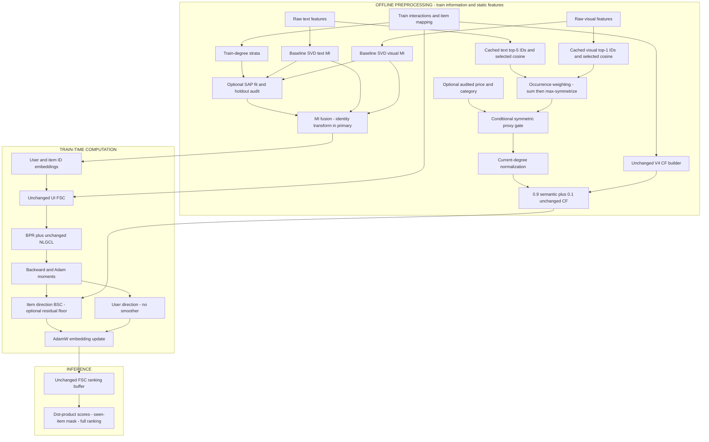

# STAIR5-v8 — Final Architecture Research Report

**Canonical implementation specification · 8 October 2026**

**Architecture:** Weighted Multimodal Semantic Graph with Candidate Support Expansion (**WMSG-CSE**). Degree-stratified Anchor-Procrustes (**SAP**), a conditional relation-proxy gate (**RPG**), and residual Dirichlet-floor BSC (**DF-BSC**) are specified as separately testable extensions. “CoED” is not part of the architecture name: this model does not implement CoED's learned edge directions.

**Status:** Research design, not a trained model. No V8 ranking result, speedup, memory peak, or statistical significance has been established. The target is **more than 7% relative NDCG@20 improvement over a freshly reproduced STAIR5-v4 N-CSE control**, not over original STAIR. This target is aspirational, not a theoretical consequence.

## 1. Executive Summary and Strategic Positioning

**Final verdict: IMPLEMENT WITH MODIFICATIONS.** Implement the smallest primary experiment first: replace the semantic edge magnitudes on the **existing V4 semantic support**, preserving MI, forward FSC, NLGCL, the CF expansion, optimizer, and evaluation. Remove UCR-D from this experiment. Do not begin with the full proposed bundle.

**Core hypothesis [HYPOTHESIS]:** Discarding similarity magnitudes on a fixed semantic candidate support may distribute item-update information inefficiently after CSE has already repaired missing collaborative support. A static, bounded magnitude-sensitive operator may improve positive-versus-negative ranking margins without adding multi-hop candidates or online gate computation.

This is an operator-weighting hypothesis, **not** a new-support hypothesis. Neither V5.2's unsuccessful expansion nor V6/V7's near-parity establishes that all weighting methods fail. Conversely, literature on learned directions does not establish that cosine weighting succeeds.

The four-stage implementation family is fully specified below. Its primary configuration deliberately leaves three unvalidated interventions neutral:

| Stage | Primary V8-core | Predeclared extension | Reason for separation |
|---|---|---|---|
| 1. Modality initialization | Exact V4 MI | SAP with same-item, degree-stratified anchors | Alignment and graph weighting test different hypotheses |
| 2. Semantic graph | WMSG on cached V4 support | RPG after metadata and relation audit | Price/category cannot identify economic relation signs by themselves |
| 3. Operator blend | Unchanged 90:10 semantic/CF blend | Same formula in all extensions | Preserve CSE and causal attribution |
| 4. Optimizer BSC | Exact V4 polynomial | DF-BSC residual bypass | A positive Dirichlet penalty would encourage smoothing |

The requested stratification correction is accepted. The requested sign gate is corrected and demoted to a **conditional proxy**, not certified substitute/complement classification. The requested anti-smoothing mechanism is replaced by a bounded residual bypass with a narrow, provable **one-step Dirichlet-energy floor**. It does not preserve the graph's spectral gap or guarantee global training convergence.

## 2. Evidence, Research History, and Post-mortem

### 2.1 Evidence rules and sources

Labels have the following meanings: **[FACT]** verified source/code statement; **[OBSERVATION]** measured or reported run phenomenon; **[INTERPRETATION]** plausible causal explanation; **[HYPOTHESIS]** requires a discriminating experiment; **[SPECULATION]** currently insufficient evidence.

Read and reviewed: [EStair.md](../EStair.md), [the complete V8 draft](v8.md), the supplied 239-line critique, [V4 experimental report](STAIR5_v4_Experiment_Report.md), [V6 report](STAIR5_v6_Report.md), and [V7 experimental report](STAIR5_v7_Experiment_Report.md), together with the relevant V4/V7 implementation and run artifacts. Earlier V5.1/V5.2 findings are used as reported historical evidence, not independently reproduced experiments. Equations in this specification supersede conflicting draft/critique equations; the original documents are preserved.

The main artifact ledger is:

- V4: `logs/GD5/stair5_v4_complete_artifacts/stair5_v4_manifest.json`.
- V7: `logs/GD5/stair5_v7_complete_artifacts/stair5_v7_manifest.json`.
- V7 achieved-dose evidence: `logs/GD5/stair5_v7_complete_artifacts/electronics_UCR.txt`.
- Code contract: `models/stair5_v4.py`, `models/stair5_v4_graph.py`, `models/stair5_v4_objectives.py`, `optimizers/stair5_v4_smoother.py`, `optimizers/AdamW.py`, and `main_stair5_v4.py`.

These are historical controls, not a substitute for new matched runs. Several summary metrics are rounded; small relative differences must not be assigned artificial precision.

### 2.2 Original STAIR → V4 → V5.1 → V5.2 → V6/V7

**[FACT]** Original STAIR combines modality initialization, coordinate-dependent forward propagation, and optimizer-side semantic smoothing. V4 adds NLGCL and a train-only CF candidate support to the semantic operator. Semantic affinity, recommendation utility, compatibility, and reliability remain distinct quantities.

| Milestone | Historical finding | What the evidence does not establish |
|---|---|---|
| Original STAIR | Fixed semantic candidates and coordinate schedules | Every semantic edge transmits useful preference information |
| V4 N-CSE | Strongest designated practical comparator; NLGCL plus CF support | A universal optimum, or that support expansion alone caused all gains |
| V5.1 KPE | Reported near-parity after modifying contrastive handling | Loss correction is mathematically only “second order,” or generally useless |
| V5.2 expansion | Reported relative regressions around 0.39–0.87% | Semantic dilution, popularity, or over-smoothing individually caused them |
| V6 BCSR | Reported extremely small graph-mass change and near-parity | Increasing that intervention would improve ranking |
| V7 UCR-D | Similar aggregate metrics; late achieved dose about 1% | Proven statistical equivalence, global anti-collapse protection, or uselessness |

For V5.2, additional higher-order connectivity plausibly repeats paths already transmitted by BSC and CF propagation. Normalization also changes the influence of **old** edges when new edges alter degrees. These mechanisms are credible but were not isolated experimentally. V8 therefore freezes support instead of adding another expansion stage.

### 2.3 Reconciled ranking ledger

All entries below are **test NDCG@20** at the validation-selected checkpoint. V4 values have four-decimal manifest precision. V7 Baby/Sports values are shortened for display; Electronics is available at six decimals in that manifest.

| Dataset | V4 N@20 | V7 N@20 | V4 selected epoch | V7 selected epoch | Conclusion |
|---|---:|---:|---:|---:|---|
| Baby | 0.0461 | 0.046143902 | 480 | 480 | Very small single-run difference |
| Sports | 0.0517 | 0.051627377 | 485 | 485 | Very small single-run difference |
| Electronics | 0.0316 | 0.031643 | 495 | 495 | Very small single-run difference |

The draft labels Electronics values around 0.0317 as NDCG@10; they belong to **NDCG@20**. V4 Electronics NDCG@10 is 0.0260. A later historical table also gives a different V4 Electronics epoch; the V4 manifest identifies epoch 495. Use artifact provenance rather than silently merging inconsistent tables.

Different GPU generations were used in historical runs. In particular, V7 Electronics ran on Blackwell; cross-hardware runtime changes are not evidence of algorithmic speedup. Historical allocated/reserved-memory summaries are not V8 memory measurements.

### 2.4 Discriminating failure analysis

| Suspected bottleneck | Evidence | Mechanism | Confidence in attribution | Alternative | Falsification test |
|---|---|---|---|---|---|
| Expansion repeats noisy paths | V5.2 regression with expanded support | Added paths can transmit unrelated preferences and modify old-edge normalization | Low–medium | Hyperparameter or seed variation | Matched support-budget expansion versus rewighting-only, multiple seeds |
| Popularity/degree dilution | More connections in expansion | Hubs change normalized influence and reduce tail-specific signals | Low | Useful high-degree coverage | Degree-stratified margins and per-node operator changes |
| Too-small operator perturbation | V6 reports 0.02–0.06% mass changes | A nearly unchanged operator may barely alter update trajectories | Medium for small perturbation, low for ranking causality | Perturbation targets irrelevant modes | Measure relative BSC-output change, not raw graph mass alone |
| V7 achieved dose was negligible | Critique asserts it from rho=0.01 | Proposed arithmetic is incorrect | Rejected as stated | One-percent change may still be insufficient or unnecessary | Read achieved dose and output-direction differences |
| Semantic magnitudes were discarded | Verified V4 builder | Equal occurrence weights erase confidence ordering within support | High as implementation fact, low as harmfulness claim | Cosine strength reflects nuisance/competitor similarity | WMSG versus uniform and shuffled-magnitude controls |
| Cross-modal MI basis mismatch | Independent SVDs and coordinate fusion | Arbitrary relative signs/bases affect fused Gram matrix | High as mathematical possibility, low as ranking attribution | Subspaces truly differ; alignment suppresses useful diversity | Same-support AP-only, random-orthogonal, and sign-flip controls |
| Over-smoothing | Not directly established by ranking tables | Polynomial attenuation can reduce nonconstant directions | Low as observed failure | Appropriate denoising | Dirichlet ratios, effective rank, and residual-only control |

**Dose correction [DERIVATION].** V7 uses

\[
\theta_t=\min(0.25,\rho/(Z_t+\epsilon)),\qquad
\rho_{\mathrm{eff},t}=\theta_t Z_t.
\]

At \(Z_t=0.05\), \(\rho=0.01\), negligible numerical epsilon gives \(\theta_t=0.2\) and achieved dose 0.01, not 0.005 or 0.0005. The Electronics text artifact reports `Z_t=0.052732, rho_eff=0.010000` at epoch 495. UCR-D is removed **for isolation and online-cost reduction**, not because this incorrect calculation proves failure. Empty diagnostic objects in some JSON telemetry limit other mechanistic claims.

## 3. Adjudication of the Draft and Meta-review

| Point | Adjudication | Final correction |
|---|---|---|
| Head-biased co-occurrence anchor threshold | Plausible bias; its magnitude was not measured | Use paired item identities and degree-stratified coverage; no `c_ij >= 5` anchor-pair requirement |
| Procrustes rotation direction | Critique itself retracts its initial objection | Keep the correct `X.T @ Y` → `P @ Q.T` solution; repair anchor indexing |
| Aligned MI retains isotropic fused covariance | Unsupported | Preserve each modality's covariance; explicitly retain fusion cross-terms |
| Cosine-power WMSG implements CoED | Incorrect mechanism transfer | Rename model; separate directions from magnitudes |
| WMSG is a new support expansion | Incorrect on fixed candidates | Call it same-support magnitude calibration |
| Semantic 5:1 fusion is baseline-preserving | Incorrect for edge occurrences | Keep unit occurrence coefficients; text has five neighbors, visual one |
| Gamma=1 recovers binary V4 | False | Use explicit reference delegation/binary mode |
| Sign gate identifies complements/substitutes | Not identifiable from supplied inputs | Conditional, bounded metadata proxy; no signed weights or economic-label claim |
| Proposed gate suppresses substitutes | Its sign does the opposite under its own interpretation | Decreasing retention for increasing substitute proxy |
| UCR-D rho=0.01 is proved too small | False dose arithmetic | Remove from primary for attribution, not a falsified-dose claim |
| Positive Dirichlet loss prevents smoothing | Reversed optimization direction | Use diagnostics and optional residual Dirichlet floor |
| Norm bound guarantees no collapse/convergence | Overclaim | Prove only operator/polynomial bounds under explicit assumptions |
| More than 7% gain, flat VRAM | Unmeasured | Define targets and measured acceptance criteria |

ARS methodology-focus review found repairable methodological and exposition blockers. Two separate AI review seats committed criteria before manuscript reading; both are **NOT_CALIBRATED**, with `criteria_binding_unavailable`. They are not human reviews or statistically independent reviewer replications. Their immutable cards and the source ledger are in `scratch/g5v8_review/`.

## 4. Targeted SOTA Literature Cross-reference

Verification date: 8 October 2026. This is a targeted mechanism review, not an exhaustive systematic review. No borrowed theorem is treated as certification of V8.

| Verified reference and status | Relevant mechanism | Transfer permitted to V8 | Transfer not justified |
|---|---|---|---|
| Seong Ho Pahng, Sahand Hormoz. **Improving Graph Neural Networks by Learning Continuous Edge Directions**. ICLR 2025. [Official proceedings](https://proceedings.iclr.cc/paper_files/paper/2025/hash/7422317f84e8c83e4c1ad2ff87e1e88e-Abstract-Conference.html); [author methods](https://arxiv.org/html/2410.14109v2) | Learned reciprocal edge directions; complex operator and separate incoming/outgoing messages | Motivation to distinguish direction from strength | Its weighted-directed WL expressivity result is not a no-over-smoothing theorem for symmetric cosine weighting |
| Rui Xue, Tianfu Wu. **ReCoG: Reciprocal Co-Evolution for Multimodal Graph Learning**. arXiv:2608.22786, 2026 preprint; NeurIPS acceptance unverified. [Primary text](https://arxiv.org/html/2608.22786v1) | Task-trained graph refinement and coupled modality representations | Adaptive topology is a competing, more expensive hypothesis | Its conditional discrepancy contraction does not apply to static optimizer BSC |
| Keigo Sakurai, Takahiro Ogawa, Miki Haseyama. **The Edge Spectrum of Choice-Derived Item Graphs: Strong and Weak Edges Encode Different Relations in Collaborative Filtering**. arXiv:2608.29578, 2026; author metadata reports CIKM acceptance, independent proceedings confirmation unavailable. [Primary text](https://arxiv.org/html/2608.29578v1) | Choice-slate MNL diversion weights; possible smoothing/BPR conflict for competing choices | Strong semantic edges need not be useful ranking edges | Amazon cosine edges are not observed-slate diversion edges; weak edges are not automatically complements |
| Ahmad Mousavi, Majid Alikhani, Yeon-Chang Lee, Roberto Corizzo, Yeganeh Abdollahinejad. **MURAL: Multimodal Uncertainty-aware Recommendation via Adaptive edge Learning**. arXiv:2609.04574, 2026 preprint; venue unverified. [Primary text](https://arxiv.org/html/2609.04574v1) | Learned edge MLP, uncertainty fusion, behavior/modality and cross-modality alignment | Alternative alignment/edge-utility hypotheses | No verified support for degree-quintile Procrustes, or blanket leakage-free alignment |
| Xin Zhou, Zhiqi Shen. **A Tale of Two Graphs: Freezing and Denoising Graph Structures for Multimodal Recommendation**. ACM MM 2023, DOI 10.1145/3581783.3611943. [Primary record](https://arxiv.org/abs/2211.06924) | FREEDOM freezes item structure and denoises interaction edges | Static graph construction can be a deliberate efficiency choice | Contemporary methods need not all use dynamic refinement |
| Penghang Yu, Zhiyi Tan, Guanming Lu, Bing-Kun Bao. **Multi-View Graph Convolutional Network for Multimedia Recommendation**. ACM MM 2023, DOI 10.1145/3581783.3613915. [Primary record](https://arxiv.org/abs/2308.03588) | MGCN behavior-guided modality purification and separate views | Preference-conditioned modality utility is established related work | It does not validate an economic sign classifier from price/category |
| Peter H. Schönemann. **A Generalized Solution of the Orthogonal Procrustes Problem**. Psychometrika 31, 1–10, 1966. [DOI](https://doi.org/10.1007/BF02289451) | Orthogonal least-squares alignment | Exact weighted Procrustes derivation below | Finite residual reduction is not semantic correctness or recommender rotation invariance |

Cong Xu, Yunhang He, Jun Wang and Wei Zhang's original recommender **STAIR: Manipulating Collaborative and Multimodal Information for E-Commerce Recommendation** was accepted AAAI 2025 according to its [author record](https://arxiv.org/abs/2412.11729). Do not confuse it with similarly named safety-alignment papers. HGAT-Rec's 2026 [publisher record](https://link.springer.com/article/10.1007/s44443-026-00979-x) was verified for bibliographic identity only; its theory is not used here.

**Theoretical limits of the literature:** CoED learns directions, while V8 learns neither directions nor edge parameters. ReCoG's contraction has architecture-specific norm assumptions. Edge Spectrum requires observed choice sets absent from the supplied pipeline. MURAL does not establish that every alignment path is detached; nor does its printed positive log-variance term alone prevent variance collapse. These papers motivate tests, not unconditional guarantees.

## 5. Candidate Selection and Final Component Policy

| Candidate | Distinct hypothesis | Main risk | Decision |
|---|---|---|---|
| Same-support WMSG | Uniform occurrence weighting discards useful confidence ordering | Strong cosine edges reflect substitutes or nuisance similarity | **Primary:** lowest integration cost and clearest placebo |
| SAP-only | Relative modality basis causes harmful MI interference | Different subspaces or useful modality diversity | **Backup:** isolated initialization experiment |
| Metadata RPG | Available relation evidence predicts harmful semantic transmission | Relation unidentifiability and missing metadata | Conditional extension only |
| Learned directional CoED-style BSC | Directional preferences require asymmetric transmission | New normalization/theory, overfit, online cost | Reject for this minimum-change V8 |
| WMSG + dynamic UCR | Instantaneous update compatibility adds useful protection | Near-parity history and attribution/online overhead | Not primary; reserve for later evidence |
| Positive Dirichlet loss | Penalizing variation prevents over-smoothing | It promotes smoothing mathematically | Reject |
| Residual DF-BSC | Excess attenuation of nonconstant update modes is harmful | Weakening useful denoising | Optional mechanistic guard, not assumed necessary |

There is no defensible numerical estimate that any candidate has the highest probability of gaining 7%. Selection prioritizes falsifiability and sparse implementation feasibility. A full-stack model is eligible only after each extension beats its corresponding simpler parent in matched experiments. Failure to qualify an extension leaves the defined core intact; it does not require another architecture-design round.

## 6. Mathematical Architecture Specification: Four Stages

### 6.1 Symbols and inherited data contract

Let \(M\) be users, \(N\) items, \(d=64\), and \(L=3\). Let \(R\in\{0,1\}^{M\times N}\) denote **deduplicated train interactions for CF statistics only**, with \(n_i=\sum_u R_{ui}\) and \(c_{ij}=\sum_u R_{ui}R_{uj}\). Native V4 training pairs and normalized user–item graph are not silently deduplicated or reconstructed.

Raw text and visual features are \(X_t\in\mathbb R^{N\times D_t}\) and \(X_v\in\mathbb R^{N\times D_v}\). Features are finite FP32; each row follows the baseline item-ID mapping. Degree, CF statistics, anchor selection and any gate calibration use train information only. Held-out interactions never enter graph construction.

For modality \(m\), centered SVD is \(X_m-\mathbf1\mu_m^\top=U_m\Sigma_m V_m^\top\). Baseline MI uses

\[
Z_m=\sqrt{N/d}\,U_m[:,1:d],\qquad
V^{(0)}=(5Z_t+Z_v)/6.
\tag{1}
\]

Use the exact existing SVD routine/cache; do not introduce singular-value scaling or stochastic SVD in the primary comparison. Let \(T_{UI}\) denote V4's native left-normalized train-interaction operator for user MI. Preserve \(U^{(0)}=T_{UI}V^{(0)}\) through the existing initialization code.

### 6.2 Stage 1 — Degree-stratified Anchor-Procrustes MI

**Purpose [HYPOTHESIS]:** reduce arbitrary relative-basis interference in MI. This stage does not change within-modality kNN geometry.

**Primary:** `alignment=off`, equation (1). **SAP extension:** use same-item pairs \((Z_{v,i},Z_{t,i})\), not co-occurrence pairs with undefined matrix indexing.

Eligible anchors have both modalities and \(n_i>0\). Sort eligible items by `(n_i, item_id)` and partition their ranks into five near-equal strata \(Q_1,\ldots,Q_5\); report boundary ties explicitly. Uniformly sample at most 1,024 IDs per stratum using a dedicated fixed RNG. Each stratum contributes total fitting weight \(1/5\): for its selected set \(A_q\), set \(w_i=1/(5|A_q|)\). Use an 80:20 within-stratum fit/audit split, renormalizing the weights separately. This split is a feature-alignment audit, not ranking validation/test data.

The fit is

\[
Q^*=\arg\min_{Q^\top Q=I_d}
\sum_{i\in A_{\mathrm{fit}}}w_i\|Z_{v,i}Q-Z_{t,i}\|_2^2.
\tag{2}
\]

Let \(C=Z_{v,A}^\top\operatorname{diag}(w)Z_{t,A}=P\Sigma H^\top\). Then

\[
Q^*=PH^\top,\qquad
V^{(0)}_{SAP}=(5Z_t+Z_vQ^*)/6.
\tag{3}
\]

**DERIVATION:** expanding (2) leaves a constant minus \(2\operatorname{tr}(Q^\top C)\); its maximum is achieved by (3). Reflections are allowed: this is an orthogonal transform, not necessarily a determinant-positive rotation.

**Predeclared engineering guards:** all five fit/audit strata nonempty, at least \(d\) fitting rows, finite SVD, and \(\sigma_{\min}(C)/\sigma_{\max}(C)\ge10^{-6}\). Require at least 1% reduction in weighted audit residual and no degree stratum with more than 2% residual regression relative to identity. These thresholds are numerical screening choices, not scientific laws. If a guard fails, use identity and record the reason; never force an unstable transform. Once an SAP arm passes, refit on all selected anchors and store its FP64 CPU transform and fingerprints.

**PROPOSITION:** \((Z_vQ)(Z_vQ)^\top=Z_vZ_v^\top\). Thus orthogonal SAP preserves visual item Gram geometry and covariance eigenvalues. It cannot change the visual column subspace to match a different text subspace.

For centered, full-rank retained vectors, \(Z_m^\top Z_m/N=I_d/d\), not \(I_d\). The covariance of fused MI is

\[
\frac{(5Z_t+Z_vQ)^\top(5Z_t+Z_vQ)}{36N}
=\frac{26}{36d}I_d+
\frac{5}{36N}(Z_t^\top Z_vQ+Q^\top Z_v^\top Z_t).
\tag{4}
\]

It is generally not isotropic. Neither SAP nor an MLP would make coordinate-wise FSC/BSC and coordinate-wise Adam rotation invariant.

### 6.3 Stage 2 — Continuous WMSG and Conditional Relation-proxy Gate

#### Frozen candidates and magnitude weights

Reuse the exact cached directed V4 kNN IDs: \(K_t(i)\) has five neighbors and \(K_v(i)\) one, obtained from raw-feature cosine under the baseline diagonal/tie policy. Do not recompute candidates from SAP-aligned or fused MI. Compute only selected-edge cosines

\[
a^m_{ij}=\frac{X_{m,i}^\top X_{m,j}}
{\max(\|X_{m,i}\|_2,\epsilon_x)\max(\|X_{m,j}\|_2,\epsilon_x)},
\qquad j\in K_m(i).
\tag{5}
\]

Use the baseline feature-normalization epsilon, FP32 and clamp finite cosine to \([-1,1]\). Invalid features fail preflight rather than being assigned fabricated semantics.

For edge power \(p\), define

\[
f_p(a)=\epsilon_w+(1-\epsilon_w)[\max(0,a)]^p,
\qquad \epsilon_w=0.05,\quad p\in\{1,1.5,2,3\}.
\tag{6}
\]

The positive floor preserves the selected support, including nonpositive-cosine candidates; log their fraction. It is not a calibrated probability. For \(a\in(0,1)\), increasing \(p\) shrinks its absolute weight and increases relative concentration toward strong edges. It does not amplify every strong edge absolutely. Gamma 5 is excluded from the initial grid because concentration needs to be justified before broadening it.

Construct directed occurrence weights, coalesce by sum, then symmetrize by maximum:

\[
B_{ij}=\sum_{m\in\{t,v\}}\mathbf1[j\in K_m(i)]f_p(a^m_{ij}),
\qquad W_{ij}=\max(B_{ij},B_{ji}),\quad W_{ii}=0.
\tag{7}
\]

Both modality occurrence coefficients are **one**. The 5:1 ratio already exists in neighbor counts; it is not an additional per-edge 5:1 weight. Text/vision overlap can have weight up to two. This preserves the baseline aggregation order. Symmetrizing each modality before summing is a different construction and must not be substituted silently.

#### Corrected gate and identifiability boundary

**Primary:** \(g_{ij}=1\). Local V4 code loads text/visual features; it does not establish mapped price/category availability for all three datasets. Such data were requested separately; availability is unconfirmed in this specification.

Economic substitute/complement signs are not identifiable from price/category alone. Identical metadata can describe competing products or compatible accessories. BPR does not require every substitute pair to repel: its constraint concerns a **user-specific sampled positive–negative margin**. Therefore a price/category heuristic must not be advertised as an economic sign classifier.

For a separately authorized metadata extension, define \(m_{ij}\in\{0,1\}\) as joint metadata validity: both prices positive, finite and comparable in currency/time; both mapped categories available with a fixed nontrivial taxonomy. Let

\[
r^{price}_{ij}=\frac{\min(price_i,price_j)}{\max(price_i,price_j)},\quad
r^{cat}_{ij}=\operatorname{Jaccard}(\mathcal C_i,\mathcal C_j),\quad
h_{ij}=r^{price}_{ij}r^{cat}_{ij}.
\tag{8}
\]

Exclude generic taxonomy roots from \(\mathcal C_i\). Define symmetric retention

\[
g_{ij}=1-\kappa m_{ij}\sigma((h_{ij}-\tau_s)/T_s),
\qquad W^g=W\odot g,
\tag{9}
\]

where \(0\le\kappa\le0.25\), \(T_s>0\). Initial extension settings are \(\kappa=0.1,\tau_s=0.7,T_s=0.1\); they have no empirical optimality claim. Primary sets \(\kappa=0\). Missing metadata is **neutral**, not evidence of complementarity. No negative edge weights are introduced.

**DERIVATION:** high same-category/similar-price proxy values reduce retention in (9), correcting the critique's increasing sigmoid. Bounds are \(1-\kappa\le g_{ij}\le1\). This only implements the proposed *proxy interpretation*. It neither proves that attenuated edges are substitutes nor labels retained edges complements.

Before enabling this arm, audit item mapping, coverage by degree stratum, metadata provenance, and relation annotations or choice-context evidence. If no relation evidence exists, retain the descriptive name RPG and test it as a heuristic; do not rename it a validated sign-aware model. Genuine signed propagation would need different normalization and proofs and is outside this V8.

### 6.4 Stage 3 — Normalization and Unchanged CSE Blend

For any symmetric, nonnegative raw graph \(A\), define \(d_i(A)=\sum_j A_{ij}\). On positive-degree nodes use \(D^{-1/2}AD^{-1/2}\); on isolated nodes use an identity block. Call this operation \(\mathcal N(A)\). Degrees are recomputed **after** gate weighting and symmetrization.

Let \(S_0\) be the exact cached V4 semantic normalized operator and \(S_{mag}=\mathcal N(W^g)\). Define

\[
S_{sem,8}=(1-\epsilon)S_0+\epsilon S_{mag},\qquad
S_8=0.9S_{sem,8}+0.1\bar S_{CF}.
\tag{10}
\]

Primary WMSG replacement uses \(\epsilon=1\). \(\epsilon=0\) is exact operator recovery and must delegate to V4 rather than rebuilding it. Partial \(\epsilon\) is a dose-control ablation, not an extra default tuning grid. All graphs have the same item indexing. With the positive floor and cached candidates, semantic support is unchanged.

The CF component is inherited without alteration:

\[
q_{ij}=\frac{c_{ij}}{c_{ij}+5}\frac{c_{ij}}{\sqrt{n_i n_j}},\qquad c_{ij}\ge2.
\tag{11}
\]

Use the V4 deterministic row top-five selection, symmetric union-max, zero diagonal, normalization and isolated-CF identity fallback. Do not form dense \(R^\top R\). The CF builder's bounded CPU block computation and memory budget remain intact.

**THEOREM 1 — Static operator bound.** Under the stated symmetry, nonnegativity, degree and isolated-block rules, \(\|S_8\|_2\le1\) for \(0\le\epsilon\le1\).

**Proof.** On positive-degree blocks, \(D^{-1/2}AD^{-1/2}\) is similar to the row-stochastic matrix \(D^{-1}A\), whose eigenvalues have modulus at most one. It is real symmetric, hence its induced 2-norm equals its largest absolute eigenvalue. Isolated identity blocks also have norm one. Thus every normalized component has norm at most one. Twice applying the triangle inequality to (10) gives

\[
\|S_8\|_2\le0.9[(1-\epsilon)\|S_0\|_2+
\epsilon\|S_{mag}\|_2]+0.1\|\bar S_{CF}\|_2\le1.
\tag{12}
\]

Components need not commute. Their blend is symmetric and nonnegative, but is generally **not row-stochastic** or the normalization of one raw graph; do not assert those stronger properties. Its spectral radius is at most its norm. For symmetric \(S_8\), they coincide. \(S_8\) is an adjacency operator, not a Laplacian; the Laplacian used below is \(I-S_8\).

Symmetric normalization alone does not symmetrize a directed top-k graph. For example, `[[0,1,0],[1,0,0],[1,0,0]]` has row degree one and norm \(\sqrt2\). This counterexample rules out the draft's proof without explicit symmetrization.

### 6.5 Stage 4 — Optimizer BSC and Residual Dirichlet-floor Mechanism

Define the unchanged coordinate coefficient

\[
b_j=0.1+0.9(j/d)^{\gamma_{BSC}},\quad j=0,\ldots,d-1,
\quad \gamma_{BSC}=0.1/0.2/0.4
\tag{13}
\]

for Baby/Sports/Electronics. It satisfies \(0\le b_j<1\). **Do not reuse the edge power \(p\) as \(\gamma_{BSC}\).** Forward FSC uses the complementary coefficient \(1-b_j\), as in V4.

After backpropagation of the unchanged total loss, let \(D_t\in\mathbb R^{N\times d}\) be the item Adam-preconditioned direction produced by the existing optimizer's moments and bias corrections. Smooth that direction, not merely raw BPR gradients:

\[
(P_8D_t)_{:,j}=P_j(S_8)(D_t)_{:,j},\qquad
P_j(S)=\frac{1-b_j}{1-b_j^{L+1}}
\sum_{\ell=0}^{L}b_j^\ell S^\ell.
\tag{14}
\]

The primary uses (14) unchanged. The optional DF-BSC arm uses

\[
\widetilde D_t=\omega D_t+(1-\omega)P_8D_t,
\qquad 0\le\omega\le0.1.
\tag{15}
\]

Initial guard experiment: \(\omega=0.05\), with separately budgeted sensitivity values \(0.02,0.1\). Primary and parity arms have \(\omega=0\). There is no learned gate, EMA state, dynamic snapshot, or extra sparse hop. Apply the existing AdamW update/weight-decay ordering exactly, substituting only its item-direction smoother. User updates remain unsmoothed.

**Rejected remedy:** adding \(+\lambda\operatorname{tr}(E^\top(I-S_8)E)\) and minimizing it favors low-energy/smooth representations. It does not prevent over-smoothing. Negating that term without scale constraints can make the objective unbounded. Thus `lambda_dirichlet=0`; the mechanism is (15), not an additional loss.

**THEOREM 2 — One-call Dirichlet floor, for L=3.** Let \(\mathcal L_8=I-S_8\succeq0\), and define \(\mathcal E_8(D)=\sum_jD_{:,j}^\top\mathcal L_8D_{:,j}\). Under Theorem 1, (15) obeys

\[
\|\widetilde D_t\|_F\le\|D_t\|_F,\qquad
\omega^2\mathcal E_8(D_t)\le\mathcal E_8(\widetilde D_t)
\le\mathcal E_8(D_t).
\tag{16}
\]

**Proof.** Diagonalize symmetric \(S_8\). For each eigenvalue \(\lambda\in[-1,1]\), the L=3 response is

\[
p_j(\lambda)=\frac{1-b_j}{1-b_j^4}
\frac{1-(b_j\lambda)^4}{1-b_j\lambda}.
\tag{17}
\]

For \(b_j<1\), its numerator and denominator are positive. The sum bound gives \(p_j(\lambda)\le1\); hence \(0<p_j(\lambda)\le1\). The residual response \(f_j=\omega+(1-\omega)p_j\) lies in \([\omega,1]\). Squared mode coefficients therefore give the Frobenius bound and (16), multiplying each mode's energy by \(f_j^2\). This proof is scoped to L=3 and the static operator; do not generalize the positivity argument to arbitrary truncation orders without checking them.

This floor limits removal of nonconstant **update-direction** energy in one call. It does not guarantee discriminative embeddings, beneficial margins, Adam convergence, bounded unsmoothed directions, or preserved algebraic connectivity. The graph itself is unchanged by (15). Repeated training can still lose discrimination. The primary polynomial was already strictly positive; the extension only adds a uniform response floor.

**PROPOSITION — Series scope.** The finite polynomial always exists. An infinite Neumann series with a fixed \(S_8\) converges because \(b_j\|S_8\|_2<1\). V8 does not require that infinite series and does not have a time-varying graph. Neither statement proves convergence of the full nonlinear optimizer.

### 6.6 Forward representation, objective, and score

Let \(A_{UI}\) be V4's native symmetric normalized user–item operator, and \(H^{(0)}=[U;V]\). For \(a_j=1-b_j\), preserve

\[
\bar H_{:,j}=\frac{1-a_j}{1-a_j^{L+1}}
\sum_{\ell=0}^{L}a_j^\ell A_{UI}^{\ell}H^{(0)}_{:,j},
\qquad \hat y_{ui}=\bar U_u^\top\bar V_i.
\tag{18}
\]

The NLGCL intermediates retain the exact recursively coordinate-scaled forward layers; do not substitute unscaled LightGCN layers. Total loss remains

\[
\mathcal J=\mathbb E_{(u,i^+,i^-)}[-\log\sigma(\hat y_{ui^+}-\hat y_{ui^-})]
+0.01\,\mathcal L_{NLGCL}^{V4}.
\tag{19}
\]

Reuse `NLGCL_Module` with tau=0.2, G=1, alpha=0.5, its original positive/duplicate semantics and chunking. Do not silently switch to KPE or multi-positive loss. AdamW decay remains an optimizer operation, not a new explicit regularization term in (19).

### 6.7 Architecture diagram



## 7. Why V8 Might Improve Ranking — Falsifiable Causal Chains

1. **WMSG [HYPOTHESIS]:** V4 assigns the same weight to each modality-edge occurrence → local confidence ordering is lost → equation (6) changes normalized transmission on the same support → useful endpoints contribute more relative to irrelevant ones → BSC changes positive–negative margins → Recall/NDCG may improve. **Falsifier:** shuffled magnitudes or uniform weights match the gain, or semantic-strength ranking does not predict useful margin transmission. High cosine alone is not preference compatibility.

2. **SAP [HYPOTHESIS]:** independent modal bases alter fusion cross-terms → same-item weighted alignment reduces arbitrary relative interference → the initial fused Gram matrix changes coherently → useful initial preference margins may improve. **Falsifier:** random orthogonal transforms match SAP, alignment reduces residual but harms ranking, or tail alignment degrades. Lower residual is insufficient evidence of ranking benefit.

3. **RPG [HYPOTHESIS]:** audited relation evidence predicts harmful transmission on some high-affinity edges → bounded attenuation changes those transmissions → conflicting preference margins improve. **Falsifier:** metadata proxy does not predict the audited relationship/update outcome, or degree-matched random gates match it. Without that evidence, the chain is speculative and the gate stays neutral.

4. **DF-BSC [HYPOTHESIS]:** excessive nonconstant-direction attenuation is measured → equation (15) raises the filter response floor → some discriminative direction energy survives → margins may improve. **Falsifier:** measured attenuation is not harmful, or V4 plus the same residual matches the alleged WMSG-specific gain. A contraction bound alone does not support this chain.

## 8. Computational Complexity and GPU Memory Contract

No new primary trainable parameters are introduced. The ID tables remain \((M+N)d\) parameters. SAP stores a fixed \(d\times d\) transform; RPG and DF-BSC are fixed scalar operations.

Let \(E_s\) be symmetric semantic nnz, \(E_c\) CF nnz, and \(E\) their coalesced union. Same-support WMSG retains \(E_s\); the floor prevents support deletion. Store **one** final sparse GPU operator, not S0, Smag and CF simultaneously. Keep raw construction/audit structures on CPU and release unnecessary temporaries.

| Cost | V4 | V8-core | Extensions |
|---|---|---|---|
| Candidate discovery | Blockwise raw-feature cosine top-k | Reuse identical cached IDs | No additional discovery |
| Selected-edge magnitude preprocessing | Unit occurrences | O(N(5Dt+Dv)) for selected dot products, O(Es) weights | Gate O(Es); SAP O(A d²+d³+N d²) |
| Item BSC per step | O(L E d) sparse products | Same L=3, support and product count | Residual adds O(Nd) arithmetic, no SpMM |
| Online edge scoring | None | None | None for specified extensions |
| Inference | Unchanged FSC; O(d) per pair, O(M_eval N d) full ranking | Same operations | Same operations |

The selected-cosine cost is additional only if cache lacks magnitudes. Existing kNN retrieval itself may be costly; no dense N×N similarity matrix is permitted. The knn chunk limit remains 1,024, and CF CPU memory budget 128 MiB as in V4.

**Deterministic size accounting, not measured peaks:** dataset item counts in historical reports are Baby 7,050, Sports 18,357, Electronics 63,001. A single FP32 N×64 direction buffer costs respectively **1.721, 4.482, 15.381 MiB**. Six selected cosine scalars per item cost **0.161, 0.420, 1.442 MiB**, retained on CPU. A FP64 64×64 SAP transform is 32 KiB on CPU. An int64-index/FP32-value CSR operator costs approximately \(8(N+1)+12E\) bytes before framework overhead; COO costs approximately \(20E\). Use actual coalesced nnz and dtype, not kN as a symmetric-nnz guess.

Residual can reuse the BSC output and existing input direction without a persistent clone; a simple clone-based implementation must budget the N×64 extra buffer above. Endpoint-gather tensors for optional diagnostics are chunked, never E×d across the whole graph. Primary graph preparation is `no_grad`; static buffers never hold `grad_fn`.

**No unconditional <800 MiB guarantee.** Historical V7 Electronics summaries already exceed 800 MiB allocated on one platform. Full-ranking buffers, contrastive activations, SVD/workspace, allocator reservation and implementation details dominate peaks. Define a measured acceptance budget: same-hardware V8-core peak allocated memory no more than matched V4 plus 32 MiB; report reserved memory separately. If a deployment requires total allocated <800 MiB, both control and V8 must meet it using identical chunking adjustments, or that requirement remains unmet. Do not hide a V8-only chunking advantage. Engineering speed target: core training median seconds/epoch within 10% of matched V4; residual extensions within 15%, measured rather than promised.

## 9. Implementation-ready Module Contracts and Minimal Code Delta

Keep existing baseline files immutable. This request produces a specification, not source implementation.

| Proposed module | Input → output | Trainable/gradient | Device and memory | Integration |
|---|---|---|---|---|
| `models/stair5_v8_alignment.py` | Zt,Zv FP32 [N,64], train degree int64 [N] → Q FP64 [64,64], aligned MI [N,64], audit JSON | No; no autograd graph | CPU float64 fitting on ≤5,120 selected rows; CPU batched N×64 transform | Optional replacement immediately before V4 MI fusion |
| `models/stair5_v8_graph.py` | Frozen directed IDs int64 [N,5]/[N,1], raw features, S0/CF → final FP32 sparse [N,N] | No; static weights | Selected-edge chunks; CPU coalesce/symmetrize and current-degree normalization | Substitute only graph-state final operator |
| Conditional RPG function in graph module | Undirected pairs [Ep,2], mapped metadata arrays/masks → FP32 retention [Ep] | No | CPU O(Ep), chunk if needed | Before normalization; mirror both endpoints |
| `optimizers/stair5_v8_smoother.py` | Callback x→S8x, b [64], direction FP32 [N,64] → same shape | No parameters; `no_grad` | GPU L=3 sparse products; optional residual O(Nd) | Existing AdamWSEvo smoother slot, after Adam preconditioning |
| `models/stair5_v8.py` | Existing V4 dataset/config → embeddings, loss, scores | Same trainable tables as V4 | Same forward tensors | Reuse inherited sampler, FSC, NLGCL and ranking |
| `main_stair5_v8.py` | CLI/YAML, seeds, manifests | Existing optimizer groups only | Same trainer/evaluation | Add options/provenance/diagnostics; no evaluation rewrite |
| `tests/test_stair5_v8_*.py` | Synthetic matrices and small dataset fixture | Not model parameters | CPU algebra + optional GPU smoke | Reference parity, graph contracts, checkpoint and diagnostics |

**Parameter invariant:** each trainable parameter occurs exactly once. User group has `smoother=None`; item group has the V8 static callback smoother. Do not create an auxiliary optimizer for fixed AP matrices or scalar controls. Baseline learning rate and decay remain untouched.

Recommended V8-core configuration delta:

```yaml
v8_arm: WMSG-core
semantic_mode: weighted       # reference delegates to exact V4
edge_power: 2.0               # validation grid: 1, 1.5, 2, 3
edge_floor: 0.05
semantic_mix: 1.0             # epsilon; reference uses exact bypass
alignment: off                # extension: stratified_procrustes
anchor_seed: 2718
anchor_per_stratum: 1024
relation_gate: off            # extension: metadata_proxy
relation_strength: 0.0        # kappa
relation_threshold: 0.7
relation_temperature: 0.1
bsc_residual: 0.0             # omega; diagnostic extension 0.05
lambda_dirichlet: 0.0
# eta=0.1, gamma, MI, FSC, NLGCL and all trainer values inherit V4.
```

Three dataset YAMLs inherit the matched V4 settings: d=64, L=3, lr=0.001, 500 epochs, evaluation every five, best validation NDCG@20, full ranking; Baby/Sports batch 1,024, Electronics 4,096; decay Baby 0.3, Sports/Electronics 0.1; NLGCL anchor chunk 1,024. Preserve beta moments, workers, sampler and RNG lifecycle from the reproduced control, not newly invented defaults.

**Checkpoint contract:** store architecture version, every option, feature/split/item-map/source hashes, cached neighbor hashes, graph fingerprint, SAP transform/anchor IDs/audit, metadata fingerprint and missingness, optimizer/scheduler state, RNG state and selected epoch. Loading a graph/MI-incompatible V4 checkpoint for V8 training is an error, not warm-start recovery. Identical source buffers and restored moments/RNG are required for resume parity.

**Sparse pass:** prepare one coalesced CSR or existing supported layout. No repeated COO conversion in each optimizer call. Reuse the baseline polynomial recurrence with one N×64 temporary per hop. `omega=0` calls the baseline path without extra arithmetic. Never perform `.item()`, histograms, CPU transfer or metadata lookups inside every training step.

**Logging:** record arm/config/seed/data/run hashes, operator nnz/degrees/weights, validation selection, test metrics, wall times for preprocessing/training/evaluation, peak allocated and reserved bytes, hardware/software, and diagnostics before releasing temporary state. Plotting functions import their own NumPy dependency and never convert a plotting exception into a “training failure” or vice versa. All dataset cells explicitly invoke the requested dataset; pilot 50/100-epoch overrides cannot silently replace the 500-epoch benchmark.

## 10. Direct Mechanism Diagnostics

Every diagnostic is planned, not yet a measured V8 result. Sample static edge pairs by degree strata and fixed IDs; compute only at epochs 1, 5, 10 and each evaluation checkpoint on a fixed small number of training minibatches.

| Diagnostic and formula | Expected supportive observation | Falsification / limitation |
|---|---|---|
| Support difference: symmetric difference of edge sets | Zero for WMSG-core | Nonzero indicates builder confound or floor violation |
| Magnitudes: mean, CV, quantiles and nonpositive-cosine fraction per modality/degree stratum | Usable spread beyond floating-point noise | Nearly constant weights make proposed intervention negligible |
| Row entropy H_i=-sum_j p_ij log p_ij, p_ij=W_ij/sum W_ij; effective neighbors 1/sum p_ij² | Selectivity improves without widespread tail collapse | Strong concentration with tail regression rejects chosen p |
| Operator perturbation: ||(S8-S4)X||F/||S4X||F on fixed probe X | Non-negligible but bounded change | Raw graph dose alone does not measure training effect |
| BSC perturbation: ||P8D-P4D||F/max(||P4D||F,epsilon) on the same preconditioned D | Actual update change | Compare identical D, not unrelated runs' directions |
| Compatibility: cosine(D_i,D_j), only if both norms pass a fixed reliability threshold | Weighted edges may select more compatible transmissions | Cosine noise at tiny norms; positive alignment alone not ranking utility |
| Margin derivative: d/dh of y_ui+ - y_ui- along item update -D_t | Changed directions improve diagnostic margins | Fix user parameters, UI operator and sampler; differentiate through unchanged FSC with respect to item parameters; surrogate not generalization proof |
| Dirichlet ratios E8(P8D)/max(E8(D),epsilon) and E8(D_tilde)/max(E8(D),epsilon) | Residual satisfies the floor and counters diagnosed excessive attenuation | Energy preservation without ranking gain rejects necessity |
| SAP audit residual per degree stratum; singular values of C; fused covariance eigenvalues | Broad alignment benefit without tail harm | In-sample fit reduction alone is automatic, not evidence |
| RPG relation-label accuracy/coverage, conditional on degree/category | Proxy tracks audited harmful relation/transmission | No labels means no validated “sign-aware” claim |
| Embedding effective rank exp(-sum pi_k log pi_k), pi from singular-value energy | Discrimination retained | Compare norm-matched embeddings; high rank alone not accuracy |
| Train-degree quintile Recall/NDCG and recommendation popularity | Tail benefit without head-only concentration | Counts and item-only metric conditioning need explicit definitions |

For update cosine, exclude directions with norms below a fixed reliability cutoff: on the same sampled preconditioned direction set, use \(\tau_D=\max(10^{-8},10^{-3}\operatorname{median}_{i:\|D_i\|>0}\|D_i\|)\). Both endpoints must exceed it; report the exclusion fraction and the 0.1x/10x cutoff sensitivity. If all directions are zero, compatibility is undefined, not zero. This is a diagnostic heuristic, not an optimizer safeguard or learned gate. The primary has no compatibility gate, so this diagnostic cannot leak into training. For a frozen training triple, define the margin derivative exactly as \(-\langle\nabla_V(\hat y_{ui^+}-\hat y_{ui^-}),D_t\rangle_F\), holding user parameters and the UI operator fixed. Compare the same triples and unsmoothed direction before and after smoothing. For tail evaluation, stratify held-out positive items by **train** degree, report coverage, and keep the evaluator's user aggregation contract explicit.

## 11. Four-phase Experimental Roadmap

### Phase 1 — Exact Parity and Engineering Check

Run reference mode with alignment off, gate neutral, epsilon=0 and omega=0. It delegates to V4 buffers/builders and optimizer arithmetic. Check fixed-batch loss, raw gradients, moments, smoothed direction, one update, evaluation scores, seen masks, and checkpoint roundtrip. Use CPU deterministic comparisons at tight tolerance, and documented FP32 tolerance for GPU sparse kernels; do not promise cross-device bitwise metrics.

Required algebra tests: weighted same-item Procrustes on known transforms, individual versus fused covariance, directed counterexample, symmetry/nonnegativity/current-degree invariants, isolated CF rows, modal overlap aggregation, gamma=1 not binary, support preservation, corrected gate monotonicity/missingness, L=3 response bounds and residual Dirichlet floor. Verify duplicate train-pair behavior stays identical in training while CF statistics remain deduplicated.

Then perform a 2–5-epoch smoke test on each dataset, including Electronics before long runs. Measure preprocessing and evaluation peaks too. **NO-GO:** any invariant mismatch, changed evaluator, provenance failure, NaN, or unbudgeted dense allocation. A syntax/algebra pass alone is not a training verification.

### Phase 2 — Controlled Grid and Diagnostic Pilot

First run V4 and WMSG-core, p in {1,1.5,2,3}, floor=0.05, all extensions off. Use equal validation-only tuning budgets and fixed seeds; choose by validation NDCG@20. A ten-epoch diagnostic pilot checks weights/operator/update changes and memory, not final ranking superiority. A longer 100–200-epoch Baby/Sports pilot compares trajectories to matched controls; original best checkpoints around 480–495 show why short pilots cannot establish final gains.

Do not Cartesian-search AP, gate and residual together. Test SAP-only next, then selected WMSG plus SAP only if SAP earns support. Test V4+omega and selected WMSG+omega if attenuation diagnostics motivate the guard. RPG is conditional on metadata verification: initial small grid kappa={0,0.1,0.25}, tau_s={0.5,0.7,0.9}, T_s fixed 0.1, separately budgeted. It is not run if metadata is unavailable. Keep extra search accounting visible.

**Fallback:** numerically invalid SAP → identity; missing metadata → neutral; collapsed degree/magnitude or tail failure → reject that p rather than renormalize with undocumented epsilons. If the core has no credible validation trend, do not deploy its full stack merely to chase the target.

### Phase 3 — Full Three-dataset Benchmark

Compare freshly reproduced V4 N-CSE versus the frozen selected V8 arm for **500 epochs**, same split, embedding size, seeding, sampler, optimizer, learning-rate budget, batch/chunk sizes, evaluation cadence and selection. Run Baby, Sports and Electronics explicitly. Use at least three paired seeds for preliminary evidence; prefer five for confirmation and increase if the observed difference variance requires it. Save every per-seed metric, not just the best seed.

Metrics: Recall@10, Recall@20, NDCG@10, NDCG@20. Primary endpoint: NDCG@20; Recall@20 is the main secondary endpoint. Full ranking and seen-item masking reuse the baseline evaluator. Test checkpoints only after arm selection is frozen. Previously inspected historical tests remain exploratory; report that limitation and do not describe them as a pristine unseen selection benchmark.

Arithmetic targets from rounded V4 figures, **not forecasts**:

| Dataset | Rounded V4 N@20 | Strict >7% target |
|---|---:|---:|
| Baby | 0.0461 | >0.049327 |
| Sports | 0.0517 | >0.055319 |
| Electronics | 0.0316 | >0.033812 |

Recompute using the matched controls' full precision. Raising N@20 from 0.0316 to 0.0332 is approximately 5.06% relative, an absolute increase of 0.0016; it is not “1.6% absolute” and does not satisfy >7%.

### Phase 4 — Placebos, Component Ablations and Confirmation

Cheap placebos should already appear in Phase 2; final controlled ablations establish the mechanism. Each row compares to its direct parent:

| Arm / contrast | Scientific question | If hypothesis is true | If false |
|---|---|---|---|
| V4 versus WMSG-core | Are semantic magnitudes useful beyond fixed membership? | Reproducible gain | Core unsupported |
| WMSG versus uniform occurrence weights | Is the gain magnitude-specific? | Weighted beats uniform | Normalization/tuning, not semantic ordering, may explain it |
| WMSG versus shuffled magnitudes | Does assignment of strength matter? | True weights beat placebo | Arbitrary perturbation may explain gain |
| V4 versus SAP-only | Is MI basis interference harmful? | SAP improves matched ranking | Alignment hypothesis not supported |
| SAP versus random orthogonal / head-only AP | Does stratified correspondence matter? | SAP improves robustness/tail metrics | Mere rotation or selection confound |
| WMSG versus WMSG+SAP | Is alignment complementary to graph weighting? | Positive incremental effect | Keep simpler core |
| WMSG versus WMSG+RPG, matched random gate | Does proxy information help? | Correct assignment beats matched random gates | Heuristic interpretation rejected |
| V4+omega versus V4; WMSG+omega versus WMSG | Is excessive filtering attenuation harmful? | Energy/margin diagnostics and ranking agree | Remove DF-BSC |
| epsilon=0/0.5/1 at selected p | Is there useful intervention dose? | Consistent validation response | Full replacement may be excessive |

Shuffle magnitudes on **undirected pairs**, within modal-membership and endpoint-degree strata, then mirror and renormalize. Preserve topology and weight multiset within strata. This does not exactly preserve every node's weighted degree; report degree and operator drift. Random gates match gate mean/distribution and missingness. Do not claim stronger placebo matching than implemented.

## 12. Statistical Validation and GO / NO-GO

Report each paired seed delta, means ± standard deviations, relative and absolute gains. Analyze seed-level differences as the independent trained-model units. Users or epochs from one run are not extra training replications. Paired-user bootstrap on a frozen checkpoint is useful **conditional** uncertainty and cannot replace seed variability.

Three paired seeds are preliminary, not sufficient justification for mechanically requiring p<0.01. With three pairs, an exact conventional two-sided sign-flip test has minimum p=2/8=0.25. A paired t-test can produce a small p under strong assumptions, but those assumptions cannot be reliably diagnosed with three observations. Five seeds improve estimation but do not automatically guarantee significance. Predeclare intervals/testing assumptions and supplement with conditional user uncertainty; never select a favorable test after seeing outcomes.

Lock the NDCG@20 testing family across the three datasets and use a multiplicity procedure such as Holm for formal confirmatory tests. State separately whether a target is met by a point estimate or by a confidence lower bound. No historical V4 multi-seed variance is established here; estimate it in matched pilots rather than inventing a numerical noise floor.

**Predeclared estimation:** for dataset \(a\), seed \(s\), let \(m_{a,s}^{8}\) and \(m_{a,s}^{4}\) be NDCG@20 and define paired absolute differences \(\Delta_{a,s}=m_{a,s}^{8}-m_{a,s}^{4}\), and relative differences \(g_{a,s}=m_{a,s}^{8}/m_{a,s}^{4}-1\). Report both \(\bar g_a\) and the ratio of mean metrics, which need not coincide. With approximately independent, normally distributed seed differences and at least five paired seeds, the planned absolute-effect interval is \(\bar\Delta_a\pm t_{1-\alpha/(2\cdot3),n-1}s_{\Delta,a}/\sqrt n\), with \(\alpha=0.05\), giving Bonferroni familywise coverage across the three primary datasets. Construct the relative-effect interval analogously from \(g\) only when its assumptions are defensible. Report raw seed differences and limitations if normality/precision is doubtful; no automatic significance declaration follows from meeting the minimum seed count. A 2,000-replicate paired-user bootstrap on each fixed checkpoint pair can complement this estimate, explicitly conditional on those fitted models. Resample the same test-user IDs in both models, retain baseline per-user metric aggregation, and do not pool users across seeds as independent training replicates.

| Decision | Rule |
|---|---|
| NO-GO | Broken reference/invariants; reproducible ranking regression; excessive tail damage; failed memory requirement |
| WEAK-GO | Positive trend within seed uncertainty, or diagnostics without ranking benefit; extend evidence rather than claim success |
| GO | Reproducible positive paired N@20 effect with supporting uncertainty analysis, acceptable Recall@20/tail behavior and measured resources |
| STRONG-GO | >7% relative N@20 point estimate over V4 on the declared datasets, statistically supported positive effect, and no hidden protocol advantage |

To claim **more than 7% with statistical support**, require a corresponding gain interval lower bound above 7%; a point estimate above 7% and an interval excluding zero support different statements. If the requested all-dataset target fails, report the failure even if original-STAIR-relative gains are large.

## 13. Dataset-specific Risks, Reviewer #2 Attack, and Mitigations

Dataset counts are measured history; statements about category/text/visual usefulness below are hypotheses. Do not assume Sports complements and Baby substitutes from their dataset names.

- **Baby:** smallest graph makes SAP and placebo pilots inexpensive. WMSG may improve within-category selectivity or overconcentrate narrow neighbors; inspect tail strata and modal agreement.
- **Sports:** more items and potentially diverse activities may make generic visual similarity less useful. Test whether weighted text neighbors predict margins instead of assuming functional complementarity.
- **Electronics:** 63,001 items and 192,403 users impose the strongest training/evaluation resource constraints. Sparse behavioral evidence and category redundancy may make magnitude or metadata proxies unreliable; prioritize degree-stratified evidence and full-training time.

| Risk | Why it could occur | Diagnostic | Mitigation | Severity |
|---|---|---|---|---|
| Cosine confidence is nuisance similarity | Packaging/background/text templates | Shuffled weights and modality-specific diagnostics | Reject weighting if semantic assignment adds no value | HIGH |
| Strong weights transmit competitor conflict | User-specific choice or sampled-negative conflict | Frozen-direction margin derivative and relation audit | Conditional bounded gate only with evidence | HIGH |
| Metadata sign unidentifiable | Price/category do not define demand relation | Coverage and labeled/contextual relation audit | Neutral primary; no economic-sign claim | CRITICAL |
| Head-biased AP | Anchor selection/fit dominated by popular items | Stratum coverage/residual | Equal-stratum mass and tail guard | HIGH |
| Alignment erases useful modality diversity | Different canonical subspaces | SAP-only and random-Q controls | Identity fallback; remove extension if harmful | HIGH |
| Covariance/basis overclaim | Fused cross-terms and coordinate schedules | Eigenvalues and common-rotation control | Narrow claims; preserve V4 schedule | HIGH |
| Overconcentrated tail neighborhoods | Large edge power reduces effective neighbors | Row entropy/effective neighbors, tail ranking | Floor, limited p grid, reject harmful setting | HIGH |
| Repeated BSC still smooths representations | Contraction does not prevent collapse | Energy, effective rank, margins | Optional residual; no global guarantee | HIGH |
| Graph normalization bug | Directed support or stale degrees | Symmetry/norm/current-degree tests | Sum then max-symmetrize; explicit isolated policy | CRITICAL |
| Gains arise from tuning | More grids/modules than control | Tuning/run ledger | Equal budgets and frozen confirmatory arm | HIGH |
| Extra memory buffers | Holding multiple graphs or E×d gathers | Phase-wise allocated/reserved peaks | One GPU operator and chunked diagnostics | HIGH |
| AP SVD rank instability | Degenerate cross-covariance | Singular values/audit residual | Fixed numerical guard and identity | MEDIUM |
| Warm-start or checkpoint leakage | Incompatible MI/graph from previous run | Provenance checks | Strict architecture/config hashes | CRITICAL |
| Weak novelty | Weighted graphs/Procrustes/residuals are standard | Closest-method comparison | Claim mechanism evidence, not unprecedented modules | HIGH |
| Zero final gain | Magnitudes already unnecessary or noisy | Matched full runs | Preserve/report simpler V4 as winner | HIGH |

## 14. Novelty, Roadmap, and Final Recommendation

**STANDARD:** cosine similarity, positive weighted normalization, convex blends, Procrustes, residual filtering, sparse SpMM, BPR and Adam. **BORROWED/INHERITED:** STAIR MI/FSC/BSC, V4 NLGCL and CSE. **ADAPTED:** same-support occurrence-aware magnitude calibration at the Adam-direction smoothing locus; degree-stratified alignment audit; the specified one-step L=3 residual energy-floor analysis. **POTENTIALLY NEW:** an experimentally demonstrated account of when semantic magnitude improves or harms recommendation-update transmission after collaborative support expansion. This problem/mechanism contribution remains unproven until diagnostic and placebo results exist.

“Nobody applied this exact combination to STAIR” is insufficient top-tier novelty. Compare directly against static weighted semantic graphs, behavior-guided purification, alignment-only and residual-only controls. CoED, ReCoG and MURAL represent materially different learned mechanisms; V8 must not borrow their names or performance claims.

Implementation order is fixed: (1) immutable V4 reference parity; (2) cached-support weighted builder and static smoother; (3) graph/update diagnostics and full dataset smoke tests; (4) validation-only core grid; (5) paired full runs; (6) separately justified SAP/RPG/DF-BSC extensions and placebos; (7) confirmatory seeds, resource reporting and publication assessment. No additional topology expansion, spectral shift scalar, learned MLP, or loss change is included without a new isolated hypothesis.

**Conservative outcome:** parity with V4, with cleaner operator diagnostics. **Plausible outcome:** dataset-dependent gains or losses whose mechanism can be tested. **Optimistic outcome:** reproducible >7% improvement over V4 with resource and tail safeguards. **Failure outcome:** magnitude weighting or extensions worsen margins and the best model remains V4. None is a fabricated experimental result.

The final recommendation is to implement **WMSG-core first**, with all four stage contracts available and every extension separately falsifiable. SAP is the backup investigation. UCR-D is excluded from primary; the critique's positive Dirichlet regularizer and unvalidated substitute/complement classifier are rejected. Promote a full assembly only if measured incremental benefits justify it. This specification is ready for implementation, while the promised ranking improvement is correctly left to experiment.

### Final quality and verification record

The source draft/critique are preserved. Bibliographic statuses, metric names, comparator denominator, graph symmetry, Procrustes correspondence/orientation, covariance scale, gate direction, dose arithmetic and Dirichlet sign have been corrected. New components are labeled hypotheses; tensors, sparse operations, neutral fallbacks, checkpoint provenance and ablations are explicit. Synthetic algebra checks are retained in `scratch/g5v8_review/validation_v8.py` with their receipt; they validate formulas, not recommendation accuracy or GPU performance. No V8 training or claim of >7% success is included.
